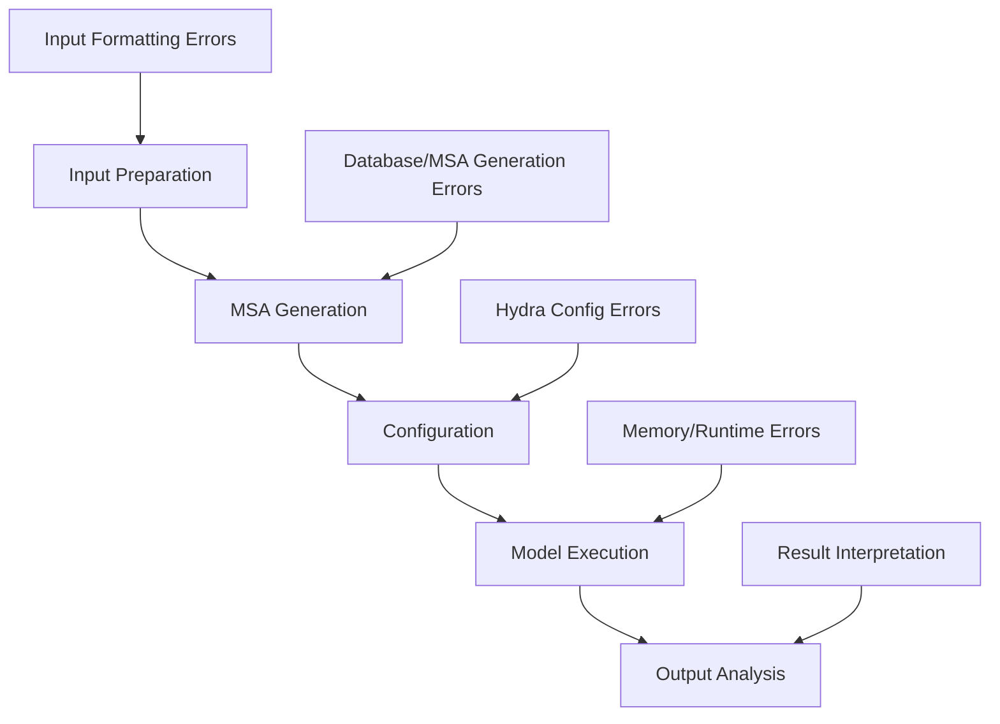
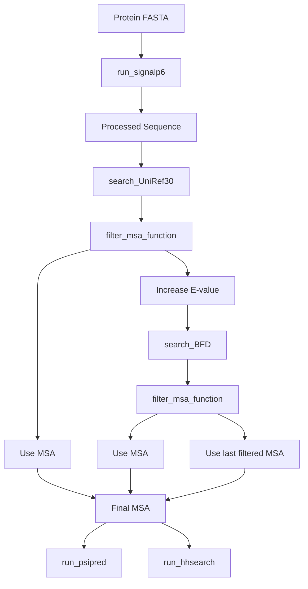
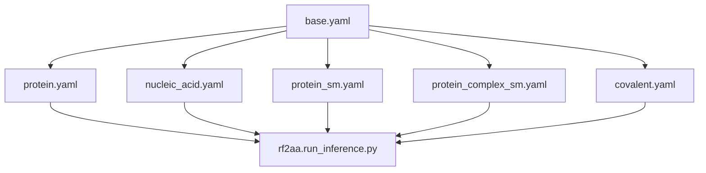
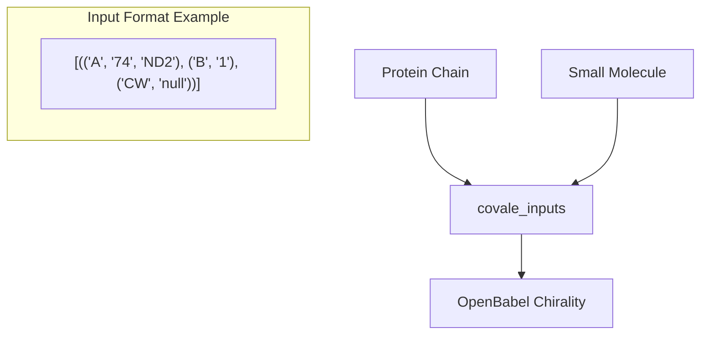
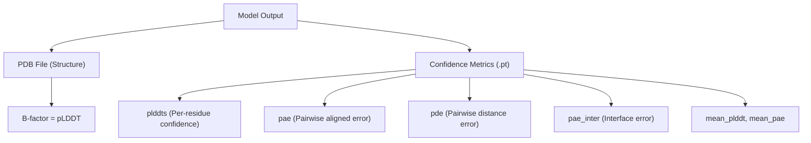

# Troubleshooting

> **Relevant source files**
> * [.gitignore](https://github.com/baker-laboratory/RoseTTAFold-All-Atom/blob/6c851405/.gitignore)
> * [README.md](https://github.com/baker-laboratory/RoseTTAFold-All-Atom/blob/6c851405/README.md?plain=1)

This page provides solutions to common issues encountered when using RoseTTAFold All-Atom (RFAA). It covers installation problems, input preparation errors, configuration issues, and guidance on interpreting unexpected results. For information on how to set up basic predictions, see [Using RFAA](/baker-laboratory/RoseTTAFold-All-Atom/4-using-rfaa).

## Common Workflow Issues

The following diagram illustrates the RFAA workflow and typical points where users encounter problems:



Sources: [README.md L20-L31](https://github.com/baker-laboratory/RoseTTAFold-All-Atom/blob/6c851405/README.md?plain=1#L20-L31)

## Installation and Setup Issues

### Common Installation Problems

| Problem | Cause | Solution |
| --- | --- | --- |
| Mamba installation fails | System requirements not met | Use alternative conda installation or check system permissions |
| Environment creation fails | Conflicting packages | Create a fresh environment with exact versions specified |
| SignalP6 registration fails | Licensing issues | Ensure you have a valid license and follow instructions precisely |
| SE3Transformer setup fails | Compilation errors | Check for required C++ compilers and CUDA if using GPU |
| Database downloads incomplete | Network or storage issues | Verify available storage space and use wget with resume capability |

### Error: Missing model weights

**Symptoms:** Error indicating that model weights cannot be found.

**Solution:** Download the weights file and ensure it's in the correct location:

```
wget http://files.ipd.uw.edu/pub/RF-All-Atom/weights/RFAA_paper_weights.pt
```

### Error: SignalP6 model not found

**Symptoms:** Error about missing SignalP6 model during MSA generation.

**Solution:** Ensure SignalP6 is properly registered and the model weights are renamed as instructed:

```
mv $CONDA_PREFIX/lib/python3.10/site-packages/signalp/model_weights/distilled_model_signalp6.pt $CONDA_PREFIX/lib/python3.10/site-packages/signalp/model_weights/ensemble_model_signalp6.pt
```

Sources: [README.md L21-L84](https://github.com/baker-laboratory/RoseTTAFold-All-Atom/blob/6c851405/README.md?plain=1#L21-L84)

## MSA Generation Issues

### MSA Generation Process



Sources: [README.md L63-L76](https://github.com/baker-laboratory/RoseTTAFold-All-Atom/blob/6c851405/README.md?plain=1#L63-L76)

### Common MSA Issues

| Problem | Cause | Solution |
| --- | --- | --- |
| MSA generation fails | Database paths incorrect | Verify paths to UniRef30 and BFD databases in your environment |
| MSA contains too few sequences | Protein is rare/unique | Try increasing `loader_params.MAXCYCLE` parameter to 10 for better results with limited MSAs |
| SignalP error | SignalP installation issue | Verify SignalP6 installation and model weights renaming |
| BLAST error | BLAST not properly installed | Check BLAST installation path and ensure it's executable |

### Error: Database search failed

**Symptoms:** Messages indicating failure to find sequences in UniRef30 or BFD databases.

**Solution:**

1. Verify database paths are correct
2. Check if databases were properly extracted
3. For rare proteins, expect fewer sequences and adjust MAXCYCLE accordingly in your configuration

Sources: [README.md L63-L76](https://github.com/baker-laboratory/RoseTTAFold-All-Atom/blob/6c851405/README.md?plain=1#L63-L76)

 [README.md L250-L252](https://github.com/baker-laboratory/RoseTTAFold-All-Atom/blob/6c851405/README.md?plain=1#L250-L252)

## Input File Format Problems

### Required Input Formats

| Input Type | Format | Common Issues |
| --- | --- | --- |
| Protein | FASTA (.fasta) | Non-standard amino acids, missing chain ID |
| Nucleic Acid | FASTA (.fasta) | Incorrect nucleotide codes, missing specification of DNA/RNA type |
| Small Molecule | SDF (.sdf) or SMILES | Invalid atom types, incorrect valence, missing 3D coordinates in SDF |
| Covalent Bonds | Tuple syntax in config | Incorrect chain IDs, 0-indexed instead of 1-indexed positions |

### Error: Invalid amino acid code

**Symptoms:** Error message about invalid amino acid characters in sequence.

**Solution:** Ensure your sequence contains only standard amino acid codes (ACDEFGHIKLMNPQRSTVWY).

### Error: Invalid nucleotide code

**Symptoms:** Error message about invalid nucleotide characters.

**Solution:** Ensure DNA sequences contain only ACGT and RNA sequences contain only ACGU.

Sources: [README.md L95-L101](https://github.com/baker-laboratory/RoseTTAFold-All-Atom/blob/6c851405/README.md?plain=1#L95-L101)

 [README.md L134-L144](https://github.com/baker-laboratory/RoseTTAFold-All-Atom/blob/6c851405/README.md?plain=1#L134-L144)

 [README.md L168-L172](https://github.com/baker-laboratory/RoseTTAFold-All-Atom/blob/6c851405/README.md?plain=1#L168-L172)

## Configuration Issues with Hydra

### Configuration Hierarchy



Sources: [README.md L86-L101](https://github.com/baker-laboratory/RoseTTAFold-All-Atom/blob/6c851405/README.md?plain=1#L86-L101)

### Common Configuration Errors

| Problem | Cause | Solution |
| --- | --- | --- |
| Missing defaults section | Incorrect config format | Ensure config starts with `defaults: - base` |
| Chain ID errors | Missing or duplicate chain IDs | Assign unique chain IDs (A, B, C, etc.) to each input |
| Input file not found | Incorrect path | Verify file paths are correct relative to working directory |
| Invalid input_type | Typo or unsupported type | Use only supported input_types: "dna", "rna", "sdf", "smiles" |

### Error: Duplicate chain ID

**Symptoms:** Error message about duplicate chain IDs in the configuration.

**Solution:** Ensure each chain in protein_inputs, na_inputs, and sm_inputs has a unique chain ID. Chain IDs are essential for distinguishing different molecules in the prediction.

Sources: [README.md L109-L124](https://github.com/baker-laboratory/RoseTTAFold-All-Atom/blob/6c851405/README.md?plain=1#L109-L124)

 [README.md L134-L144](https://github.com/baker-laboratory/RoseTTAFold-All-Atom/blob/6c851405/README.md?plain=1#L134-L144)

## Covalent Modification Issues

### Covalent Bond Specification



Sources: [README.md L214-L262](https://github.com/baker-laboratory/RoseTTAFold-All-Atom/blob/6c851405/README.md?plain=1#L214-L262)

### Common Covalent Issues

| Problem | Cause | Solution |
| --- | --- | --- |
| Syntax errors | Escaping quotes improperly | Follow the exact syntax with escaped quotes as shown in examples |
| Indexing errors | Using 0-indexed positions | Remember positions are 1-indexed for both residues and atoms |
| Chirality errors | Missing chirality specification | Specify chirality for all chiral centers (CW, CCW, or null) |
| Leaving group errors | Including leaving groups | Remove leaving groups from input small molecules |

### Error: OpenBabel detected a chiral center

**Symptoms:** Error indicating OpenBabel detected a chiral center that was not specified in the configuration.

**Solution:** Add the chirality specification for this atom in your configuration, even if you believe OpenBabel is incorrect:

```
[(("A", "74", "ND2"), ("B", "1"), ("CW", "null"))]
```

**Important note:** You cannot define bonds between two small molecule chains. For PDB structures with multiple small molecule residues, merge them into a single SDF file before input.

Sources: [README.md L210-L230](https://github.com/baker-laboratory/RoseTTAFold-All-Atom/blob/6c851405/README.md?plain=1#L210-L230)

 [README.md L246-L262](https://github.com/baker-laboratory/RoseTTAFold-All-Atom/blob/6c851405/README.md?plain=1#L246-L262)

## Runtime Errors and Performance Issues

### Memory and Resource Issues

| Problem | Cause | Solution |
| --- | --- | --- |
| Out of memory error | Model size exceeds GPU memory | Use smaller batch size or CPU mode |
| Slow prediction | Complex with many chains | Normal for large complexes; consider increasing MAXCYCLE |
| Recycling errors | Configuration issues | Check parameters related to recycling |
| CUDA errors | GPU compatibility issues | Try CPU mode or update CUDA drivers |

### Error: CUDA out of memory

**Symptoms:** CUDA out of memory error during model execution.

**Solution:**

1. Try running on a GPU with more memory
2. If unavailable, run in CPU mode by setting `device="cpu"` in your configuration
3. For large complexes, consider breaking prediction into smaller parts

### Job Taking Too Long

**Symptoms:** Prediction seems to run indefinitely.

**Solution:**

1. MSA generation can take hours for some proteins, especially when searching BFD
2. Large complexes naturally take longer to predict
3. Check if your system has adequate resources (CPU, GPU, memory)

Sources: [README.md L89-L90](https://github.com/baker-laboratory/RoseTTAFold-All-Atom/blob/6c851405/README.md?plain=1#L89-L90)

## Interpreting Output Files

### Understanding Output Structure



Sources: [README.md L266-L282](https://github.com/baker-laboratory/RoseTTAFold-All-Atom/blob/6c851405/README.md?plain=1#L266-L282)

### Confidence Metrics and Interpretation

| Metric | Good Value | Mediocre Value | Poor Value | Interpretation |
| --- | --- | --- | --- | --- |
| mean_plddt | >90 | 70-90 | <70 | Overall model confidence |
| pae_prot | <5 | 5-10 | >10 | Protein structure confidence |
| pae_inter | <10 | 10-20 | >20 | Protein-ligand interface confidence |

### Error: Model produces unrealistic structure

**Symptoms:** Output structure has steric clashes or unnatural geometry.

**Solution:**

1. Check input files for correctness
2. Increase `loader_params.MAXCYCLE` parameter to 10 for difficult cases
3. Verify pae_inter score - values <10 indicate high confidence in the interface

**Note:** As mentioned in the README, "RFAA is not accurate for all cases, but produces useful error estimates to allow users to identify accurate predictions." Always check the confidence metrics to assess prediction quality.

Sources: [README.md L273-L281](https://github.com/baker-laboratory/RoseTTAFold-All-Atom/blob/6c851405/README.md?plain=1#L273-L281)

 [README.md L8](https://github.com/baker-laboratory/RoseTTAFold-All-Atom/blob/6c851405/README.md?plain=1#L8-L8)

## Issues with Complex Structure Prediction

### Multi-Chain and Higher-Order Complex Issues

| Problem | Cause | Solution |
| --- | --- | --- |
| Poor interface quality | Insufficient sampling | Increase MAXCYCLE parameter to 10 |
| RNA MSA pairing issues | Not currently supported | Use RF-NA for cases requiring paired protein-RNA MSAs |
| Small molecule orientation issues | Incorrect input | Provide accurate 3D coordinates in SDF files |
| Homooligomer prediction problems | Duplicate sequences | Ensure each chain has a unique identifier, even for identical sequences |

### Error: Cannot define bonds between small molecules

**Symptoms:** Error when attempting to create covalent bonds between small molecules.

**Solution:** Current implementation only supports bonds between proteins and small molecules. For PDB structures with multiple small molecule residues that need to be connected, merge them into a single SDF file before input.

Sources: [README.md L146-L147](https://github.com/baker-laboratory/RoseTTAFold-All-Atom/blob/6c851405/README.md?plain=1#L146-L147)

 [README.md L226-L228](https://github.com/baker-laboratory/RoseTTAFold-All-Atom/blob/6c851405/README.md?plain=1#L226-L228)

## General Troubleshooting Tips

1. **Check input files carefully**: Most errors stem from improperly formatted inputs
2. **Examine logs closely**: Error messages often contain specific information about what went wrong
3. **Start simple**: Test with a simple protein structure before attempting complex predictions
4. **Validate configurations**: Use the example configurations in the README as templates
5. **Increasing model cycles**: For difficult cases, increase `loader_params.MAXCYCLE` to 10 as recommended in the paper
6. **Check output confidence**: Always examine confidence metrics, especially pae_inter for interface quality
7. **Database issues**: Ensure all sequence databases are properly downloaded and extracted

Sources: [README.md L8-L9](https://github.com/baker-laboratory/RoseTTAFold-All-Atom/blob/6c851405/README.md?plain=1#L8-L9)

 [README.md L89-L90](https://github.com/baker-laboratory/RoseTTAFold-All-Atom/blob/6c851405/README.md?plain=1#L89-L90)

 [README.md L250-L252](https://github.com/baker-laboratory/RoseTTAFold-All-Atom/blob/6c851405/README.md?plain=1#L250-L252)