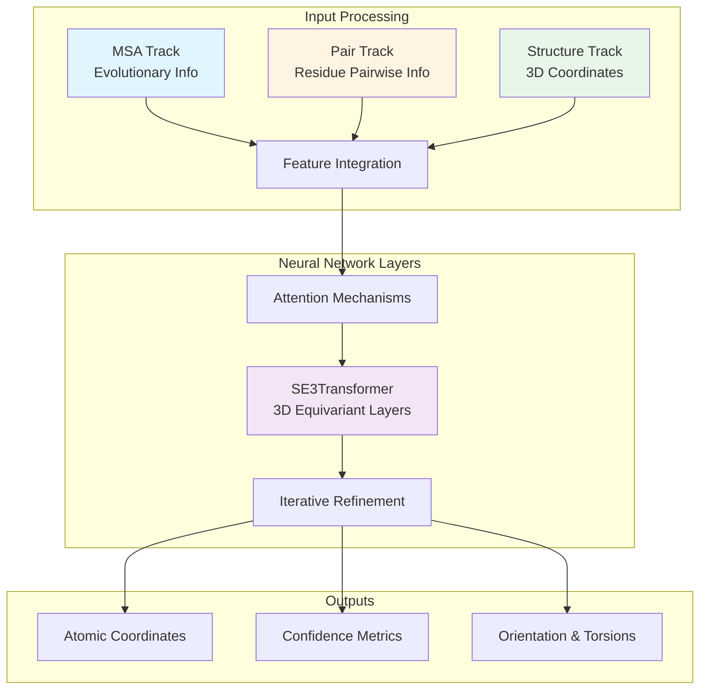

---
slug:1-overview
blog_type:normal
---


RoseTTAFold All-Atom (RFAA) 是一种先进的生物分子结构预测神经网络，旨在预测多种生物分子组装体的三维结构。该系统将传统的蛋白质结构预测能力扩展到了包括核酸、小分子、共价修饰和金属在内的范畴——所有这些都在一个统一的深度学习框架内实现。RFAA 在 AlphaFold 和 RoseTTAFold 成功的基础上构建，同时解决了对完整生物分子复合物进行建模这一更广泛的挑战，而不仅仅是针对孤立的蛋白质链。


该模型架构围绕复杂的三轨道设计构建，能够同时处理不同表示形式的信息，使其能够捕捉生物分子结构固有的进化模式和几何约束。这种方法使得 RFAA 能够处理复杂的组装体，其中不同的分子类型通过各种力（包括氢键、静电相互作用和共价键）进行相互作用。

来源：[README.md](README.md#L1-L10), [RoseTTAFoldModel.py](rf2aa/model/RoseTTAFoldModel.py#L29-L77)

## RoseTTAFold All-Atom 可以预测什么

RFAA 在预测多种生物分子类型的结构方面展现了非凡的通用性，使其在结构生物学、药物发现和生物工程等研究领域具有极高的价值。该系统旨在处理从简单的单体结构到包含不同分子组分的复杂多链组装体。

核心预测能力包括：

- **蛋白质结构**：利用多序列比对 (MSA) 和结构模板进行传统的蛋白质折叠预测
- **蛋白质-核酸复合物**：预测 DNA-蛋白质和 RNA-蛋白质的相互作用，这对于理解基因调控和表达至关重要
- **蛋白质-小分子复合物**：对蛋白质与配体、辅因子或药物分子之间的相互作用进行建模
- **高阶生物分子复合物**：包含多种蛋白质、核酸和小分子的组装体，以各种组合形式存在
- **共价修饰蛋白质**：预测蛋白质通过共价键与其他分子结合（例如，与小分子的翻译后修饰）的结构

对于每种预测类型，RFAA 不仅生成原子坐标，还生成置信度指标（pLDDT 分数），帮助用户评估预测结构不同区域的可靠性。这种自评估能力对于实际应用至关重要，因为研究人员需要知道他们可以信任预测的哪些部分。

来源：[README.md](README.md#L1-L15), [run_inference.py](rf2aa/run_inference.py#L24-L68), [data/merge_inputs.py](rf2aa/data/merge_inputs.py#L161-L169)

## 三轨道架构设计

RoseTTAFold All-Atom 的根本创新在于其三轨道架构，它通过并行但相互连接的神经网络通路处理信息。该设计使模型能够利用互补的信息源，并在整个预测过程中保持不同表示之间的一致性。



这三个轨道发挥不同但互补的功能：

1. **MSA 轨道**：处理多序列比对以捕捉进化保守模式。该轨道识别序列中的哪些位置在同源物中是保守的，哪些位置允许变异，从而为最终结构提供关键约束。MSA 轨道的维度为 d_msa=256，并使用自注意力机制提取协同进化信号。

2. **Pair 轨道**：维护一个二维矩阵，表示序列中所有残基/原子之间的成对相互作用。该轨道捕获分子的不同部分如何相互作用，整合来自 MSA 轨道、模板结构和正在生成的 3D 坐标的信息。Pair 轨道使用 d_pair=192 维度，并包含来自结构信息的偏置项。

3. **Structure 轨道**：使用 SE3 等变神经网络表示原子的实际 3D 坐标。该轨道直接处理空间关系，并确保预测遵守 3D 空间的物理约束，包括旋转和平移对称性。Structure 轨道利用 SE3Transformer 组件来保持等变性。

这些轨道在网络的每一层通过双向连接进行通信，允许信息在表示之间自由流动，并随着结构预测的进行实现迭代优化。

来源：[RoseTTAFoldModel.py](rf2aa/model/RoseTTAFoldModel.py#L38-L77), [Track_module.py](rf2aa/model/Track_module.py#L1-L80), [base.yaml](rf2aa/config/inference/base.yaml#L32-L63)

## 关键技术组件

RFAA 结合了几个高级技术组件，协同工作以实现准确的生物分子结构预测。理解这些组件有助于深入了解系统如何处理不同类型的输入并生成一致的 3D 结构。

### 用于 3D 等变性的 SE3Transformer

SE3Transformer 是一种专门的神经网络层，在连续的 3D 旋转和平移下保持等变性。这种数学属性确保了如果你旋转或平移输入坐标，输出也会以完全相同的方式进行变换——这对于建模物理系统至关重要，因为坐标系不应影响预测结构。SE3Transformer 使用球谐函数和 Clebsch-Gordan 系数以旋转不变的方式处理几何关系。

该组件对于 RFAA 的全原子能力特别重要，因为它允许模型推理 3D 空间关系，而不会受到坐标系任意方向的影响。其实现使用基于图的方法，其中原子是节点，键/相互作用是边，注意力机制在此图结构上运行。

来源：[SE3Transformer/README.md](rf2aa/SE3Transformer/README.md#L20-L40), [RoseTTAFoldModel.py](rf2aa/model/RoseTTAFoldModel.py#L54-L56)

### 化学特征处理

RFAA 为每个原子和残基处理丰富的化学信息，包括原子类型、键连接性、手性和化学性质。化学模块定义了广泛的字典，将原子类型映射到物理属性，如 Lennard-Jones 参数、氢键能力和扭转角偏好。这些化学特征被编码为可学习的嵌入，神经网络利用它们做出物理上现实的预测。

该系统处理特殊情况，包括手性中心（决定分子结构的旋光性）、共价键模式和金属配位环境。对于小分子，它可以接受 SMILES 字符串格式或 SDF 文件的输入，解析分子结构以提取原子、键和指导结构预测过程的化学性质。

来源：[chemical.py](rf2aa/chemical.py#L1-L50), [scoring.py](rf2aa/scoring.py#L5-L10), [data/small_molecule.py](rf2aa/data/small_molecule.py#L10-L21)

### 基于 Hydra 的配置系统

RFAA 使用 Hydra 进行灵活的配置管理，允许用户通过 YAML 文件指定预测参数。基础配置文件定义了模型架构参数、数据库路径和推理设置。专门的配置文件针对不同的预测类型（仅蛋白质、蛋白质-核酸复合物、蛋白质-小分子复合物、共价修饰等）扩展基础配置。

该配置系统支持可重现的预测和轻松的自定义，而无需修改源代码。用户可以指定目标复合物中的哪些链对应哪种分子类型，提供输入文件路径，并调整计算参数，如 CPU 数量和内存分配。

来源：[base.yaml](rf2aa/config/inference/base.yaml#L1-L20), [docker.yaml](examples/docker/docker.yaml#L1-L22), [run_inference.py](rf2aa/run_inference.py#L1-L20)

### 模板和 MSA 集成

该模型利用来自多序列比对的进化信息和来自同源模板的结构信息。在推理过程中，RFAA 搜索大型序列数据库（UniRef30, BFD）以寻找同源序列并构建 MSA。它还在结构数据库 中搜索可以提供额外约束的模板结构。

模板的集成通过一个专门的嵌入层处理，该层处理一维模板特征（每残基信息）和二维模板特征（成对距离和方向信息）。此模板信息与 MSA 衍生的协同进化信号和 Pair 轨道中不断发展的 3D 坐标相结合。

来源：[data/protein.py](rf2aa/data/protein.py#L10-L68), [data_loader.py](rf2aa/data/data_loader.py#L107-L163), [README.md](README.md#L60-L80)

## 代码仓库结构

RoseTTAFold-All-Atom 代码仓库组织成包含代码、配置文件、示例和文档的逻辑目录。该结构支持推理使用和潜在的模型训练。

```
RoseTTAFold-All-Atom/
├── rf2aa/                          # 主包目录
│   ├── model/                      # 神经网络架构
│   │   ├── RoseTTAFoldModel.py     # 核心模型实现
│   │   ├── Track_module.py         # 三轨道处理模块
│   │   └── layers/                 # 注意力和嵌入层
│   ├── data/                       # 数据加载和预处理
│   │   ├── data_loader.py          # 输入数据结构
│   │   ├── merge_inputs.py         # 多链整合
│   │   ├── protein.py              # 蛋白质输入处理
│   │   ├── nucleic_acid.py         # 核酸处理
│   │   └── small_molecule.py       # 小分子处理
│   ├── config/                     # 配置文件
│   │   └── inference/              # 推理配置
│   │       ├── base.yaml           # 基础配置
│   │       ├── protein.yaml        # 蛋白质特定设置
│   │       ├── nucleic_acid.yaml   # 核酸特定设置
│   │       └── covalent.yaml       # 共价修饰设置
│   ├── SE3Transformer/             # 3D 等变 Transformer
│   ├── chemical.py                 # 化学性质定义
│   ├── run_inference.py            # 主推理脚本
│   └── scoring.py                  # 置信度计算
├── examples/                       # 示例输入文件和配置
│   ├── protein/                    # 示例蛋白质序列
│   ├── nucleic_acid/               # 示例核酸序列
│   ├── small_molecule/             # 示例小分子
│   └── docker/                     # Docker 部署示例
├── environment.yaml                # Conda 环境规范
├── Dockerfile                      # Docker 容器定义
└── README.md                       # 主要文档
```

来源：[get_repo_structure](#), [README.md](README.md#L1-L100)

## 计算需求

运行 RFAA 需要大量的计算资源和用于 MSA 和模板生成的海量参考数据库。该系统旨在支持具有 CUDA 11.8 支持的 GPU 加速 Linux 系统，尽管仅使用 CPU 进行推理也是可行的，但性能会有所降低。

**硬件需求：**
- GPU：支持 CUDA 11.8+ 的 NVIDIA GPU（推荐：A100, V100, 或 RTX 3090/4090）
- CPU：多核处理器（推荐 4+ 核用于 MSA 生成）
- RAM：32GB+ 系统内存（对于大型复合物推荐 64GB+）
- 存储：400GB+ 用于序列和结构数据库

**软件栈：**
- Python 3.10/3.11
- 支持 CUDA 的 PyTorch
- DGL (Deep Graph Library) 用于 SE3Transformer
- HH-suite 用于 MSA 生成和模板搜索
- Open Babel 用于小分子处理
- Hydra 用于配置管理

提供的 Docker 镜像通过将所有依赖项打包在容器化环境中简化了部署，尽管用户仍需要挂载数据库并提供适当的计算资源。

来源：[environment.yaml](environment.yaml#L1-L200), [Dockerfile](Dockerfile#L1-L60), [README.md](README.md#L25-L60)

## 何时使用 RoseTTAFold All-Atom

RFAA 特别适用于涉及预测具有多种分子类型的生物分子复合物结构的研究场景。考虑在以下情况使用 RFAA：

**理想用例：**
- 预测蛋白质-小分子复合物的结构，由于大的构象变化，传统的对接方法可能会失败
- 对蛋白质-核酸复合物进行建模，以了解基因调控、RNA 结合蛋白或 CRISPR 系统
- 为含有辅因子或辅基的多蛋白质组装体生成结构模型
- 研究小分子通过共价键附着在蛋白质上的翻译后修饰
- 探索蛋白质中的金属结合位点，其中金属配位几何结构至关重要

**需要考虑的局限性：**
- 该模型提供有用的误差估计，但在所有情况下并不完全准确——应仔细检查置信度分数
- 非常大的复合物（>2000 个残基）可能会超出当前的内存限制
- 训练数据中未代表的新型辅因子或稀有修饰可能准确性较低
- 预测时间与序列长度和数据库大小成正比，因此大型复合物需要大量的计算资源

对于没有其他分子成分的纯蛋白质结构预测，AlphaFold2 或 RoseTTAFold2 等专用工具可能更合适。RFAA 的优势在于其处理异质分子组装体的能力。

来源：[README.md](README.md#L10-L15), [base.yaml](rf2aa/config/inference/base.yaml#L28-L33)

## 后续步骤

要开始使用 RoseTTAFold All-Atom，建议按以下顺序阅读入门文档：

- **[快速开始](2-quick-start)**：通过一个最小的工作示例快速上手，查看 RFAA 的实际运行
- **[安装与设置](3-installation-and-setup)**：安装依赖项、下载数据库和配置环境的完整指南
- **[使用 Docker 运行推理](4-running-inference-with-docker)**：了解使用容器化部署运行 RFAA 的最简单方法
- **[理解模型输出](5-understanding-model-outputs)**：了解如何解释预测结构和置信度指标

要深入了解系统架构和配置：

- **[三轨道设计概述](14-three-track-design-overview)**：详细解释 MSA、Pair 和 Structure 轨道
- **[Hydra 配置管理](6-hydra-configuration-management)**：如何针对不同的预测类型自定义和管理配置
- **[输入数据结构](18-input-data-structures)**：关于 RFAA 如何在内部表示不同分子类型的详细信息

针对特定用例：

- **[蛋白质结构预测](9-protein-structure-prediction)**：预测仅蛋白质结构的指南
- **[蛋白质-核酸复合物预测](10-protein-nucleic-acid-complex-prediction)**：DNA/RNA-蛋白质复合物的指南
- **[蛋白质-小分子复合物预测](11-protein-small-molecule-complex-prediction)**：配体结合和辅因子相互作用的指南