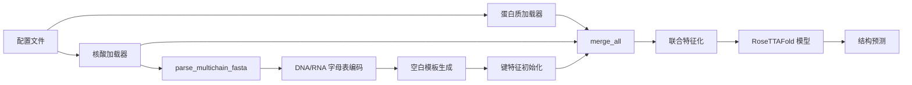
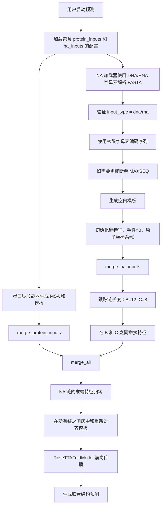

---
slug:10-protein-nucleic-acid-complex-prediction
blog_type:normal
---


此功能支持对包含蛋白质和核酸（DNA 和 RNA）的生物分子复合物进行结构预测。RoseTTAFold-All-Atom 通过专门的流程处理每种生物分子类型，并将其合并以进行联合结构预测，从而处理这些异源组装体。该系统支持多链核酸构型，包括双链 DNA/RNA 结构。

来源：[README.md](README.md#L1-L200)

## 架构概览

蛋白质-核酸复合物预测流水线采用模块化架构，核酸和蛋白质在合并之前通过类型特定的加载器独立处理。这种分离方式允许专门处理核酸的化学性质，同时保持统一的推理过程。



来源：[run_inference.py](rf2aa/run_inference.py#L1-L100), [merge_inputs.py](rf2aa/data/merge_inputs.py#L88-L210)

## 核酸输入处理

### 配置结构

核酸输入通过 Hydra 配置文件中的 `na_inputs` 部分指定。每条核酸链需要唯一的链标识符，并指定 FASTA 文件路径和输入类型（DNA 或 RNA）。

```yaml
na_inputs: 
  B: 
    fasta: examples/nucleic_acid/7u7w_B.fasta
    input_type: "dna"
  C: 
    fasta: examples/nucleic_acid/7u7w_C.fasta
    input_type: "dna"
```

来源：[README.md](README.md#L170-L185), [nucleic_acid.yaml](rf2aa/config/inference/nucleic_acid.yaml)

### FASTA 文件格式

核酸 FASTA 文件使用带有描述性头信息的标准序列格式。每条链都需要单独的 FASTA 文件，即使是双链 DNA/RNA 中的碱基配对链也是如此。

```
>7U7W_2|Chain B[auth T]|DNA (5'-D(*CP*AP*TP*TP*AP*TP*GP*AP*CP*GP*CP*T)-3')|synthetic construct (32630)
CATTATGACGCT
```

```
>7U7W_3|Chain C[auth P]|DNA (5'-D(*AP*GP*CP*GP*TP*CP*AP*T)-3')|synthetic construct (32630)
AGCGTCAT
```

来源：[7u7w_B.fasta](examples/nucleic_acid/7u7w_B.fasta#L1-L3), [7u7w_C.fasta](examples/nucleic_acid/7u7w_C.fasta#L1-L3)

### 加载机制

`load_nucleic_acid()` 函数通过类型特定的编码处理核酸输入：

1.  **输入验证**：验证 `input_type` 为 "dna" 或 "rna"
2.  **字母表选择**：配置合适的核酸字母表进行编码
    *   DNA 字母表：`00000000000000000000-0ACGTD00000`
    *   RNA 字母表：`00000000000000000000-000000ACGUN`
3.  **序列解析**：使用带有核酸特定参数的 `parse_multichain_fasta()`
4.  **MSA 截断**：强制执行 `loader_params["MAXSEQ"]` 中的最大序列数限制
5.  **模板生成**：创建空白模板，因为核酸目前不支持模板
6.  **特征初始化**：初始化键特征以及用于手性和原子坐标系的零数组

来源：[nucleic_acid.py](rf2aa/data/nucleic_acid.py#L1-L46), [parsers.py](rf2aa/data/parsers.py#L200-L286)

### 化学表示

系统通过化学数据库为所有核酸残基维护详细的原子表示：

| 核酸类型 | 残基 | 索引范围 | 原子数 |
|-------------------|----------|-------------|------------|
| DNA | DA (Ade), DC (Cyt), DG (Gua), DT (Thy) | 22-25 | 每个 36 个原子 |
| DNA 未知 | DX | 26 | 14 个原子 |
| RNA | A, C, G, U | 27-30 | 每个 36 个原子 |
| RNA 未知 | RX | 31 | 14 个原子 |

<CgxTip>
DNA 使用核糖框架 (O4', C1', C2') 作为局部坐标系，并显式建模磷酸基团 (P, OP1, OP2, O5')。这与蛋白质的 N-CA-C 骨架框架系统不同。
</CgxTip>

来源：[chemical.py](rf2aa/chemical.py#L100-L200)

## 多链整合

### 核酸链合并

使用 `merge_na_inputs()` 合并多个核酸链，该函数：

1.  **遍历链**：处理由字符 ID 标识的每条链
2.  **跟踪链长度**：维护链 ID 到序列长度的映射
3.  **特征拼接**：使用 `merge_two_inputs()` 进行特征合并
4.  **MSA 处理**：应用异源二聚体 MSA 合并 (`merge_a3m_hetero`)
5.  **键特征平铺**：在链间对角平铺键特征
6.  **模板堆叠**：拼接模板坐标和 1D 特征

```python
def merge_na_inputs(na_inputs):
    running_inputs = None
    chain_lengths = []
    for chid, input in na_inputs.items():
        running_inputs = merge_two_inputs(running_inputs, input)
        chain_lengths.append((chid, input.length()))
    return running_inputs, chain_lengths
```

来源：[merge_inputs.py](rf2aa/data/merge_inputs.py#L88-L98)

### 异源组装体整合

`merge_all()` 函数协调所有生物分子类型的最终组装：

1.  **单独合并**：分别合并蛋白质、核酸和小分子输入
2.  **顺序组合**：先组合蛋白质 + 核酸，然后添加小分子
3.  **链长度跟踪**：编译所有类型的完整链长度列表
4.  **末端特征**：应用 N/C 末端特征（对于核酸归零）
5.  **坐标重新对齐**：在所有链之间居中和重新对齐模板
6.  **共价处理**：处理任何共价键规范

```python
running_inputs = merge_two_inputs(protein_inputs, na_inputs)
running_inputs = merge_two_inputs(running_inputs, sm_inputs)
all_chain_lengths = protein_chain_lengths + na_chain_lengths + sm_chain_lengths
```

来源：[merge_inputs.py](rf2aa/data/merge_inputs.py#L161-L210)

## 输入要求和约束

### 强制性规范

| 组件 | 要求 | 格式 |
|-----------|-------------|--------|
| 链 ID | 单个字符串 | 'A', 'B', 'C' 等 |
| FASTA 路径 | 文件的相对或绝对路径 | "examples/nucleic_acid/chain.fasta" |
| 输入类型 | 核酸类型标识符 | "dna" 或 "rna" |

### 当前限制

*   **无 MSA 生成**：核酸序列不进行 MSA 生成（仅使用查询序列）
*   **无 RNA MSA**：RNA 序列不能使用与蛋白质配对的 MSA
*   **无模板支持**：不利用核酸的结构模板
*   **单文件单链**：每条核酸链都需要自己的 FASTA 文件（不支持多链文件）

<CgxTip>
对于需要配对蛋白质-RNA MSA 的情况（这对核糖蛋白很重要），作者建议使用 RF-NA，这是一种专门设计用于利用进化信息进行蛋白质-RNA 复合物预测的工具。
</CgxTip>

来源：[README.md](README.md#L183-L187)

## 完整工作流示例

此流程图说明了完整的蛋白质-核酸复合物预测工作流：



来源：[run_inference.py](rf2aa/run_inference.py#L28-L75), [nucleic_acid.py](rf2aa/data/nucleic_acid.py#L1-L46)

## 参数配置

### 关键加载器参数

控制核酸处理的加载器参数包括：

```python
loader_params = {
    "MAXSEQ": 10000,  # 保留的最大序列数
    "n_templ": 4,     # 模板数量（NA 为空白）
}
```

来源：[nucleic_acid.py](rf2aa/data/nucleic_acid.py#L13-L22)

### RawInputData 结构

核酸输入填充 `RawInputData` 数据类，包含：

| 字段 | 描述 | 核酸特定处理 |
|-------|-------------|---------------------|
| `msa` | 多序列比对 | 仅查询序列，截断至 MAXSEQ |
| `ins` | 插入统计 | 核酸全为零 |
| `bond_feats` | 键邻接矩阵 | 已初始化但连接性极小 |
| `xyz_t` | 模板坐标 | 空白模板（随机初始化） |
| `t1d` | 模板 1D 特征 | 空白特征 |
| `mask_t` | 模板坐标掩码 | 全为假（无模板） |
| `chirals` | 手性中心 | 核酸为空张量 |
| `atom_frames` | 局部坐标系 | 核酸为空张量 |

来源：[data_loader.py](rf2aa/data/data_loader.py#L9-L38)

## 运行预测

### 基本命令结构

使用 Hydra 配置执行蛋白质-核酸复合物预测：

```bash
python -m rf2aa.run_inference --config-name nucleic_acid
```

来源：[README.md](README.md#L168-L170)

### 预期输出

模型生成：

*   **预测的 3D 结构**：包含蛋白质和核酸坐标的 PDB 文件
*   **置信度指标**：每个残基的 pLDDT 分数，指示预测可靠性
*   **链排列**：反映蛋白质-核酸相互作用的空间排列

要了解模型输出和置信度指标，请参阅 [了解模型输出](5-understanding-model-outputs)。

来源：[README.md](README.md#L1-L10)

## 后续步骤

*   关于纯蛋白质结构预测，请参阅 [蛋白质结构预测](9-protein-structure-prediction)
*   关于蛋白质-小分子复合物，请参阅 [蛋白质-小分子复合物预测](11-protein-small-molecule-complex-prediction)
*   关于结合所有类型的高阶组装体，请参阅 [高阶生物分子复合物](12-higher-order-biomolecular-complexes)
*   关于了解处理多样化生物分子的三轨道架构，请参阅 [三轨道设计概览](14-three-track-design-overview)