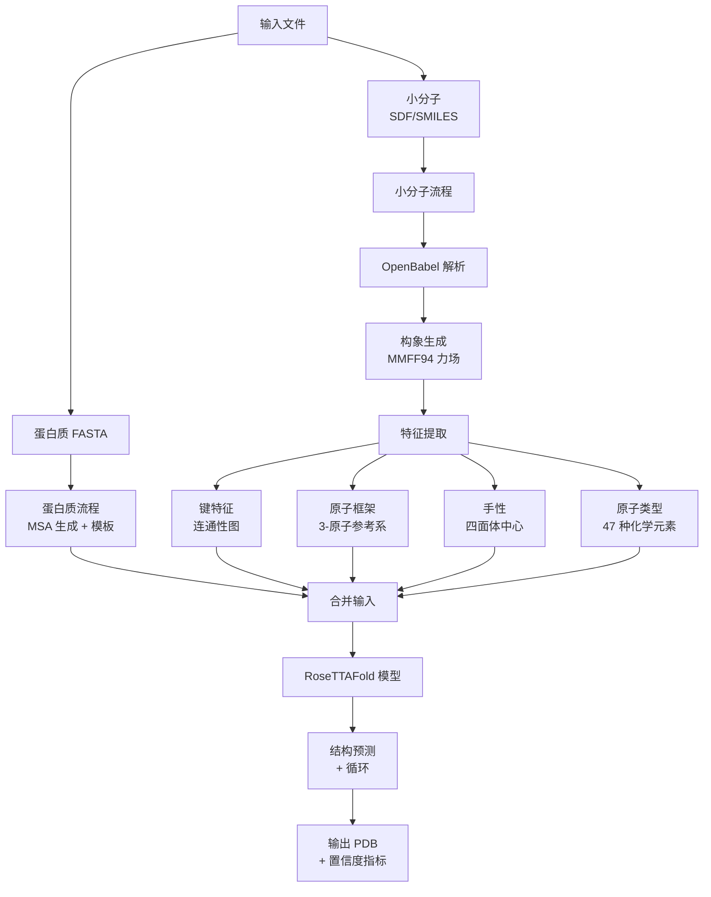
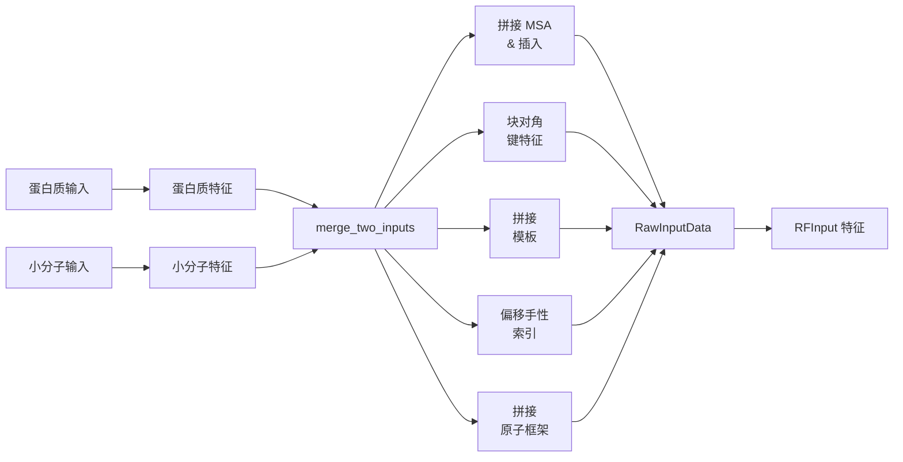

---
slug:11-protein-small-molecule-complex-prediction
blog_type:normal
---


蛋白质-小分子复合物预测能够对配体结合位点、药物靶标相互作用以及生物分子组装体内的金属离子配位进行建模。RoseTTAFold All-Atom 将小分子视为原子分辨率的输入，并采用专门的化学特征表示，使模型能够预测配体相对于蛋白结合口袋的取向。


## 架构概述

蛋白质-小分子预测流程遵循模块化架构，将化学预处理与核心 RoseTTAFold 模型集成在一起。小分子在合并到蛋白质输入之前，会经过专门的 特征化处理，以便进行联合结构预测。



这种架构确保了小分子以原子级化学精度进行表示，同时与蛋白质预测框架无缝集成。模型通过统一的三轨道表示系统学习预测蛋白质-配体相互作用。

Sources: [small_molecule.py](rf2aa/data/small_molecule.py#L1-L42), [parsers.py](rf2aa/data/parsers.py#L744-L813)

## 输入格式和规范

小分子输入支持多种化学文件格式，每种格式都通过 OpenBabel 处理以获得一致的表示。系统接受结构化文件和基于字符串的表示。

| 输入类型 | 描述 | 文件扩展名 | 示例 |
|------------|-------------|----------------|---------|
| SDF | 包含 3D 坐标的结构数据格式 | `.sdf` | `examples/small_molecule/ARD_ideal.sdf` |
| MOL2 | Tripos MOL2 格式 | `.mol2` | 配体结构文件 |
| SMILES | 简化分子线性输入规范 | 字符串输入 | `CN1C=NC2=C1C(=O)N(C(=O)N2C)C` |

推理配置中的小分子输入需要两个必填字段：

```yaml
sm_inputs:
  C:
    input: examples/small_molecule/ARD_ideal.sdf
    input_type: "sdf"
  ```

`input` 字段指定文件路径或 SMILES 字符串，而 `input_type` 指示解析格式。链字母（A, B, C 等）是必需的，用于在复杂组装体中区分多个小分子输入。

Sources: [protein_sm.yaml](rf2aa/config/inference/protein_sm.yaml#L1-L13), [parsers.py](rf2aa/data/parsers.py#L744-L813)

## 化学解析流程

小分子经过多阶段解析流程，将原始化学表示转换为适合神经网络处理的张量特征。

### 分子解析和构象生成

`parse_mol` 函数是小分子处理的主要入口点。当输入文件中未提供 3D 坐标时，系统使用 OpenBabel 的构象生成功能生成它们：

1. **文件解析**：OpenBabel 从 SDF、MOL2 或 SMILES 字符串中读取分子结构
2. **构象生成**：OBBuilder 构建初始 3D 结构，然后使用快速转子搜索进行 MMFF94 力场优化
3. **氢原子移除**：可选的氢原子剥离在保持重原子几何结构的同时降低计算复杂度
4. **对称性枚举**：识别分子对称性排列，以便在训练期间处理等效原子

对于 SDF 文件，系统包含一个预处理步骤，用于标准化元素名称格式（例如，`FE` → `Fe`），以确保 OpenBabel 正确解析。

Sources: [parsers.py](rf2aa/data/parsers.py#L729-L813), [small_molecule.py](rf2aa/data/small_molecule.py#L10-L20)

### 原子类型编码

系统将原子序数映射到分类编码方案，支持标准 20 种氨基酸之外的 47 种不同的原子类型。这包括常见元素（C, N, O, S, P）、卤素（F, Cl, Br, I）、金属（Fe, Zn, Mg, Ca, Cu）和其他元素。每个原子在扩展字母表中被分配一个唯一的整数标记。

映射位于 `ChemicalData` 类中，该类维护原子序数、三字母代码和模型标记索引之间的对应关系。这种统一的编码允许模型在一致的序列表示中处理蛋白质残基、核酸和小分子原子。

Sources: [chemical.py](rf2aa/chemical.py#L102-L123), [chemical.py](rf2aa/chemical.py#L63-L150)

## 化学特征提取

小分子表示的核心创新在于提取具有化学意义的特征，这些特征捕获了分子几何形状和拓扑结构。

### 键特征和连通性图

键特征将分子连通性图编码为 2D 邻接矩阵，其中每个条目表示原子对之间的键类型：

- **0**：未知
- **1**：单键
- **2**：双键
- **3**：三键
- **4**：芳香键
- **5-6**：肽/核酸骨架键
- **7**：蛋白质-配体键

`get_bond_feats` 函数遍历 OpenBabel 分子对象中的键，提取键级和芳香性信息以构造对称邻接矩阵：

```python
for bond in openbabel.OBMolBondIter(mol):
    i,j = (bond.GetBeginAtomIdx()-1, bond.GetEndAtomIdx()-1)
    bond_feats[i,j] = bond.GetBondOrder() if not bond.IsAromatic() else 4
    bond_feats[j,i] = bond_feats[i,j]
```

这种连通性图使模型能够理解分子拓扑结构并区分不同的键合环境。

Sources: [util.py](rf2aa/util.py#L528-L540)

### 原子框架选择

原子框架为每个原子定义局部坐标系，这对于 FAPE（框架对齐点误差）损失计算和结构预测至关重要。`get_atom_frames` 函数使用基于优先级的系统选择最佳的三原子键合组合作为参考框架：

1. **路径枚举**：在分子图中查找所有长度为 2 的路径（3 原子链）
2. **优先级评分**：每种原子类型都有分配的优先级（例如，F > Cl > Br > O > N > C）
3. **框架选择**：对于每个原子，选择具有最高优先级键合邻居的框架
4. **回退处理**：对于键合重原子不足的原子，使用相距 2 个键的原子框架

选定的框架存储为相对偏移量（例如，`[(-1, 1), (0, 1), (1, 1)]`），指示哪些相邻原子形成局部参考框架。这确保了无论绝对分子位置如何，都能保持一致的坐标表示。

<CgxTip>
原子框架优先级遵循电负性趋势 (F > Cl > Br > I > O > S > N > P > C)，这有助于模型为结构预测建立具有化学意义的局部坐标系。</CgxTip>

Sources: [util.py](rf2aa/util.py#L491-L526)

### 手性特征

四面体手性中心被明确识别和编码，以确保预测结构的立体化学正确性。`get_chirals` 函数：

1. **立体检测**：使用 OpenBabel 的立体外观识别具有四面体立体化学的原子
2. **中心枚举**：对于每个手性中心，提取中心原子及其四个取代基
3. **二面角计算**：计算由取代基形成的伪二面角
4. **理想角度分配**：根据观察到的手性分配理想的四面体角度 (arcsin(1/√3) ≈ 19.47°) 及适当的符号

输出是一个形状为 `(N_chiral, 5)` 的张量，包含每个手性中心的四个原子索引和目标二面角。这种明确的手性表示可以防止结构预测过程中的外消旋化。

Sources: [kinematics.py](rf2aa/kinematics.py#L250-L281)

### 分子对称性处理

具有对称子结构（例如，苯环、甲基）的分子需要特殊处理以避免简并预测。`get_automorphs` 函数：

1. **对称性检测**：使用 OpenBabel 的 `FindAutomorphisms` 枚举所有保留分子结构的有效原子排列
2. **坐标排列**：将每个对称排列应用于坐标张量
3. **掩码更新**：相应地更新排列的原子存在掩码
4. **限制执行**：限制对称变体的数量（默认值：1000）以防止内存问题

训练期间的这种数据增强提高了模型正确处理对称分子的能力，并防止其对任意原子排序过拟合。

Sources: [util.py](rf2aa/util.py#L844-L867)

## 推理配置

蛋白质-小分子复合物使用 Hydra 配置文件，这些文件指定输入来源和链分配。提供两种主要的配置模板：

### 单蛋白与配体

`protein_sm.yaml` 配置演示了预测带有小分子配体的单蛋白链：

```yaml
defaults:
  - base

job_name: "7qxr"

protein_inputs:
  A: 
    fasta_file: examples/protein/7qxr.fasta

sm_inputs:
  B:
    input: examples/small_molecule/NSW_ideal.sdf
    input_type: "sdf"
  ```

链 A 代表蛋白质序列，而链 B 是小分子配体。作业名称决定输出文件命名。

### 多蛋白复合物与配体

`protein_complex_sm.yaml` 配置扩展到多个蛋白质链：

```yaml
defaults:
  - base
job_name: "3fap"

protein_inputs:
  A:
    fasta_file: examples/protein/3fap_A.fasta
  B: 
    fasta_file: examples/protein/3fap_B.fasta

sm_inputs:
  C:
    input: examples/small_molecule/ARD_ideal.sdf
    input_type: "sdf"
  ```

此配置预测异源二聚体蛋白复合物（链 A 和 B）以及小分子配体（链 C），该配体可能在两个蛋白质链之间的界面处相互作用。

Sources: [protein_sm.yaml](rf2aa/config/inference/protein_sm.yaml#L1-L13), [protein_complex_sm.yaml](rf2aa/config/inference/protein_complex_sm.yaml#L1-L14)

## 输入合并和特征集成

`merge_all` 函数协调蛋白质和小分子输入合并为统一的特征表示：



合并过程：

1. **MSA 拼接**：蛋白质和小分子 MSA 沿序列维度拼接，对单序列小分子 MSA 进行特殊处理
2. **键特征块组装**：键特征形成块对角矩阵，其中最初不存在链间键（这些键可能在预测期间形成）
3. **模板拼接**：模板特征（如果可用）沿残基维度拼接
4. **手性索引偏移**：小分子手性中心索引偏移蛋白质序列长度，以在组合系统中保持正确的索引
5. **原子框架拼接**：原子框架直接拼接，因为每个框架引用其自身链内的原子

生成的 `RawInputData` 对象包含特征构造所需的所有信息，然后再传递给模型的前向传播。

Sources: [merge_inputs.py](rf2aa/data/merge_inputs.py#L97-L169), [merge_inputs.py](rf2aa/data/merge_inputs.py#L161-L209)

## 特征构造流程

`RawInputData.construct_features` 方法将原始输入转换为 RoseTTAFold 模型消耗的 `RFInput` 格式：

1. **MSA 特征化**：将 MSA 张量转换为潜在表示 (`msa_seed`) 和完整 MSA 嵌入 (`msa_extra`)，并应用掩码策略
2. **键距离矩阵**：从连通性图计算成对键距离
3. **模板坐标初始化**：使用 `ChemData().INIT_CRDS` 的规范模板设置初始原子坐标
4. **框架对齐**：使用原子框架定义将模板坐标转换为局部参考框架
5. **扭转角提取**：从模板坐标计算骨架和侧链扭转角
6. **同链掩码**：创建二进制矩阵，指示哪些残基对属于同一条链

对于小分子，模板初始化使用通用坐标模板，扭转角提取处理可用于小分子原子的 10 个扭转自由度。

Sources: [data_loader.py](rf2aa/data/data_loader.py#L107-L163), [data_loader.py](rf2aa/data/data_loader.py#L166-L201)

## 运行推理

准备配置文件后，蛋白质-小分子预测遵循标准推理工作流程：

```bash
# 预测蛋白质-配体复合物
python -m rf2aa.run_inference --config-name protein_sm

# 预测多蛋白-配体复合物
python -m rf2aa.run_inference --config-name protein_complex_sm
```

推理过程：

1. **模型加载**：加载预训练的 RoseTTAFold All-Atom 权重
2. **输入构造**：解析 FASTA 和小分子文件，构造合并特征
3. **前向传播**：运行模型通过多次循环迭代
4. **输出生成**：将预测结构写入 PDB 文件，并附带每个残基的置信度分数

输出 PDB 文件包含蛋白质和小分子原子，具有优化的结合几何形状。辅助 `.pt` 文件包含置信度指标，包括预测的 lDDT、预测对齐误差 (PAE) 和预测距离误差 (PDE)。

Sources: [run_inference.py](rf2aa/run_inference.py#L112-L152), [README.md](README.md#L207-L226)

## 输出解释

生成的 PDB 文件包括：

- **蛋白质原子**：标准骨架 (N, CA, C, O) 和侧链原子
- **小分子原子**：输入配体的所有重原子，具有优化位置
- **B-factors**：每个残基的置信度分数 (plddt) 编码为温度因子
- **链 ID**：蛋白质 (A, B, ...) 和小分子 (C, D, ...) 的单独链

辅助文件中的置信度指标有助于评估预测质量：

- **plddt**：预测的 lDDT 分数，范围从 0 到 100，值 > 70 表示通常可靠的预测
- **PAE 矩阵**：残基对之间的预测对齐误差，有助于评估结构域和结合位点的置信度
- **PDE**：残基间接触的预测距离误差

对于蛋白质-配体界面，检查对应于蛋白质-配体接触的 PAE 矩阵子区域——低误差值表明高置信度的结合位点预测。

Sources: [run_inference.py](rf2aa/run_inference.py#L130-L152), [README.md](README.md#L312-L350)

## 高级注意事项

### 金属离子

金属离子（Fe, Zn, Mg, Ca, Cu 等）被视为使用相同流程的小分子输入。单个金属原子可以指定为 SMILES 字符串（例如，`[Fe+2]`），或包含在具有适当电荷状态的 SDF 文件中。模型从训练数据中学习金属配位几何形状，并可以预测蛋白质结构内合理的配位位点。

### 多个配体

支持通过在配置的 `sm_inputs` 部分指定额外的链来包含多个小分子的复合物。每个配体在合并之前被独立处理，允许模型预测多配体结合位点和竞争性结合场景。

### 共价配体

共价结合的配体需要通过共价修饰系统进行特殊处理。`covalent.yaml` 配置和相关基础结构允许指定蛋白质残基和小分子原子之间的共价键。有关共价复合物预测的更多详细信息，请参阅 [共价键规范](26-covalent-bond-specification)。

Sources: [chemical.py](rf2aa/chemical.py#L83-L150), [README.md](README.md#L207-L226)

## 故障排除指南

| 问题 | 症状 | 解决方案 |
|-------|----------|----------|
| 构象生成失败 | `ValueError: Failed to generate 3D coordinates` | 验证 SDF 文件包含有效的分子结构；尝试替代的构象生成或提供预生成的坐标 |
| 未知原子类型警告 | 原子不在识别的元素列表中 | 检查输入文件中的元素名称格式；确保原子序数正确 |
| 推理期间内存错误 | 系统耗尽 RAM | 减少配置中的 `MAXCYCLE` 参数；处理较小的复合物；减少对称性自构的数量 |
| 配体定位不良 | 结合界面处的 plddt 分数低 | 确保蛋白质 MSA 高质量；如果可用，考虑提供模板结构 |

<CgxTip>
对于具有高分子柔性的配体，提供来自量子力学或分子动力学计算的预生成构象，与依赖默认的 MMFF94 构象生成相比，可以显著提高结合位点预测的准确性。</CgxTip>

## 后续步骤

要加深你对 RoseTTAFold All-Atom 中蛋白质-小分子预测的理解，请探索以下相关主题：

- [输入数据结构](18-input-data-structures) - 详细检查 `RawInputData` 和 `RFInput` 数据结构
- [化学特征处理](21-chemical-feature-processing) - 深入介绍键特征、手性和原子框架
- [置信度指标计算](24-confidence-metrics-calculation) - 如何计算和解释 plddt、PAE 和 PDE 分数
- [三轨道设计概述](14-three-track-design-overview) - 小分子特征如何集成到 MSA、对和坐标轨道中
- [高阶生物分子复合物](12-higher-order-biomolecular-complexes) - 在单个预测中组合蛋白质、核酸和小分子

有关实际实施指导，请参阅 [快速入门](2-quick-start) 和 [安装和设置](3-installation-and-setup) 页面，以确保你的环境已正确配置用于蛋白质-小分子预测。