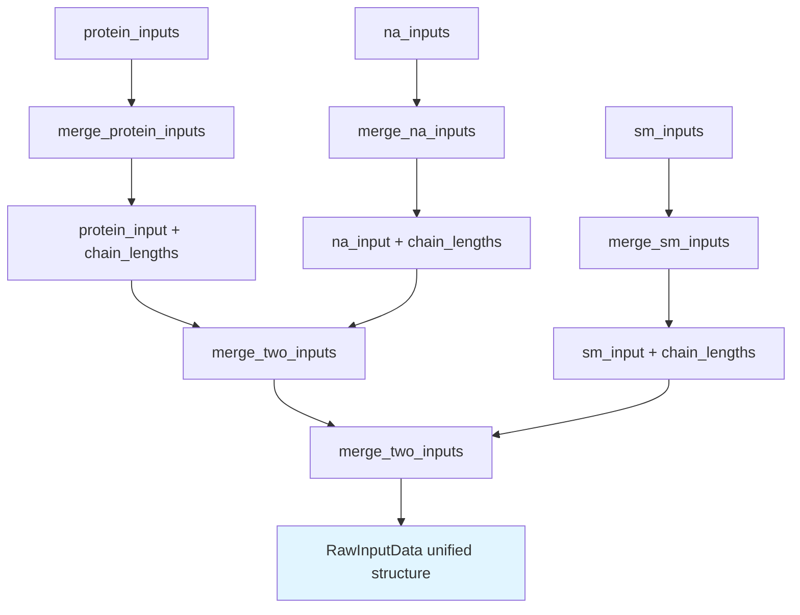
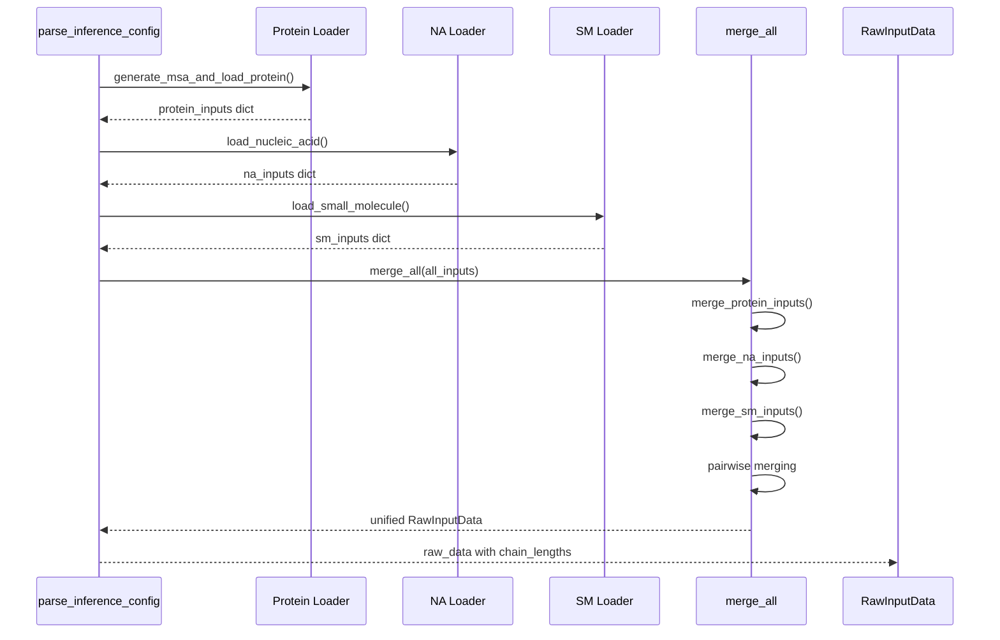

---
slug:12-higher-order-biomolecular-complexes
blog_type:normal
---


本页面记录了 RoseTTAFold-All-Atom 预测多组分生物分子组装体结构的能力，这些组装体结合了蛋白质、核酸和小分子。该系统通过统一的输入合并架构支持分层复合物形成，该架构在保持组分身份的同时，实现了跨分子类型的相互作用。

## 多组分输入系统

RoseTTAFold-All-Atom 将高级复合物视为三种基本组分类型的组装体，每种类型都有专门的输入处理，但在神经网络中采用统一的表示。推理配置接受针对蛋白质 (`protein_inputs`)、核酸 (`na_inputs`) 和小分子 (`sm_inputs`) 的独立部分，这些部分通过协调的流水线进行解析和合并。

来源：[run_inference.py](rf2aa/run_inference.py#L30-L85)

```yaml
# 来自 protein_na_sm.yaml 的配置示例
protein_inputs: 
  A: 
    fasta_file: examples/protein/7u7w_A.fasta
na_inputs: 
  B: 
    fasta: examples/nucleic_acid/7u7w_B.fasta
    input_type: "dna"
  C: 
    fasta: examples/nucleic_acid/7u7w_C.fasta
    input_type: "dna"
sm_inputs: 
  D:
    input: examples/small_molecule/XG4.sdf
    input_type: "sdf"
```

来源：[protein_na_sm.yaml](rf2aa/config/inference/protein_na_sm.yaml#L1-L19)

<CgxTip>链标识符在所有组分类型中必须是唯一的单个字符。系统会验证唯一性，并对重复或多字符链名称报错。</CgxTip>

## 输入合并架构

核心合并逻辑位于 `merge_all()` 中，它在最终整合之前协调特定于组分的合并策略。该函数遵循分层方法：首先对每种组分类型进行专门的合并，然后成对组合成统一的 `RawInputData` 结构。

来源：[merge_inputs.py](rf2aa/data/merge_inputs.py#L161-L209)



### 蛋白质输入合并

蛋白质组分 undergo 最复杂的合并过程，以处理同源寡聚体（相同亚基）和异源寡聚体（不同亚基）。`merge_protein_inputs()` 函数：

1. **去重**：计算序列的 MD5 哈希值以识别相同的链
2. **MSA 整合**：通过分类学 ID 连接唯一序列的 MSA，然后针对重复序列进行扩展
3. **模板平铺**：沿残基维度对角线合并模板结构
4. **键特征**：构建块对角键矩阵，保留链内连接性

来源：[merge_inputs.py](rf2aa/data/merge_inputs.py#L9-L87)

<CgxTip>对于同源寡聚体，系统使用偏移平铺智能地扩展多 MSA，以防止来自不同寡聚体重复的相同序列进行人工配对。这确保模型学习亚基间几何结构，而不是利用序列重复性。</CgxTip>

### 核酸和小分子合并

NA 和 SM 组分通过 `merge_na_inputs()` 和 `merge_sm_inputs()` 使用简单的连接策略。这些函数沿残基维度简单地连接特征，因为这些组分缺乏 MSA 数据和复杂的模板信息。两者都依赖通用的 `merge_two_inputs()` 函数进行成对组合。

来源：[merge_inputs.py](rf2aa/data/merge_inputs.py#L88-L99)

## 多组分组装流水线

`ModelRunner.parse_inference_config()` 方法协调组分加载和合并。每种组分类型都有专用的加载器函数，用于创建 `RawInputData` 对象，然后通过 `merge_all()` 进行统一。

来源：[run_inference.py](rf2aa/run_inference.py#L26-L85)



## 链识别和跟踪

链边界通过 `chain_lengths` 属性在整个流水线中保持，该属性存储 `(chain_id, length)` 元组。这实现了从统一输入结构中精确重建单个组分。

来源：[data_loader.py](rf2aa/data/data_loader.py#L41-L50)

`get_chain_bins_from_chain_lengths()` 方法计算每条链的残基索引范围，支持下游分析和输出生成。键特征使用块对角矩阵（不同链上的 i,j 对应 bond_feats[i,j] = 0）来强制链分离，直到神经网络学习链间相互作用。

来源：[util.py](rf2aa/util.py#L1002-L1013)

## 特定于组分的输入格式

### 蛋白质输入

每个蛋白质链需要一个 FASTA 文件。系统使用 HHsearch 针对配置的数据库生成 MSA，并提取模板信息。

```yaml
protein_inputs:
  A:
    fasta_file: examples/protein/7s69_A.fasta
  B:
    fasta_file: examples/protein/7qxr.fasta
```

来源：[protein.yaml](rf2aa/config/inference/protein.yaml)

### 核酸输入

NA 输入需要带有类型指定（"dna" 或 "rna"）的 FASTA 文件。不支持多链 FASTA；请为每条链提供单独的文件。

来源：[nucleic_acid.py](rf2aa/data/nucleic_acid.py#L9-L46)

### 小分子输入

SM 输入接受 SMILES 字符串或 SDF 文件。系统使用 Open Babel 解析分子结构、计算构象异构体并提取键拓扑。

来源：[small_molecule.py](rf2aa/data/small_molecule.py#L10-L21)

## 复合物类型分类

下表总结了支持的高级复合物类型及其组分组合：

| 复合物类型 | 组分 | 示例用例 | 配置模式 |
|--------------|------------|------------------|----------------------|
| 蛋白质同源寡聚体 | 多个相同蛋白质 | 对称酶复合物 | 具有相同序列的多个 protein_inputs |
| 蛋白质异源寡聚体 | 多个不同蛋白质 | 转录因子复合物 | 具有不同序列的多个 protein_inputs |
| 蛋白质-NA 复合物 | 蛋白质 + DNA/RNA | 聚合酶-DNA 复合物 | protein_inputs + na_inputs |
| 蛋白质-SM 复合物 | 蛋白质 + 配体 | 酶-抑制剂复合物 | protein_inputs + sm_inputs |
| 蛋白质-NA-SM 复合物 | 所有三种类型 | 含抗生素的核糖体复合物 | 所有三个输入部分 |

## 高级功能

### 共价整合

系统通过 `covale_inputs` 部分支持将小分子连接到特定蛋白质残基的共价修饰。这会触发 `load_covalent_molecules()` 中的专门处理，将目标残基原子化并创建显式共价键。

来源：[run_inference.py](rf2aa/run_inference.py#L68-L77)

### 多蛋白质复合物的 MSA 配对

对于多蛋白质复合物，系统尝试通过分类学 ID 在链间对配同源序列。`load_multi_msa()` 函数定位配对的 MSA，并构建表示亚基间进化耦合的多序列比对。

来源：[data_loader_utils.py](rf2aa/data/data_loader_utils.py#L842-L862)

```python
def load_multi_msa(chain_ids, Ls, chid2hash, chid2taxid, params):
    """为任意数量的蛋白质链加载多 MSA。尝试
    定位配对的 MSA 并通过分类学 ID 在所有链间对配序列。
    未配对的序列在底部进行填充和堆叠。
    """
```

## 输出生成

推理流水线根据从键特征派生的 `same_chain` 矩阵生成带有链注释的 PDB 文件。分别为链内和链间相互作用计算置信度指标（pLDDT、pAE、pDE），从而能够评估界面预测的质量。

来源：[run_inference.py](rf2aa/run_inference.py#L123-L145)

```python
err_dict = dict(
    plddts = plddts.cpu(),
    pae = pae.cpu(),
    pde = pde.cpu(),
    pae_prot = float(pae[0,prot_mask_2d].mean()) if pae is not None else None,
    pae_inter = float(pae[0,inter_mask_2d].mean()) if pae is not None else None,
)
```

来源：[run_inference.py](rf2aa/run_inference.py#L177-L184)

## 配置示例

### 带配体的多蛋白质复合物

`protein_complex_sm.yaml` 展示了带有小分子的二聚体蛋白质复合物：

```yaml
protein_inputs:
  A:
    fasta_file: examples/protein/3fap_A.fasta
  B: 
    fasta_file: examples/protein/3fap_B.fasta

sm_inputs:
  C:
    input: examples/small_molecule/ARD_ideal.sdf
    input_type: "sdf"
```

来源：[protein_complex_sm.yaml](rf2aa/config/inference/protein_complex_sm.yaml)

### 完整的三组分复合物

`protein_na_sm.yaml` 展示了所有组分类型的整合：

```yaml
protein_inputs: 
  A: 
    fasta_file: examples/protein/7u7w_A.fasta
na_inputs: 
  B: 
    fasta: examples/nucleic_acid/7u7w_B.fasta
    input_type: "dna"
  C: 
    fasta: examples/nucleic_acid/7u7w_C.fasta
    input_type: "dna"
sm_inputs: 
  D:
    input: examples/small_molecule/XG4.sdf
    input_type: "sdf"
```

来源：[protein_na_sm.yaml](rf2aa/config/inference/protein_na_sm.yaml)

## 后续步骤

对于特定组分类型，请查阅专用文档：
- [蛋白质结构预测](9-protein-structure-prediction) 了解详细的蛋白质输入准备
- [蛋白质-核酸复合物预测](10-protein-nucleic-acid-complex-prediction) 了解 NA 特定的注意事项
- [蛋白质-小分子复合物预测](11-protein-small-molecule-complex-prediction) 了解配体处理
- [共价键规范](26-covalent-bond-specification) 了解共价修饰工作流

要了解统一输入如何通过模型架构传播，请参阅：
- [输入数据结构](18-input-data-structures) 了解 `RawInputData` 和 `RFInput` 表示
- [ModelRunner 工作流](22-modelrunner-workflow) 了解完整的推理流水线