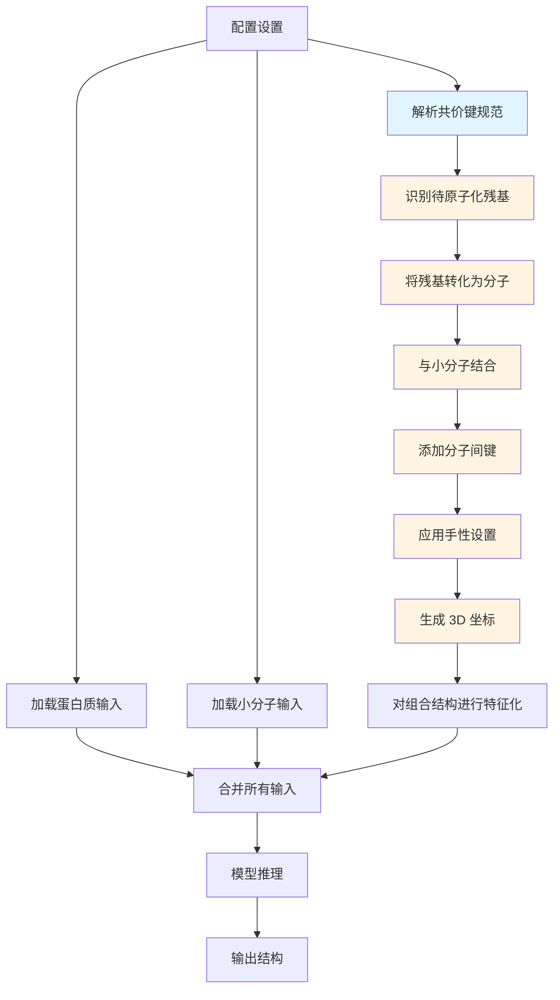
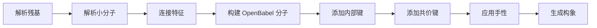
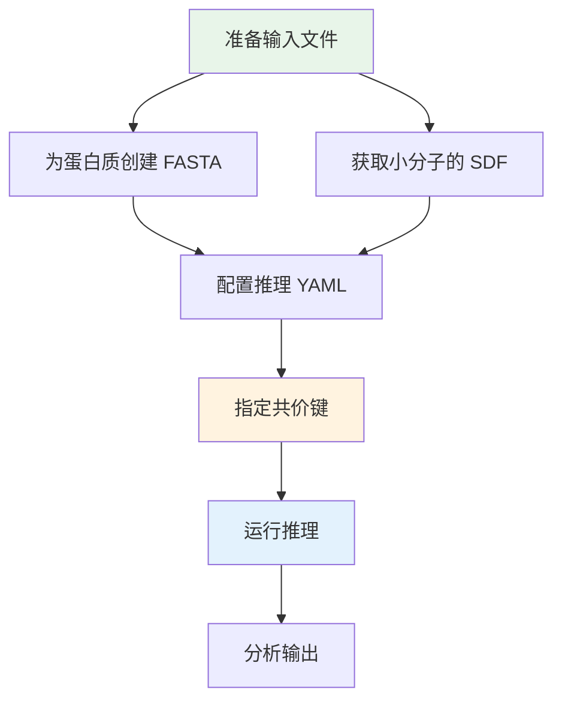

---
slug:13-covalently-modified-protein-prediction
blog_type:normal
---


RoseTTAFold All-Atom 中的共价修饰预测功能能够对小分子通过共价键永久结合到蛋白质上的生物分子复合物进行准确建模。该功能对于研究酶-抑制剂复合物、翻译后修饰以及共价结合起关键作用的药物发现应用至关重要。系统处理了将标准氨基酸残基转化为原子级表示的复杂任务，这些原子级表示可以与小分子配体形成特定的共价键，同时保持正确的立体化学和连接性。

## 架构概览

共价修饰管道作为一个专门的数据预处理阶段运行，将蛋白质残基转化为原子级分子，并与小分子输入建立共价键。这种转换发生在主预测管道之前，确保神经网络接收到所有结合组分的统一表示。



该架构遵循系统的转换过程，其中蛋白质链仅在共价结合位点部分转换为原子级细节，而蛋白质的其余部分保持标准 RoseTTAFold 管道使用的残基级表示。

## 配置系统

共价修饰预测需要一种专门的配置结构，它扩展了标准的蛋白质-小分子复合物配置。关键的附加参数是 `covale_inputs`，它使用结构化元组格式指定共价键。

来源：[covalent.yaml](rf2aa/config/inference/covalent.yaml#L1-L18)

### 完整配置示例

```yaml
defaults:
  - base

job_name: 7s69_A

protein_inputs: 
  A: 
    fasta_file: examples/protein/7s69_A.fasta

sm_inputs:
  B: 
    input: examples/small_molecule/7s69_glycan.sdf
    input_type: sdf

covale_inputs: "[((\"A\", \"74\", \"ND2\"), (\"B\", \"1\"), (\"CW\", \"null\"))]"

loader_params:
  MAXCYCLE: 10
```

### 共价键规范格式

`covale_inputs` 参数使用在运行时解析的 Python 元组语法。每个共价键被指定为一个包含三个元组的列表：

| 组件 | 描述 | 示例 | 备注 |
|-----------|-------------|---------|-------|
| 蛋白质位置 | 链 ID、残基索引、原子名称 | `("A", "74", "ND2")` | 残基索引从 1 开始 |
| 小分子位置 | 链 ID、原子索引 | `("B", "1")` | 原子索引从 1 开始 |
| 手性设置 | 第一个原子的手性、第二个原子的手性 | `("CW", "null")` | 新的手性中心为 "CW" 或 "CCW"，否则为 "null" |

**完整的键元组结构：**
```python
[
    ((protein_chain, residue_number, atom_name),
     (sm_chain, sm_atom_number),
     (chirality_protein_side, chirality_sm_side))
]
```

来源：[covalent.yaml](rf2aa/config/inference/covalent.yaml#L13), [covale.py](rf2aa/data/covale.py#L53-L70)

## 数据处理管道

### 残基原子化过程

共价修饰预测的核心创新是将蛋白质残基从残基级选择性转换为原子级表示。这种转换通过 `find_residues_to_atomize()` 函数进行，该函数：

1.  **识别目标残基**：解析 `covale_inputs` 规范以定位哪些蛋白质残基将参与共价键
2.  **将残基转化为分子**：使用化学数据库中的理想几何结构将每个目标残基转化为独立分子
3.  **跟踪索引**：维护原始残基位置与组合表示中的新原子索引之间的映射关系

来源：[covale.py](rf2aa/data/covale.py#L53-L108)

原子化过程创建 `AtomizedResidue` 对象来跟踪：

```python
@dataclass
class AtomizedResidue:
    chain: str                              # 小分子链标识符
    chain_index_in_combined_chain: int      # 在组合分子中的位置
    absolute_N_index_in_chain: int          # 氮原子索引
    absolute_C_index_in_chain: int          # 碳原子索引
    original_chain: str                     # 原始蛋白质链
    index_in_original_chain: int            # 在原始链中的位置
```

来源：[covale.py](rf2aa/data/covale.py#L22-L28)

### 分子结合与键形成

在原子化目标残基后，系统通过 `get_combined_atoms_bonds()` 将它们与小分子输入结合。此过程：

1.  **解析所有分子**：使用 OpenBabel 读取原子化残基和小分子 SDF 文件
2.  **连接原子特征**：合并原子类型、坐标和键特征
3.  **构建键矩阵**：为每个组件创建带有偏移量的稀疏键表示
4.  **保留内部键**：维持单个分子内所有现有的键

来源：[covale.py](rf2aa/data/covale.py#L128-L158)

额外的分子间键随后通过 `make_obmol_from_atoms_bonds()` 添加：



来源：[covale.py](rf2aa/data/covale.py#L159-L201)

## 手性处理

当形成产生新手性中心的共价键时，系统允许通过 `set_chirality()` 函数显式指定手性。这至关重要，因为共价键的形成通常会将 sp² 碳转化为 sp³ 杂化，从而产生新的手性中心。

### 手性配置

| 手性值 | OpenBabel 立体化学 | 何时需要 |
|-----------------|--------------------------|---------------|
| `"CW"` | 顺时针（通常为 R 构型） | 形成新手性中心 |
| `"CCW"` | 逆时针（通常为 S 构型） | 形成新手性中心 |
| `"null"` | 无变化 | 未创建手性中心 |

系统验证仅在实际创建新手性中心时才指定手性。如果你为未成为手性中心的原子指定手性，系统将引发断言错误。相反，如果形成了新手性中心但未指定手性，系统需要显式配置。

来源：[covale.py](rf2aa/data/covale.py#L203-L218)

### 坐标重新计算

应用手性设置后，系统通过 `recompute_xyz_after_chirality()` 使用 MMFF94 力场重新生成 3D 坐标。这确保了：

1.  **正确的立体化学**：手性中心采用指定的构型
2.  **合理的几何结构**：力场优化键角和距离
3.  **物理真实性**：坐标代表低能构象

<CgxTip>手性规范对于准确预测生物活性至关重要。许多酶-抑制剂相互作用依赖于特定的立体化学，错误的手性可能导致完全不同的结合模式或活性丧失。</CgxTip>

来源：[covale.py](rf2aa/data/covale.py#L225-L239)

## 离去基团去除

对于某些共价修饰（例如，带有离去基团的蛋白酶抑制剂），系统支持从小分子输入中自动去除离去基团原子。这通过小分子输入中的 `is_leaving` 参数控制。

### 离去基团配置

```yaml
sm_inputs:
  B:
    input: examples/small_molecule/inhibitor.sdf
    input_type: sdf
    is_leaving: "[True, True, False, True, False]"  # 每个原子的布尔值列表
```

`is_leaving` 参数是一个布尔值列表，小分子中的每个原子对应一个条目，其中 `True` 表示应在形成共价键之前去除的原子。

来源：[covale.py](rf2aa/data/covale.py#L239-L254)

### 去除过程

1.  **解析分子**：加载小分子并生成构象
2.  **识别离去原子**：使用布尔列表定位要去除的原子
3.  **删除原子**：以反向索引顺序去除原子以保持索引
4.  **导出新的 SDF**：将修改后的分子写入临时文件
5.  **更新配置**：用修改后的版本替换原始输入

此过程确保离去基团被彻底去除而不干扰剩余的分子结构，从而允许与蛋白质正确形成共价键。

来源：[covale.py](rf2aa/data/covale.py#L254-L268)

## 与主管道集成

在处理共价修饰后，原子化残基通过 `merge_inputs.py` 中的 `merge_all()` 集成到主预测管道中。集成过程：

1.  **合并标准输入**：结合蛋白质、核酸和小分子输入
2.  **更新蛋白质特征**：调用 `update_protein_features_after_atomize()` 以：
    -   在原子化残基和相邻残基之间创建新的键特征
    -   去除原子化残基的残基级特征
    -   通过原子化边界的 N-C 肽键维持连接性
3.  **确定特征表示**：为神经网络生成统一的输入

来源：[merge_inputs.py](rf2aa/data/merge_inputs.py#L161-L209)

### 特征更新过程

`RawInputData` 中的 `update_protein_features_after_atomize()` 方法处理在将特定残基转换为原子级细节的同时维持蛋白质链连接性的精细任务：

```python
# 按 N 端到 C 端的顺序处理残基
for residue in residues_to_atomize:
    # 与前一个残基创建键（如果不是链起点）
    if not is_chain_start:
        bond_feats[prev_residue, N_atom] = RESIDUE_ATOM_BOND
        bond_feats[N_atom, prev_residue] = RESIDUE_ATOM_BOND
    
    # 与后一个残基创建键（如果不是链终点）
    if not is_chain_end:
        bond_feats[next_residue, C_atom] = RESIDUE_ATOM_BOND
        bond_feats[C_atom, next_residue] = RESIDUE_ATOM_BOND
    
    # 去除残基级特征
    keep[absolute_index_in_combined_input] = 0
```

这确保了蛋白质主链连续性在原子化区域得以保留，使神经网络能够理解整体链拓扑结构，同时在修饰位点受益于原子级细节。

来源：[data_loader.py](rf2aa/data/data_loader.py#L52-L89)

## 实践实施指南

### 分步工作流



### 输入准备

1.  **蛋白质序列**：为蛋白质链准备标准的 FASTA 文件
2.  **小分子**：获取或创建具有适当 3D 坐标的配体 SDF 文件
3.  **识别附着点**：确定哪个蛋白质残基和原子将形成共价键
4.  **确定手性**：识别是否将创建新手性中心并指定构型

### 运行预测

```bash
# 导航到仓库根目录
cd RoseTTAFold-All-Atom

# 运行共价修饰预测
python -m rf2aa.run_inference --config-name covalent
```

<CgxTip>始终验证蛋白质序列中的原子名称与化学数据库中使用的标准命名法匹配。系统使用这些名称来识别用于共价附着的精确原子，错误的名称将导致预测失败。</CgxTip>

## 支持的共价修饰

该系统支持生物系统中常见的各种类型的共价修饰：

| 修饰类型 | 示例 | 键特征 |
|------------------|---------|---------------------|
| 糖基化 | N-连接聚糖到天冬酰胺 | N-C 键（N-糖苷键） |
| 磷酸化 | 磷酸到丝氨酸/苏氨酸/酪氨酸 | O-P 键 |
| 蛋白酶抑制剂 | 环氧酮、硼酸酯 | 共价弹头化学 |
| 药物偶联物 | ADC、PROTAC | 稳定连接子 |
| 翻译后修饰 | 泛素、SUMO | 异肽键 |

键规范系统的灵活性允许对多样化的共价化学进行建模，包括天然存在的修饰和合成药物分子。

来源：[covale.py](rf2aa/data/covale.py#L12-L18)

## 高级配置

### 多个共价键

可以通过扩展 `covale_inputs` 列表在单个预测中指定多个共价键：

```yaml
covale_inputs: "[
  ((\"A\", \"74\", \"ND2\"), (\"B\", \"1\"), (\"CW\", \"null\")),
  ((\"A\", \"150\", \"SG\"), (\"C\", \"1\"), (\"null\", \"CCW\"))
]"
```

这使得能够对双功能修饰或具有多个共价结合配体的蛋白质进行建模。

### 跨链修饰

共价键可以在不同蛋白质链上的残基之间形成：

```yaml
protein_inputs:
  A:
    fasta_file: examples/protein/chain_A.fasta
  B:
    fasta_file: examples/protein/chain_B.fasta

covale_inputs: "[
  ((\"A\", \"100\", \"NZ\"), (\"B\", \"50\", \"OD1\"), (\"null\", \"null\"))
]"
```

这对于模拟二硫键或其他链间共价连接非常有用。

来源：[README.md](README.md#L200-L215)

## 输出解释

共价修饰预测产生与标准预测相同的输出格式，共价键在最终结构中显式建模。解释时的关键注意事项：

1.  **键长和几何结构**：共价键将具有适当的键长（C-C 约 1.5 Å，C-N 约 1.4 Å 等）
2.  **立体化学**：配置的手性将反映在最终坐标中
3.  **局部环境**：修饰位点将与周围残基显示现实的相互作用
4.  **置信度指标**：pLDDT 和 PAE 分数适用于修饰残基以及结构的其余部分

输出的 PDB 文件将包含具有适当元素名称和连接信息的小分子原子，使其适合下游分析和可视化。

## 故障排除

### 常见问题

| 问题 | 原因 | 解决方案 |
|-------|-------|----------|
| 找不到原子 | 规范中的原子名称不正确 | 验证原子名称与 PDB 命名法匹配 |
| 手性错误 | 形成新手性中心但未指定手性 | 添加适当的 "CW" 或 "CCW" 值 |
| 键形成失败 | 未去除离去基团原子 | 将 `is_leaving` 参数添加到小分子输入 |
| 索引超出范围 | 1-based 和 0-based 索引混淆 | 记住配置中的残基号是从 1 开始的 |

### 调试技巧

1.  **检查原子名称**：在你的结构上使用 `parse_pdb()` 以验证确切的原子名称
2.  **验证分子**：独立解析你的 SDF 文件以确保其可读
3.  **测试单个键**：在添加多个键之前先测试单个共价键
4.  **检查手性**：检查分子结构以识别哪些原子在键形成时成为手性原子

来源：[parsers.py](rf2aa/data/parsers.py#L485-L550)

## 后续步骤

要全面了解预测管道，请继续阅读：

- [蛋白质-小分子复合物预测](11-protein-small-molecule-complex-prediction) - 了解非共价蛋白质-配体相互作用
- [输入数据结构](18-input-data-structures) - 详细检查数据表示
- [化学特征处理](21-chemical-feature-processing) - 深入探讨化学计算

对于实际应用，请查看：

- [使用 Docker 运行推理](4-running-inference-with-docker) - 容器化执行环境
- [了解模型输出](5-understanding-model-outputs) - 解释置信度指标和结构质量