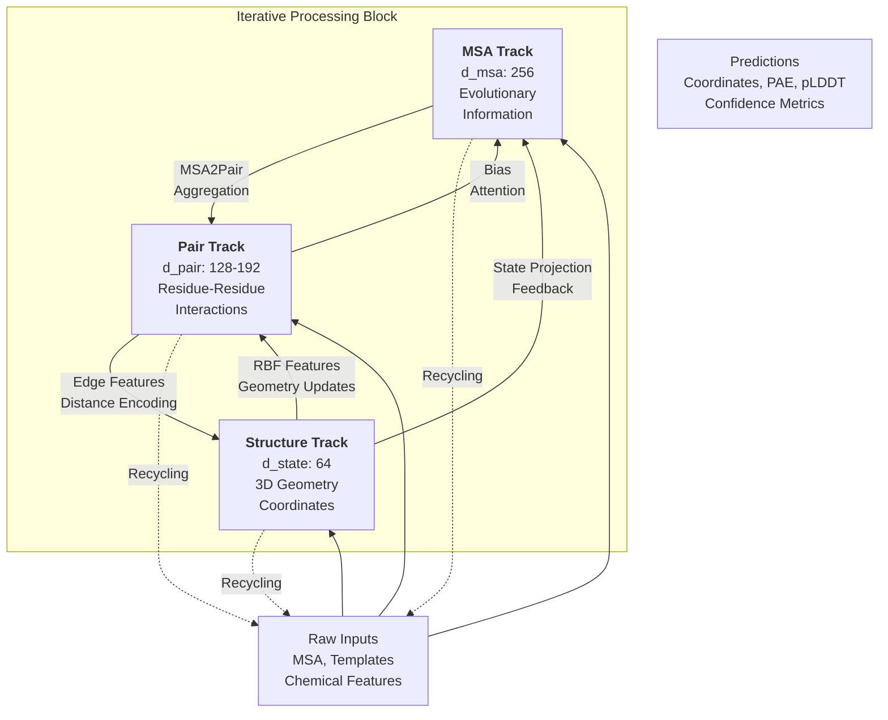

---
slug:14-three-track-design-overview
blog_type:normal
---


RoseTTAFold-All-Atom 采用了一种复杂的三轨神经网络架构，通过紧密耦合的信息交换通路处理生物分子系统的互补表示。该设计协调 MSA（多序列比对）、Pair（残基间关系）和 Structure（3D 几何）轨道以迭代方式运行，使模型能够同时利用进化信息、空间约束和化学物理知识。这种架构方法使 RFAA 能够在一个统一的框架内预测蛋白质、核酸、小分子及其复合物的结构。

## 架构基础

三轨架构在不同抽象级别上表示信息，并维护轨道间的双向通信通道。每个轨道使用针对其表示类型优化的不同维度和专用计算机制。MSA 轨道通过序列比对捕获进化约束，Pair 轨道通过基于注意力的处理编码成对相互作用，Structure 轨道通过 SE(3)-等变变换维护 3D 坐标信息。




来源: [RoseTTAFoldModel.py](rf2aa/model/RoseTTAFoldModel.py#L29-L167), [Track_module.py](rf2aa/model/Track_module.py#L892-L1070)

## 轨道规范与计算操作

每个轨道维护不同的特征维度，并实现针对其表示要求定制的专用神经网络操作。配置系统允许通过推理配置文件自定义这些参数，默认值针对多样化的生物分子预测任务进行了优化。

**表：轨道维度与计算组件**

| Track | Dimension | Primary Components | Key Operations | Output Representation |
|-------|-----------|-------------------|----------------|----------------------|
| **MSA** | d_msa: 256 | MSAPairStr2MSA, FeedForward, Row/Column Attention | Biased self-attention with pair/state bias, global attention for extra sequences | (B, N, L, 256) - Batch, Sequences, Length, Features |
| **Pair** | d_pair: 128-192 | PairStr2Pair, Triangle Multiplication, Axial Attention | Striped attention operations, triangle multiplications, gating | (B, L, L, 128-192) - Batch, Length, Length, Features |
| **Structure** | d_state: 64 | Str2Str, SE3TransformerWrapper, SCPred | SE(3)-equivariant graph convolutions, coordinate updates, torsion prediction | (B, L, 3, 3) - Batch, Length, Atoms, Coordinates |

来源: [Track_module.py](rf2aa/model/Track_module.py#L70-L130), [Track_module.py](rf2aa/model/Track_module.py#L273-L425), [Track_module.py](rf2aa/model/Track_module.py#L460-L575), [base.yaml](rf2aa/config/inference/base.yaml#L39-L67)

### MSA 轨道实现

MSA 轨道始于嵌入层 (`MSA_emb`)，将原始序列标记转换为高维表示。核心计算单元是 `MSAPairStr2MSA`，它实现了一种复杂的注意力机制，引入了来自 Pair 轨道和 Structure 轨道的偏置信号。偏置项结合了归一化的 Pair 特征与基于距离的径向基函数（RBF）特征，而 Structure 轨道通过状态投影到查询序列提供反馈。该模块应用带 Pair 偏置的行注意力，随后是列注意力和前馈变换 [Track_module.py](rf2aa/model/Track_module.py#L70-L130)。

```python
# Simplified MSA track operation flow
pair_bias = norm_pair(pair) + emb_rbf(rbf_feat)  # Distance-aware pair bias
state_bias = proj_state(norm_state(state)).reshape(B, 1, L, -1)  # Structure feedback
msa = index_add(msa, state_bias, query_idx)  # Inject structure info
msa = msa + row_attn(msa, pair_bias)  # Row attention with bias
msa = msa + col_attn(msa)  # Column attention
msa = msa + ff(msa)  # Feed-forward transformation
```

来源: [Track_module.py](rf2aa/model/Track_module.py#L70-L130), [Embeddings.py](rf2aa/model/layers/Embeddings.py#L14-L82)

### Pair 轨道实现

Pair 轨道作为中央通信枢纽，通过复杂的注意力架构编码残基间关系。`PairStr2Pair` 模块实现了三角形乘法（包括出站和入站），随后是带偏置的轴向注意力操作。关键的是，该轨道通过 `crop` 参数支持条带处理以提高内存效率，从而能够对大型蛋白质的 Pair 矩阵子块进行计算。该模块还引入了来自结构状态特征的门控机制，调节距离信息如何影响 Pair 表示 [Track_module.py](rf2aa/model/Track_module.py#L273-L425)。

<CgxTip>
条带注意力实现（`p2p_crop` 参数）将 L×L Pair 矩阵划分为重叠块，独立处理每个块。这种设计使得能够高效扩展到包含数千个残基的蛋白质，同时通过块边界保持捕获长程相互作用的能力。crop 参数默认为 -1（全矩阵），但在内存受限环境中可设置为 128 或 256 等值。
</CgxTip>

```python
# Structure state gating on pair updates
left = proj_left(norm_state(state))
right = proj_right(norm_state(state))
gate = sigmoid(to_gate(einsum('bli,bmj->blmij', left, right)))
rbf_feat = gate * emb_rbf(rbf_feat)  # Modulate distance info with structure state

# Striped processing for efficiency
if crop > 0 and crop <= L:
    pair = subblock(tri_mul_out, pair, rbf_feat, crop)  # Process blocks
```

来源: [Track_module.py](rf2aa/model/Track_module.py#L273-L425), [RoseTTAFoldModel.py](rf2aa/model/RoseTTAFoldModel.py#L38-L77)

### Structure 轨道实现

Structure 轨道通过 SE(3)-等变变换维护 3D 坐标信息，确保预测结果尊重旋转和平移对称性。`Str2Str` 模块整合来自 MSA 和 Pair 轨道的特征，构建一个图表示，其中节点代表残基，边编码几何和化学关系。核心计算引擎是 `SE3TransformerWrapper`，它通过等变注意力机制处理类型 0（标量）和类型 1（向量）特征。该模块还通过 `SCPred` 头预测侧链扭转角，从而实现全原子重建 [Track_module.py](rf2aa/model/Track_module.py#L460-L575)。

<CgxTip>
SE(3)-等变设计确保对输入坐标应用旋转或平移会导致输出坐标产生等效变换。这是通过对标量（l0）和向量（l1）特征进行注意力操作实现的，其中基于四元数的旋转更新保持了群结构。输出包括用于明确旋转表示的四元数分量（qA, qB, qC, qD）。
</CgxTip>

来源: [Track_module.py](rf2aa/model/Track_module.py#L460-L575), [SE3_network.py](rf2aa/model/layers/SE3_network.py#L1-L101)

## 轨道间通信机制

三轨架构的强大之处在于精心设计的通信通路，这些通路实现了表示之间的信息流动。四种主要的通信机制促进了跨轨道学习：MSA 到 Pair 聚合、Pair 到 MSA 偏置、Structure 到 MSA 反馈以及 Pair 到 Structure 整合。

**表：轨道间通信通路**

| Source → Target | Module | Information Type | Computational Pattern |
|-----------------|--------|------------------|----------------------|
| MSA → Pair | MSA2Pair | Sequence co-evolution signals | Outer product aggregation across MSA depth |
| Pair → MSA | MSAPairStr2MSA | Residue relationship bias | Attention bias term in row/column operations |
| Str → MSA | MSAPairStr2MSA | Geometric constraints | State projection on query sequence |
| Pair → Str | Str2Str | Distance/orientation encoding | Edge features in SE(3) graph |
| Str → Pair | PairStr2Pair | Coordinate-based gating | Multiplicative gate on RBF features |

来源: [Track_module.py](rf2aa/model/Track_module.py#L426-L459), [Track_module.py](rf2aa/model/Track_module.py#L70-L130), [Track_module.py](rf2aa/model/Track_module.py#L460-L575)

### MSA 到 Pair 信息流

`MSA2Pair` 模块通过外积操作随后的线性投影，将来自 MSA 轨道的进化信息聚合到 Pair 表示中。该实现通过投影左右序列嵌入，在 MSA 深度（N 个序列）上取平均，并通过学习的投影组合结果来计算成对关系。零初始化的输出确保 Pair 特征最初仅编码几何信息，然后再逐步纳入进化信号 [Track_module.py](rf2aa/model/Track_module.py#L426-L459)。

```python
# MSA aggregation to pair features
msa = norm(msa)
left = proj_left(msa)  # (B, N, L, d_hidden)
right = proj_right(msa) / float(N)  # Normalize by sequence count
out = einsum('bsli,bsmj->blmij', left, right).reshape(B, L, L, -1)
pair = pair + proj_out(out)  # Residual connection with zero init
```

来源: [Track_module.py](rf2aa/model/Track_module.py#L426-L459)

### Structure 轨道整合

Structure 轨道通过 RBF 编码的距离特征接收来自 Pair 轨道的几何约束，这些特征与 Pair 嵌入和化学信息拼接，形成 SE(3) Transformer 的边特征。节点特征结合了 MSA 查询序列信息和结构状态特征，创建了一个平衡进化信号与当前几何理解的丰富表示。SE(3) Transformer 处理该图结构，通过等变注意力操作更新标量节点特征（状态）和向量特征（l1 表示）[Track_module.py](rf2aa/model/Track_module.py#L460-L575)。

来源: [Track_module.py](rf2aa/model/Track_module.py#L460-L575), [SE3_network.py](rf2aa/model/layers/SE3_network.py#L35-L101)

## 迭代处理架构

IterativeSimulator 通过不同的块类型协调多个处理周期，每种块类型服务于特定的计算目标。该架构包含三个连续阶段：用于处理额外序列信息的 Extra 块、用于深度迭代优化的 Main 块，以及用于最终坐标精修的 Refiner 块。这种多阶段设计允许模型首先建立广泛的进化约束，然后通过深度迭代优化结构，最后利用物理约束精修坐标 [Track_module.py](rf2aa/model/Track_module.py#L975-L1220)。

**表：迭代块配置**

| Block Type | Default Count | MSA Dimension | Attention Type | Purpose |
|------------|---------------|---------------|----------------|---------|
| Extra Blocks | 4 | d_msa_full: 64 | Global column attention | Process additional sequences, establish constraints |
| Main Blocks | 12-32 | d_msa: 256 | Standard column attention | Deep iterative refinement of structure |
| Refiner Blocks | 4 | d_msa: 256 | SE(3) refinement | Coordinate polishing with physical constraints |

来源: [Track_module.py](rf2aa/model/Track_module.py#L975-L1070), [base.yaml](rf2aa/config/inference/base.yaml#L42-L67)

### IterBlock 实现

每个 `IterBlock` 包含通过所有三个轨道的一个完整处理周期。在一个块内，操作按顺序进行：带有 Pair 和 Structure 偏置的 MSA 更新、MSA 到 Pair 聚合、带有基于距离特征的 Pair 更新，以及通过 SE(3) 变换的 Structure 更新。该块可选择性地支持训练期间的检查点以提高内存效率，并包含对重复蛋白质的对称性处理。前向传播返回所有轨道的更新表示以及中间预测（四元数、alphas）[Track_module.py](rf2aa/model/Track_module.py#L892-L975)。

来源: [Track_module.py](rf2aa/model/Track_module.py#L892-L975)

### 回收机制

该架构通过回收机制支持跨多个周期的迭代优化，该机制将前一周期的输出作为后一周期的输入。`Recycling` 模块（或用于全面特征回收的 `RecyclingAllFeatures`）将先前的 MSA、Pair、Structure 和 State 表示与当前输入结合，允许模型迭代改进其预测。回收在 RoseTTAFoldModule 的模块级别运行，周期数由配置中的 `MAXCYCLE` 参数控制 [RoseTTAFoldModel.py](rf2aa/model/RoseTTAFoldModel.py#L385-L458), [base.yaml](rf2aa/config/inference/base.yaml#L31-L37)。

```python
# Recycling combines previous iteration outputs with new inputs
def recycle(msa, pair, xyz, state, sctors, mask_recycle=None):
    rbf_feat = rbf(torch.cdist(xyz[:,:,1], xyz[:,:,1]))
    # Combine previous and current representations
    # (Detailed implementation in Recycling class)
    return updated_msa, updated_pair, updated_xyz, updated_state
```

来源: [RoseTTAFoldModel.py](rf2aa/model/RoseTTAFoldModel.py#L385-L458), [Embeddings.py](rf2aa/model/layers/Embeddings.py#L385-L458)

## 轨道架构中的高级功能

三轨设计结合了几种复杂功能，用于处理复杂的生物分子系统，包括对称性约束、模板整合和化学特征处理。这些功能使模型能够在结构预测期间遵守已知的物理和生化约束。

### 对称性和重复处理

对于具有内部对称性或重复单元的蛋白质，该架构实现了对称化操作，强制对称子单元得到等效处理。`apply_pair_symmetry` 函数支持多种方法（'max'、'mean'、'copy'），用于在 Pair 表示的对称块之间传播信息。当启用 `symmetrize_repeats` 时，`find_symmsub` 函数识别 Pair 矩阵中的对称对角线，对称化操作强制这些区域的一致性 [Track_module.py](rf2aa/model/Track_module.py#L131-L258)。

```python
# Symmetry operations enforce equivalent treatment of repeats
if symmetrize_repeats:
    symmsub = find_symmsub(L, repeat_length, symmsub_k)  # Find symmetric diagonals
    pair = apply_pair_symmetry(pair, symmsub, method='max')  # Enforce symmetry
```

来源: [Track_module.py](rf2aa/model/Track_module.py#L131-L258), [Track_module.py](rf2aa/model/Track_module.py#L273-L425)

### 模板整合

模板信息通过 `Templ_emb` 模块直接整合到 Pair 轨道中。模板提供来自同源蛋白的结构先验，编码 2D 距离和方向特征（61 个距离分箱 + 6 个方向）以及 1D 序列和置信度信息。模板堆栈通过与 Pair 轨道类似的注意力操作处理这些特征，并可选择对包含重复单元的模板进行对称性处理。当启用 `copy_main_block` 时，整合支持将模板信息复制到对称块 [Embeddings.py](rf2aa/model/layers/Embeddings.py#L242-L384)。

来源: [Embeddings.py](rf2aa/model/layers/Embeddings.py#L242-L384), [RoseTTAFoldModel.py](rf2aa/model/RoseTTAFoldModel.py#L52-L67)

## 后续步骤

本概述建立了理解 RoseTTAFold-All-Atom 三轨架构的基础。要加深您的理解：

- **[RoseTTAFoldModule 核心组件](15-rosettafoldmodule-core-components)**：检查轨道处理、输入嵌入和预测头整合的模块级协调
- **[用于 3D 等变性的 SE3Transformer](16-se3transformer-for-3d-equivariance)**：深入了解使 Structure 轨道能够进行几何感知处理的 SE(3)-等变 Transformer 架构
- **[注意力机制和嵌入](17-attention-mechanisms-and-embeddings)**：探索支持轨道间通信的特定注意力实现（MSA 行/列、轴向注意力、三角形乘法）