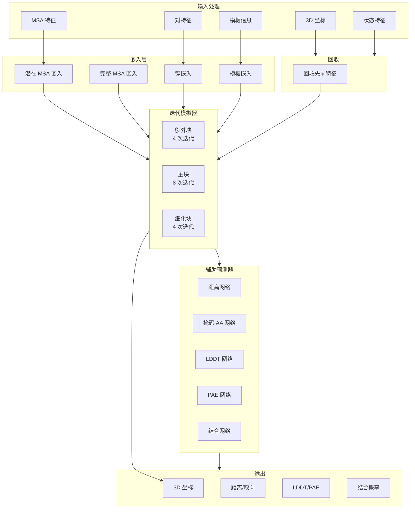
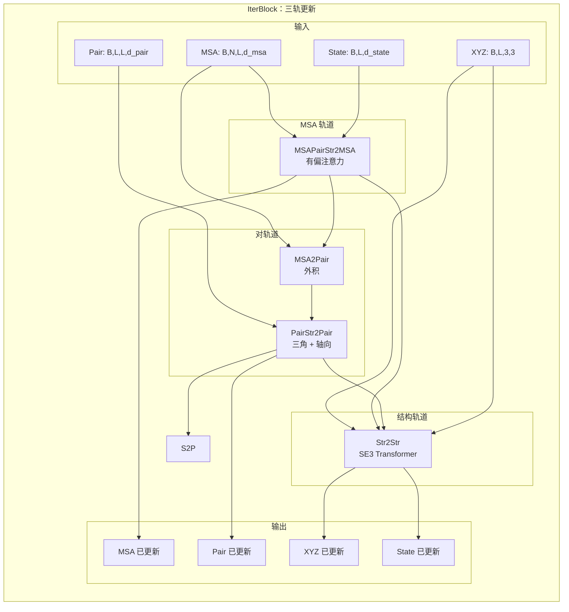

---
slug:15-rosettafoldmodule-core-components
blog_type:normal
---

RoseTTAFoldModule 是 RoseTTAFold-All-Atom 架构的核心协调器，它实现了一个复杂的三轨系统，通过迭代细化联合处理多序列比对（MSA）特征、残基对关系和 3D 结构坐标。该模块通过一个结合深度学习与生物物理约束的集成框架，实现了蛋白质、核酸、小分子及其复合物的全原子结构预测。

来源：[RoseTTAFoldModel.py](rf2aa/model/RoseTTAFoldModel.py#L29-L167)

## 模块架构概览

RoseTTAFoldModule 实现了一个分层架构，由初始化层、迭代模拟器和辅助预测头组成。该模块设计用于通过多次回收迭代处理输入特征，逐步完善结构预测和特征表示。

该架构维持 MSA 表示的特征维度 d_msa=256，成对特征维度 d_pair=128，以及原子状态特征维度 d_state=16，通过迭代细化过程实现轨道间的高效信息流。

来源：[RoseTTAFoldModel.py](rf2aa/model/RoseTTAFoldModel.py#L42-L51)

## 初始化和嵌入层

嵌入层将原始输入特征转换为学习到的表示，作为迭代细化的基础。每个嵌入层专门处理特定类型的生物或结构信息。

**潜在 MSA 嵌入** 通过保留进化信息的学习投影处理核心 MSA 信息。MSA_emb 模块生成三个并行嵌入：形状为 (B, N, L, d_msa) 的 MSA 嵌入、形状为 (B, L, L, d_pair) 的对嵌入，以及形状为 (B, L, d_state) 的状态嵌入。对嵌入通过 PositionalEncoding2D 模块结合了来自左右残基嵌入的序列信息和相对位置编码。

来源：[Embeddings.py](rf2aa/model/layers/Embeddings.py#L14-L82)

**完整 MSA 嵌入** 处理包括额外序列和插入的扩展序列信息。Extra_emb 模块处理维度等于氨基酸 Token 总数加上插入缺失和末端标记的特征，生成维度为 d_msa_full=64 的嵌入，以捕获更广泛的序列多样性。

来源：[Embeddings.py](rf2aa/model/layers/Embeddings.py#L95-L119)

**键嵌入** 通过 Bond_emb 模块编码残基间的共价键信息。该层将形状为 (B, L, L) 的键特征投影到对表示空间，使模型能够直接将化学连接约束纳入成对特征轨道。

来源：[Embeddings.py](rf2aa/model/layers/Embeddings.py#L126-L144)

**模板嵌入** 通过 Templ_emb 模块整合来自同源模板的结构信息。该层处理 2D 模板特征（61 个距离直方图箱 + 6 个取向 + 掩码）和 1D 模板特征（序列 + 置信度），应用 TemplatePairStack 更新对和状态特征。模板嵌入通过可配置的对称化参数支持重复蛋白质的对称操作，包括 repeat_length（重复长度）、symmsub_k（对角线数量）和 sym_method（平均、最大或复制操作）。

来源：[Embeddings.py](rf2aa/model/layers/Embeddings.py#L242-L327)

| 嵌入类型 | 输入维度 | 输出维度 | 用途 |
|---|---|---|---|
| 潜在 MSA | d_init=328 | d_msa=256 | 核心进化信息 |
| 完整 MSA | NAATOKENS+4 | d_msa_full=64 | 扩展序列多样性 |
| 键 | NBTYPES | d_pair=128 | 共价连接 |
| 模板 | t2d=68, t1d=30 | d_pair, d_state | 同源结构信息 |

## 回收机制

回收机制通过将前几轮的预测作为后续周期的输入来实现迭代细化。RoseTTAFoldModule 支持由 recycling_type 参数控制的两种回收策略："msa_pair"（默认）和 "all"。

**MSA-对回收** 仅使用一个 Recycling 模块更新 MSA 和对特征，该模块从 CA 坐标计算距离特征并将其投影到对表示空间。回收的特征被添加到初始嵌入中：第一个 MSA 序列接收回收的 MSA 特征，所有对特征接收回收的对特征。

来源：[Embeddings.py](rf2aa/model/layers/Embeddings.py#L385-L404)

**全特征回收** 通过 RecyclingAllFeatures 模块提供更全面的更新。除了基于距离的对更新外，该策略还结合来自左右残基的状态信息和扭转角信息来更新 MSA 特征。状态投影将距离特征与双侧状态信息连接，实现轨道间更丰富的特征传播。

来源：[Embeddings.py](rf2aa/model/layers/Embeddings.py#L417-L434)

<CgxTip>回收机制是模型迭代细化策略的基础。对于涉及多条链或配体的复杂预测，使用 "all" 回收类型可以通过在每次迭代中纳入更全面的结构信息来提高收敛性。</CgxTip>

## 迭代模拟器

IterativeSimulator 通过组织成三个阶段的多个块（额外块、主块和细化块）来协调三轨更新过程。每个阶段在逐步完善结构和特征表示方面发挥独特作用。

来源：[Track_module.py](rf2aa/model/Track_module.py#L975-L1085)

**额外块**（默认：4 个块）在启用全局注意力的情况下处理完整 MSA 特征（d_msa_full=64）。这些块使用配置了 n_head_msa=8、d_hidden_msa=8 和 use_global_attn=True 的 IterBlock 实例处理多样化的序列信息。额外块使模型能够在专注于核心查询序列之前利用扩展 MSA 的序列多样性。

来源：[Track_module.py](rf2aa/model/Track_module.py#L1006-L1022)

**主块**（默认：8 个块）使用标准注意力处理核心潜在 MSA 特征（d_msa=256）。这些 IterBlock 实例使用 n_head_msa=8、d_hidden=32 和 use_global_attn=False，通过迭代的三轨更新将计算资源集中在完善主序列表示上。

来源：[Track_module.py](rf2aa/model/Track_module.py#L1024-L1040)

**细化块**（默认：4 个块）使用配置了 SE3_ref_param 的专用 Str2Str 模块执行最终的 SE(3)-等变细化。这些块结合了手性梯度和 Lennard-Jones 势等物理约束，以产生物理上合理的全原子结构。细化器操作的邻域 top_k=64，比主块的 top_k=128 更小，从而实现精确的局部细化。

来源：[Track_module.py](rf2aa/model/Track_module.py#L1042-L1071)

### IterBlock：单次迭代单元

IterBlock 实现一个完整的三轨更新周期，通过协调操作整合 MSA、对和结构轨道之间的信息。

来源：[Track_module.py](rf2aa/model/Track_module.py#L892-L974)

**MSAPairStr2MSA** 使用有偏自注意力更新 MSA 轨道，其中注意力偏差源自对特征和结构信息。该模块将径向基函数（RBF）距离特征投影到对空间，并将其与现有的对表示结合。查询序列位置 通过投影到 MSA 维度的状态特征从结构轨道接收额外反馈。行注意力应用源自对特征的偏差，而列注意力（对于额外块为 MSAColGlobalAttention）纳入序列范围的上下文。

来源：[Track_module.py](rf2aa/model/Track_module.py#L71-L130)

**MSA2Pair** 通过外积注意力将 MSA 信息转换为对特征。该模块通过瓶颈（d_hidden=16）降低 MSA 维度并应用 dropout 以防止过拟合，生成捕获 MSA 中共进化约束的对更新。

来源：[Track_module.py](rf2aa/model/Track_module.py#L426-L448)

**PairStr2Pair** 通过三角操作和轴向注意力细化对表示。三角乘法（包括传入和传出）捕获高阶几何关系，而行和列轴向注意力以 O(L²) 复杂度实现高效的成对通信。对于对称重复蛋白质，该模块支持块对称化操作（平均、最大或复制）以在重复结构单元间强制执行对称约束。

来源：[Track_module.py](rf2aa/model/Track_module.py#L273-L366)

**Str2Str** 使用 SE(3)-等变 Transformer 更新结构轨道。该模块通过连接序列和状态表示来处理节点特征，然后将其投影到 SE(3) Transformer 输入维度。边特征结合对信息与 RBF 距离特征及序列分离/键信息。SE3TransformerWrapper 在由 CA 坐标构建的 k 近邻图（默认 top_k=128）上执行等变消息传递，输出标量状态更新（l0 特征）和向量平移/旋转（l1 特征）。

来源：[Track_module.py](rf2aa/model/Track_module.py#L460-L575)

旋转由预测的四元数参数（qA, qB, qC, qD）构建，并应用旋转掩码以防止修改小分子坐标。最终的坐标更新将旋转应用于残基坐标系，并加上预测的平移，在刚性变换下保持等变性。

来源：[Track_module.py](rf2aa/model/Track_module.py#L938-L974)

## 辅助预测头

辅助预测头从细化的特征表示中生成多样化的结构和置信度指标，为下游分析提供可解释的输出。

**DistanceNetwork** 预测对称和非对称取向特征。对称投影输出 61 个距离箱和 6 个 omega 角箱，而非对称投影输出 37 个 theta 箱和 19 个 phi 箱。对称特征与其转置进行平均以强制执行成对一致性。网络对权重和偏置使用零初始化，确保预测从均匀分布开始。

来源：[AuxiliaryPredictor.py](rf2aa/model/layers/AuxiliaryPredictor.py#L6-L27)

**MaskedTokenNetwork** 预测 MSA 中掩码位置的氨基酸概率。该头将 MSA 特征投影到 NAATOKENS 类，使模型能够通过掩码语言建模学习序列模式。输出被重塑以结合批量和序列维度，以便高效分类。

来源：[AuxiliaryPredictor.py](rf2aa/model/layers/AuxiliaryPredictor.py#L38-L57)

**LDDTNetwork** 使用 50 个校准箱预测每个残基的置信度分数。局部距离差分测试（LDDT）通过比较残基间距离来测量局部结构准确性，提供残基级别的质量指标，有助于识别预测良好的区域。

来源：[AuxiliaryPredictor.py](rf2aa/model/layers/AuxiliaryPredictor.py#L58-L73)

**PAENetwork** 使用 64 个箱预测预测对齐误差（PAE）矩阵。PAE 估计结构对齐后对齐残基之间的预期误差，捕获局部和全局预测置信度。该指标对于评估多链复合物中的界面预测准确性特别有价值。

来源：[AuxiliaryPredictor.py](rf2aa/model/layers/AuxiliaryPredictor.py#L74-L88)

**BinderNetwork** 根据 PAE 预测分类两条链是否形成结合界面。该网络提取链间 PAE 值（其中 same_chain=0），计算其平均值，并应用 sigmoid 分类器生成结合概率。该头能够直接评估预测的复合物形成。

来源：[AuxiliaryPredictor.py](rf2aa/model/layers/AuxiliaryPredictor.py#L89-L104)

<CgxTip>所有辅助预测头对其投影层使用零初始化。这种设计选择确保预测从均匀先验开始，使模型仅在迭代细化产生可靠的特征表示时才逐渐学会做出自信的预测。</CgxTip>

## 前向传播执行流程

RoseTTAFoldModule 的前向方法实现了完整的推理流水线，协调从输入嵌入到输出生成的所有组件。

**输入验证和形状检查** 在启用 assert_single_sequence_input 时对输入张量形状和设备位置执行可选的断言检查。这验证输入特征是否符合预期维度，对于调试自定义输入流水线特别有用。

来源：[RoseTTAFoldModel.py](rf2aa/model/RoseTTAFoldModel.py#L208-L258)

**嵌入生成** 通过对输入特征应用潜在嵌入、完整嵌入和键嵌入来创建初始特征表示。潜在嵌入生成 MSA、对和状态特征，而键嵌入将共价键信息添加到对特征中。完整嵌入单独处理扩展的 MSA 信息。

来源：[RoseTTAFoldModel.py](rf2aa/model/RoseTTAFoldModel.py#L300-L310)

**回收集成** 通过选定的回收策略纳入先前迭代的预测。当先前的特征不可用时，针对首次迭代情况初始化零张量。回收的特征被添加到其相应的初始嵌入中，实现回收迭代间的逐步细化。

来源：[RoseTTAFoldModel.py](rf2aa/model/RoseTTAFoldModel.py#L312-L321)

**模板集成** 通过模板嵌入添加源自模板的信息，使用同源模板的结构约束更新对和状态特征。此步骤通过沿主对角线的可配置块复制支持重复蛋白质的对称操作。

来源：[RoseTTAFoldModel.py](rf2aa/model/RoseTTAFoldModel.py#L323-L325)

**迭代模拟** 通过模拟器执行三轨细化，返回来自所有块的中间坐标和特征。模拟器生成 xyz_s（来自每个块的坐标）、alpha_s（扭转角）、xyzallatom_s（全原子坐标）以及表示每次迭代旋转的四元数。

来源：[RoseTTAFoldModel.py](rf2aa/model/RoseTTAFoldModel.py#L327-L337)

**预测生成** 将辅助预测头应用于最终特征：来自 MSA 特征的掩码氨基酸预测、来自对特征的距离直方图和取向预测、来自状态特征的 LDDT 预测，以及来自对特征的 PAE/PDE 预测（PDE 使用对称化的对特征）。结合网络基于链间 PAE 值生成结合概率预测。

来源：[RoseTTAFoldModel.py](rf2aa/model/RoseTTAFoldModel.py#L339-L358)

| 输出组件 | 特征来源 | 形状 | 描述 |
|---|---|---|---|
| logits_dist | pair | (B, 61, L, L) | 距离箱概率 |
| logits_aa | msa | (B, NAATOKENS, N*L) | 掩码氨基酸概率 |
| logits_pae | pair | (B, 64, L, L) | 对齐误差预测 |
| lddt | state | (B, 50, L) | 每残基置信度 |
| xyz | - | (N_blocks, B, L, 3, 3) | 中间骨架坐标 |
| alpha_s | - | (N_blocks, B, L, NTOTALDOFS, 2) | 扭转角预测 |

## 配置和超参数

RoseTTAFoldModule 暴露了大量配置参数，使其能够适应不同的预测任务和计算约束。

**块结构参数** 控制每个模拟阶段的深度：n_extra_block（默认 4）、n_main_block（默认 8）和 n_ref_block（默认 4）。这些参数直接在计算成本和预测质量之间进行权衡，块越多可以实现更细粒度的细化，但会增加推理时间。

来源：[RoseTTAFoldModel.py](rf2aa/model/RoseTTAFoldModel.py#L38-L41)

**特征维度** 参数定义每个轨道的容量：d_msa=256（MSA 特征）、d_msa_full=64（扩展 MSA 特征）、d_pair=128（成对特征）、d_templ=64（模板特征）和源自 SE3_param['l0_out_features'] 的 d_state（默认 16）。这些维度在模型表达能力与内存需求之间取得平衡。

来源：[RoseTTAFoldModel.py](rf2aa/model/RoseTTAFoldModel.py#L42-L46)

**注意力配置** 包括用于 MSA 轨道注意力头的 n_head_msa=8 和用于对轨道注意力头的 n_head_pair=4。隐藏层维度由 d_hidden=32 和 d_hidden_templ=64 控制，分别用于通用和模板特定的前馈网络。

来源：[RoseTTAFoldModel.py](rf2aa/model/RoseTTAFoldModel.py#L47-L50)

**基于物理的约束** 能够纳入领域知识：use_chiral_l1=True 将手性梯度信息作为 l1 特征添加，use_lj_l1=False 控制 Lennard-Jones 势梯度。lj_lin=0.6 参数线性化 Lennard-Jones 势以进行稳定的梯度计算。refiner_topk=64 设置最终细化块的邻域大小。

来源：[RoseTTAFoldModel.py](rf2aa/model/RoseTTAFoldModel.py#L64-L70)

**对称参数** 强制重复蛋白质的结构规律性：symmetrize_repeats 启用对称化，repeat_length 指定单元长度，symmsub_k 定义要对称化的对角线，sym_method 选择操作（平均、最大或复制）。main_block 在复制模板信息时识别包含基序区域的主块。

来源：[RoseTTAFoldModel.py](rf2aa/model/RoseTTAFoldModel.py#L32-L37)

RoseTTAFoldModule 将多轨道学习与生物物理约束复杂地集成在一起，能够对多样化的生物分子系统进行准确的全原子结构预测。模块化架构促进了针对各个组件的定向改进，同时通过迭代细化过程保持连贯的信息流。

来源：[RoseTTAFoldModel.py](rf2aa/model/RoseTTAFoldModel.py#L29-L167)

## 下一步

要加深对 RoseTTAFold 架构的理解，请继续阅读 [SE3Transformer 用于 3D 等变性](16-se3transformer-for-3d-equivariance)，了解结构轨道如何实现旋转和平移等变性。如需更广泛的架构视角，请参阅 [三轨设计概览](14-three-track-design-overview)，了解信息如何在整个模型的轨道间流动。