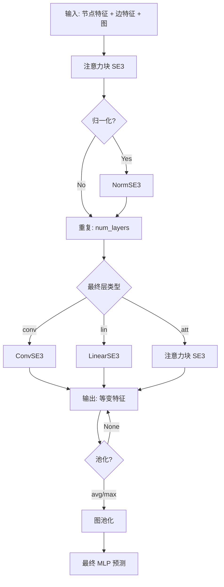

---
slug:16-se3transformer-for-3d-equivariance
blog_type:normal
---


SE3Transformer 是一种专用的神经网络架构，它在处理表示生物分子系统的图结构数据时，能够保持 **SE(3)-等变性**——即在 3D 旋转和平移下的数学不变性。这种架构选择确保了当输入坐标在 3D 空间中经历刚体变换时，输出能够进行可预测且一致的变换，这对于预测分子取向不应影响结果的原子结构至关重要。

来源：[README.md](rf2aa/SE3Transformer/README.md#L48-L74), [SE3_network.py](rf2aa/model/layers/SE3_network.py#L23-L24)

## 数学基础：Fiber 数据结构

SE(3)-等变表示的核心数据抽象是 **Fiber** 类，它根据特征在 SO(3) 旋转下的变换程度来组织特征。k 类型的特征根据旋转群的第 k 个不可约表示进行变换，其维度为 2k+1。这种结构使网络能够混合等变特征，同时保持旋转属性。

```python
FiberEl = namedtuple('FiberEl', ['degree', 'channels'])

class Fiber(dict):
    """
    描述一组特征的结构。
    特征分为类型 (0, 1, 2, 3, ...)。k 类型的特征维度为 2k+1。
    """
```

Fiber 提供了从原始张量创建特征结构、计算维度以及对特征多重性执行算术运算的方法。例如，`Fiber.create(num_degrees=3, num_channels=32)` 会生成一个包含度 0、1、2、3 的 fiber，每个度包含 32 个通道。0 型特征代表 **标量**（在旋转下不变），1 型特征代表 **3D 向量**，而更高度的特征则捕获高阶张量表示。

来源：[fiber.py](rf2aa/SE3Transformer/se3_transformer/model/fiber.py#L34-L53)

## 基础计算：球谐函数和 Clebsch-Gordan 系数

SE3Transformer 依赖于两个基本的数学构造来计算 **等变基矩阵**，从而实现不同度特征之间的正确混合：

1. **球谐函数**：计算相对位置的旋转等变表示。该实现使用 e3nn 库中的 `o3.spherical_harmonics()` 生成高达指定最大度的谐函数。这些构成了基础的角分量。

2. **Clebsch-Gordan 系数**：实现不可约表示的耦合。这些系数定义了如何通过中间度 J 组合 d_in 和 d_out 度的特征，并通过 `o3.wigner_3j()` 实现 Wigner 3-j 符号。它们被缓存以避免冗余计算。

`get_basis_script()` 函数结合这些组件，为每个输入-输出度对生成成对基矩阵 K_J，构成了所有等变操作的基础。这些基在每个图上计算一次，并在网络层中重复使用。

来源：[basis.py](rf2aa/SE3Transformer/se3_transformer/model/basis.py#L55-L95), [basis.py](rf2aa/SE3Transformer/se3_transformer/model/basis.py#L37-L54)

<CgxTip>
基础计算是 SE3Transformer 中计算密集度最高的操作。为了提高效率，球谐函数和 Clebsch-Gordan 系数使用 Python 的 `lru_cache` 装饰器进行缓存，确保它们在整个训练或推理会话中每个设备每个度配置只计算一次。</CgxTip>

## 核心架构：SE3Transformer

SE3Transformer 类在顺序流水线中编排多层等变操作：



构造函数接受控制网络深度（`num_layers`）、特征维度（`fiber_in`、`fiber_hidden`、`fiber_out`）、注意力配置（`num_heads`、`channels_div`）和优化标志（`tensor_cores`、`low_memory`）的参数。`fuse_level` 参数确定用于 Tensor Core 优化的操作融合程度，当 Tensor Core 可用时，FULL 融合提供最大吞吐量。

每一层由一个 `AttentionBlockSE3` 组成，后跟可选的 `NormSE3` 归一化。最终层可以根据任务要求配置为卷积、线性变换或注意力块。该架构支持可选的图池化，并且可以返回特定类型的特征。

来源：[transformer.py](rf2aa/SE3Transformer/se3_transformer/model/transformer.py#L63-L95), [transformer.py](rf2aa/SE3Transformer/se3_transformer/model/transformer.py#L95-L160)

## 等变注意力机制

`AttentionSE3` 类实现了保持 SE(3)-等变性的多头稀疏图自注意力。与在平坦特征向量上操作的标准注意力机制不同，这种注意力机制在 **Fiber 结构特征** 上操作：

前向传播将键和查询特征重塑以分离注意力头，通过内积计算注意力权重，并将这些权重应用于值特征。关键的见解是，所有操作都尊重 Fiber 结构——0 度特征仅与 0 度交互，1 度与 1 度交互，依此类推——确保在整个过程中保持等变性。

`AttentionBlockSE3` 将此机制包装在一个完整的块中，包括跳跃连接、层归一化和可选的边特征融合。它管理从节点特征到边特征（键/值生成）的转换、注意力计算以及转换回节点特征的过程。

来源：[attention.py](rf2aa/SE3Transformer/se3_transformer/model/layers/attention.py#L40-L80), [attention.py](rf2aa/SE3Transformer/se3_transformer/model/layers/attention.py#L107-L160)

## SE(3)-等变卷积：张量场网络

`ConvSE3` 类实现了张量场网络（TFN）卷积，这是图节点之间等变消息传递的核心构建块：

```python
class ConvSE3(nn.Module):
    """
    SE(3)-等变图卷积（张量场网络卷积）。
    此卷积可以将任意输入 Fiber 映射到任意输出 Fiber，
    同时保持等变性。不同度的特征相互交互
    以产生输出特征。
    """
```

卷积操作涉及三个关键步骤：
1. **径向剖面函数**：多层感知器处理不变边特征（例如距离），为每个频率分量生成可学习的径向权重。
2. **基加权组合**：径向权重调制预计算的等变基矩阵以形成学习核。
3. **邻居聚合**：核应用于邻居节点特征，并聚合结果以生成更新的节点特征。

`VersatileConvSE3` 模块提供灵活的融合策略：FULL 将所有操作融合到单个核中以实现最大的 Tensor Core 利用率，PARTIAL 融合选定的操作，NONE 成对执行操作以实现最大的灵活性。`fuse_level` 参数允许在计算效率和内存使用之间进行权衡。

来源：[convolution.py](rf2aa/SE3Transformer/se3_transformer/model/layers/convolution.py#L203-L260), [convolution.py](rf2aa/SE3Transformer/se3_transformer/model/layers/convolution.py#L121-L146)

## 线性等变变换

`LinearSE3` 层在每个度内提供逐点线性变换，相当于保持等变性的 1×1 卷积：

每个度接收一个独立的线性变换：0 型特征（标量）通过权重矩阵变换以产生新的 0 型特征，1 型特征（向量）通过单独的矩阵变换以产生 1 型特征，依此类推。不发生跨度混合，在保持等变性的同时允许灵活的通道维度更改。此操作通常用于将隐藏表示映射到输出维度的最终层。

来源：[linear.py](rf2aa/SE3Transformer/se3_transformer/model/layers/linear.py#L35-L60)

## 与 RoseTTAFold 的集成：SE3TransformerWrapper

RoseTTAFold 架构通过 `SE3TransformerWrapper` 类集成 SE3Transformer，该类将通用的 SE(3)-等变架构调整为适用于全原子结构预测：

包装器构建具有特定 fiber 配置的 SE3Transformer：
- `fiber_in`：包含 0 型特征（标量嵌入）和可选的 1 型特征（向量坐标）。
- `fiber_hidden`：使用 `Fiber.create(num_degrees, num_channels)` 创建多度隐藏表示。
- `fiber_out`：包含 0 型输出特征（状态嵌入）和可选的 1 型输出特征（坐标更新）。

包装器通过精心设计的权重初始化方案处理初始化：ReLU 之前的线性层使用 Kaiming 正态初始化，而径向函数层使用专门的初始化，最终层零初始化以进行稳定训练。最终的线性层被零初始化，以便最初产生小梯度，从而促进稳定学习。

来源：[SE3_network.py](rf2aa/model/layers/SE3_network.py#L23-L95), [RoseTTAFoldModel.py](rf2aa/model/RoseTTAFoldModel.py#L90-L150)

## 在迭代结构细化中的使用

Track_module.py 中的 `IterativeSimulator` 编排多个 `IterBlock` 模块，每个模块包含用于结构细化的 SE(3)-等变操作：

`Str2Str` 模块应用 SE3TransformerWrapper 来更新结构特征。它接收 MSA 嵌入、对嵌入、当前坐标和状态特征，产生更新的坐标和状态嵌入。前向传播在 `torch.cuda.amp.autocast(enabled=False)` 模式下操作，以保持敏感几何操作的精度。该模块处理原子帧表示、键特征和 top-k 邻居选择以进行高效计算。

同样，`Allatom2Allatom` 模块将 SE(3) 变换直接应用于全原子表示，从而在整个迭代细化过程中实现对原子位置的细粒度更新。该模块使用 `@torch.cuda.amp.autocast(enabled=False)` 操作，以保持坐标更新的数值稳定性。

来源：[Track_module.py](rf2aa/model/Track_module.py#L460-L576), [Track_module.py](rf2aa/model/Track_module.py#L577-L587), [Track_module.py](rf2aa/model/Track_module.py#L892-L975)

## 等变性测试和验证

实现在 `test_equivariance.py` 中包括严格的等变性测试：

测试验证通过旋转矩阵 R 旋转输入坐标会产生也由 R 旋转的输出，容差为 `TOL = 1e-3`。测试创建具有不同度节点特征的随机图，应用旋转变换，并检查每个特征类型的 `|f(x @ R) - f(x) @ R| < TOL`。这种数学验证确保实现正确保留了对于可靠结构预测至关重要的 SE(3)-等变性属性。

来源：[test_equivariance.py](rf2aa/SE3Transformer/tests/test_equivariance.py#L1-L50)

## 性能优化策略

SE3Transformer 实现包括几种性能优化：

| 优化策略 | 实现 | 益处 |
|---------------------|----------------|---------|
| Tensor Core 融合 | `fuse_level = ConvSE3FuseLevel.FULL` | 在 NVIDIA Ampere/Volta/Turing 上速度提升高达 1.5 倍 |
| 低内存模式 | `low_memory=True` 参数 | 减少内存消耗，操作较慢 |
| 混合精度训练 | 使用 autocast 自动转换 | 计算速度更快，同时保持精度 |
| 基缓存 | Clebsch-Gordan 上的 `@lru_cache(maxsize=None)` | 避免冗余系数计算 |
| 填充基 | `use_pad_trick=True` 参数 | 更好的 Tensor Core 利用率 |

<CgxTip>
`tensor_cores` 标志自动启用完全融合和填充基，以便在 NVIDIA GPU 上获得最佳性能。但是，当内存受限时（例如大型蛋白质复合物），设置 `low_memory=True` 会牺牲一些性能以显著减少内存占用。</CgxTip>

来源：[transformer.py](rf2aa/SE3Transformer/se3_transformer/model/transformer.py#L100-L115), [README.md](rf2aa/SE3Transformer/README.md#L154-L194)

## 架构总结

SE3Transformer 为分子图上的 SE(3)-等变深度学习提供了一个完整的框架：


该架构的力量在于其数学基础——使用群论保证等变性，而不是仅仅依赖归纳偏置。这使其特别适用于 3D 几何基础的任务，例如蛋白质结构预测、分子性质预测和原子级结构细化。

要深入了解与 SE3Transformer 交互的注意力机制，请参阅 [注意力机制和嵌入](17-attention-mechanisms-and-embeddings)。要了解 SE3Transformer 如何集成到更广泛的三轨道架构中，请参阅 [RoseTTAFoldModule 核心组件](15-rosettafoldmodule-core-components)。