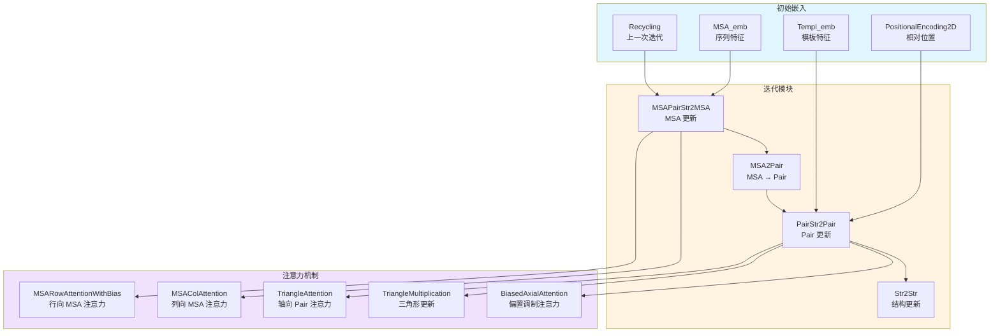

---
slug:17-attention-mechanisms-and-embeddings
blog_type:normal
---


本页面深入解析了驱动 RoseTTAFold-All-Atom 三轨架构的注意力机制和嵌入策略。这些组件构成了核心计算引擎，使模型能够整合多种生物信息来源——MSA 序列、残基对关系和 3D 结构——从而对蛋白质、核酸和小分子复合物生成连贯的预测结果。

## 架构概览

RoseTTAFold-All-Atom 采用了复杂的多尺度注意力架构，在三个基础轨道上运行：MSA（多序列比对）、Pair（残基对关系）和 Structure（3D 坐标）。注意力机制促进了这些轨道之间的双向信息流动，使模型能够通过多次回收循环迭代地优化预测。



该架构设计遵循分层模式，其中高分辨率轨道（维度为 N×L 的 MSA）为低分辨率轨道（维度为 L×L 的 Pair）提供信息，同时结构反馈循环优化所有表示。这种设计使模型能够通过 MSA 分析捕捉进化模式，并通过 3D 几何推理捕捉物理约束。

来源：[Track_module.py](rf2aa/model/Track_module.py#L892-L974), [Attention_module.py](rf2aa/model/layers/Attention_module.py#L31-L76)

## 多头注意力基础

基础的多头注意力机制是所有专用注意力变体的计算基础。该实现遵循标准的 Transformer 架构，并采用了专为深度循环训练设计的初始化策略。

### 核心架构

注意力机制在多个并行头上计算缩放点积注意力，使模型能够联合关注来自不同表示子空间的信息。前向传播实现了三个关键变换：

- **Query/Key/Value 投影**：线性映射，将输入特征投影为每个注意力头的查询、键和值向量
- **注意力计算**：在键维度上通过 softmax 归一化的缩放点积注意力
- **输出投影**：线性变换，将多头输出组合回目标维度

关键的缩放因子 `1/√(d_hidden)` 通过确保注意力权重在反向传播期间保持在适当范围内，防止深度网络中的梯度消失。这一数学选择直接影响数十次回收迭代中的训练稳定性。

来源：[Attention_module.py](rf2aa/model/layers/Attention_module.py#L31-L76)

### 初始化策略

初始化方案根据其在残差连接架构中的作用区分不同的投影类型：

- **Query/Key/Value 投影**：Glorot uniform（Xavier uniform）初始化，通过层维持方差稳定性
- **输出投影**：零初始化确保残差连接在初始化时表现为恒等变换，这对于深度网络至关重要
- **偏置项**：输出投影的零初始化，防止初始特征漂移

这种初始化策略不仅仅是表面文章——它直接解决了包含 12 个以上迭代模块的网络固有的训练挑战。通过从类似恒等的行为开始，网络可以逐渐学习有意义的变换，而不会在早期阶段破坏特征。

<CgxTip>零初始化的输出投影是一个关键的架构选择，它使残差连接在早期训练期间能够作为跳跃连接发挥作用。这防止了注意力层在初期压倒输入特征，并允许梯度无阻碍地流经深层注意力块堆栈。</CgxTip>

来源：[Attention_module.py](rf2aa/model/layers/Attention_module.py#L48-L57)

## MSA 轨道注意力机制

MSA 轨道采用专用的注意力模式，旨在捕捉多个序列维度上的进化信息。这些机制在形状为 (B, N, L, d_msa) 的 MSA 张量上运行，其中 B 是批次大小，N 是序列数量，L 是序列长度，d_msa 是特征维度。

### 带有 Pair 偏置的行向注意力

MSARowAttentionWithBias 实现了 MSA 行与 Pair 表示之间的交叉注意力，使模型能够将成对残基关系信息整合到 MSA 特征更新中。这种机制对于将结构约束整合到序列级推理中至关重要。

该操作遵循三个阶段的过程：

1. **偏置准备**：变换 Pair 特征并将其与 RBF（径向基函数）距离特征结合，以创建注意力偏置
2. **序列加权**：序列加权模块计算每个序列的重要性分数，该分数调制查询投影
3. **偏置注意力**：标准多头注意力在 softmax 之前增加了源自 Pair 的偏置项

数学公式用外部偏置项扩展了标准注意力：
```
attn = softmax(QK^T/√(d_hidden) + bias)
```

这种偏置注入机制允许模型在 MSA 更新期间优先考虑某些残基对关系，从而有效地将结构知识整合到序列进化建模中。

来源：[Attention_module.py](rf2aa/model/layers/Attention_module.py#L108-L169)

### 列向全局注意力

MSAColAttention 在 MSA 的列维度上运行，允许信息在相同位置的不同序列之间流动。这对于捕捉位置特定的保守模式和识别重要残基至关重要。

存在两种变体：

- **MSAColAttention**：用于典型 MSA 处理的标准列注意力
- **MSAColGlobalAttention**：具有较小特征维度 (d_msa=64) 的全局注意力变体，用于高效处理大型 MSA

列注意力置换张量维度以在序列维度 (N) 上计算注意力，允许每个位置从比对中的所有序列聚合信息。这使模型能够根据注意力权重学习哪些序列在每个位置最具信息量。

来源：[Attention_module.py](rf2aa/model/layers/Attention_module.py#L170-L253)

### MSA 轨道整合

MSAPairStr2MSA 模块在每个迭代模块内协调所有 MSA 轨道更新。它协调：

1. **Pair 偏置准备**：归一化 Pair 特征并添加 RBF 距离编码
2. **状态注入**：投影结构状态特征并将其添加到查询序列（MSA 中的第一个序列）
3. **行注意力**：应用 MSARowAttentionWithBias 并使用 Dropout 进行正则化
4. **列注意力**：应用标准或全局列注意力
5. **前馈变换**：扩展因子为 4 的两层前馈网络

该模块代表了 Pair 和结构信息影响 MSA 表示的主要接口。状态注入机制专门使用结构反馈更新查询序列（索引 0），从而创建从结构到序列的关键反馈循环。

来源：[Track_module.py](rf2aa/model/Track_module.py#L71-L130)

## Pair 轨道注意力机制

Pair 轨道在表示残基对关系的 L×L 矩阵上运行，采用复杂的注意力模式来捕捉局部和全局结构约束。这些机制对于生物分子结构中的长程相互作用和物理约束建模至关重要。

### 三角注意力

TriangleAttention 沿着 Pair 矩阵的起始节点（行）或结束节点（列）实现轴向注意力。这种专门的注意力模式旨在捕捉残基之间的方向性关系。

该机制计算行注意力的对 (i,j) 和 (i,k) 之间，或列注意力的对 (i,j) 和 (k,j) 之间的注意力。这使模型能够推理几何关系：

- **行注意力**：捕捉 Pair (i,j) 如何与所有共享相同起始残基 i 的 Pair 相关
- **列注意力**：捕捉 Pair (i,j) 如何与所有共享相同结束残基 j 的 Pair 相关

每个三角注意力层包含一个门控机制，学习根据输入 Pair 特征调制注意力输出的贡献。这种门控通过注意力机制提供了信息流的自适应控制。

来源：[Attention_module.py](rf2aa/model/layers/Attention_module.py#L274-L341)

### 三角乘法

TriangleMultiplication 实现了受 AlphaFold 2 中三角更新模式启发的乘法更新。该机制通过沿三角维度计算 Pair 特征的乘积来捕捉三体相关性。

存在两种变体：

- **传出乘法**：计算所有 k 的 `left(i,k) * right(k,j)`，捕捉来自 i 的传出边
- **传入乘法**：计算所有 k 的 `left(k,i) * right(k,j)`，捕捉指向 j 的传入边

乘法操作之后是 k 维度上的归一化（除以序列长度 L），然后通过门控输出投影。该机制特别擅长捕捉涉及三个残基的几何约束，例如角度和二面角关系。

<CgxTip>三角乘法在计算上代价高昂，但对于捕捉三体相关性非常强大。该实现使用 einsum 操作来提高效率，并且通过 L 进行归一化防止了可能因可变序列长度而产生的梯度缩放问题。</CgxTip>

来源：[Attention_module.py](rf2aa/model/layers/Attention_module.py#L342-L405)

### 偏置轴向注意力

BiasedAxialAttention 实现了带有外部偏置调制的绑定轴向注意力，作为标准三角注意力模式的替代方案。“绑定”方面意味着查询和键在注意力维度上共享同一组特征。

与标准三角注意力的关键架构差异：

1. **绑定注意力**：查询和键矩阵源自相同的特征，减少了参数数量
2. **偏置注入**：外部偏置（通常来自 RBF 距离特征）被添加到注意力 logits
3. **键归一化**：键被序列长度 L 除以保持尺度不变性

当偏置项携带应该引导注意力模式的强几何信息（例如来自当前 3D 坐标的距离约束）时，此机制特别有用。

来源：[Attention_module.py](rf2aa/model/layers/Attention_module.py#L406-L476)

### Pair 轨道整合

PairStr2Pair 模块在每个迭代模块内协调所有 Pair 轨道更新。它实现了一个复杂的处理流程：

1. **RBF 特征嵌入**：将基于距离的 RBF 特征变换为 Pair 维度
2. **状态门控**：投影结构状态特征以创建调制 RBF 特征的门控
3. **三角乘法**：应用传出和传入三角乘法，并使用 Dropout
4. **轴向注意力**：应用行和列偏置轴向注意力
5. **前馈变换**：扩展因子为 2 的两层前馈网络

该模块可选地支持针对非常大的蛋白质的条带处理，其中操作应用于 Pair 矩阵的子块以减少内存占用。这使得能够对具有数千个残基的蛋白质进行推理。

来源：[Track_module.py](rf2aa/model/Track_module.py#L273-L425)

## 初始嵌入策略

初始嵌入层将原始生物数据转换为注意力机制所需的丰富特征表示。这些嵌入为迭代优化建立了起点。

### MSA 嵌入

MSA_emb 从原始输入数据生成初始 MSA、Pair 和 State 嵌入。该过程涉及：

- **MSA 投影**：将 One-Hot 编码的 MSA 特征 (d_init = 2*NAATOKENS + 4) 线性变换为 d_msa 维度
- **查询增强**：查询序列嵌入被添加到所有 MSA 行，确保目标序列被整合
- **Pair 构建**：左右残基嵌入求和，然后用位置编码增强
- **状态初始化**：从查询序列生成残基状态特征

查询增强确保我们要预测的目标序列在所有 MSA 行中始终被表示，为注意力机制创建一个强信号以供使用。

来源：[Embeddings.py](rf2aa/model/layers/Embeddings.py#L14-L82)

### 2D 位置编码

PositionalEncoding2D 为 Pair 表示提供相对位置信息，这对于捕捉分子结构中依赖距离的模式至关重要。编码在两个尺度上运行：

- **残基级编码**：以可配置范围（默认 -32 到 +32）捕捉残基之间的相对位置
- **原子级编码**：以较小范围（默认 0 到 8）捕捉局部原子邻域关系

该实现使用学习的嵌入而不是固定的正弦编码，允许模型为特定任务学习最佳的位置表示。编码在构建后添加到 Pair 特征，确保位置信息存在于所有 Pair 轨道操作中。

该模块还支持针对多链复合物的链编码，使模型能够区分链间和链内残基对。

来源：[Track_module.py](rf2aa/model/Track_module.py#L27-L69)

### 模板嵌入

Templ_emb 将结构模板信息整合到模型中，提供进化和结构约束的额外来源。模板处理流程：

1. **2D 模板嵌入**：将 2D 特征（距离图 + 方向）与 1D 特征的外积连接，然后投影到模板维度
2. **模板堆栈处理**：应用注意力层来处理模板特征
3. **交叉注意力**：标准注意力将模板特征与查询 Pair 特征融合
4. **扭转角处理**：单独的嵌入路径处理扭转角信息

模板堆栈使用专用处理，包括针对重复蛋白的可选对称操作，使模型能够在存在时利用内部对称性。

来源：[Embeddings.py](rf2aa/model/layers/Embeddings.py#L242-L330)

## 回收嵌入

回收嵌入使模型能够通过多次迭代优化预测，每次迭代接收来自上一次迭代预测的信息。这种迭代优化对于实现高质量的结构预测至关重要。

### MSA-Pair 回收

标准 Recycling 模块将上一次迭代的结构信息注入到当前的 MSA 和 Pair 表示中：

1. **MSA 归一化**：MSA 特征的层归一化
2. **Pair 归一化**：Pair 特征的层归一化
3. **距离计算**：从上一次迭代坐标中的 CA 原子距离计算 RBF 特征
4. **Pair 注入**：投影距离特征并将其添加到归一化的 Pair 特征

这为模型提供了关于其先前预测的明确几何反馈，使其能够在随后的迭代中纠正错误。

来源：[Embeddings.py](rf2aa/model/layers/Embeddings.py#L385-L403)

### 全特征回收

RecyclingAllFeatures 提供了更全面的回收策略，整合了所有可用信息：

- **Pair 回收**：结合距离 RBF 特征与左/右状态投影（来自 SE3 层的结构特征）
- **MSA 回收**：投影扭转角特征并将其添加到 MSA 表示

这种更丰富的回收为模型提供了更详细的反馈，可能会提高复杂预测的收敛性。回收策略之间的选择可根据计算约束和模型性能要求进行配置。

来源：[Embeddings.py](rf2aa/model/layers/Embeddings.py#L417-L458)

## 跨轨道通信

跨轨道通信机制实现了三个轨道之间的信息流动，这对于将多样化的生物信号整合为连贯的预测至关重要。

### MSA 到 Pair

MSA2Pair 通过外积聚合将 MSA 表示转换为 Pair 特征：

1. **MSA 投影**：将 MSA 特征投影到较低维度
2. **外积**：在所有序列上计算 `sum_{seq} MSA[i,seq] ⊗ MSA[j,seq]`
3. **Pair 注入**：投影外积结果并将其添加到现有的 Pair 特征

这使得来自 MSA 的共进化信息能够影响成对关系建模，这对于捕捉指示结构接触的相关突变至关重要。

来源：[Track_module.py](rf2aa/model/Track_module.py#L426-L448)

### 结构反馈

MSAPairStr2MSA 模块通过以下方式实现结构反馈：

1. **状态归一化**：归一化来自 SE3 层的结构状态特征
2. **状态投影**：将状态特征投影到 MSA 维度
3. **查询注入**：将投影后的状态添加到 MSA 中的查询序列（第一行）

这种将结构信息直接注入查询序列，使 MSA 轨道能够在处理进化信息的同时推理几何约束。

来源：[Track_module.py](rf2aa/model/Track_module.py#L100-L106)

## 全原子嵌入

全原子嵌入将模型的能力从 Cα 原子扩展到完整的全原子表示，这对于准确的侧链放置和小分子建模至关重要。

### 残基到原子扩展

AllatomEmbed 将残基级表示扩展为原子级特征：

1. **残基扩展**：将残基状态广播到 27 个原子位置
2. **随机掩码**：以概率 p_mask 随机掩码残基特征以提高鲁棒性
3. **元素编码**：连接 One-Hot 元素类型编码
4. **压缩**：将组合特征投影到原子级维度

训练期间的随机掩码提供了噪声鲁棒性，防止模型过度依赖完美的残基信息。

来源：[Track_module.py](rf2aa/model/Track_module.py#L610-L672)

### 原子到残基归约

ResidueEmbed 执行逆操作，将原子级特征聚合回残基级：

1. **展平**：将原子级特征 (B, L, 27, d_state) 重塑为 (B, L, 27*d_state)
2. **投影**：到残基维度的线性变换
3. **归一化**：用于稳定训练的层归一化

这种原子和残基表示之间的双向转换使模型能够在不同操作中以适当的尺度运行。

来源：[Track_module.py](rf2aa/model/Track_module.py#L685-L711)

## 迭代模块整合

IterBlock 模块在迭代模拟器的单次迭代中协调所有注意力机制，为优化提供主要的计算循环。

### 处理流程

每个 IterBlock 执行固定的操作序列：

1. **RBF 特征计算**：从当前坐标计算基于距离的 RBF 特征，并用位置编码增强
2. **MSA 更新**：使用 Pair 和结构信息更新 MSA 特征
3. **MSA→Pair 投影**：将更新的 MSA 转换为 Pair 特征
4. **Pair 更新**：使用三角操作和轴向注意力优化 Pair 特征
5. **结构更新**：使用 SE3 Transformer (Str2Str) 更新 3D 坐标
6. **对称操作**：可选地对重复蛋白应用对称操作

Str2Str 模块调用 SE3Transformer，它实现 3D 等变注意力以在保持旋转和平移对称性的同时更新原子位置。

来源：[Track_module.py](rf2aa/model/Track_module.py#L892-L974), [SE3_network.py](rf2aa/model/layers/SE3_network.py)

### 梯度检查点

IterBlock 支持梯度检查点以提高训练期间的内存效率：

```python
if use_checkpoint:
    msa = checkpoint.checkpoint(create_custom_forward(self.msa2msa), msa, pair, rbf_feat, state, use_reentrant=True)
    pair = checkpoint.checkpoint(create_custom_forward(self.msa2pair), msa, pair, use_reentrant=True)
    # ... 其他检查点操作
```

这通过在反向传播期间重新计算前向传播来用计算时间换取内存节省，从而能够在有限的 GPU 内存下训练更深的模型。

来源：[Track_module.py](rf2aa/model/Track_module.py#L930-L950)

## 技术实现细节

### 注意力参数配置

模型为不同的注意力类型使用了精心调整的超参数：

| 注意力类型 | d_hidden | n_head | 典型用例 |
|----------------|----------|--------|------------------|
| MSA 行向 | 32 | 8 | 带有 Pair 偏置的 MSA 更新 |
| MSA 列向 | 32 | 8 | 标准 MSA 列注意力 |
| MSA 全局 | 8 | 8 | 大型 MSA 处理 |
| 三角 | 32 | 4 | Pair 轴向注意力 |
| 偏置轴向 | 32 | 4 | 替代 Pair 注意力 |

参数选择平衡了表示能力与计算效率，对于高分辨率 MSA 轨道使用更多的头和较小的隐藏维度。

来源：[RoseTTAFoldModel.py](rf2aa/model/RoseTTAFoldModel.py#L42-L48)

### Dropout 模式

应用了不同的 Dropout 模式以防止过拟合：

- **广播 Dropout (dim=1)**：应用于行操作，丢弃整个 MSA 行或 Pair 矩阵行
- **广播 Dropout (dim=2)**：应用于列操作，丢弃整个列
- **标准 Dropout**：应用于前馈层

广播 Dropout 模式提供了尊重张量结构的正则化，确保在相关维度上进行连贯的特征掩码。

来源：[Track_module.py](rf2aa/model/Track_module.py#L334-L335)

## 后续步骤

要更深入地了解特定的架构组件：

- **3D 几何推理**：[SE3Transformer for 3D Equivariance](16-se3transformer-for-3d-equivariance) 解释了 SE3 Transformer 如何在更新原子坐标的同时保持旋转等变性
- **整体模型结构**：[RoseTTAFoldModule Core Components](15-rosettafoldmodule-core-components) 全面展示了这些注意力机制如何整合到完整模型中
- **三轨设计**：[Three-Track Design Overview](14-three-track-design-overview) 解释了 MSA/Pair/Structure 分解的架构原理

对于实际实现细节：

- **配置**：[Base Configuration Parameters](7-base-configuration-parameters) 展示了如何配置注意力超参数
- **数据流**：[Input Data Structures](18-input-data-structures) 解释了输入数据如何流入这些嵌入层
- **推理**：[ModelRunner Workflow](22-modelrunner-workflow) 展示了这些机制在预测期间如何被使用