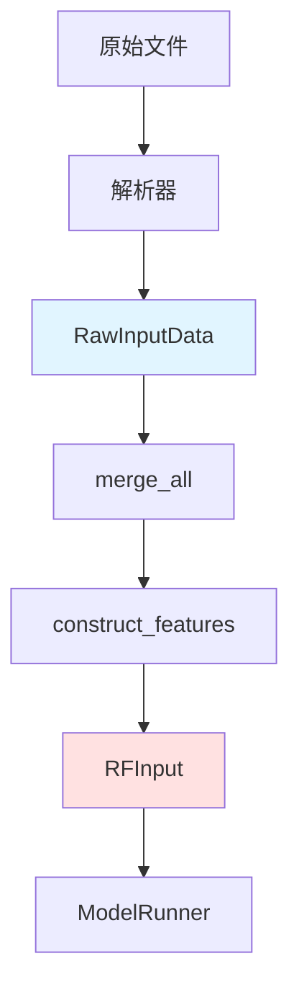
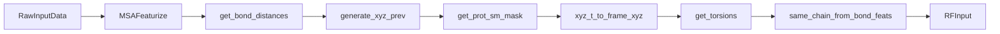

---
slug:18-input-data-structures
blog_type:normal
---

RoseTTAFold-All-Atom 采用分层的数据架构，将原始生物输入转换为针对三轨神经网络设计优化的结构化张量。该系统通过统一的数据结构管理多种生物分子类型——蛋白质、核酸和小分子——在保持化学准确性的同时，实现高效的并行计算。

## 核心数据架构

输入管道维护两个主要数据结构：用于中间表示的 `RawInputData` 和用于模型可消费特征的 `RFInput`。这种分离使得预处理操作（如 MSA 生成、模板提取和原子化）能够在最终特征化之前，在结构化但灵活的格式上进行。

该架构通过为每种生物分子类型维护单独的加载路径，然后将它们合并为统一表示，从而支持异源复合物。链边界、分类 ID 和共价修饰规范等关键元数据在整个转换流水线中均被保留。

来源：[data_loader.py](rf2aa/data/data_loader.py#L13-L27), [merge_inputs.py](rf2aa/data/merge_inputs.py#L161-L204)

## RawInputData 结构

`RawInputData` 作为主要的中间数据容器，封装了特征构建所需的所有信息。该数据类支持灵活的操作，包括用于共价配体修饰的残基原子化和用于复合物组装的特征过滤。

### 核心张量字段

| 字段 | 形状 | 描述 | 化学上下文 |
|-------|-------|-------------|------------------|
| `msa` | (N, L) | 多序列比对 | 查询序列位于索引 0 |
| `ins` | (N, L) | 插入统计 | 追踪空位位置 |
| `bond_feats` | (L, L) | 键连通性矩阵 | 键类型 1-7 |
| `xyz_t` | (T, L, NTOTAL, 3) | 模板坐标 | T 个模板，36 种原子类型 |
| `mask_t` | (T, L, NTOTAL) | 模板原子存在性 | 已观测 vs 缺失 |
| `t1d` | (T, L, NPROTAAS) | 1D 模板特征 | 每个残基的嵌入 |
| `chirals` | (4, NCHIRAL) | 手性规范 | 四面体中心 |
| `atom_frames` | (L, NTOTAL, 3) | 局部坐标系 | 用于内部坐标 |

键特征矩阵用键类型编码共价连接：UNKNOWN (0), SINGLE (1), DOUBLE (2), TRIPLE (3), AROMATIC (4), BACKBONE (5), PROTEIN-LIGAND (6), 和 OTHER (7)。这种编码既支持距离计算（通过最短路径算法），也支持特定键的特征生成。

来源：[data_loader.py](rf2aa/data/data_loader.py#L13-L27), [data_loader_utils.py](rf2aa/data/data_loader_utils.py#L887-L891), [chemical.py](rf2aa/chemical.py#L104-L106)

### 可选元数据字段

- `taxids`: List[str] - 用于跨链 MSA 比对的分类标识符
- `term_info`: Tensor - 链边界的 N/C 端二进制特征
- `chain_lengths`: List[Tuple[str, int]] - 链标识符和长度对
- `idx`: List - 用于输出生成的残基索引

chain_length 元数据通过提供抽象残基索引与物理链边界之间的映射，实现了复合物组装。此信息对于生成区分链内和链间相互作用的 `same_chain` 矩阵至关重要。

来源：[data_loader.py](rf2aa/data/data_loader.py#L23-L26), [data_loader.py](rf2aa/data/data_loader.py#L41-L50)

## 残基原子化机制

`update_protein_features_after_atomize` 方法实现了从粗粒度残基到全原子表示的转换。对于共价配体结合，此过程至关重要，因为必须以原子细节表示特定的残基侧链以形成正确的键。

<CgxTip>原子化需要按顺序处理残基（从 N 端到 C 端），以正确处理顺序键修饰。该算法会在移除残基级表示之前，更新原子化残基与其邻居之间的键特征。</CgxTip>

该操作涉及三个步骤：(1) 为 N 端和 C 端连接建立残基-原子键，(2) 在相邻的原子化残基之间创建顺序键，(3) 通过 `keep_features` 方法过滤残基级特征。所有张量维度相应调整，并重新索引手性中心索引以保持一致性。

来源：[data_loader.py](rf2aa/data/data_loader.py#L52-L89), [data_loader.py](rf2aa/data/data_loader.py#L91-L105)

## RFInput 结构

`RFInput` 代表最终的、模型可消费的特征集，所有预处理均已完成。该结构直接输入到 RoseTTAFold 网络，并包含三轨架构（MSA、pair 和 coordinate 轨道）所需的所有轨道。

### 必需输入特征

| 轨道 | 字段 | 形状 | 用途 |
|-------|-------|-------|---------|
| MSA | `msa_latent` | (N, L, d_model) | 压缩的 MSA 表示 |
| MSA | `msa_full` | (N, L, d_model) | 完整的 MSA 特征 |
| MSA | `seq` | (B, L) | One-hot 编码序列 |
| MSA | `seq_unmasked` | (L,) | 原始查询序列 |
| Pair | `bond_feats` | (L, L) | 共价连接 |
| Pair | `dist_matrix` | (L, L) | 图距离 |
| Pair | `t2d` | (T, L, L, d_pair) | 2D 模板特征 |
| Coord | `xyz_prev` | (L, NTOTAL, 3) | 初始坐标 |
| Coord | `xyz_t` | (T, L, 3) | 模板 Ca 坐标 |
| Coord | `alpha_t` | (T, L, 3*NTOTALDOFS) | 模板扭转角 |
| Coord | `atom_frames` | (L, NTOTAL, 3) | 局部坐标系 |
| General | `chirals` | (4, NCHIRAL) | 手性约束 |
| General | `same_chain` | (L, L) | 链邻接矩阵 |

距离矩阵使用图最短路径算法从键特征计算得出，使网络能够通过拓扑距离而不仅仅是原始坐标来推断分子连接性。

来源：[data_loader.py](rf2aa/data/data_loader.py#L166-L189), [data_loader.py](rf2aa/data/data_loader.py#L107-L163)

### 回收状态特征

可选字段支持回收迭代机制：
- `msa_prev`: 上一次迭代的 MSA 轨道
- `pair_prev`: 上一次迭代的 pair 轨道  
- `state_prev`: 上一次迭代的网络状态
- `mask_recycle`: 用于选择性回收的掩码

这些特征使网络能够通过迭代细化来改进其预测，通常在 3-6 个周期内达到收敛。

来源：[data_loader.py](rf2aa/data/data_loader.py#L185-L188)

## 特征构建流水线

`construct_features` 方法通过一系列结构化操作将 `RawInputData` 转换为 `RFInput`：

MSA 特征化应用聚类、掩码和嵌入转换。配置参数控制聚类数量、掩码概率和用于可重复性的随机种子。模板特征从笛卡尔坐标系转换为内部坐标系（扭转角和坐标系），提供保持 SE(3) 不变性的旋转等变表示。

`xyz_prev` 的初始化使用理想化坐标而非源自模板的坐标，以兼容训练协议，尽管注释代码表明推理的预期方法将利用模板信息。

来源：[data_loader.py](rf2aa/data/data_loader.py#L107-L163), [data_loader_utils.py](rf2aa/data/data_loader_utils.py#L55-L247)

## 多模态输入集成

`merge_all` 函数通过组合蛋白质、核酸和小分子输入，编排异源复合物的组装。该过程通过分层成对合并进行：

1. **蛋白质合并**：连接 MSA、模板和特征，同时保持链边界
2. **核酸合并**：带索引偏移的直接连接
3. **小分子合并**：带索引偏移的直接连接
4. **交联**：通过残基原子化更新共价连接的键特征

<CgxTip>模板坐标在最终组装前在每条链内居中和重新对齐，确保正确的空间关系，同时通过感知 nan 的操作处理缺失原子。</CgxTip>

生成的统一输入包含所有分子实体并具有正确的链间连接性，使模型能够在架构层上不区分分子类型的情况下推断界面和结合模式。

来源：[merge_inputs.py](rf2aa/data/merge_inputs.py#L161-L204), [merge_inputs.py](rf2aa/data/merge_inputs.py#L9-L105)

## 化学词汇和标记化

`ChemicalData` 单例定义了跨越 80 多种残基类型的完整化学词汇，包括：
- **20 种标准氨基酸** 加上 UNK 和 MASK 标记
- **10 种核酸残基**（5 种 DNA，5 种 RNA）
- **47 个单独原子** 用于小分子表示

这个统一的标记空间使模型能够通过单个序列表示处理所有生物分子类型，并在需要时通过坐标轨道访问原子级细节。`CHAIN_GAP` 常量 (200) 提供了一个特殊标记，用于在解析期间分离链。

来源：[chemical.py](rf2aa/chemical.py#L63-L121), [chemical.py](rf2aa/chemical.py#L108-L120)

## 设备管理和批次模拟

`RFInput` 类提供用于设备传输和批次维度添加的实用方法。`to(gpu)` 方法将所有张量字段迁移到指定设备，而 `add_batch_dim` 在前面添加单例批次维度，以启用模仿 dataloader 行为的推理工作流。该设计通过同一接口支持单序列推理和批次训练。

来源：[data_loader.py](rf2aa/data/data_loader.py#L190-L201)

## 数据流总结

输入架构在保持化学保真度的同时，将原始生物数据通过多个抽象级别进行转换。关键原则包括：

- **模块化加载**：针对 FASTA、PDB、MOL2 和 A3M 格式的单独解析器
- **统一表示**：所有生物分子类型共享公共特征空间
- **元数据保留**：链边界和修饰规范始终维护
- **灵活组合**：异源复合物通过确定性合并规则组装

生成的 `RFInput` 结构为三轨网络提供了在单一连贯框架中同时利用进化信息（MSA 轨道）、成对关系（pair 轨道）和几何约束（coordinate 轨道）所需的所有信息。

来源：[run_inference.py](rf2aa/run_inference.py#L112-L127), [parsers.py](rf2aa/data/parsers.py#L152-L152)

## 后续步骤

要了解如何从原始生物数据填充这些输入结构，请参阅[数据加载和特征化](19-data-loading-and-featurization)。要探索使用这些输入的网络架构，请参阅[三轨设计概述](14-three-track-design-overview)。有关模板集成的详细信息，请参阅[MSA 生成和模板集成](20-msa-generation-and-template-integration)。