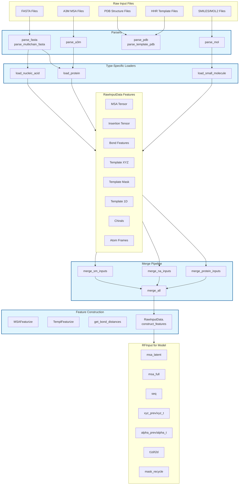

---
slug:19-data-loading-and-featurization
blog_type:normal
---

RoseTTAFold-All-Atom 中的数据加载和特征化系统将原始生物输入转换为与三轨架构兼容的结构化张量表示。这个多阶段流程处理多种分子类型——蛋白质、核酸和小分子——通过专用解析器、特定类型的特征提取器以及支持共价修饰和复杂生物分子组装的复杂合并策略将它们统一起来。该系统在生物数据格式与神经网络推理所需的数学表示之间架起了桥梁。

## 架构概述

数据流水线作为一个分层转换系统运行，输入在其中经过不同的处理阶段。在最底层，解析器将原始生物文件转换为中间数值表示。这些表示随后经过特定类型的特征化，再合并为与 MSA、2D 对和 3D 坐标轨道兼容的统一结构。该架构旨在处理全原子预测的复杂性，同时在不同的分子类型之间保持清晰的关注点分离。

## 输入解析和类型识别

解析子系统使用针对每种数据类型的专用解析器，将生物文件格式转换为数值表示。蛋白质序列和 MSA 使用标准的 20 种氨基酸字母表加上间隔和掩码标记，而核酸采用 DNA/RNA 特定的字母表，小分子则通过 OpenBabel 进行解析以实现全面的原子类型识别。

蛋白质和核酸序列的 FASTA 文件通过 `parse_fasta()` 或 `parse_multichain_fasta()` 进行解析，它们分别处理单链和多链输入 [rf2aa/data/parsers.py#L152-L207](/rf2aa/data/parsers.py#L152-L207)。对于 A3M 格式的 MSA，`parse_a3m()` 通过区分大写匹配状态和小写插入来执行提取序列比对和插入统计的关键任务 [rf2aa/data/parsers.py#L402-L480](/rf2aa/data/parsers.py#L402-L480)。小分子通过 `parse_mol()` 进行解析，支持 SMILES 字符串和 MOL2 文件，并使用 OpenBabel 生成 3D 构象 [rf2aa/data/parsers.py#L744-L812](/rf2aa/data/parsers.py#L744-L812)。

<CgxTip>解析系统通过将小写字母转换为插入跟踪数组来区分 MSA 中的匹配状态和插入，这对于准确的 MSA 特征化至关重要，因为插入代表相对于查询序列的进化插入。</CgxTip>

## 特定类型的输入加载

每种分子类型都遵循专用的加载路径，生成包含核心特征张量的标准化 `RawInputData` 对象。这种设计模式确保了特定类型的优化，同时为下游处理保持统一的接口。

### 蛋白质加载

蛋白质输入通过 `load_protein()` 经历最复杂的加载过程 [rf2aa/data/protein.py#L55-L87](/rf2aa/data/protein.py#L55-L87)。该函数解析 A3M MSA 文件，并可选地纳入来自 HHsearch 结果（HHR/ATAB 文件）的结构模板。当有模板可用时，`get_templates()` 从模板数据库中提取 1D 特征（序列、比对置信度）和 3D 坐标 [rf2aa/data/protein.py#L10-L53](/rf2aa/data/protein.py#L10-L53)。对于没有模板的蛋白质，`blank_template()` 生成用随机噪声初始化的占位符坐标，以实现训练的一致性 [rf2aa/data/data_loader_utils.py#L248-L262](/rf2aa/data/data_loader_utils.py#L248-L262)。蛋白质键特征使用 `get_protein_bond_feats()` 计算，该函数建立了肽主链和侧链相互作用的连接模式。

### 核酸加载

核酸（DNA/RNA）通过 `load_nucleic_acid()` 遵循简化的加载路径 [rf2aa/data/nucleic_acid.py#L9-L46](/rf2aa/data/nucleic_acid.py#L9-L46)。由于核酸通常没有可用的模板，系统会生成具有适当维度的空白模板。解析器根据输入类型参数选择 DNA 或 RNA 字母表，确保正确的标记映射。键特征使用针对核酸几何进行调整的蛋白质风格连接模式进行初始化。

### 小分子加载

通过 `load_small_molecule()` 进行的小分子加载利用 OpenBabel 进行全面的化学分析 [rf2aa/data/small_molecule.py#L10-L41](/rf2aa/data/small_molecule.py#L10-L41)。解析分子结构后，系统使用 `get_bond_feats()` 计算键特征，该函数对键级和连接性进行编码，通过 `get_chirals()` 提取手性信息以进行立体中心识别，并使用 `get_atom_frames()` 构建原子框架以建立局部坐标系 [rf2aa/data/small_molecule.py#L21-L37](/rf2aa/data/small_molecule.py#L21-L37)。这种全面的特征化使模型能够处理复杂的立体化学和共价修饰。

## RawInputData 结构

`RawInputData` 数据类作为最终模型输入构建之前中间表示的中心容器 [rf2aa/data/data_loader.py#L13-L163](/rf2aa/data/data_loader.py#L13-L163)。该结构封装了下游处理所需的所有分子信息，并提供了用于查询和操作数据的实用方法。

核心字段包括：

- **msa**：形状为 (N, L) 的多序列比对张量，其中 N 是序列计数，L 是残基长度
- **ins**：与 MSA 维度匹配的插入跟踪数组，记录每个位置的插入长度
- **bond_feats**：键连接矩阵，编码残基/原子之间的共价和非共价相互作用
- **xyz_t**：形状为 (T, L, NTOTAL, 3) 的模板 3D 坐标，其中 T 是模板计数，NTOTAL 是每个残基的原子数
- **mask_t**：模板有效性掩码，指示哪些原子具有观测坐标
- **t1d**：模板 1D 特征，包括序列同一性和比对置信度
- **chirals**：立体中心的手性信息，对小分子尤为重要
- **atom_frames**：每个原子/残基的局部坐标系定义

该结构提供了基本的实用方法，包括用于提取目标序列的 `query_sequence()`、用于识别原子与残基位置的 `is_atom()`，以及用于处理共价修饰的 `update_protein_features_after_atomize()`，其中残基被扩展为完整的原子表示 [rf2aa/data/data_loader.py#L28-L89](/rf2aa/data/data_loader.py#L28-L89)。

<CgxTip>RawInputData 结构在序列信息（MSA）、结构信息（模板）和化学信息（键、手性）之间保持了分离，实现了模块化处理，同时保持所有数据在公共维度上对齐。</CgxTip>

## MSA 特征化

MSA 特征化将原始多序列比对转换为针对神经网络消费优化的张量表示。`MSAFeaturize()` 函数通过提取三个互补的特征流来执行此转换 [rf2aa/data/data_loader_utils.py#L55-L246](/rf2aa/data/data_loader_utils.py#L55-L246)。

该过程创建：

1. **序列特征**：使用查询序列对每个位置的氨基酸（或核苷酸）类型进行独热编码
2. **MSA 潜在表示**：聚类 MSA 表示，包括配置文件统计、插入平均值和子集序列的末端特征
3. **MSA 完整表示**：独热编码的额外序列，在聚类集合之外提供多样性

特征化涉及几个关键步骤：

- **配置文件计算**：通过独热编码和平均计算 MSA 中每个位置的特异性氨基酸频率 [rf2aa/data/data_loader_utils.py#L85-L86](/rf2aa/data/data_loader_utils.py#L85-L86)
- **聚类**：按相似性对序列进行分组以减少冗余，由限制种子序列的 MAXLAT 参数控制
- **特征连接**：将配置文件（22 维）、插入统计（2 维）和末端特征（2 维）组合成每个位置全面的 26 维特征向量
- **序列掩码**：在训练过程中以概率 p_mask 应用随机掩码以提高鲁棒性并防止过拟合

该函数还通过 `get_term_feats()` 处理末端特征，该函数标记 N 端和 C 端位置，为链末端提供关键的空间上下文 [rf2aa/data/data_loader_utils.py#L44-L54](/rf2aa/data/data_loader_utils.py#L44-L54)。

*表：MSA 特征张量维度*

| Feature | Shape | Description | Component Count |
|---------|-------|-------------|-----------------|
| seq | (1, L, 22) | Query sequence one-hot encoding | 22 (20 aa + gap + mask) |
| msa_seed | (N_seed, L, 26) | Clustered MSA with profile | 26 (profile 22 + ins 2 + term 2) |
| msa_extra | (N_extra, L, 25) | Extra sequences | 25 (aa 22 + ins 1 + term 2) |
| mask_pos | (N_seed, L, 1) | MSA position mask | 1 |

## 模板特征化

通过 `TemplFeaturize()` 进行的模板特征化将结构模板数据转换为引导结构预测的张量表示 [rf2aa/data/data_loader_utils.py#L264-L320](/rf2aa/data/data_loader_utils.py#L264-L320)。该函数处理由 HHsearch 识别的模板，提取 3D 坐标和 1D 序列特征，并按序列同一性阈值进行过滤。

模板处理流水线：

1. **序列同一性过滤**：移除序列同一性高于配置阈值的模板，以防止对高度相似结构的过拟合
2. **模板选择**：从可用模板中随机采样（如果 pick_top=True，则选择顶部模板），直到达到配置的最大值
3. **坐标提取**：使用比对映射从模板结构中检索 3D 原子位置
4. **特征构建**：构建结合序列同一性和比对置信度分数的 1D 特征

模板坐标从 `ChemData().INIT_CRDS` 初始化，并添加了随机噪声以用于模板未覆盖的位置，确保所有张量位置都具有有效值 [rf2aa/data/data_loader_utils.py#L286-L299](/rf2aa/data/data_loader_utils.py#L286-L299)。掩码张量指示哪些原子具有真实的模板坐标与占位符。

对于多模板场景，`merge_hetero_templates()` 在模板维度上对角平铺模板坐标，应用随机旋转和平移以防止平凡解 [rf2aa/data/data_loader_utils.py#L322-L357](/rf2aa/data/data_loader_utils.py#L322-L357)。这种平铺策略使模型能够整合来自多个结构模板的信息，而无需假设一致的坐标框架。

## 输入合并策略

合并子系统将来自多个链和分子类型的输入统一为适合模型推理的单一连贯结构。这个关键组件实现了蛋白质复合物、蛋白质-核酸复合物和蛋白质-小分子复合物的预测。

合并层次遵循以下模式：

1. `merge_protein_inputs()`：连接蛋白质链，同时通过分类 ID 处理复合物的 MSA 配对 [rf2aa/data/merge_inputs.py#L9-L87](/rf2aa/data/merge_inputs.py#L9-L87)
2. `merge_na_inputs()`：平凡连接缺乏 MSA 的核酸输入 [rf2aa/data/merge_inputs.py#L88-L96](/rf2aa/data/merge_inputs.py#L88-L96)
3. `merge_sm_inputs()`：连接小分子输入 [rf2aa/data/merge_inputs.py#L97-L105](/rf2aa/data/merge_inputs.py#L97-L105)
4. `merge_all()`：编排完整的合并流水线，应用坐标居中和共价修饰的重新索引 [rf2aa/data/merge_inputs.py#L161-L209](/rf2aa/data/merge_inputs.py#L161-L209)

蛋白质 MSA 合并特别复杂，使用 `merge_msas()` 合并来自多条链的 MSA，同时保留用于序列配对的分类信息 [rf2aa/data/data_loader_utils.py#L460-L745](/rf2aa/data/data_loader_utils.py#L460-L745)。对于异源寡聚物（不同的链），`merge_a3m_hetero()` 水平连接 MSA，而同源寡聚物（相同的链）使用 `merge_a3m_homo()` 生成对称增强的 MSA [rf2aa/data/data_loader_utils.py#L370-L458](/rf2aa/data/data_loader_utils.py#L370-L458)。

合并所有输入类型后，系统应用 `center_and_realign_missing()` 来重新居中坐标系，并通过将缺失的模板坐标吸附到同一条链上最近的现有残基来处理它们 [rf2aa/util.py#L18-L80](/rf2aa/util.py#L18-L80)。这确保模型的输入对于 3D 处理进行了适当的条件设置。

## 特征构建流水线

`RawInputData.construct_features()` 方法编排向模型就绪的 RFInput 格式的最终转换 [rf2aa/data/data_loader.py#L107-L163](/rf2aa/data/data_loader.py#L107-L163)。该方法将所有处理后的组件整合为三轨架构所需的全面特征集。

构建过程涉及：

1. **MSA 特征化**：调用 `MSAFeaturize()` 生成序列、种子 MSA 和额外 MSA 特征
2. **距离矩阵计算**：使用最短路径算法将键特征转换为成对距离 [rf2aa/data/data_loader_utils.py#L887-L891](/rf2aa/data/data_loader_utils.py#L887-L891)
3. **坐标初始化**：从模板或默认值设置初始 3D 坐标
4. **扭转角提取**：使用运动学模块从模板坐标计算主链和侧链扭转角
5. **模板掩码生成**：创建结合蛋白质和小分子有效性指示器的 2D 掩码
6. **同链检测**：从键连接性中识别哪些残基对属于同一条链

扭转角计算特别重要，它将模板坐标转换为模型结构预测轨道使用的内部角度表示。`xyz_converter.get_torsions()` 方法提取每个残基的 NTOTALDOFS 个扭转角，每个表示为 (cos, sin) 对 [rf2aa/data/data_loader.py#L135-L141](/rf2aa/data/data_loader.py#L135-L141)。

## RFInput 结构

`RFInput` 数据类表示由 RoseTTAFold-All-Atom 消耗的最终模型输入格式 [rf2aa/data/data_loader.py#L166-L203](/rf2aa/data/data_loader.py#L166-L203)。该结构包含在三轨（MSA、2D 对、3D 坐标）上进行推理所需的所有张量字段，以及用于迭代优化的回收状态。

关键张量类别包括：

- **MSA 轨道张量**：`msa_latent`（聚类 MSA 特征）、`msa_full`（额外序列）、`seq`（独热序列）、`seq_unmasked`（原始序列标记）
- **对轨道张量**：`t1d`（模板 1D 特征）、`t2d`（模板 2D 特征）、`mask_t`（模板有效性掩码）、`same_chain`（链邻接）
- **坐标轨道张量**：`xyz_prev`（初始坐标）、`xyz_t`（模板坐标）、`alpha_prev`（初始扭转角）、`alpha_t`（模板扭转角）
- **化学张量**：`bond_feats`（连接性）、`dist_matrix`（成对距离）、`chirals`（立体化学）、`atom_frames`（局部框架）
- **回收张量**：`msa_prev`、`pair_prev`、`state_prev`、`mask_recycle`（用于迭代优化）

该结构提供了用于 GPU 传输（`to()`）和批维度添加（`add_batch_dim()`）的实用方法，能够与 PyTorch 数据加载和模型推理流水线无缝集成。

*表：L 个残基的 RFInput 张量维度*

| Tensor Group | Tensor | Shape | Track |
|--------------|--------|-------|-------|
| MSA | msa_latent | (N_seed, L, 26) | MSA |
| MSA | msa_full | (N_extra, L, 25) | MSA |
| MSA | seq | (1, L, 22) | MSA |
| Pair | t1d | (T, L, 23) | Pair |
| Pair | t2d | (T, L, L, 64) | Pair |
| Coordinate | xyz_prev | (L, NTOTAL, 3) | Coordinate |
| Coordinate | xyz_t | (T, L, NTOTAL, 3) | Coordinate |
| Coordinate | alpha_prev | (L, NTOTALDOFS, 2) | Coordinate |
| Chemical | bond_feats | (L, L) | Pair |
| Chemical | dist_matrix | (L, L) | Pair |

## 确定性推理支持

数据流水线通过受控的随机化包含对确定性推理的全面支持。多个函数接受 `deterministic` 参数，该参数固定随机种子以实现可重现的行为 [rf2aa/data/data_loader_utils.py#L67-L72](/rf2aa/data/data_loader_utils.py#L67-L72)。这影响 MSA 采样、模板选择、坐标随机化和噪声添加。

当启用确定性模式时：
- 在随机操作之前固定随机种子
- MSA 序列限制为最小子集
- 模板选择遵循确定性顺序
- 随机噪声添加使用固定种子

这种可重现性对于调试、科学验证以及需要在多次推理运行中产生一致输出的部署场景至关重要。