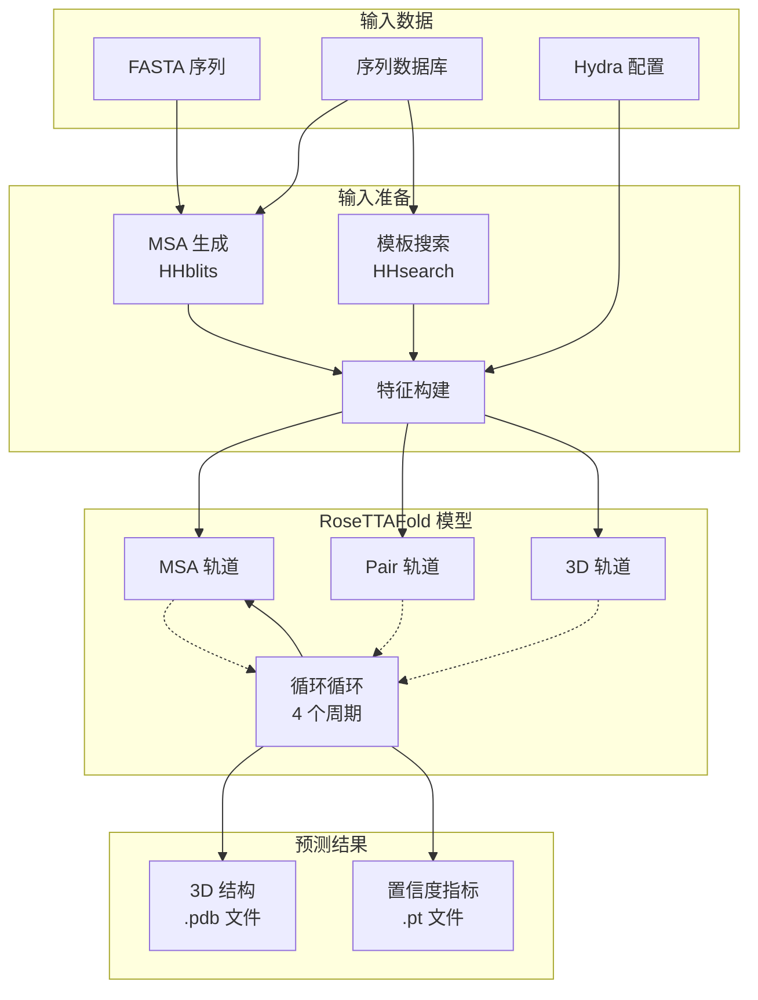

---
slug:2-quick-start
blog_type:normal
---


RoseTTAFold All-Atom (RFAA) 是一个用于预测生物分子结构（包括蛋白质、核酸、小分子及其复合物）的深度学习系统。本指南将帮助你完成安装并运行你的首次结构预测。


## 系统架构概述

RFAA 采用了一种**三轨道神经网络架构**，该架构同时处理多种数据表示以生成准确的结构预测。该系统通过复杂的循环机制整合了序列信息（MSA 轨道）、成对关系（pair 轨道）和 3D 坐标数据（3D 轨道）。



核心推理工作流由 `run_inference.py` 中的 `ModelRunner` 类编排，该类管理配置解析、模型加载、特征构建和输出生成。

来源：[run_inference.py](/rf2aa/run_inference.py#L10-L30), [README.md](/README.md#L1-L20)

## 项目结构

该仓库遵循模块化组织，具有清晰的关注点分离：

```
RoseTTAFold-All-Atom/
├── rf2aa/                          # 核心推理代码
│   ├── model/                      # 模型架构
│   │   ├── RoseTTAFoldModel.py     # 主模型实现
│   │   ├── Track_module.py         # 轨道处理模块
│   │   └── layers/                 # 神经网络层
│   ├── data/                       # 数据加载和预处理
│   │   ├── protein.py              # 蛋白质特定数据处理
│   │   ├── nucleic_acid.py         # 核酸处理
│   │   ├── small_molecule.py       # 配体/小分子处理
│   │   └── merge_inputs.py         # 输入合并
│   ├── config/inference/            # Hydra 配置文件
│   │   ├── base.yaml              # 基础配置
│   │   ├── protein.yaml           # 蛋白质预测示例
│   │   ├── nucleic_acid.yaml      # 核酸示例
│   │   └── protein_sm.yaml        # 蛋白质-配体示例
│   └── run_inference.py            # 主推理入口点
├── examples/                       # 示例输入和配置
│   ├── protein/                    # 蛋白质预测示例
│   ├── nucleic_acid/               # 核酸示例
│   ├── small_molecule/             # 小分子示例
│   └── docker/                     # Docker 部署示例
├── environment.yaml                # Conda 环境规范
├── install_dependencies.sh         # 外部依赖安装
├── make_msa.sh                     # MSA 生成脚本
└── Dockerfile                      # 容器定义
```

来源：[Repository structure](/), [README.md](/README.md#L1-L100)

## 安装先决条件

在继续之前，请确保你的系统满足这些要求：

| 需求 | 最低版本 | 推荐 |
|-------------|----------------|-------------|
| **操作系统** | Linux (Ubuntu 20.04+) | Linux (Ubuntu 22.04) |
| **GPU** | 搭载 CUDA 11.8 的 NVIDIA | NVIDIA RTX 3090+ |
| **内存** | 64 GB | 128 GB+ |
| **存储空间** | 400 GB | 数据库需 500 GB+ |
| **Python** | 3.10 | 3.10 |
| **CUDA** | 11.8 | 11.8 |

<CgxTip>
巨大的存储需求主要是由于序列数据库（UniRef30 约 46GB，BFD 约 272GB，模板约 81GB）。如果本地空间有限，请考虑使用外部存储或网络附加存储。
</CgxTip>

来源：[environment.yaml](/environment.yaml#L1-L200), [README.md](/README.md#L40-L70)

## 快速安装步骤

### 步骤 1：安装 Mamba 并克隆仓库


首先，安装 Mamba（一个更快的 conda 替代品）并克隆仓库：

```bash
# 安装 Mambaforge
wget "https://github.com/conda-forge/miniforge/releases/latest/download/Mambaforge-$(uname)-$(uname -m).sh"
bash Mambaforge-$(uname)-$(uname -m).sh
source ~/.bashrc

# 克隆仓库
git clone https://github.com/baker-laboratory/RoseTTAFold-All-Atom
cd RoseTTAFold-All-Atom
```

来源：[README.md](/README.md#L15-L30)

### 步骤 2：创建环境并安装依赖

使用提供的规范创建 conda 环境并安装所需的包：

```bash
# 创建 RFAA 环境
mamba env create -f environment.yaml
conda activate RFAA

# 安装 SE3Transformer 模块
cd rf2aa/SE3Transformer/
pip3 install --no-cache-dir -r requirements.txt
python3 setup.py install
cd ../../

# 安装外部依赖 (CS-BLAST)
bash install_dependencies.sh
```

该环境包括 PyTorch、CUDA 库、用于 MSA 生成的 HHsuite 以及其他科学计算包。

来源：[environment.yaml](/environment.yaml#L1-L50), [install_dependencies.sh](/install_dependencies.sh#L1-L23)

### 步骤 3：配置 SignalP（可选）

SignalP 用于信号肽检测。此步骤是可选的，但建议进行以获得改进的预测：

```bash
# 从 https://services.healthtech.dtu.dk/services/SignalP-6.0/ 下载获得许可的 SignalP 6.0
signalp6-register signalp-6.0h.fast.tar.gz

# 重命名模型权重以确保兼容性
mv $CONDA_PREFIX/lib/python3.10/site-packages/signalp/model_weights/distilled_model_signalp6.pt \
   $CONDA_PREFIX/lib/python3.10/site-packages/signalp/model_weights/ensemble_model_signalp6.pt
```

来源：[README.md](/README.md#L32-L39)

### 步骤 4：下载模型权重和数据库

下载预训练的模型权重和序列数据库：

```bash
# 下载模型权重 (~3.5 GB)
wget http://files.ipd.uw.edu/pub/RF-All-Atom/weights/RFAA_paper_weights.pt

# 下载 UniRef30 数据库 (~46 GB)
wget http://wwwuser.gwdg.de/~compbiol/uniclust/2020_06/UniRef30_2020_06_hhsuite.tar.gz
mkdir -p UniRef30_2020_06
tar xfz UniRef30_2020_06_hhsuite.tar.gz -C ./UniRef30_2020_06

# 下载 BFD 数据库 (~272 GB)
wget https://bfd.mmseqs.com/bfd_metaclust_clu_complete_id30_c90_final_seq.sorted_opt.tar.gz
mkdir -p bfd
tar xfz bfd_metaclust_clu_complete_id30_c90_final_seq.sorted_opt.tar.gz -C ./bfd

# 下载模板数据库 (~81 GB)
wget https://files.ipd.uw.edu/pub/RoseTTAFold/pdb100_2021Mar03.tar.gz
tar xfz pdb100_2021Mar03.tar.gz

# 下载 BLAST (~39 MB)
wget https://ftp.ncbi.nlm.nih.gov/blast/executables/legacy.NOTSUPPORTED/2.2.26/blast-2.2.26-x64-linux.tar.gz
mkdir -p blast-2.2.26
tar -xf blast-2.2.26-x64-linux.tar.gz -C blast-2.2.26
cp -r blast-2.2.26/blast-2.2.26/ blast-2.2.26_bk
rm -r blast-2.2.26
mv blast-2.2.26_bk/ blast-2.2.26
```

来源：[README.md](/README.md#L44-L75)

### 步骤 5：配置环境变量

设置环境变量以指向数据库位置。将这些添加到你的 `.bashrc` 中以持久保存：

```bash
# 设置数据库路径
export DB_UR30=`pwd`/UniRef30_2020_06
export DB_BFD=`pwd`/bfd/
export BLASTMAT=`pwd`/blast-2.2.26/data/
```

来源：[README.md](/README.md#L77-L85)

## 运行你的首次预测

### 基础蛋白质结构预测

让我们使用提供的示例之一运行一个简单的蛋白质结构预测：

1. **检查示例配置**：

```yaml
# rf2aa/config/inference/protein.yaml
defaults:
  - base

job_name: "7u7w_protein"
protein_inputs: 
  A:
    fasta_file: examples/protein/7u7w_A.fasta
```

来源：[protein.yaml](/rf2aa/config/inference/protein.yaml#L1-L8)

2. **运行推理**：

```bash
# 在 RoseTTAFold-All-Atom 目录下
conda activate RFAA
python rf2aa/run_inference.py --config-name rf2aa/config/inference/protein.yaml
```

推理过程会自动执行这些步骤：
- **MSA 生成**：使用 HHblits 搜索 UniRef30 和 BFD 数据库
- **模板搜索**：通过 HHsearch 识别结构同源物
- **特征构建**：将数据转换为模型兼容的张量
- **模型推理**：运行 4 周期循环前向传递
- **输出生成**：写入 PDB 结构和置信度指标

来源：[run_inference.py](/rf2aa/run_inference.py#L190-L210), [make_msa.sh](/make_msa.sh#L1-L135)

3. **检查输出**：

完成后，你会发现：
- `{job_name}.pdb` - 带有每残基置信度分数的 3D 原子坐标
- `{job_name}_aux.pt` - 用于质量评估的置信度指标（pLDDT, PAE, PDE）

来源：[run_inference.py](/rf2aa/run_inference.py#L145-L160)

### 可用的预测类型

RFAA 通过不同的配置文件支持多种生物分子预测类型：

| 预测类型 | 配置文件 | 输入格式 |
|-----------------|-------------|--------------|
| **单一蛋白质** | `protein.yaml` | FASTA 序列 |
| **蛋白质复合物** | `protein.yaml` | 多个 FASTA 文件 |
| **蛋白质-核酸** | `nucleic_acid.yaml` | 蛋白质 + 核酸 FASTA |
| **蛋白质-小分子** | `protein_sm.yaml` | 蛋白质 FASTA + SMILES/SDF |
| **共价复合物** | `covalent.yaml` | 蛋白质 + 共价键规范 |

来源：[Config directory](/rf2aa/config/inference/)

## 了解配置系统

RFAA 使用 **Hydra** 进行配置管理，支持灵活的参数覆盖和组合。基础配置（`base.yaml`）包含所有默认参数，而专用配置针对特定用例对其进行了扩展。

**关键配置部分**：

```yaml
# rf2aa/config/inference/base.yaml
job_name: "structure_prediction"
output_path: ""
checkpoint_path: RFAA_paper_weights.pt

database_params:
  sequencedb: ""
  hhdb: "pdb100_2021Mar03/pdb100_2021Mar03"
  command: make_msa.sh
  num_cpus: 4
  mem: 64

loader_params:
  MAXCYCLE: 4        # 循环迭代次数
  MAXSEQ: 1024        # 最大 MSA 序列数
  MAXLAT: 128         # 最大序列长度
```

你可以从命令行覆盖任何参数：

```bash
python rf2aa/run_inference.py --config-name protein \
  job_name=my_protein \
  protein_inputs.A.fasta_file=my_sequence.fasta \
  output_path=./output/
```

来源：[base.yaml](/rf2aa/config/inference/base.yaml#L1-L71)

## Docker 部署（替代方案）

为了简化部署，Docker 提供了一个预配置所有依赖的容器化环境。

### 使用 Docker 构建和运行

```bash
# 构建 Docker 镜像
docker build -t rfaa-image .

# 运行推理（挂载你的数据库和权重）
docker run --gpus all \
  -v `pwd`/examples:/workdir/ \
  -v /path/to/databases/UniRef30_2020_06/:/mnt/databases/rfaa/latest/UniRef30_2020_06/ \
  -v /path/to/databases/bfd/:/mnt/databases/rfaa/latest/bfd/ \
  -v /path/to/pdb100_2021Mar03/:/pdb100_2021Mar03/ \
  -v /path/to/weights/RFAA_paper_weights.pt:/weights/RFAA_paper_weights.pt \
  rfaa-image python rf2aa/run_inference.py --config-name examples/docker/docker.yaml
```

来源：[Dockerfile](/Dockerfile#L1-L72), [docker.yaml](/examples/docker/docker.yaml#L1-L22), [dockerrun.sh](/examples/docker/dockerrun.sh#L1-L5)

<CgxTip>
推荐在生产环境或需要无系统冲突运行多次预测时使用 Docker 部署。确保你有足够的磁盘空间用于 Docker 镜像（约 10GB）加上挂载的数据库。
</CgxTip>

## 常见首次使用问题及解决方案

| 问题 | 原因 | 解决方案 |
|-------|-------|----------|
| **CUDA 内存不足** | GPU 内存不足 | 减少 `MAXLAT` 或使用较短的序列 |
| **未找到数据库** | 环境变量不正确 | 验证 `DB_UR30`、`DB_BFD` 和 `BLASTMAT` 路径 |
| **MSA 生成失败** | 缺少 HHsuite 安装 | 确保 HHsuite 已安装并在 PATH 中 |
| **导入错误** | 未激活 Conda 环境 | 在推理前运行 `conda activate RFAA` |
| **MSA 生成缓慢** | 大型数据库搜索 | 减少 `num_cpus` 或使用预计算的 MSA |

来源：[base.yaml](/rf2aa/config/inference/base.yaml#L1-L71)

## 下一步？

现在你已经安装并运行了 RFAA，探索这些高级主题：

- **[安装和设置](3-installation-and-setup)** - 详细的安装故障排除和高级配置选项
- **[使用 Docker 运行推理](4-running-inference-with-docker)** - 生产环境的完整 Docker 部署指南
- **[了解模型输出](5-understanding-model-outputs)** - 解读置信度指标（pLDDT, PAE, PDE）和输出格式
- **[蛋白质结构预测](9-protein-structure-prediction)** - 单链和多链蛋白质预测的综合指南
- **[Hydra 配置管理](6-hydra-configuration-management)** - 掌握高级用例的配置系统

RFAA 的模块化架构允许你深入探索各个组件。首先阅读 **[三轨道设计概述](14-three-track-design-overview)** 以了解核心模型架构，然后根据你的研究需求深入特定的预测类型。