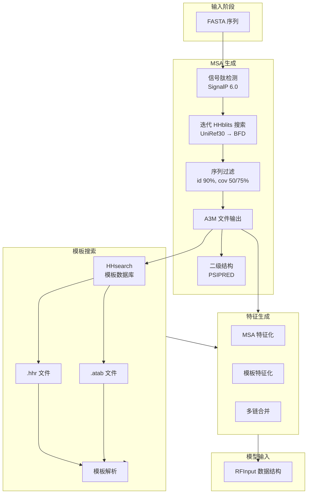

---
slug:20-msa-generation-and-template-integration
blog_type:normal
---


本页面文档记录了 RoseTTAFold-All-Atom 中生成多序列比对（MSA）和整合结构模板的计算流程。这些流程通过捕获序列保守模式并利用已知的同源结构，提供了关键的演化和结构信息，用于指导模型的预测。

## 架构概览

MSA 生成和模板整合流程遵循多阶段架构，将原始序列输入转化为三轨模型所需的丰富特征表示。该工作流结合了数据库搜索、统计分析和结构比对，以提取演化约束和模板信息。



## MSA 生成流程

MSA 生成始于原始序列输入，并逐步搜索多样性越来越高的序列数据库，以构建全面的比对。

### 数据库搜索策略

流程执行分层搜索策略，首先使用 UniRef30（按 30% 一致性聚类），如果未找到足够的序列，则回退到 BFD（Big Fantastic Database）。这种方法在搜索效率和覆盖深度之间取得了平衡 [make_msa.sh](make_msa.sh#L18-L29)。

对于每个数据库，HHblits 执行迭代搜索，每次迭代逐渐放宽 E-value 截止值（1e-10 → 1e-6 → 1e-3），以扩大每次迭代的搜索空间 [make_msa.sh](make_msa.sh#L55-L65)。流程跟踪两个序列计数阈值：

- **高质量阈值**：在 90% 一致性、75% 覆盖率下，序列数 >2000
- **中等质量阈值**：在 90% 一致性、50% 覆盖率下，序列数 >4000

<CgxTip>流程在 E-value 过滤之前使用序列冗余削减（90% 一致性截止值）以在保持多样性的同时减少计算负载，然后应用覆盖率阈值以确保比对区域具有生物学意义。</CgxTip>

| 数据库 | 大小 | 典型覆盖率 | 用例 |
|----------|------|------------------|----------|
| UniRef30 | ~1.4亿 聚类 | 广泛的分类采样 | 主要搜索目标 |
| BFD | ~32亿 序列 | 深度分类采样 | 孤儿蛋白的备选 |

### 信号肽处理

在生成 MSA 之前，序列使用 SignalP 6.0 进行信号肽检测 [make_msa.sh](make_msa.sh#L31-L39)。信号肽是 N 端靶向序列，否则会在 MSA 中产生虚假比对。当检测到信号肽时，流程使用修剪后的序列进行 HHblits 搜索，但保留原始序列用于下游处理。

### 序列过滤和选择

在每次 HHblits 迭代之后，序列使用 hhfilter 经历两阶段过滤 [make_msa.sh](make_msa.sh#L62-L64)：

1. **id90cov75**：90% 序列一致性，75% 查询覆盖率
2. **id90cov50**：90% 序列一致性，50% 查询覆盖率

当有足够的序列（>2000）可用时，流程优先选择高覆盖率集（cov75），否则使用更宽松的 cov50 集。这种自适应选择确保了足够的深度而没有过度的冗余。

### 二级结构预测

PSIPRED 算法从最终的 MSA 生成二级结构预测 [make_msa.sh](make_msa.sh#L123-L125)。这些预测（输出为 SS2 格式）有两个目的：

1. 为查询序列提供演化知情的二级结构先验
2. 通过将结构信息整合到 hhsearch 比对中来提高模板搜索准确性

组合的 MSA 和二级结构（`.msa0.ss2.a3m`）构成了模板搜索的输入。

## 模板整合

模板整合利用实验确定的同源物的结构信息来指导结构预测。

### 模板搜索执行

HHsearch 对用户指定的结构数据库执行模板搜索 [make_msa.sh](make_msa.sh#L130-L133)。关键参数包括：

- **-b 50 -B 500**：返回前 500 个比对，在 HHR 输出中显示 50 个
- **-e 100**：最大 E-value 阈值
- **-p 5.0**：MAC（多重比对覆盖率）概率阈值
- **-mact 0.05**：比对列的后验概率阈值

搜索生成两个输出文件：
- `.hhr`：包含统计分数的人类可读比对摘要
- `.atab`：用于程序化处理的表格化比对数据

### 模板数据解析

`parse_templates_raw` 函数处理 hhsearch 输出以提取结构模板 [rf2aa/data/parsers.py](rf2aa/data/parsers.py#L624-L693)。这涉及三个主要阶段：

1. **比对提取**：解析 `.atab` 文件以获取查询-模板位置映射和逐位置分数
2. **命中统计**：从 `.hhr` 文件提取全局比对指标（概率、E-value、一致性、相似性）
3. **结构检索**：使用模板标识符从 FFindex 数据库提取原子坐标

该函数过滤模板，要求至少有 10 个比对列，以避免与不显著结构重叠的虚假匹配。

<CgxTip>模板坐标以全原子细节提取（每个残基 14 个原子），但在模型处理期间根据观察到的原子密度进行掩码，允许部分模板信息为预测提供信息，即使模板是不完整的。</CgxTip>

### 模板坐标处理

`read_templates` 函数将原始模板数据转换为模型就绪格式 [rf2aa/data/parsers.py](rf2aa/data/parsers.py#L695-L726)。关键操作包括：

1. **查询映射**：使用比对将模板坐标映射到查询序列位置
2. **坐标中心化**：每个模板经历中心化和重新比对到一致的方向
3. **特征编码**：模板氨基酸的独热编码，并增加一个维度用于逐模板分数

当未找到模板时（例如，孤儿蛋白），系统生成填充有间隙 token 和掩码坐标的虚拟模板 [rf2aa/data/parsers.py](rf2aa/data/parsers.py#L700-L705)。

## MSA 特征化

`MSAFeaturize` 函数将原始 MSA 数据转换为三轨架构所消耗的特征张量 [rf2aa/data/data_loader_utils.py](rf2aa/data/data_loader_utils.py#L55-L246)。

### 输入数据结构

原始 MSA 数据包括：
- **msa**：整数编码的序列比对（N×L 张量）
- **ins**：插入统计，跟踪每列插入的残基数量

### 种子 MSA 特征生成

前 Nclust 个序列（不包括查询）构成接收完整特征编码的“种子 MSA”。种子特征包括 [rf2aa/data/data_loader_utils.py](rf2aa/data/data_loader_utils.py#L191-L219)：

| 特征 | 维度 | 描述 |
|---------|-----------|-------------|
| 独热氨基酸 | Nclust × L × 21 | 残基类型编码 |
| 聚类概貌 | Nclust × L × 21 | 分配序列的加权平均值 |
| 插入统计 | Nclust × L × 2 | 直接和平均插入计数 |
| 末端标志 | Nclust × L × 2 | N 端/C 端指示器 |

聚类算法通过汉明距离将额外的序列分配给种子聚类，计算概貌和插入统计的加权平均值 [rf2aa/data/data_loader_utils.py](rf2aa/data/data_loader_utils.py#L182-L200)。

### 掩码策略

在训练期间，15% 的种子 MSA 位置经历随机掩码，具有三方分布 [rf2aa/data/data_loader_utils.py](rf2aa/data/data_loader_utils.py#L136-L161)：

- **70%**：替换为特殊的掩码 token
- **10%**：替换为均匀随机氨基酸
- **10%**：替换为从 MSA 概貌采样的氨基酸
- **10%**：保持不变

这种掩码语言建模目标使模型能够学习演化约束，同时保留一些位置信息。

### 额外序列特征

种子集之外的剩余序列接收简化的编码：
- **独热氨基酸**：Nextra × L × 21
- **插入统计**：Nextra × L × 1
- **末端标志**：Nextra × L × 2

这种双层策略平衡了计算效率和信息内容，为代表序列提供丰富特征，同时通过额外序列包含更广泛的多样性。

## 模板特征化

通过 `TemplFeaturize` 函数，将模板坐标和特征处理为模型兼容的张量 [rf2aa/data/data_loader_utils.py](rf2aa/data/data_loader_utils.py#L264-L321)。

### 坐标处理

模板坐标经历几何变换：
1. **缺失坐标处理**：未比对的位置接收 NaN 值，后来转换为零
2. **坐标归一化**：使用骨架原子对模板进行中心化和重新比对
3. **随机变换**：在训练期间应用以进行数据增强

### 扭转角提取

模板结构通过模型的坐标转换器提供扭转角约束 [rf2aa/data/data_loader.py](rf2aa/data/data_loader.py#L135-L141)。这些角度（phi、psi、omega）是从骨架原子坐标计算的，并与角度掩码连接以指示观察到的与缺失的角度。

生成的 `alpha_t` 张量（L × NTOTALDOFS × 3）编码每个扭转角的正弦、余弦和掩码值，提供来自模板的直接结构指导。

## 多链 MSA 整合

对于具有多个蛋白质链的复合物，流程必须智能地组合单个 MSA 以捕获链间演化耦合。

### 异源寡聚体合并

对于具有不同序列的蛋白质，`merge_a3m_hetero` 函数沿残基维度连接 MSA [rf2aa/data/data_loader_utils.py](rf2aa/data/data_loader_utils.py#L370-L401)。合并的 MSA 包含两条链的比对序列，并为缺少一条链同源物的序列插入间隙。

### 分类学 ID 配对

当来自不同链的 MSA 共享具有相同分类学 ID 的序列时，`join_msas_by_taxid` 函数在链之间配对这些序列 [rf2aa/data/data_loader_utils.py](rf2aa/data/data_loader_utils.py#L506-L620)。此过程：

1. 在两个 MSA 中识别具有匹配分类学 ID 的序列
2. 在每条链中选择最类似于查询的序列
3. 创建保留生物学配对的配对比对列

分类学配对对于准确模拟异源寡聚体至关重要，其中同一生物体提供不同的相互作用链。

### 同源寡聚体处理

对于相同链（同源寡聚体），`merge_a3m_homo` 函数跨亚基复制 MSA [rf2aa/data/data_loader_utils.py](rf2aa/data/data_loader_utils.py#L403-L458)。支持两种模式：

- **default**：创建 MSA 的 Nmer 副本，每个亚基具有偏移量
- **paired**：创建配对序列，其中每行包含所有 Nmer 链

默认模式用于对称亚基的独立建模，而配对模式保留跨亚基耦合信息。

## 与模型输入整合

最后阶段将 MSA 特征、模板特征和其他输入特征组合到 `RFInput` 数据结构中 [rf2aa/data/data_loader.py](rf2aa/data/data_loader.py#L145-L163)。

### 特征张量

`RFInput` 数据类包含以下 MSA 和模板相关字段：

```python
@dataclass
class RFInput:
    msa_latent: torch.Tensor      # 种子 MSA 特征 (MAXCYCLE × Nclust × L × 27)
    msa_full: torch.Tensor        # 额外 MSA 序列 (MAXCYCLE × Nextra × L × 25)
    t1d: torch.Tensor             # 模板 1D 特征 (n_templ × L × 22)
    t2d: torch.Tensor             # 模板 2D 特征 (n_templ × L × L × 44)
    xyz_t: torch.Tensor          # 模板坐标 (n_templ × L × 3)
    alpha_t: torch.Tensor         # 模板扭转角 (L × NTOTALDOFS × 3)
    mask_t: torch.Tensor          # 模板存在掩码 (n_templ × L × L)
```

2D 模板特征（`t2d`）编码模板残基之间的成对几何关系，包括从模板坐标计算的距离分箱和方向特征。

### 循环和多周期处理

特征化流程支持多周期推理，其中模型跨循环迭代生成更新的 MSA [rf2aa/data/data_loader_utils.py](rf2aa/data/data_loader_utils.py#L114-L118)。每个周期使用不同的随机种子进行序列采样，创建特征表示的集成，从而提高预测鲁棒性。

## 配置和自定义

MSA 生成和模板整合行为通过模型运行器配置中的配置参数控制。

### 数据库参数

数据库访问通过 `database_params` 部分配置 [rf2aa/data/preprocessing.py](rf2aa/data/preprocessing.py#L19-L23)：

```yaml
database_params:
  command: "make_msa.sh"           # MSA 生成脚本
  sequencedb: "/path/to/uniref30"   # 序列数据库位置
  hhdb: "/path/to/templates"       # 模板数据库位置
  num_cpus: 8                       # CPU 分配
  mem: 64                           # RAM 分配 (GB)
```

### MSA 特征化参数

MSA 处理参数在 `loader_params` 中定义 [rf2aa/data/data_loader_utils.py](rf2aa/data/data_loader_utils.py#L98-L108)：

| 参数 | 默认值 | 描述 |
|-----------|---------|-------------|
| MAXLAT | 512 | 最大潜在 MSA 序列数 |
| MAXSEQ | 16384 | 最大总 MSA 序列数 |
| MAXCYCLE | 4 | 循环次数 |
| p_msa_mask | 0.15 | 要掩码的位置比例 |

这些参数控制计算成本和信息内容之间的权衡，较大的值提供更丰富的演化信号，但计算成本增加。

## 故障排除

### MSA 深度不足

如果 MSA 生成产生的序列少于 2000 个：
1. 验证数据库路径和完整性
2. 考虑添加 BFD 数据库以进行深度分类采样
3. 检查可能阻碍比对的异常序列特征（例如，无序区域）

### 未找到模板

当 hhsearch 未返回模板时：
1. 验证模板数据库可访问性
2. 考虑放宽 E-value 阈值（修改 make_msa.sh 中的 `-e` 参数）
3. 对于孤儿蛋白，系统优雅地回退到仅使用 MSA 信息的无模板预测

### MSA 处理期间的内存问题

对于导致内存错误的大型 MSA：
1. 减少 `MAXSEQ` 参数以限制序列计数
2. 启用 MSA 修剪以去除冗余
3. 通过 `database_params.mem` 增加系统 RAM 分配

MSA 生成和模板整合系统为 RoseTTAFold-All-Atom 中的准确结构预测提供了演化和结构基础。通过系统地结合序列多样性、结构同源性和复杂的特征化，该流程使三轨架构能够利用互补的信息源，以对多样化的蛋白质家族和复合物类型进行稳健预测。

## 后续步骤

- **[输入数据结构](18-input-data-structures)**：了解输入特征的内部表示
- **[数据加载和特征化](19-data-loading-and-featurization)**：理解完整的数据处理流程
- **[化学特征处理](21-chemical-feature-processing)**：探索小分子和配体特征如何被整合