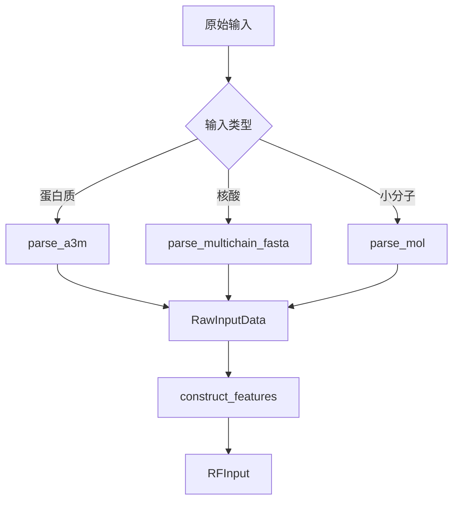

---
slug:21-chemical-feature-processing
blog_type:normal
---

RoseTTAFold-All-Atom 中的化学特征处理流水线将原始分子输入转换为与三轨道架构兼容的统一表示形式。该系统通过统一的化学框架处理蛋白质、核酸和小分子，提取对结构预测至关重要的结构和拓扑特征。

## 化学数据基础

整个特征处理系统构建在 `ChemicalData` 单例类（[`chemical.py`](rf2aa/chemical.py#L63-L78)）之上，该类维护着一个全面的化学数据库，包括原子类型、残基定义、键分类和拓扑映射。该单例确保所有处理流水线中的化学知识保持一致。

化学字母表包含 80 种不同的标记类型：20 种标准氨基酸，以及未知和掩码标记；10 种核酸类型（DNA 和 RNA），1 种组氨酸互变异构体，以及 47 种用于小分子表示的原子类型（[`chemical.py`](rf2aa/chemical.py#L86-L97)）。这种统一编码使模型能够通过单一的序列表示无缝处理异质生物分子复合物。

## 小分子处理

小分子加载遵循由 `load_small_molecule()`（[`small_molecule.py`](rf2aa/data/small_molecule.py#L10-L11)）发起的两阶段流程，该函数委托给分子解析和特征计算。

**分子解析**：`parse_mol()` 函数（[`parsers.py`](rf2aa/data/parsers.py#L744-L813)）使用 OpenBabel 处理多种输入格式，包括 MOL2、SDF 和 SMILES 字符串。此过程包括：

- **构象生成**：当 `generate_conformer=True` 时，该函数使用 MMFF94 力场通过 `OBBuilder` 和快速转子搜索优化 3D 几何结构（[`parsers.py`](rf2aa/data/parsers.py#L759-L767)）
- **氢原子去除**：显式氢原子被去除以降低复杂度（[`parsers.py`](rf2aa/data/parsers.py#L768-L774)）
- **原子类型映射**：原子序数通过 `atomnum2atomtype` 字典映射到化学字母表（[`parsers.py`](rf2aa/data/parsers.py#L777-L779)）
- **自同构枚举**：对于对称分子，识别等效原子排列以提高训练数据多样性（[`parsers.py`](rf2aa/data/parsers.py#L788-L790)）

**特征提取**：`compute_features_from_obmol()` 函数（[`small_molecule.py`](rf2aa/data/small_molecule.py#L21-L38)）生成模型输入所需的完整特征集，包括键拓扑、手性信息和局部参考坐标系。

<CgxTip>在训练过程中，对称小分子的自同构检测至关重要——它防止模型基于任意的原子编号学习虚假的相关性，同时在推理期间保持化学有效性。</CgxTip>

## 核酸处理

核酸序列（DNA 和 RNA）通过 `load_nucleic_acid()`（[`nucleic_acid.py`](rf2aa/data/nucleic_acid.py#L9-L46)）进行处理，该函数根据输入类型规范区分 DNA 和 RNA 字母表。该函数生成：

- **序列编码**：使用 DNA 或 RNA 特定的字母表将 FastA 文件解析为整数编码的序列（[`nucleic_acid.py`](rf2aa/data/nucleic_acid.py#L17-L25)）
- **键拓扑**：`get_protein_bond_feats()` 为核苷酸骨架连接生成邻接信息（[`nucleic_acid.py`](rf2aa/data/nucleic_acid.py#L36)）
- **占位符结构**：由于核酸通常缺乏初始 3D 结构，因此为坐标和模板创建空白模板（[`nucleic_acid.py`](rf2aa/data/nucleic_acid.py#L32-L35)）

核酸骨架扭转角在 `ChemicalData.load_derived_data()`（[`chemical.py`](rf2aa/chemical.py#L2317-L2350)）中定义，并根据配置参数支持基于核糖和基于磷酸盐的参考坐标系。

## 键拓扑特征

键连接性被编码为具有 8 种键分类的稀疏邻接矩阵（[`chemical.py`](rf2aa/chemical.py#L98-L102)）：

| 键类型 | 编码 | 描述 |
|-----------|----------|-------------|
| UNK | 0 | 未知/模糊键 |
| SINGLE | 1 | 单共价键 |
| DOUBLE | 2 | 双共价键 |
| TRIPLE | 3 | 三共价键 |
| AROMATIC | 4 | 芳香键 |
| BACKBONE | 5 | 肽/核酸骨架 |
| PEPTIDE | 6 | 蛋白质-配体共价键 |
| OTHER | 7 | 其他键类型 |

`get_bond_feats()` 工具（[`util.py`](rf2aa/util.py)）从分子结构中提取键拓扑，创建 L×L 稀疏矩阵，其中非零条目表示具有适当类型编码的成键原子对。

## 手性处理

四面体手性是在结构预测期间强制执行的关键几何约束。`get_chirals()` 函数（[`kinematics.py`](rf2aa/kinematics.py#L227-L253)）通过以下方式识别小分子中的所有手性中心：

1. 查询 OpenBabel 的立体化学外观以获取四面体立体中心
2. 提取形成手性环境的中心原子和三个取代基
3. 计算理想四面体几何结构的预期伪二面角 ±arcsin(1/√3)
4. 返回形状为 (N_chiral, 5) 的张量，包含四个原子索引和预期手性符号（[`kinematics.py`](rf2aa/kinematics.py#L251-L253)）

对于蛋白质残基，`get_atomize_protein_chirals()`（[`kinematics.py`](rf2aa/kinematics.py#L255-L281)）在原子化侧链上执行类似的手性检测，从而在结构细化期间实现手性约束强制执行。

<CgxTip>手性特征被编码为有符号角度而不是二进制标记——这在优化期间提供梯度信息，允许模型逐渐纠正手性违规，而不是突然拒绝它们。</CgxTip>

## 局部参考坐标系

每个原子位置都需要一个局部坐标系以进行几何操作。`get_atom_frames()` 工具（[`util.py`](rf2aa/util.py)）构建定义局部坐标系的锚原子三元组，用于：

- **蛋白质残基**：N、Cα、C 骨架原子定义标准肽框架（[`util.py`](rf2aa/util.py#L130-L164)）
- **核酸**：骨架磷酸和糖原子定义核苷酸框架（[`chemical.py`](rf2aa/chemical.py#L2317-L2350)）
- **小分子原子**：NetworkX 图分析根据连接性和几何结构识别最佳框架锚点

`xyz_t_to_frame_xyz()` 函数（[`util.py`](rf2aa/util.py#L218-L242)）将模板坐标转换为这些局部框架，使模型能够独立于全局方向来推断相对原子位置。

## 数据结构流水线

特征处理流水线产生两个主要数据结构：

**RawInputData**（[`data_loader.py`](rf2aa/data/data_loader.py#L13-L165)）：一个中间容器，保存未处理的分子特征，包括 MSA 序列、键邻接矩阵、模板坐标、手性约束和原子框架。该结构支持诸如 `keep_features()` 之类的操作用于选择性保留，以及 `update_protein_features_after_atomize()` 用于残基级别的修改。

**RFInput**（[`data_loader.py`](rf2aa/data/data_loader.py#L166-L201)）：由 `construct_features()`（[`data_loader