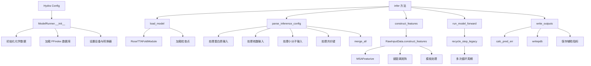

---
slug:22-modelrunner-workflow
blog_type:normal
---

ModelRunner 作为 RoseTTAFold-All-Atom 推理操作的主要编排层，协调数据准备、模型执行和输出生成。该类实现了一个模块化工作流，通过统一接口处理复杂的生物分子预测，包括蛋白质、核酸、小分子和共价修饰复合物。

## 架构概览

ModelRunner 实现了一个六阶段流水线，将原始输入规范转换为带有置信度指标的预测 3D 结构。该架构在初始化、配置解析、模型加载、特征构建、前向推理和输出序列化之间分离关注点。

来源：[run_inference.py](rf2aa/run_inference.py#L21-L33), [run_inference.py](rf2aa/run_inference.py#L151-L156)

## 初始化阶段

ModelRunner 构造函数建立推理所需的计算环境和必要的数据结构。此阶段配置化学参数，初始化用于模板访问的 FFindex 数据库，设置适当的计算设备（CUDA 或 CPU），并创建用于结构操作的坐标转换实用程序。

通过 `initialize_chemdata()` 进行的化学数据初始化会加载全原子建模所需的原子类型索引、Lennard-Jones 参数、键定义和手性约束。FFindex 数据库连接能够在 MSA 生成和结构预测期间高效检索模板。XYZConverter 实例提供在笛卡尔坐标和扭转角表示之间进行转换的方法，这对于模型的内部坐标系至关重要。

来源：[run_inference.py](rf2aa/run_inference.py#L23-L32)

## 配置解析

`parse_inference_config()` 方法处理 Hydra 配置以生成跨不同输入类型的统一分子表示。该方法处理四种主要输入类别：蛋白质、核酸、小分子和共价修饰残基。

对于蛋白质输入，该方法验证链的唯一性（需要单字符链标识符），并为每个指定链调用 `generate_msa_and_load_protein()`。此函数通过外部数据库搜索执行 MSA 生成并加载结构模板。核酸输入使用带有适当输入类型规范（RNA 或 DNA）的 `load_nucleic_acid()`。小分子输入支持 SMILES 字符串和 SDF 文件，并通过 `load_covalent_molecules()` 对共价键合分子进行特殊处理。

此阶段的一个关键方面是处理共价修饰。当指定蛋白质和小分子之间的共价键时，系统会跟踪哪些残基必须被“原子化”（从残基级转换为原子级表示）并相应地更新键特征。然后 `merge_all()` 函数将所有输入类型合并到单个 `RawInputData` 对象中，连接 MSA，合并键特征矩阵，并跨链对齐模板。

来源：[run_inference.py](rf2aa/run_inference.py#L34-L94), [merge_inputs.py](rf2aa/data/merge_inputs.py#L104-L200)

## 模型加载

`load_model()` 方法使用配置中 `legacy_model_param` 部分指定的参数实例化 RoseTTAFoldModule。这包括架构维度（嵌入大小、注意力头数、块计数）、对称性设置以及用于 3D 等变处理的 SE3Transformer 参数。

化学参数被传输到适当的设备（GPU 或 CPU），并在初始化期间传递给模型。这些参数包括全原子掩码、原子类型索引、Lennard-Jones 参数、键计数以及 Cβ 几何约束（长度、角度、扭转角）。模型从指定的检查点路径加载预训练权重，恢复模型状态以进行推理。

来源：[run_inference.py](rf2aa/run_inference.py#L96-L111), [RoseTTAFoldModel.py](rf2aa/model/RoseTTAFoldModel.py#L30-L77)

## 特征构建

`construct_features()` 方法委托给 `RawInputData.construct_features()`，后者将合并的原始数据转换为神经网络所需的张量格式。此转换涉及几个复杂的处理步骤。

通过 `MSAFeaturize()` 进行的 MSA 特征化将多序列 alignment 转换为三个组成部分：`seq`（one-hot 编码的目标序列）、`msa_seed`（MSA track 的潜在表示）和 `msa_extra`（额外的 MSA 信息）。该过程包括基于 `p_msa_mask` 参数的位置掩码和用于适当链边界的末端残基处理。

键特征通过 `get_bond_distances()` 转换为距离矩阵，对模型必须遵守的连接约束进行编码。模板处理使用 XYZConverter 从结构模板中提取扭转角（`alpha_t`），提供初始构象偏置。系统还通过将模板坐标转换为基于框架的表示来计算 2D 模板特征（`t2d`）。

该方法构造一个包含 18 个张量字段的 `RFInput` 数据类，包括 MSA 表示、序列编码、键特征、距离矩阵、手性约束、模板坐标、扭转角和链标识符。这个全面的特征集使模型能够整合进化、结构和化学信息。

来源：[data_loader.py](rf2aa/data/data_loader.py#L107-L163)

## 前向推理和循环

`run_model_forward()` 方法通过循环执行迭代细化来执行神经网络预测。在推理之前，该方法向所有张量添加批次维度，并将其传输到计算设备。键特征和序列掩码按照模型要求转换为长整型。

核心推理通过 `recycle_step_legacy()` 进行，该方法在多个周期（默认：4）内实现迭代细化过程。每个周期包括：

1. **循环输入准备**：`add_recycle_inputs()` 函数将前一周期（`msa_prev`、`pair_prev`、`xyz`、`alpha`）的输出注入当前输入。初始周期使用占位符坐标和零初始化的循环状态。

2. **前向传播**：RoseTTAFoldModule 通过其三轨架构（MSA、pair 和坐标 track）处理增强的输入，产生更新的预测。

3. **梯度控制**：早期周期使用 `torch.no_grad()` 以防止不必要的计算图构建。只有最后一个周期保留梯度以用于潜在的训练场景。

4. **特征选择**：早期周期设置 `return_raw=True` 以绕过昂贵的全原子坐标生成。最后一个周期生成完整的原子坐标。

循环机制允许模型迭代地细化其预测，每个周期结合来自先前预测的信息以提高结构准确性。`use_checkpoint` 参数在最后一个周期启用梯度检查点以提高内存效率。

来源：[run_inference.py](rf2aa/run_inference.py#L115-L127), [recycling.py](rf2aa/training/recycling.py#L10-L28), [recycling.py](rf2aa/training/recycling.py#L49-L72)

## 输出生成和指标

`write_outputs()` 方法处理模型输出以生成人类可读的结构文件和置信度指标。模型产生多个输出流：`logits`（序列预测）、`logits_aa`（氨基酸预测）、`logits_pae`（预测 alignment 误差）、`logits_pde`（预测距离误差）、`p_bind`（结合预测）、`xyz`（骨架坐标）、`alpha_s`（扭转角）、`xyz_allatom`（全原子坐标）和 `lddt`（局部距离差异测试预测）。

置信度指标通过专门的去分箱函数计算。`lddt_unbin()` 方法使用 softmax 加权的分箱中心将分箱的 lDDT 预测转换为连续值。类似地，`pae_unbin()` 和 `pde_unbin()` 使用适当的分箱步长（PAE 为 0.5 Å，PDE 为 0.3 Å）将分箱的误差预测转换为连续估计值。

`calc_pred_err()` 方法将这些指标聚合到一个综合误差字典中，包括：每个残基的 pLDDT 分数、PAE 矩阵、PDE 矩阵、平均置信度分数以及用于小分子相互作用的专门掩码。系统使用 `is_atom()` 函数识别小分子残基，从而区分蛋白质-蛋白质、蛋白质-配体和配体-配体相互作用。

最终结构以 PDB 格式写入，其中 pLDDT 分数存储为 B-factors，能够在结构查看器中可视化置信度。链边界信息（`Ls_from_same_chain_2d`）确保输出文件中的适当链划分。辅助指标以 PyTorch 格式保存以供下游分析。

来源：[run_inference.py](rf2aa/run_inference.py#L130-L150), [run_inference.py](rf2aa/run_inference.py#L158-L200)

## 工作流执行摘要

完整的推理执行序列由 `infer()` 方法编排，该方法按正确顺序调用每个阶段：

1. **模型设置**：加载模型架构和权重
2. **配置处理**：解析和合并所有输入规范
3. **特征构建**：将原始数据转换为张量格式
4. **模型推理**：执行基于循环的预测
5. **输出生成**：写入结构和置信度指标

这种模块化设计能够灵活组合不同的输入类型，并重用各个组件以进行测试或调试。

来源：[run_inference.py](rf2aa/run_inference.py#L151-L156)

<CgxTip>
循环机制对预测质量至关重要。默认的 MAXCYCLE 为 4，在计算成本和准确性之间提供了平衡。减少此参数可显著加快推理速度，但可能会降低结构质量，特别是对于复杂组装或低置信度区域。
</CgxTip>

## 配置参数

影响 ModelRunner 工作流的关键配置参数：

| 参数 | 默认值 | 描述 | 位置 |
|-----------|---------|-------------|----------|
| MAXCYCLE | 4 | 循环迭代次数 | loader_params |
| n_templ | 4 | 使用的模板数量 | loader_params |
| MAXSEQ | 1024 | 最大 MSA 深度 | loader_params |
| MAXLAT | 128 | 最大序列长度 | loader_params |
| seqid | 150.0 | 序列一致性阈值 | loader_params |
| recycling_type | "all" | 循环策略 (msa_pair/all) | legacy_model_param |
| use_same_chain | True | 启用链感知建模 | legacy_model_param |

来源：[base.yaml](rf2aa/config/inference/base.yaml#L44-L71)

## 后续步骤

了解 ModelRunner 工作流为探索推理流水线的特定方面奠定了基础：

- **[前向传播和循环](23-forward-pass-and-recycling)** - 迭代细化机制和三轨信息流的详细分析
- **[置信度指标计算](24-confidence-metrics-calculation)** - pLDDT、PAE 和 PDE 计算的深入检查
- **[结构输出生成](25-structure-output-generation)** - PDB 格式输出和辅助指标文件的完整指南

有关实际实施指导，请参阅特定生物分子类型的输入准备文档：
- **[蛋白质结构预测](9-protein-structure-prediction)**
- **[蛋白质-核酸复合物预测](10-protein-nucleic-acid-complex-prediction)**
- **[蛋白质-小分子复合物预测](11-protein-small-molecule-complex-prediction)**