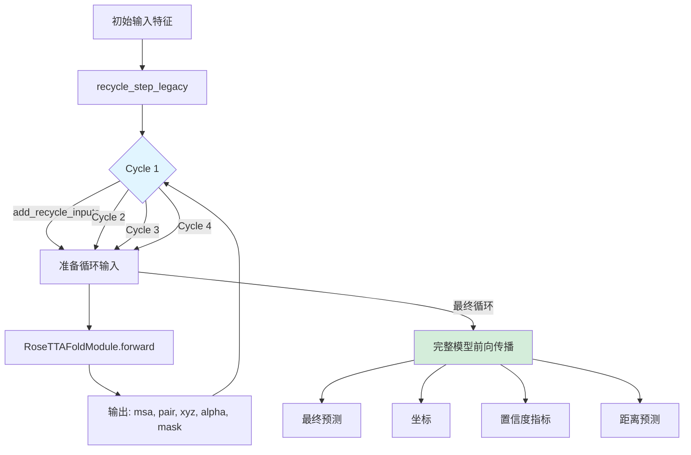
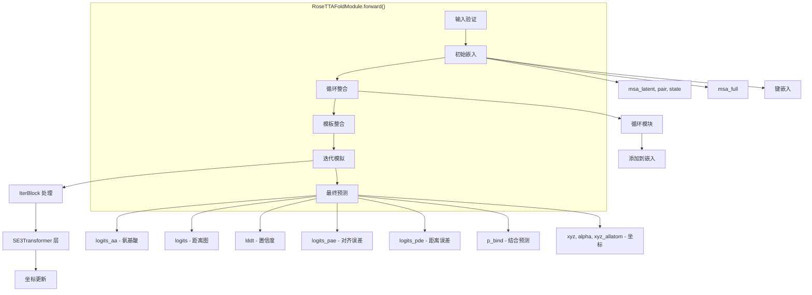

---
slug:23-forward-pass-and-recycling
blog_type:normal
---


本页面记录了 RoseTTAFold-All-Atom 中的前向传播和迭代循环机制，解释了模型如何通过多个循环来优化预测，从而实现准确的生物分子结构预测。

## 循环架构概述

循环机制实现了一种迭代优化策略，其中每次前向传播都建立在上一轮循环的输出之上，逐步改进结构预测。这种架构通过自洽性使模型能够收敛到更精确的构象。



循环由训练模块中的 `recycle_step_legacy()` 协调，它管理迭代过程并协调外层循环控制器与内层模型前向传播之间的交互。

来源：[recycling.py](rf2aa/training/recycling.py#L10-L31), [run_inference.py](rf2aa/run_inference.py#L115-L127)

## 循环实现

### 外层循环控制器

`recycle_step_legacy()` 函数作为主控制器，执行多次前向传播并管理计算上下文：

```python
def recycle_step_legacy(ddp_model, input, n_cycle, use_amp, nograds=False, force_device=None):
    xyz_prev, alpha_prev, mask_recycle = \
        input["xyz_prev"], input["alpha_prev"], input["mask_recycle"]
    output_i = (None, None, xyz_prev, alpha_prev, mask_recycle)
    for i_cycle in range(n_cycle):
        # 混合精度和梯度的上下文管理
        with ExitStack() as stack:
            stack.enter_context(torch.cuda.amp.autocast(enabled=use_amp))
            if i_cycle < n_cycle -1 or nograds is True:
                stack.enter_context(torch.no_grad())
                if force_device is None:
                    stack.enter_context(ddp_model.no_sync())
            return_raw = (i_cycle < n_cycle -1)
            use_checkpoint = not nograds and (i_cycle == n_cycle -1)

            input_i = add_recycle_inputs(input, output_i, i_cycle, gpu, return_raw=return_raw, use_checkpoint=use_checkpoint)
            output_i = ddp_model(**input_i)
    return output_i
```

该循环执行 `n_cycle` 次迭代（默认为 4 次），策略性地在中间循环中禁用梯度以减少内存占用，而在训练时的最终循环中启用梯度。

来源：[recycling.py](rf2aa/training/recycling.py#L10-L31)

### 每轮循环的输入准备

`add_recycle_inputs()` 函数为每次循环迭代准备输入张量字典，提取特定循环的 MSA 数据并整合先前的输出：

```python
def add_recycle_inputs(network_input, output_i, i_cycle, gpu, return_raw=False, use_checkpoint=False):
    input_i = {}
    for key in network_input:
        if key in ['msa_latent', 'msa_full', 'seq']:
            input_i[key] = network_input[key][:,i_cycle].to(gpu, non_blocking=True)
        else:
            input_i[key] = network_input[key]

    L = input_i["msa_latent"].shape[2]
    msa_prev, pair_prev, _, alpha, mask_recycle = output_i
    xyz_prev = ChemData().INIT_CRDS.reshape(1,1,ChemData().NTOTAL,3).repeat(1,L,1,1).to(gpu, non_blocking=True)

    input_i['msa_prev'] = msa_prev
    input_i['pair_prev'] = pair_prev
    input_i['xyz'] = xyz_prev
    input_i['mask_recycle'] = mask_recycle
    input_i['sctors'] = alpha
    input_i['return_raw'] = return_raw
    input_i['use_checkpoint'] = use_checkpoint

    input_i.pop('xyz_prev')
    input_i.pop('alpha_prev')
    return input_i
```

关键的准备步骤包括：从循环维度提取特定循环的 MSA 嵌入，保留先前的输出（`msa_prev`、`pair_prev`、`alpha`）用于循环，每轮循环将坐标重置为初始框架，以及根据是否为最终循环来配置输出模式。

来源：[recycling.py](rf2aa/training/recycling.py#L49-L71)

## 模型前向传播

### 前向方法结构

`RoseTTAFoldModule.forward()` 方法协调单个循环迭代的完整前向传播，遵循结构化的流程：



来源：[RoseTTAFoldModel.py](rf2aa/model/RoseTTAFoldModel.py#L168-L418)

### 初始嵌入

前向传播首先为所有轨道生成初始嵌入：

```python
# 获取嵌入
msa_latent, pair, state = self.latent_emb(
    msa_latent, seq, idx, bond_feats, dist_matrix, same_chain=same_chain
)
msa_full = self.full_emb(msa_full, seq, idx)
pair = pair + self.bond_emb(bond_feats)

msa_latent, pair, state = msa_latent.to(dtype), pair.to(dtype), state.to(dtype)
msa_full = msa_full.to(dtype)
```

这些嵌入在整合循环信息之前构成了基础。

来源：[RoseTTAFoldModel.py](rf2aa/model/RoseTTAFoldModel.py#L336-L345)

### 循环整合

核心循环机制将上一次迭代的输出整合到当前的嵌入中：

```python
# 执行循环
if msa_prev is None:
    msa_prev = torch.zeros_like(msa_latent[:,0])
if pair_prev is None:
    pair_prev = torch.zeros_like(pair)
if state_prev is None or self.recycling_type == "msa_pair":
    state_prev = torch.zeros_like(state)

msa_recycle, pair_recycle, state_recycle = self.recycle(msa_prev, pair_prev, xyz, state_prev, sctors, mask_recycle)
msa_recycle, pair_recycle = msa_recycle.to(dtype), pair_recycle.to(dtype)

msa_latent[:,0] = msa_latent[:,0] + msa_recycle.reshape(B,L,-1)
pair = pair + pair_recycle
state = state + state_recycle
```

循环模块将先前的嵌入和坐标转换为更新值，并将其添加到当前嵌入中。对于第一轮循环，先前的嵌入初始化为零。

来源：[RoseTTAFoldModel.py](rf2aa/model/RoseTTAFoldModel.py#L349-L361)

## 循环类型和配置

通过 `recycling_factory` 实现了两种循环策略：

| 循环类型 | 循环的特征 | 描述 |
|----------------|-------------------|-------------|
| `msa_pair` | MSA, Pair | 仅循环序列和成对表示 |
| `all` | MSA, Pair, State | 循环所有三个轨道的表示，包括 3D 状态 |

循环类型通过模型初始化和推理配置中的 `recycling_type` 参数进行配置。

来源：[Embeddings.py](rf2aa/model/layers/Embeddings.py#L455-L458), [base.yaml](rf2aa/config/inference/base.yaml#L60)

### 配置参数

推理配置中与循环相关的关键参数：

```yaml
loader_params:
  MAXCYCLE: 4  # 循环迭代次数

legacy_model_param:
  recycling_type: "all"  # 循环策略
```

`MAXCYCLE` 参数决定了执行多少次前向传播，在计算成本和预测质量之间取得平衡。默认的 4 次循环为大多数应用提供了良好的平衡。

来源：[base.yaml](rf2aa/config/inference/base.yaml#L36-L60)

## 迭代模拟

在循环整合之后，`IterativeSimulator` 通过多个架构块处理更新后的嵌入：

```python
# 根据给定输入预测坐标
is_motif = is_motif if self.freeze_track_motif else torch.zeros_like(seq).bool()[0]
msa, pair, xyz, alpha_s, xyz_allatom, state, symmsub, quat = self.simulator(
    seq_unmasked, msa_latent, msa_full, pair, xyz[:,:,:3], state, idx,
    symmids, symmsub, symmRs, symmmeta,
    bond_feats, dist_matrix, same_chain, chirals, is_motif, atom_frames, 
    use_checkpoint=use_checkpoint, use_atom_frames=self.use_atom_frames, 
    p2p_crop=p2p_crop, topk_crop=topk_crop
)
```

模拟器通过 SE3Transformer 层更新坐标，在保持 3D 等变性的同时迭代优化结构预测。

来源：[RoseTTAFoldModel.py](rf2aa/model/RoseTTAFoldModel.py#L368-L374), [Track_module.py](rf2aa/model/Track_module.py#L975-L1221)

## 输出生成

### 中间输出与最终输出

模型根据 `return_raw` 标志产生不同的输出，该标志基于循环位置设置：

```python
if return_raw:
    # 获取最后一个结构
    xyz_last = xyz_allatom[-1].unsqueeze(0)
    return msa[:,0], pair, xyz_last, alpha_s[-1], None

# 预测被遮蔽的氨基酸
logits_aa = self.aa_pred(msa)

# 预测距离图和方向图
logits = self.c6d_pred(pair)

# 预测 LDDT
lddt = self.lddt_pred(state)

# 预测对齐误差和距离误差
logits_pae = self.pae_pred(pair)
logits_pde = self.pde_pred(pair + pair.permute(0,2,1,3))

# 预测结合/不结合
p_bind = self.bind_pred(logits_pae, same_chain)
```

对于中间循环，模型返回循环所需的最小输出（MSA、pair、坐标、方向角、mask）。对于最终循环，它生成包括置信度指标和误差估计在内的全面预测。

来源：[RoseTTAFoldModel.py](rf2aa/model/RoseTTAFoldModel.py#L376-L418)

<CgxTip>
循环循环创造了一种自洽效应，每次迭代都会优化模型自身的预测。这对于解决蛋白质结构预测中的局部歧义特别有效，因为模型可以利用其不断演变的 3D 结构来为后续的嵌入提供信息。</CgxTip>

## 推理集成

`ModelRunner` 类在推理期间协调循环过程：

```python
def run_model_forward(self, input_feats):
    input_feats.add_batch_dim()
    input_feats.to(self.device)
    input_dict = asdict(input_feats)
    input_dict["bond_feats"] = input_dict["bond_feats"].long()
    input_dict["seq_unmasked"] = input_dict["seq_unmasked"].long()
    outputs = recycle_step_legacy(self.model, 
                                 input_dict, 
                                 self.config.loader_params.MAXCYCLE, 
                                 use_amp=False,
                                 nograds=True,
                                 force_device=self.device)
    return outputs
```

运行器通过添加批次维度并将数据移动到适当的设备来准备输入特征，然后委托给禁用梯度计算的循环循环（`nograds=True`），因为推理不需要反向传播。

来源：[run_inference.py](rf2aa/run_inference.py#L115-L127)

<CgxTip>
循环循环中的内存优化通过两个关键策略实现：(1) 当 `nograds=True` 时，禁用中间循环的梯度；(2) 仅对最终循环选择性地使用激活检查点（`use_checkpoint`）。这允许在 GPU 内存限制内适配更大的批次大小。</CgxTip>

## 下一步

完成前向传播和循环迭代后，模型生成置信度指标以评估预测质量。探索下一个主题：[置信度指标计算](24-confidence-metrics-calculation)。

要全面了解模型架构，请查看 [RoseTTAFoldModule 核心组件](15-rosettafoldmodule-core-components) 文档。