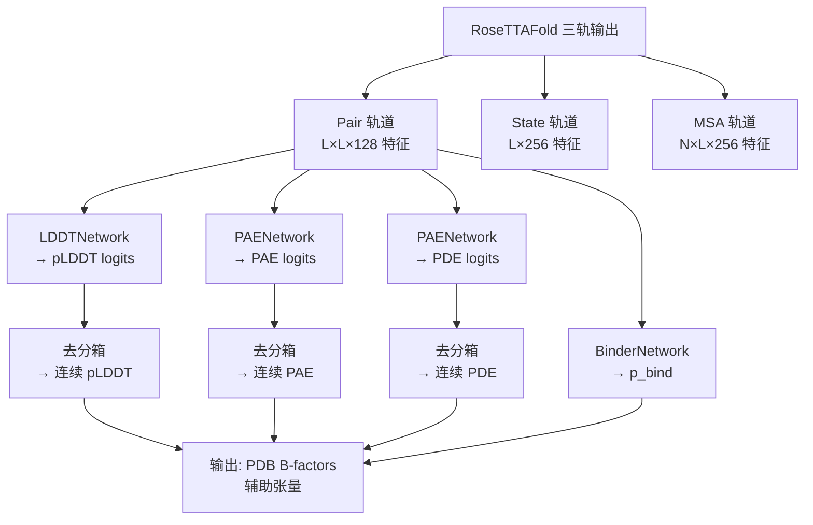

---
slug:24-confidence-metrics-calculation
blog_type:normal
---


置信度指标是 RoseTTAFold-All-Atom 的关键输出，用于量化不同层面上结构预测的可靠性。这些指标使用户能够评估局部残基准确性、成对比对可靠性以及多链复合物的结合置信度。系统通过专用预测头实现了多种互补的置信度评分，这些预测头作用于不同的特征表示。

## 架构概述

置信度预测系统由四个专门的预测网络组成，它们分别处理来自三轨架构的不同特征轨道。每个指标都从不同尺度提供关于预测可靠性的独特信息——从单残基的局部准确性到链间结合置信度。



预测头在 `RoseTTAFoldModule` 构造函数的模型初始化期间实例化，其配置了与每个指标的分箱方案相匹配的适当输出维度 [rf2aa/model/RoseTTAFoldModel.py](/baker-laboratory/RoseTTAFold-All-Atom/blob/main/rf2aa/model/RoseTTAFoldModel.py#L138-L149)。

## 单残基置信度：pLDDT

预测的局部距离差异测试提供 0 到 100 范围内的单残基置信度评分，指示局部原子几何形状的预期准确性。较高的数值表示对该残基预测结构的更大置信度。

### 分箱与预测

LDDTNetwork 基于结构优化模块最终迭代的状态特征（每个残基 256 维向量）运行。该网络使用单个线性投影层为每个残基生成 50 个分箱 logits：

```python
class LDDTNetwork(nn.Module):
    def __init__(self, n_feat, n_bin_lddt=50):
        super(LDDTNetwork, self).__init__()
        self.proj = nn.Linear(n_feat, n_bin_lddt)
```

这 50 个分箱对应于 LDDT 空间中 0 到 1 之间的等距区间，每个分箱代表 0.02 的范围。Logits 初始化为零，这鼓励模型仅在证据支持时学习高置信度的预测 [rf2aa/model/layers/AuxiliaryPredictor.py](/baker-laboratory/RoseTTAFold-All-Atom/blob/main/rf2aa/model/layers/AuxiliaryPredictor.py#L58-L72)。

### 转换为连续评分

在推理过程中，通过加权平均将 50 分箱分类分布转换为连续置信度评分：

```python
def lddt_unbin(self, pred_lddt):
    nbin = pred_lddt.shape[1]
    bin_step = 1.0 / nbin
    lddt_bins = torch.linspace(bin_step, 1.0, nbin, 
                                dtype=pred_lddt.dtype, 
                                device=pred_lddt.device)
    pred_lddt = nn.Softmax(dim=1)(pred_lddt)
    return torch.sum(lddt_bins[None,:,None]*pred_lddt, dim=1)
```

Softmax 将 logits 转换为概率，然后乘以分箱中心并求和以产生预期的 LDDT 值 [rf2aa/run_inference.py](/baker-laboratory/RoseTTAFold-All-Atom/blob/main/rf2aa/run_inference.py#L158-L164)。

### 输出集成

单残基 pLDDT 评分作为 B-factor 列写入 PDB 输出文件，能够在 PyMOL 或 ChimeraX 等分子查看器中直接可视化。这提供了一个直观的着色方案，蓝色区域表示高置信度，红色区域表示低置信度 [rf2aa/run_inference.py](/baker-laboratory/RoseTTAFold-All-Atom/blob/main/rf2aa/run_inference.py#L138-L144)。

<CgxTip>pLDDT 评分对于识别柔性区域、建模错误或缺乏进化约束的区域特别有价值。pLDDT 低于 50 的残基通常表示需要实验验证的不可靠区域。</CgxTip>

## 成对比对误差：PAE

预测对齐误差指标提供一个 L×L 矩阵，量化在将结构对齐以使残基 i 放置在残基 j 上时的预期位置误差（以埃为单位）。该指标对于评估结构域运动、对接可靠性和多链复合物预测至关重要。

### 预测架构

PAE 使用具有 64 个输出分箱的专用 PAENetwork 从配对特征（L×L×128）计算得出。分箱方案使用 0.5 Å 的步长，范围从 0.25 Å 到 31.75 Å，覆盖了预期的对齐误差范围：

```python
class PAENetwork(nn.Module):
    def __init__(self, n_feat, n_bin_pae=64):
        super(PAENetwork, self).__init__()
        self.proj = nn.Linear(n_feat, n_bin_pae)
```

配对特征的对称性质使得能够预测非对称误差矩阵，因为由于潜在的构象灵活性，PAE(i,j) 通常不等于 PAE(j,i) [rf2aa/model/layers/AuxiliaryPredictor.py](/baker-laboratory/RoseTTAFold-All-Atom/blob/main/rf2aa/model/layers/AuxiliaryPredictor.py#L74-L88)。

### 去分箱过程

PAE logits 通过跨分箱的加权平均转换为连续误差值：

```python
def pae_unbin(self, logits_pae, bin_step=0.5):
    nbin = logits_pae.shape[1]
    bins = torch.linspace(bin_step*0.5, bin_step*nbin-bin_step*0.5, nbin,
                           dtype=logits_pae.dtype, 
                           device=logits_pae.device)
    logits_pae = torch.nn.Softmax(dim=1)(logits_pae)
    return torch.sum(bins[None,:,None,None]*logits_pae, dim=1)
```

这产生一个 3D 张量（batch × L × L），包含所有残基对的预期对齐误差 [rf2aa/run_inference.py](/baker-laboratory/RoseTTAFold-All-Atom/blob/main/rf2aa/run_inference.py#L167-L172)。

### 多链掩码

对于包含蛋白质、核酸和小分子的复合物，PAE 值通过识别每个残基类别的掩码按分子类型聚合：

```python
sm_mask = is_atom(seq)[0]
sm_mask_2d = sm_mask[None,:]*sm_mask[:,None]
prot_mask_2d = (~sm_mask[None,:])*(~sm_mask[:,None])
inter_mask_2d = sm_mask[None,:]*(~sm_mask[:,None]) + (~sm_mask[None,:])*sm_mask[:,None]
```

这使得能够分别分析蛋白质内部、配体内部和分子间相互作用，其中 `is_atom(seq)` 根据超过核酸 token 阈值的序列 token 值识别小分子残基 [rf2aa/run_inference.py](/baker-laboratory/RoseTTAFold-All-Atom/blob/main/rf2aa/run_inference.py#L181-L184), [rf2aa/util.py](/baker-laboratory/RoseTTAFold-All-Atom/blob/main/rf2aa/util.py#L131-L133)。

## 成对距离误差：PDE

预测距离误差指标提供另一种 L×L 矩阵，量化残基对之间预测距离的预期误差。与考虑对齐的 PAE 不同，PDE 专注于原始距离预测准确性。

### 对称化输入特征

PDE 使用相同的 PAENetwork 架构，但在对称化的配对特征上运行，以尊重距离的对称性质：

```python
logits_pde = self.pde_pred(pair + pair.permute(0,2,1,3))
```

添加置换特征可确保预测在 diagonal（对角线）两侧对称，这在物理上是必需的，因为 distance(i,j) = distance(j,i) [rf2aa/model/RoseTTAFoldModel.py](/baker-laboratory/RoseTTAFold-All-Atom/blob/main/rf2aa/model/RoseTTAFoldModel.py#L390)。

### 精细化分箱

PDE 使用更精细的分箱分辨率，具有 64 个分箱，间距为 0.3 Å，从而能够对近距离接触进行更精确的距离误差预测：

```python
def pde_unbin(self, logits_pde, bin_step=0.3):
    nbin = logits_pde.shape[1]
    bins = torch.linspace(bin_step*0.5, bin_step*nbin-bin_step*0.5, nbin,
                           dtype=logits_pde.dtype, 
                           device=logits_pde.device)
    logits_pde = torch.nn.Softmax(dim=1)(logits_pde)
    return torch.sum(bins[None,:,None,None]*logits_pae, dim=1)
```

较小的分箱大小（PAE 为 0.3 Å，而 PAE 为 0.5 Å）反映了对距离预测比对齐误差有更高的精度要求 [rf2aa/run_inference.py](/baker-laboratory/RoseTTAFold-All-Atom/blob/main/rf2aa/run_inference.py#L174-L179)。

## 结合概率预测

对于多链复合物，系统预测不同链在预测界面处相互结合的概率。这通过专用分类头从 PAE 矩阵得出。

### 链间误差聚合

BinderNetwork 仅提取链间残基对（其中 `same_chain == 0`）的 PAE 值并计算其平均值：

```python
def forward(self, pae, same_chain):
    logits = pae.permute(0,2,3,1)
    logits_inter = torch.mean(logits[same_chain==0], dim=0).nan_to_num()
    prob = torch.sigmoid(self.classify(logits_inter))
    return prob
```

分类由单个线性层执行，该层通过 sigmoid 激活将 64 分箱 PAE 分布映射为结合概率 [rf2aa/model/layers/AuxiliaryPredictor.py](/baker-laboratory/RoseTTAFold-All-Atom/blob/main/rf2aa/model/layers/AuxiliaryPredictor.py#L99-L104)。

### 单链处理

对于单链预测或所有残基属于同一条链的情况，链间 PAE 聚合产生全零（由于没有 `same_chain==0` 条目），导致在 `nan_to_num()` 和 sigmoid 变换后的结合概率为 0.5。这表示不确定性而非明确预测 [rf2aa/model/layers/AuxiliaryPredictor.py](/baker-laboratory/RoseTTAFold-All-Atom/blob/main/rf2aa/model/layers/AuxiliaryPredictor.py#L101)。

## 置信度指标存储与检索

所有置信度指标都聚合并存储在一个字典中，该字典包含原始预测和处理后的值：

```python
err_dict = dict(
    plddts = plddts.cpu(),
    pae = pae.cpu() if pae is not None else None,
    pde = pde.cpu() if pde is not None else None,
    p_bind = p_bind.cpu() if p_bind is not None else None,
    same_chain = input_feats.same_chain
)
```

该字典序列化为与主 PDB 输出一起存储的辅助 `.pt` 文件，从而能够以编程方式访问置信度指标用于下游分析 [rf2aa/run_inference.py](/baker-laboratory/RoseTTAFold-All-Atom/blob/main/rf2aa/run_inference.py#L181-L192), [rf2aa/run_inference.py](/baker-laboratory/RoseTTAFold-All-Atom/blob/main/rf2aa/run_inference.py#L146-L150)。

### 指标汇总表

| 指标 | 输入特征 | 输出形状 | 范围 | 主要用例 |
|--------|---------------|--------------|-------|------------------|
| pLDDT | State (L×256) | L | 0-100 | 单残基局部准确性 |
| PAE | Pair (L×L×128) | L×L | 0-32 Å | 成对比对误差、结构域运动 |
| PDE | 对称化 Pair (L×L×128) | L×L | 0-19 Å | 成对距离预测误差 |
| p_bind | PAE 链间 | 标量 | 0-1 | 多链结合概率 |

<CgxTip>分析多链复合物时，请检查 PAE 矩阵的对角线块以了解链内置信度，检查非对角线块以了解链间对接可靠性。较低的非对角线 PAE 值（<10 Å）通常表示链放置的置信度较高。</CgxTip>

## 与模型流程集成

置信度预测在所有回收迭代完成后的最终模型前向传递期间生成。RoseTTAFoldModel 与结构坐标一起返回这些指标：

```python
return (
    logits, logits_aa, logits_pae, logits_pde, p_bind, 
    xyz, alpha_s, xyz_allatom, lddt, msa[:,0], pair, state
)
```

ModelRunner 按顺序协调去分箱、掩码和输出写入，确保所有置信度指标在序列化前得到正确处理 [rf2aa/model/RoseTTAFoldModel.py](/baker-laboratory/RoseTTAFold-All-Atom/blob/main/rf2aa/model/RoseTTAFoldModel.py#L400-L411), [rf2aa/run_inference.py](/baker-laboratory/RoseTTAFold-All-Atom/blob/main/rf2aa/run_inference.py#L130-L150)。

## 后续步骤

有关置信度指标在结构分析中的实际应用，请参阅 [结构输出生成](25-structure-output-generation) 以了解这些指标如何与坐标输出集成。要检查生成用于置信度预测的特征的迭代优化过程，请查看 [前向传递和回收](23-forward-pass-and-recycling)。