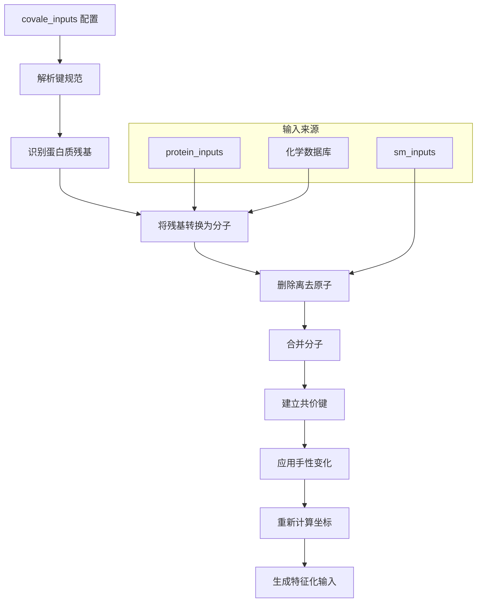

---
slug:26-covalent-bond-specification
blog_type:normal
---


共价键规范系统能够对蛋白质残基与小分子之间的共价附着进行建模，包括翻译后修饰、共价抑制剂以及其他共价连接。该系统将选定的蛋白质残基从残基级别转换为原子级别表示，并在转换后的原子与小分子原子之间建立显式共价键，同时可选择指定由成键引起的立体化学变化。

## 架构概览

共价键规范架构遵循一个系统化的转换流程，整合了蛋白质、小分子和化学约束规范：



该系统利用化学数据库检索理想化的残基坐标和原子连接性，并在指定手性变化时使用 OpenBabel 进行分子操作和几何优化。

## 配置格式

共价键通过推理配置文件中的 `covale_inputs` 参数进行指定。该格式使用作为 Python 代码求值的嵌套元组结构：

```yaml
covale_inputs: "[
  ((protein_chain, residue_number, atom_name),
   (sm_chain, atom_number),
   (chirality_first, chirality_second)),
  ...
]"
```

**每个键规范的组成：**

| 组件 | 类型 | 描述 | 示例 |
|-----------|------|-------------|---------|
| `protein_chain` | string | 蛋白质残基的链标识符 | `"A"` |
| `residue_number` | string | 残基索引（基于 1 的 PDB 编号） | `"74"` |
| `atom_name` | string | 残基内的原子名称 | `"ND2"` |
| `sm_chain` | string | 小分子链标识符 | `"B"` |
| `atom_number` | string | 小分子中的原子索引（基于 1） | `"1"` |
| `chirality_first` | string | 蛋白质原子的手性（`"CW"`、`"CCW"` 或 `"null"`） | `"CW"` |
| `chirality_second` | string | 小分子原子的手性（`"CW"`、`"CCW"` 或 `"null"`） | `"null"` |

**来自 [`covalent.yaml`](rf2aa/config/inference/covalent.yaml#L12-L12) 的完整示例：**

```yaml
protein_inputs: 
  A: 
    fasta_file: examples/protein/7s69_A.fasta

sm_inputs:
  B: 
    input: examples/small_molecule/7s69_glycan.sdf
    input_type: sdf

covale_inputs: "[((\"A\", \"74\", \"ND2\"), (\"B\", \"1\"), (\"CW\", \"null\"))]"
```

这指定了链 A 中残基 74（天冬酰胺）的原子 `ND2` 与小分子链 B 中的原子 1 之间的共价键，其中蛋白质原子在成键后变为顺时针构型的手性中心。

<CgxTip>重要提示：`covale_inputs` 字符串必须是有效的 Python 列表语法，并正确转义引号。在元组内始终使用双引号，如果嵌套在 YAML 字符串中，请使用反斜杠进行转义。</CgxTip>

## 核心数据结构

### MoleculeToMoleculeBond

[`MoleculeToMoleculeBond`](rf2aa/data/covale.py#L12-L19) 数据类表示两个原子之间（可能位于不同分子中）的共价键：

```python
@dataclass
class MoleculeToMoleculeBond:
    chain_index_first: int        # 合并结构中第一个分子的链索引
    absolute_atom_index_first: int  # 第一个原子的绝对索引
    chain_index_second: int       # 第二个分子的链索引
    absolute_atom_index_second: int # 第二个原子的绝对索引
    new_chirality_atom_first: Optional[str]  # 第一个原子的手性规范
    new_chirality_atom_second: Optional[str] # 第二个原子的手性规范
```

### AtomizedResidue

[`AtomizedResidue`](rf2aa/data/covale.py#L21-L28) 数据类跟踪从蛋白质表示转换为原子级别的残基：

```python
@dataclass
class AtomizedResidue:
    chain: str                          # 转换后的链标识符
    chain_index_in_combined_chain: int  # 在合并分子列表中的索引
    absolute_N_index_in_chain: int      # N 原子的绝对索引
    absolute_C_index_in_chain: int      # C 原子的绝对索引
    original_chain: str                 # 原始蛋白质链
    index_in_original_chain: int        # 原始残基索引
```

## 处理流程

### 1. 键规范解析与验证

[`load_covalent_molecules()`](rf2aa/data/covale.py#L31-L52) 函数作为入口点，验证是否同时提供了共价输入和小分子输入：

```python
def load_covalent_molecules(protein_inputs, config, model_runner):
    if config.covale_inputs is None:
        return None
    
    if config.sm_inputs is None:
        raise ValueError("如果提供了 covale_inputs，则还必须提供小分子输入")
     
    covalent_bonds = eval(config.covale_inputs)
    sm_inputs = delete_leaving_atoms(config.sm_inputs)
    residues_to_atomize, combined_molecules, extra_bonds = find_residues_to_atomize(...)
```

### 2. 残基识别与原子化

[`find_residues_to_atomize()`](rf2aa/data/covale.py#L53-L108) 函数处理每个键规范，识别目标蛋白质残基，并将其转换为分子格式：

```python
for bond in covalent_bonds:
    prot_chid, prot_res_idx, atom_to_bond = bond[0]
    sm_chid, sm_atom_num = bond[1]
    chirality_first_atom, chirality_second_atom = bond[2]
```

对于每个指定的蛋白质残基，[`convert_residue_to_molecule()`](rf2aa/data/covale.py#L109-L127) 从化学数据库检索理想化坐标：

```python
def convert_residue_to_molecule(protein_inputs, residue, model_runner):
    prot_chid, prot_res_idx, atom_to_bond = residue
    protein_input = protein_inputs[prot_chid]
    prot_res_abs_idx = int(prot_res_idx) -1
    residue_identity_num = protein_input.query_sequence()[prot_res_abs_idx]
    residue_identity = ChemData().num2aa[residue_identity_num]
    molecule_info = model_runner.molecule_db[residue_identity]
    sdf = molecule_info["sdf"]
```

这将从化学数据库中检索包含该残基类型理想化坐标的 SDF（结构数据格式）字符串。

### 3. 离去基团去除

系统支持去除离去原子——即在共价键形成过程中被置换的原子。[`delete_leaving_atoms()`](rf2aa/data/covale.py#L239-L253) 函数处理小分子：

```python
def delete_leaving_atoms(sm_inputs):
    updated_sm_inputs = {}
    for chain in sm_inputs:
        if "is_leaving" not in sm_inputs[chain]:
            continue
        is_leaving = eval(sm_inputs[chain]["is_leaving"])
        sdf_string = delete_leaving_atoms_single_chain(sm_inputs[chain]["input"], is_leaving)
        updated_sm_inputs[chain] = {
            "input": create_and_populate_temp_file(sdf_string),
            "input_type": "sdf"
        }
    sm_inputs.update(updated_sm_inputs)
    return sm_inputs
```

蛋白质残基也利用化学数据库的离去基团规范进行离去基团去除：

```python
is_heavy = [i for i, a in enumerate(molecule_info["atom_id"]) if a[0] != "H"]
is_leaving = [a for i,a  in enumerate(molecule_info["leaving"]) if i in is_heavy]
sdf_string_no_leaving_atoms = delete_leaving_atoms_single_chain(temp_file, is_leaving)
```

### 4. 分子合并与键建立

[`get_combined_atoms_bonds()`](rf2aa/data/covale.py#L128-L158) 函数将多个分子连接为单一表示：

```python
def get_combined_atoms_bonds(combined_molecule):
    atom_list  = []
    bond_feats_list = []
    xyzs = []
    Ls = []
    for molecule in combined_molecule:
        obmol, msa, ins, xyz, mask = parse_mol(
            molecule, 
            filetype="sdf", 
            string=False,
            generate_conformer=True,
            find_automorphs=False    
        )
        bond_feats = get_bond_feats(obmol)
        atom_list.append(msa)
        bond_feats_list.append(bond_feats)
        xyzs.append(xyz)
        Ls.append(msa.shape[0])
    
    atoms = torch.cat(atom_list)
    L_total = sum(Ls)
    bond_feats = torch.zeros((L_total, L_total)).long()
    offset = 0
    for bf in bond_feats_list:
        L = bf.shape[0]
        bond_feats[offset:offset+L, offset:offset+L] = bf
        offset += L
    xyz = torch.cat(xyzs, dim=1)[0]
    return atoms, bond_feats, xyz, Ls
```

[`make_obmol_from_atoms_bonds()`](rf2aa/data/covale.py#L159-L191) 函数创建一个 OpenBabel 分子并添加额外的共价键：

```python
for bond in extra_bonds:
    absolute_index_first = get_absolute_index_from_relative_indices(
        bond.chain_index_first,
        bond.absolute_atom_index_first, 
        Ls
    ) 
    absolute_index_second = get_absolute_index_from_relative_indices(
        bond.chain_index_second,
        bond.absolute_atom_index_second,
        Ls
    )
    order = 1 #all covale bonds are single bonds
    openbabel_bond = make_openbabel_bond(mol, absolute_index_first, absolute_index_second, order)
    mol.AddBond(openbabel_bond)
    set_chirality(mol, absolute_index_first, bond.new_chirality_atom_first)
    set_chirality(mol, absolute_index_second, bond.new_chirality_atom_second)
```

<CgxTip>系统中指定的所有共价键均被视为单键，无论其在原始分子中的键级如何。这简化了表示方式，适用于包括糖基化和共价抑制剂形成在内的大多数共价修饰。</CgxTip>

### 5. 手性处理

共价键的形成会产生新的立体中心。[`set_chirality()`](rf2aa/data/covale.py#L203-L219) 函数强制执行指定的手性构型：

```python
def set_chirality(mol, absolute_atom_index, new_chirality):
    stereo = openbabel.OBStereoFacade(mol)
    if stereo.HasTetrahedralStereo(absolute_atom_index+1):
        tetstereo = stereo.GetTetrahedralStereo(mol.GetAtom(absolute_atom_index+1).GetId())
        if tetstereo is None:
            return

        assert new_chirality is not None, "you have introduced a new stereocenter, \
            so you must specify its chirality either as CW, or CCW"
        
        config = tetstereo.GetConfig()
        config.winding = chirality_options[new_chirality]
        tetstereo.SetConfig(config)
        print("Updating chirality...")
    else:
        assert new_chirality is None, "you have specified a chirality without creating a new chiral center"
```

手性选项映射到 OpenBabel 常量：

```python
chirality_options = {
    "CW": openbabel.OBStereo.Clockwise,
    "CCW": openbabel.OBStereo.AntiClockwise,
}
```

手性变化后，[`recompute_xyz_after_chirality()`](rf2aa/data/covale.py#L225-L238) 使用 MMFF94 力场优化分子几何结构：

```python
def recompute_xyz_after_chirality(obmol):
    builder = openbabel.OBBuilder()
    builder.Build(obmol)
    ff = openbabel.OBForceField.FindForceField("mmff94")
    did_setup = ff.Setup(obmol)
    if did_setup:
        ff.FastRotorSearch()
        ff.GetCoordinates(obmol)
    else:
        raise ValueError(f"Failed to generate 3D coordinates for molecule {filename}.")
    atom_coords = torch.tensor([[obmol.GetAtom(i).x(),obmol.GetAtom(i).y(), obmol.GetAtom(i).z()] 
                                for i in range(1, obmol.NumAtoms()+1)]).unsqueeze(0) # (1, natoms, 3)
    return atom_coords
```

## 蛋白质特征更新

当残基被原子化时，必须更新蛋白质输入特征以反映这种变化。[`update_protein_features_after_atomize()`](rf2aa/data/data_loader.py#L51-L96) 方法修改键特征：

```python
def update_protein_features_after_atomize(self, residues_to_atomize):
    ...
    for residue in residues_to_atomize:
        original_chain_start_index, original_chain_end_index = chain_bins[residue.original_chain]
        absolute_index_in_combined_input = original_chain_start_index + residue.index_in_original_chain

        atomized_chain_start_index, atomized_chain_end_index = chain_bins[residue.chain]
        N_index = atomized_chain_start_index + residue.absolute_N_index_in_chain
        C_index = atomized_chain_start_index + residue.absolute_C_index_in_chain
        
        # if residue is first in the chain, no extra bond feats to following residue
        if absolute_index_in_combined_input != original_chain_start_index:
            self.bond_feats[absolute_index_in_combined_input-1, N_index] = ChemData().RESIDUE_ATOM_BOND
            self.bond_feats[N_index, absolute_index_in_combined_input-1] = ChemData().RESIDUE_ATOM_BOND
        
        # if residue is last in chain, no bonds feats to following residue
        if absolute_index_in_combined_input != original_chain_end_index-1:
            self.bond_feats[absolute_index_in_combined_input+1, C_index] = ChemData().RESIDUE_ATOM_BOND
            self.bond_feats[C_index,absolute_index_in_combined_input+1] = ChemData().RESIDUE_ATOM_BOND
        keep[absolute_index_in_combined_input] = 0
```

这在原子化残基的 N 和 C 原子与前一个/后一个残基之间建立了正确的主链连接，然后移除了原始的残基级别特征。

## 常见用例

### 糖基化

糖基化将糖链连接到蛋白质侧链（通常是 N 连接糖基化的天冬酰胺 Asn，或 O 连接糖基化的丝氨酸 Ser/苏氨酸 Thr）。[`covalent.yaml`](rf2aa/config/inference/covalent.yaml) 中的示例演示了 N 连接糖基化：

```yaml
covale_inputs: "[((\"A\", \"74\", \"ND2\"), (\"B\", \"1\"), (\"CW\", \"null\"))]"
```

这将 Asn74 的 ND2 原子连接到糖的第一个原子，其中氮原子成为具有顺时针构型的新手性中心。

### 共价抑制剂

对于与催化残基形成永久键的共价抑制剂（例如，靶向半胱氨酸 Cys 的共价药物）：

```yaml
sm_inputs:
  B:
    input: examples/small_molecule/covalent_inhibitor.sdf
    input_type: sdf
    is_leaving: "[0, 0, 1, 0, 0]"  # 第三个原子是离去基团

covale_inputs: "[((\"A\", \"25\", \"SG\"), (\"B\", \"3\"), (\"null\", \"null\"))]"
```

这将在去除离去基团后，将 Cys25 的 SG 原子与抑制剂的第三个原子成键。

### 翻译后修饰

对于磷酸化、乙酰化或其他 PTM（即一个小基团附着在残基上）：

```yaml
covale_inputs: "[((\"A\", \"102\", \"O\"), (\"B\", \"1\"), (\"null\", \"null\"))]"
```

这将丝氨酸/苏氨酸/酪氨酸的羟基氧原子连接到修饰基团。

## 约束与限制

| 约束 | 描述 | 变通方法 |
|------------|-------------|------------|
| 小分子格式 | 共价键仅支持 SDF 格式 | 使用 OpenBabel 将其他格式转换为 SDF |
| 键级 | 所有共价键均被视为单键 | 模型通过几何结构隐式处理键级 |
| 手性检测 | 必须显式指定新立体中心的手性 | 当未创建新的立体中心时，使用 `"null"` |
| 离去基团 | 必须在小分子输入中预先指定离去原子 | 在小分子配置中提供 `is_leaving` 数组 |
| 多重键 | 按规范顺序依次处理 | 对于手性规范，顺序很重要 |

## 与模型流程的集成

共价键规范系统通过 [`load_covalent_molecules()`](rf2aa/data/covale.py#L31-L52) 函数与更广泛的 RoseTTAFold-All-Atom 流程集成，该函数返回可供模型使用的特征化输入：

```python
return chainid_to_input, residues_to_atomize
```

这些输入与其他链输入合并，并通过标准数据流程进行处理，确保在整个结构预测过程中遵守共价约束。

## 后续步骤

为了全面了解上下文中的共价键规范：

- 探索 [蛋白质-小分子复合物预测](11-protein-small-molecule-complex-prediction) 以了解小分子输入准备的详细信息
- 查阅 [手性处理](27-chirality-handling) 以深入了解立体化学考量
- 参见 [化学特征处理](21-chemical-feature-processing) 以了解分子特征化的详细信息
- 咨询 [输入数据结构](18-input-data-structures) 以了解共价特征如何在内部表示