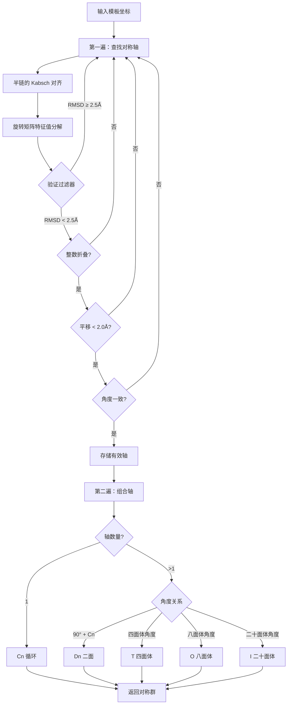
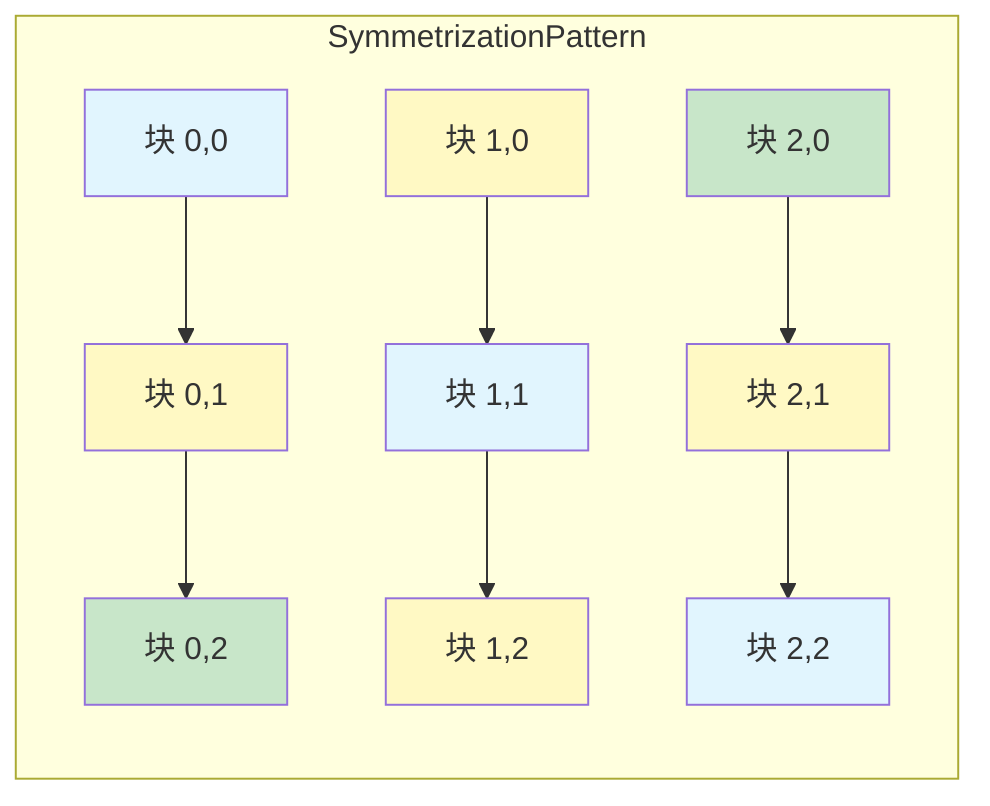

---
slug:28-symmetry-and-repeat-handling
blog_type:normal
---

RoseTTAFold-All-Atom 实现了一套复杂的系统，用于检测和强制执行生物分子复合物中的对称性，并包含处理序列内部重复单元的机制。这些功能对于精确建模对称寡聚体、病毒衣壳和重复蛋白结构域至关重要，因为在这些情况下，结构约束能显著减少构象搜索空间。

## 对称性检测框架

该系统采用两遍算法从模板结构中检测对称性并构建合适的对称群。核心检测逻辑位于 `rf2aa/symmetry.py` 中，始于 `get_symmetry()` 函数，该函数分析坐标数组以识别旋转对称性 [symmetry.py#L112-L225]。

在第一遍中，算法通过比较半链（在中点处分割）对来扫描潜在的对称轴。对于每一对，它执行 Kabsch 对齐以计算旋转矩阵，并使用特征值分解计算相应的对称轴。系统使用多个标准验证潜在的对称性：均方根偏差截止值（`rms_cut=2.5` Å）、整数折叠验证（`nfold_cut=0.1`）、沿对称轴的平移约束（`trans_cut=2.0` Å）以及角度一致性检查（`angle_cut=0.05` 弧度）。这种严格的过滤确保只接受生物学上合理的对称性 [symmetry.py#L126-L172]。

第二遍将检测到的对称轴组合成完整的对称群。该算法支持五种对称群分类：循环（Cn）、二面（Dn）以及三种柏拉图立体——四面体（T）、八面体（O）和二十面体（I）。对于多面体群，轴之间的特定角度关系决定群类型（例如，四面体要求 3 重轴与 2 重轴在 arccos(-1/√3) 处相交）。系统返回对称群标识符以及映射到此对称性的亚基索引列表 [symmetry.py#L174-L225]。

<CgxTip>对称性检测系统作用于模板坐标，而非完整的蛋白质序列。这意味着生成具有同源模板的准确 MSA 是在结构预测中利用对称性的先决条件。</CgxTip>

## 对称群构建

一旦识别出对称群，`symm_subunit_matrix()` 函数就会生成完整的数学表示，包括旋转矩阵和亚基映射 [symmetry.py#L228-L386]。该函数根据点群几何结构分别处理每种对称类型。

对于循环对称性（Cn），系统使用 `generateC()` 围绕主轴生成 n 个旋转矩阵，该函数创建从 0 到 2π 均匀间隔角度的旋转 [symmetry.py#L7-L14]。亚基映射矩阵遵循循环模式，其中 `symmatrix[i,j] = (i - j) mod n`，表示将亚基 j 与亚基 i 对齐所需的相对旋转。距对称轴的偏移距离使用 `D = est_radius/sin(θ/2)` 估算，其中 `θ = 2π/n` [symmetry.py#L228-L250]。

二面对称性（Dn）结合了旋转对称性和 n 个垂直的 2 重轴。`generateD()` 函数创建 2n 个旋转矩阵：n 个围绕主轴的旋转加上 n 个围绕垂直轴的旋转，并结合 180° 翻转 [symmetry.py#L16-L25]。亚基矩阵扩展为 2n×2n，其块结构代表了二面群特征的两个亚基环 [symmetry.py#L250-L276]。

柏拉图立体（T、O、I）具有硬编码的旋转矩阵和从其对称操作导出的亚基映射。四面体对称性使用 12 个操作，八面体使用 24 个，二十面体使用 60 个。这些被显式编码为旋转矩阵和置换矩阵 [symmetry.py#L277-L386]。

**对称群特征**

| 群 | 旋转操作 | 亚基计数 | 典型生物学示例 | 矩阵大小 |
|-------|----------------------|---------------|-----------------------------|-------------|
| Cn | n 次旋转 | n | 铁蛋白、GroEL | n×n |
| Dn | 2n 次旋转 + n 次 C2 翻转 | 2n | DNA 结合寡聚体 | 2n×2n |
| T | 12 个操作 | 12 | 某些病毒衣壳蛋白 | 12×12 |
| O | 24 个操作 | 24 | 铁蛋白核心 | 24×24 |
| I | 60 个操作 | 60 | 大多数病毒衣壳 | 60×60 |

## 重复单元对称化

除了对称群之外，该架构还通过对特征进行块对称化来处理序列内部的重复。`find_symmsub()` 函数构建一个对称化矩阵，用于识别哪些块对应该被约束以共享特征 [Track_module.py#L131-L168]。

矩阵构建遵循对角线模式，即距离主对角线相等偏移量的块接收相同的索引。参数 `k` 控制有多少条非对角线参与对称化，对角线总数为 `2k + 1`。例如，当 `k=1` 时，对称化包括主对角线和每侧的一条非对角线。滚动偏移模式确保对等效重复对进行对称处理 [Track_module.py#L147-L167]。

`apply_pair_symmetry()` 函数提供了三种在配对轨迹中强制执行重复等效性的方法 [Track_module.py#L254-L270]：

- **均值对称化**：对等效块的特征取平均值，减少方差并强制执行共识。在 `mean_block_activations()` 中实现，该函数计算共享相同对称化索引的所有块的算术平均值 [Track_module.py#L223-L251]。

- **最大值对称化**：从等效块中选择最大幅度的特征，可能保留强信号。在 `max_block_activations()` 中实现，该函数堆叠块并在对称化维度上应用 `torch.max()` [Track_module.py#L181-L220]。

- **复制对称化**：将特征从指定的“主块”（通常包含定义明确的基序）复制到所有等效块。此方法保留详细的基序信息，同时强制执行对称约束。

<CgxTip>均值对称化提供最平滑的特征景观，但可能会稀释重复单元之间真正的生物学差异。最大值对称化可能会放大噪声。当一个重复包含来自模板或实验约束的高置信度结构信息时，复制对称化是最合适的。</CgxTip>

## 配置和模型集成

对称性和重复参数通过 `rf2aa/model/RoseTTAFoldModel.py` 中的 `RoseTTAFoldModule` 初始化进行配置 [RoseTTAFoldModel.py#L32-L77]。关键参数包括：

- `symmetrize_repeats`：布尔标志，用于启用/禁用配对轨迹中的重复对称化
- `repeat_length`：单个重复单元的残基长度（必须能整除总长度）
- `symmsub_k`：要包含在对称化中的非对角线数量（默认 k=1 包括主对角线 + 直接相邻块）
- `sym_method`：对称化方法（'mean'、'max' 或 'copy'）
- `main_block`：包含高置信度基序信息的块的索引（与 'copy' 方法一起使用）

这些参数通过 `PairStr2Pair` 模块 [Track_module.py#L273-L375] 和 `IterBlock` 迭代模拟块 [Track_module.py#L892-L974] 在模型架构中传播。在前向传播期间，系统在每次迭代时应用对称化，以在整个细化过程中保持约束。

对称性集成发生在多个阶段：在 `PairStr2Pair.forward()` 中更新配对特征期间 [Track_module.py#L366-L375]，在 `update_symm_Rs()` 中更新结构期间 [Track_module.py#L772-L833]，以及在 `update_symm_subs()` 中重新映射亚基期间 [Track_module.py#L836-L880]。

**配置参数关系**

| 参数 | 类型 | 默认值 | 对预测的影响 |
|-----------|------|---------|----------------------|
| `symmetrize_repeats` | bool | None | 启用/禁用重复约束；对于重复序列有显著的性能提升 |
| `repeat_length` | int | None | 必须能整除总序列长度；决定块大小 |
| `symmsub_k` | int | None | 较高的值包含更远的块；k=1 为最小值，k=2 包含次近邻 |
| `sym_method` | str | None | 'mean' 用于平滑，'max' 用于信号保留，'copy' 用于基序传播 |
| `main_block` | int | None | 'copy' 方法需要；选择特征传播的源块 |

## 动态对称性适应

该系统包括在推理期间动态更新对称性参数的机制。`update_symm_Rs()` 函数可以选择性地优化对称变换，以最小化对称相关亚基之间的距离图误差 [Track_module.py#L772-L833]。

当 `fit=True` 时，系统使用 L-BFGS 优化来调整平移（T0）和旋转（编码为四元数 Q0）参数，以最小化对称预测距离图与实际距离图之间的差异。此优化运行 4 次迭代，并使用强 Wolfe 线搜索，细化对称参数以更好地匹配生成的结构，同时保持整体对称约束 [Track_module.py#L807-L828]。

`update_symm_subs()` 函数根据迭代细化期间质心位置，动态重新计算哪些亚基对应该被对称化 [Track_module.py#L836-L880]。这允许系统随着结构的演变而调整对称分组，特别是在初始模板对称性不能完美匹配预测构象的情况下非常有用。该函数识别每个对称操作的最近邻亚基，并相应地更新对称化映射。

## 与模型工作流的集成

对称性信息通过 `rf2aa/run_inference.py` 中的 `ModelRunner` 类流经完整的推理管道 [run_inference.py#L21-L152]。虽然基本配置默认不启用对称性，但系统接受通过旧模型参数字典传递的对称性相关参数 [run_inference.py#L96-L108]。

在 `recycle_step_legacy()`（从 `run_model_forward()` 调用）的前向传播期间，对称参数与其他输入一起传递给模型的 `forward()` 方法 [RoseTTAFoldModel.py#L186-L187]。模型在每次循环迭代期间应用对称约束，确保结构细化在整个预测过程中尊重对称性。

<CgxTip>为了获得对称组装的最佳效果，请提供具有正确生物组装信息（BIOMT 记录）的高质量模板。系统可以直接从这些记录中检测对称性并应用适当的约束，从而显著提高寡聚复合物的预测准确性。</CgxTip>

## 后续步骤

了解对称性和重复处理为探索相关高级功能提供了背景。继续阅读 [共价键规范](26-covalent-bond-specification) 以了解共价约束如何与对称约束集成，或继续阅读 [手性处理](27-chirality-handling) 以了解其他立体化学强制执行机制。对于实际应用，请参阅 [自定义推理配置](8-custom-inference-configs) 以了解如何为特定预测任务启用对称性功能。