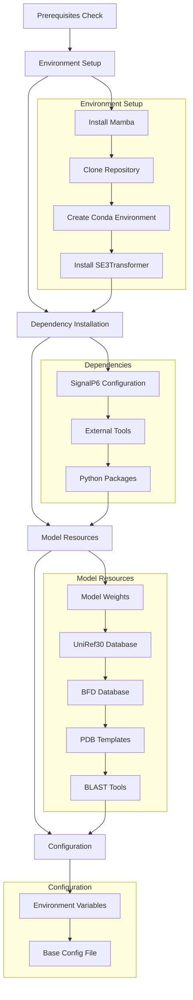
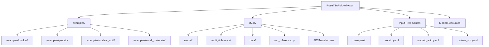

---
slug:3-installation-and-setup
blog_type:normal
---


RoseTTAFold-All-Atom 需要经过一个全面的安装过程，包括环境配置、依赖管理、大型数据库下载以及正确的路径配置。本指南为中级开发者提供了一种系统的方法，用于设置跨蛋白质、核酸、小分子和共价修饰的生物分子结构建模预测环境。


## 安装架构概述

安装过程遵循一个多阶段流水线，旨在建立结构预测的计算基础。理解此架构有助于识别哪些组件之间存在交互，以及配置决策在何处会影响性能。



## 系统要求和先决条件

在开始安装之前，请确保你的系统满足运行 RoseTTAFold-All-Atom 的计算要求。由于生物数据库庞大以及采用 GPU 加速的神经网络架构，系统对内存和存储的需求相当高。

<CgxTip>数据库需求很大（总共约 400GB），且推理过程需要支持 CUDA 的 NVIDIA GPU。在下载数据库之前，请仔细规划存储分配。</CgxTip>

**最低系统要求：**

| Component | Minimum Specification | Recommended Specification |
|-----------|----------------------|---------------------------|
| GPU | 支持 CUDA 11.8 的 NVIDIA GPU | 显存 16GB+ 的 GPU |
| System RAM | 64GB | 128GB+ |
| Storage | 500GB SSD | 1TB+ NVMe SSD |
| Operating System | Linux x86_64 | Ubuntu 22.04 LTS |
| Python | 3.10 | 3.10 (由 conda 管理) |

环境规范文件 ([environment.yaml](environment.yaml#L1-L330)) 配置了 CUDA 11.8、cuDNN 8.8.0 和支持 GPU 的 PyTorch，确保与深度学习框架的要求兼容。

## 环境设置

### 安装 Mamba 包管理器

Mamba 是本项目的首选包管理器，它比标准 conda 提供更快的依赖解析速度。安装需要下载最新的 Miniforge 版本并运行安装程序。

来源：[README.md](README.md#L28-L33)

```bash
wget "https://github.com/conda-forge/miniforge/releases/latest/download/Mambaforge-$(uname)-$(uname -m).sh"
bash Mambaforge-$(uname)-$(uname --machine).sh
rm Mambaforge-$(uname)-$(uname --machine).sh
source ~/.bashrc
```

### 克隆仓库

从 Baker Laboratory 的 GitHub 仓库获取 RoseTTAFold-All-Atom 源代码并进入项目目录。

来源：[README.md](README.md#L35-L37)

```bash
git clone https://github.com/baker-laboratory/RoseTTAFold-All-Atom
cd RoseTTAFold-All-Atom
```

### 创建 Conda 环境

环境规范文件定义了所有必需的依赖项，包括 PyTorch、CUDA 库、生物工具（HHsuite、BLAST）和科学计算包。创建此环境可建立一个可复现的计算环境。

来源：[README.md](README.md#L39-L45), [environment.yaml](environment.yaml#L1-L15)

```bash
mamba env create -f environment.yaml
conda activate RFAA
```

该环境包含关键的依赖项：
- **深度学习**：支持 CUDA 11.8 的 PyTorch，cuDNN 8.8.0
- **生物信息学**：HHsuite 3.3.0，BLAST legacy 2.2.26
- **科学计算**：NumPy, SciPy, Matplotlib
- **分子建模**：DGL (Deep Graph Library)

## SE3Transformer 安装

SE3Transformer 模块为核心 3D 等变神经网络架构，用于处理分子结构中的空间关系。该组件需要在创建环境后通过 pip 单独安装。

来源：[README.md](README.md#L39-L45), [rf2aa/SE3Transformer/requirements.txt](rf2aa/SE3Transformer/requirements.txt#L1-L5), [rf2aa/SE3Transformer/setup.py](rf2aa/SE3Transformer/setup.py#L1-L12)

```bash
cd rf2aa/SE3Transformer/
pip3 install --no-cache-dir -r requirements.txt
python3 setup.py install
cd ../../
```

SE3Transformer 的要求指定了：
- **e3nn==0.3.3**：用于 3D 数据的欧几里得神经网络
- **wandb==0.12.0**：实验跟踪
- **pynvml==11.0.0**：NVIDIA GPU 监控
- **dllogger**：来自 NVIDIA 的深度学习日志记录器

## SignalP6 配置

SignalP6 预测蛋白质序列中的信号肽和跨膜区域。该组件需要授权下载和特定配置，以便集成到 RoseTTAFold 流水线中。

来源：[README.md](README.md#L47-L56)

**安装步骤：**

1. 从官方 DTU 服务下载 SignalP-6.0h
2. 注册安装
3. 重命名蒸馏模型权重以启用集成模式

```bash
signalp6-register signalp-6.0h.fast.tar.gz
mv $CONDA_PREFIX/lib/python3.10/site-packages/signalp/model_weights/distilled_model_signalp6.pt \
   $CONDA_PREFIX/lib/python3.10/site-packages/signalp/model_weights/ensemble_model_signalp6.pt
```

<CgxTip>模型权重重命名步骤至关重要——推理流水线期望使用集成模型的文件名，但 SignalP6 默认提供的文件名是蒸馏模型的名称。</CgxTip>

## 外部工具依赖

安装脚本 ([install_dependencies.sh](install_dependencies.sh#L1-L23)) 会下载 CS-BLAST，这是一个通过上下文特定评分矩阵扩展 BLAST 的序列搜索工具。该工具通过根据序列上下文调整评分矩阵来增强蛋白质序列数据库搜索。

来源：[install_dependencies.sh](install_dependencies.sh#L1-L23)

```bash
bash install_dependencies.sh
```

该脚本会自动检测你的操作系统（Linux 或 macOS）并下载适合特定平台的二进制文件。

## 模型权重下载

预训练模型权重使你无需从头训练网络即可进行推理。这些权重捕获了用于预测各种分子类型的生物分子结构的学习参数。

来源：[README.md](README.md#L58-L60)

```bash
wget http://files.ipd.uw.edu/pub/RF-All-Atom/weights/RFAA_paper_weights.pt
```

将这些权重存储在你的推理配置可以访问的位置。权重文件大小约为 3-4GB，包含完整的神经网络参数。

## 数据库设置

RoseTTAFold-All-Atom 需要多个生物数据库来进行多序列比对 (MSA) 生成和模板识别。这些数据库代表了模型用于推断进化约束的知识库。

来源：[README.md](README.md#L62-L95)

### 数据库要求概述

| Database | Size | Purpose | Format |
|----------|------|---------|--------|
| UniRef30 | 46GB | 序列同源性搜索 | HHSuite 格式 |
| BFD | 272GB | 多样化序列数据库 | MMseqs2 格式 |
| PDB Templates | 81GB | 结构模板 | FFindex/FFdata |
| BLAST Data | 39MB | 旧版 BLAST 矩阵 | ASCII 格式 |

### UniRef30 数据库

UniRef30 数据库提供 30% 一致性下的聚类蛋白质序列，在 MSA 生成的覆盖率和冗余减少之间取得了平衡。

```bash
wget http://wwwuser.gwdg.de/~compbiol/uniclust/2020_06/UniRef30_2020_06_hhsuite.tar.gz
mkdir -p UniRef30_2020_06
tar xfz UniRef30_2020_06_hhsuite.tar.gz -C ./UniRef30_2020_06
```

### BFD 数据库

BFD (Big Fantastic Database) 包含来自宏基因组来源的多样化蛋白质序列，显着扩展了新型或较少研究蛋白质的序列覆盖率。

```bash
wget https://bfd.mmseqs.com/bfd_metaclust_clu_complete_id30_c90_final_seq.sorted_opt.tar.gz
mkdir -p bfd
tar xfz bfd_metaclust_clu_complete_id30_c90_final_seq.sorted_opt.tar.gz -C ./bfd
```

### PDB 模板数据库

来自蛋白质数据库的结构模板提供了来自已知结构的进化约束，使模型能够利用同源结构信息。

```bash
wget https://files.ipd.uw.edu/pub/RoseTTAFold/pdb100_2021Mar03.tar.gz
tar xfz pdb100_2021Mar03.tar.gz
```

### BLAST 旧版工具

BLAST 2.2.26 旧版分发版提供了与现有序列搜索流水线的兼容性。安装需要特定的提取步骤来处理嵌套的目录结构。

来源：[README.md](README.md#L91-L95)

```bash
wget https://ftp.ncbi.nlm.nih.gov/blast/executables/legacy.NOTSUPPORTED/2.2.26/blast-2.2.26-x64-linux.tar.gz
mkdir -p blast-2.2.26
tar -xf blast-2.2.26-x64-linux.tar.gz -C blast-2.2.26
cp -r blast-2.2.26/blast-2.2.26/ blast-2.2.26_bk
rm -r blast-2.2.26
mv blast-2.2.26_bk/ blast-2.2.26
```

## 环境配置

正确的环境变量配置使推理流水线能够定位数据库和资源，而无论你当前的工作目录是什么。

来源：[README.md](README.md#L97-L115)

### 设置环境变量

配置以下环境变量以指向你的数据库安装位置：

```bash
export DB_UR30=`pwd`/UniRef30_2020_06
export DB_BFD=`pwd`/bfd/
export BLASTMAT=`pwd`/blast-2.2.26/data/
```

要进行永久配置，请将这些行添加到你的 `~/.bashrc` 文件中。MSA 生成脚本会引用这些变量，因此它们必须在运行时可用。

### 基础配置文件

基础配置文件 ([rf2aa/config/inference/base.yaml](rf2aa/config/inference/base.yaml#L1-L71)) 定义了推理任务的默认参数。编辑此文件以设置特定于你的安装的路径。

来源：[rf2aa/config/inference/base.yaml](rf2aa/config/inference/base.yaml#L1-L15)

```yaml
database_params:
  sequencedb: "$path_to_databases/pdb100_2021Mar03/pdb100_2021Mar03"
  hhdb: "$path_to_databases/pdb100_2021Mar03/pdb100_2021Mar03"
  command: make_msa.sh
  num_cpus: 4
  mem: 64

checkpoint_path: $path_to_weights/RFAA_paper_weights.pt
```

将 `$path_to_databases` 和 `$path_to_weights` 替换为你的实际绝对路径。配置支持绝对路径和基于环境变量的路径。

## Docker 替代安装

Docker 提供了一种容器化的替代方案，避免了 conda 环境设置和本地依赖管理。这种方法确保了可复现性，并简化了在不同系统上的部署。

来源：[Dockerfile](Dockerfile#L1-L72)

### 构建 Docker 镜像

Dockerfile ([Dockerfile](Dockerfile#L1-L72)) 创建了一个包含 CUDA 11.8、Python 3.11 和所有必需依赖项的极简环境。从仓库根目录构建镜像：

```bash
docker build . -t rosetta-fold-all-atom:latest
```

构建过程：
1. 建立 CUDA 11.8 基础环境
2. 安装系统依赖项
3. 设置 micromamba 作为包管理器
4. 安装 SE3Transformer
5. 下载并配置 BLAST 工具
6. 从 [environment.yaml](environment.yaml#L1-L330) 安装 conda 环境
7. 配置默认数据库路径

### 运行 Docker 推理

通过将数据目录挂载到容器中来执行推理。数据库单独挂载以保持镜像大小可控。

来源：[README.md](README.md#L117-L142), [examples/docker/docker.yaml](examples/docker/docker.yaml#L1-L22)

```bash
docker run --gpus all \
    -v `pwd`:/workdir/ \
    -v $path_to_uniref30:/mnt/databases/rfaa/latest/UniRef30_2020_06/ \
    -v $path_to_bfd:/mnt/databases/rfaa/latest/bfd/ \
    -v $path_to_pdb100_2021Mar03:/pdb100_2021Mar03/ \
    -v $path_to_RFAA_paper_weights.pt:/weights/RFAA_paper_weights.pt \
    rosetta-fold-all-atom:latest \
    python -m rf2aa.run_inference -cd /workdir/ --config-name $config_name
```

**Docker 关键注意事项：**

- 配置文件中的输入路径必须使用 `/workdir/` 前缀表示挂载的工作目录
- 数据库路径使用容器内部的挂载点
- 由于许可限制，Docker 镜像中**未包含** SignalP6
- 需要支持 GPU 的设备，并通过 `--gpus all` 标志访问

### Docker 配置示例

示例配置文件 ([examples/docker/docker.yaml](examples/docker/docker.yaml#L1-L22)) 演示了容器化执行的路径指定：

```yaml
defaults:
  - base

checkpoint_path: /weights/RFAA_paper_weights.pt

database_params:
  sequencedb: "/pdb100_2021Mar03/pdb100_2021Mar03"
  hhdb: "/pdb100_2021Mar03/pdb100_2021Mar03"
  command: make_msa.sh
  num_cpus: 4
  mem: 64

protein_inputs:
  A:
    fasta_file: /workdir/3fap_A.fasta
  B: 
    fasta_file: /workdir/3fap_B.fasta
```

## 项目结构概述

了解目录组织有助于在安装后定位配置文件、输入示例和模型组件。



**关键目录：**

- `rf2aa/`：核心模型实现和推理脚本
- `rf2aa/config/inference/`：不同预测任务的配置文件
- `examples/`：蛋白质、核酸和小分子预测的示例输入文件
- `rf2aa/data/`：数据加载和预处理模块
- `rf2aa/model/`：神经网络架构定义

## 安装验证

使用提供的示例测试你的安装。成功执行即表示环境配置正确。

来源：[README.md](README.md#L143-L152)

```bash
# Test with protein example
cd examples/protein/
python -m rf2aa.run_inference --config-name protein

# Test with Docker (requires database mounts)
cd examples/docker/
docker run --gpus all \
    -v `pwd`:/workdir/ \
    -v $path_to_databases:/mnt/databases/rfaa/latest/ \
    -v $path_to_pdb100:/pdb100_2021Mar03/ \
    -v $path_to_weights:/weights/ \
    rosetta-fold-all-atom:latest \
    python -m rf2aa.run_inference -cd /workdir/ --config-name docker
```

## 后续步骤

安装完成后，你可以继续详细了解如何使用 Docker 运行推理，请参阅 [Running Inference with Docker](4-running-inference-with-docker)。如需了解如何配置不同的预测场景，请探索 [Hydra Configuration Management](6-hydra-configuration-management) 中的 Hydra 配置管理系统。如果你已准备好开始进行预测，请从 [Protein Structure Prediction](9-protein-structure-prediction) 开始，它演示了最简单的用例。