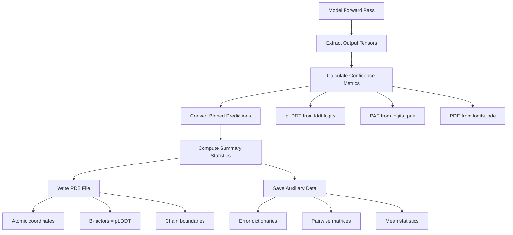

---
slug:5-understanding-model-outputs
blog_type:normal
---


RoseTTAFold-All-Atom 生成全面的预测输出，包括原子坐标、置信度指标和辅助数据文件。本文档解释了完整的输出结构，使你能够评估预测质量并将结果整合到你的下游工作流中。

## 输出文件概览

模型在推理完成后生成两个主要输出文件：一个是包含原子坐标和置信度信息的 PDB 格式结构文件，另一个是存储详细指标的 PyTorch 辅助文件。这些文件由 ModelRunner 类中的 `write_outputs` 方法写入，该方法处理模型的输出张量并将它们保存到你指定的输出目录中。

来源：[rf2aa/run_inference.py](rf2aa/run_inference.py#L130-L148)

### 生成的输出文件

| 文件扩展名 | 描述 | 内容 |
|----------------|-------------|----------|
| `.pdb` | Protein Data Bank 格式 | 3D 原子坐标、B-factors (pLDDT)、链信息 |
| `_aux.pt` | PyTorch 序列化数据 | 置信度指标、成对误差矩阵、序列数据 |

输出文件名由推理配置中的 `job_name` 参数控制，辅助文件会自动添加 `_aux.pt` 后缀。

来源：[rf2aa/run_inference.py](rf2aa/run_inference.py#L138-L144)

## 模型输出张量结构

RoseTTAFoldModule 的前向传播返回一个包含 12 个组件的全面元组，捕获所有预测信息。该结构被解包并处理以生成最终的输出文件。

来源：[rf2aa/model/RoseTTAFoldModel.py](rf2aa/model/RoseTTAFoldModel.py#L408-L419)

### 输出张量组件

| 组件 | 形状 | 描述 | 用途 |
|-----------|-------|-------------|-------|
| `logits` | (B, N_bins, L, L) | 距离/方向预测 | 用于内部置信度计算 |
| `logits_aa` | (B, N_aa, L) | 氨基酸类型预测 | 用于序列恢复分析 |
| `logits_pae` | (B, N_bins, L, L) | 预测对齐误差 logits | 转换为 PAE 矩阵 |
| `logits_pde` | (B, N_bins, L, L) | 预测距离误差 logits | 转换为 PDE 矩阵 |
| `p_bind` | (B, 1) | 结合概率分数 | 指示复合物形成的置信度 |
| `xyz` | (B, N_cycle, L, 27, 3) | 回收的骨架坐标 | 预测在周期中的演变 |
| `alpha_s` | (B, N_cycle, L, 2) | 侧链取向角度 | 内部坐标系 |
| `xyz_allatom` | (B, N_cycle, L, N_total, 3) | 全原子坐标 | 包含侧链的完整结构 |
| `lddt` | (B, N_bin, L, 1) | 每残基 lDDT 预测 | 转换为 pLDDT 置信度分数 |
| `msa` | (B, N_seq, L, d_msa) | MSA 潜在表示 | 内部嵌入（不保存） |
| `pair` | (B, L, L, d_pair) | 成对表示 | 内部嵌入（不保存） |
| `state` | (B, L, d_single) | 单残基状态 | 内部嵌入（不保存） |

来源：[rf2aa/model/RoseTTAFoldModel.py](rf2aa/model/RoseTTAFoldModel.py#L408-L419)

## 输出生成流水线

模型输出处理遵循结构化的流水线，将原始网络输出转换为可解释的文件。`ModelRunner.infer` 方法通过加载模型、构建特征、通过回收迭代运行前向传播以及写入输出来协调此过程。



来源：[rf2aa/run_inference.py](rf2aa/run_inference.py#L151-L157), [rf2aa/run_inference.py](rf2aa/run_inference.py#L115-L129)

## 置信度指标

RoseTTAFold-All-Atom 提供多种置信度指标，帮助从不同层面（每残基、成对和整体结构质量）评估预测质量。

来源：[rf2aa/run_inference.py](rf2aa/run_inference.py#L181-L201)

### 每残基置信度 (pLDDT)

预测局部距离差异测试 (pLDDT) 分数提供每残基的置信度估计，范围为 0 到 100。较高的值表示对局部结构准确性的信心更大。模型输出分箱预测，使用加权平均将其转换为连续值。

**转换过程：**
- 输入：形状为 (B, N_bins, L, 1) 的 `pred_lddt`
- 分箱步长：1.0 / N_bins（默认 bins = 50）
- 在分箱上应用 softmax 并计算加权和

来源：[rf2aa/run_inference.py](rf2aa/run_inference.py#L158-L162)

### 预测对齐误差 (PAE)

PAE 矩阵提供所有残基对之间的成对距离误差预测，指示最佳对齐后的预期偏差。该指标对于评估结构域取向和界面质量特别有价值。

**转换过程：**
- 输入：形状为 (B, N_bins, L, L) 的 `logits_pae`
- 分箱步长：0.5 Å
- 分箱范围从 0.25 Å 到 (N_bins × 0.5 - 0.25) Å
- 输出形状：(B, L, L)

来源：[rf2aa/run_inference.py](rf2aa/run_inference.py#L167-L171)

### 预测距离误差 (PDE)

PDE 使用针对较短范围优化的不同分箱方案提供补充距离误差信息，为局部几何准确性提供额外的见解。

**转换过程：**
- 输入：形状为 (B, N_bins, L, L) 的 `logits_pde`
- 分箱步长：0.3 Å
- 对称化：在预测前使用 `pair + pair.permute(0,2,1,3)` 应用
- 输出形状：(B, L, L)

来源：[rf2aa/run_inference.py](rf2aa/run_inference.py#L174-L178), [rf2aa/model/RoseTTAFoldModel.py](rf2aa/model/RoseTTAFoldModel.py#L405)

### 汇总统计

`calc_pred_err` 方法将置信度指标汇总为可解释的汇总统计，使用序列类型识别自动检测蛋白质与小分子区域。

来源：[rf2aa/run_inference.py](rf2aa/run_inference.py#L181-L201)

| 指标 | 描述 | 计算 |
|--------|-------------|-------------|
| `mean_plddt` | 全局结构置信度 | 所有 pLDDT 分数的平均值 |
| `mean_pae` | 平均预测对齐误差 | 所有残基对的平均值 |
| `pae_prot` | 蛋白质-蛋白质 PAE | 仅屏蔽蛋白质-蛋白质对 |
| `pae_inter` | 界面 PAE | 仅蛋白质-小分子对 |

**掩码生成：**
```python
sm_mask = is_atom(seq)[0]  # 识别小分子残基
sm_mask_2d = sm_mask[None,:] * sm_mask[:,None]
prot_mask_2d = (~sm_mask[None,:]) * (~sm_mask[:,None])
inter_mask_2d = sm_mask[None,:] * (~sm_mask[:,None]) + (~sm_mask[None,:]) * sm_mask[:,None]
```

来源：[rf2aa/run_inference.py](rf2aa/run_inference.py#L189-L196)

## PDB 文件输出

主要结构输出以标准 PDB 格式写入，能够在 PyMOL、ChimeraX 或 UCSF Chimera 等分子查看器中直接可视化。`writepdb` 函数（在 util.py 中定义）处理内部坐标到 PDB 格式的转换。

来源：[rf2aa/util.py](rf2aa/util.py#L800-L900)

### PDB 文件特性

| 特性 | 实现 | 目的 |
|---------|----------------|---------|
| 原子坐标 | `xyz_allatom[-1]` | 最终周期坐标 |
| B-factors | `plddts` 值 | 每残基置信度显示 |
| 链信息 | 来自 `same_chain` 的 `chain_Ls` | 正确的链分割 |
| ATOM/HETATM | 基于残基类型 | 标准 PDB 记录类型 |
| 键信息 | `bond_feats` | 用于可视化的连接性 |

**关键实现细节：**
- 只有最终的回收迭代 (`xyz_allatom[-1]`) 会写入 PDB 文件
- B-factors 编码 pLDDT 分数，用于颜色编码的置信度可视化
- 链长度使用 `Ls_from_same_chain_2d` 从 `same_chain` 矩阵中提取
- 小分子原子被正确标记为 HETATM 记录

来源：[rf2aa/run_inference.py](rf2aa/run_inference.py#L136-L142), [rf2aa/util.py](rf2aa/util.py#L800-L900)

### 链边界检测

`Ls_from_same_chain_2d` 函数分析二进制 `same_chain` 矩阵以确定各个链的长度，确保在输出 PDB 文件中正确分配链 ID。

来源：[rf2aa/util.py](rf2aa/util.py#L879-L887)

```python
def Ls_from_same_chain_2d(same_chain):
    """给定指示两个残基是否在同一链上的二进制矩阵，返回链长度列表"""
    Ls = []
    i_curr = 0
    while i_curr < len(same_chain):
        idx = torch.where(same_chain[i_curr])[0]
        Ls.append(int(idx[-1]-idx[0]+1))
        i_curr = idx[-1]+1
    return Ls
```

## 辅助数据文件

辅助文件 (`_aux.pt`) 包含 PDB 格式中无法容纳的全面预测元数据。这个 PyTorch 序列化字典支持详细分析和自定义下游处理。

来源：[rf2aa/run_inference.py](rf2aa/run_inference.py#L143-L144)

### 辅助文件内容

| 键 | 数据类型 | 形状 | 描述 |
|-----|-----------|-------|-------------|
| `plddts` | Tensor | (L,) | 每残基 pLDDT 置信度分数 |
| `pae` | Tensor | (L, L) | 预测对齐误差矩阵 |
| `pde` | Tensor | (L, L) | 预测距离误差矩阵 |
| `mean_plddt` | Float | 标量 | 全局平均置信度 |
| `mean_pae` | Float | 标量 | 平均成对对齐误差 |
| `pae_prot` | Float | 标量 | 蛋白质-蛋白质界面 PAE |
| `pae_inter` | Float | 标量 | 蛋白质-配体界面 PAE |
| `same_chain` | Tensor | (L, L) | 链边界信息 |

**使用示例：**
```python
import torch
aux_data = torch.load("output_job_aux.pt")
print(f"Mean pLDDT: {aux_data['mean_plddt']:.2f}")
print(f"Interface PAE: {aux_data['pae_inter']:.2f}")
```

来源：[rf2aa/run_inference.py](rf2aa/run_inference.py#L196-L201)

## 回收信息

模型采用迭代回收机制，在多个周期中细化预测。输出张量 `xyz` 包含每个回收迭代的坐标，但只有最终迭代会写入 PDB 文件。

来源：[rf2aa/training/recycling.py](rf2aa/training/recycling.py#L10-L28)

**回收过程：**
- 默认周期：由 loader 配置中的 `MAXCYCLE` 控制
- 每个周期使用前一周期的输出细化预测
- 早期周期（中间）返回没有完整侧链细节的原始坐标
- 最终周期产生完整的全原子坐标

来源：[rf2aa/training/recycling.py](rf2aa/run_inference.py#L115-L129)

## 输出配置

输出行为通过推理配置系统控制。影响输出的关键参数包括：

| 参数 | 位置 | 默认值 | 效果 |
|-----------|----------|---------|--------|
| `output_path` | config | 当前目录 | 输出文件的写入位置 |
| `job_name` | config | 推断 | 输出文件的基本名称 |
| `MAXCYCLE` | loader_params | 3 | 回收迭代次数 |

来源：[rf2aa/config/inference/base.yaml](rf2aa/config/inference/base.yaml)

## 解释输出质量

理解置信度指标使你能够评估预测可靠性并识别需要审查的区域。

来源：[rf2aa/run_inference.py](rf2aa/run_inference.py#L181-L201)

### 质量指南

| pLDDT 范围 | 解释 | 推荐用途 |
|-------------|----------------|----------------|
| 90-100 | 非常高置信度 | 完全信任结构 |
| 70-90 | 良好置信度 | 通常可靠 |
| 50-70 | 低置信度 | 谨慎使用 |
| 0-50 | 极低置信度 | 视为不可靠 |

**PAE 解释：**
- 低 PAE 值 (< 2-3 Å)：高位置准确性
- 高 PAE 值 (> 10 Å)：相对位置不确定
- 结构域级别分析：检查 PAE 模式以识别刚性结构域

### 界面分析

对于蛋白质-配体复合物，`pae_inter` 指标专门评估界面质量。低界面 PAE 值表明对结合姿势预测有信心。

来源：[rf2aa/run_inference.py](rf2aa/run_inference.py#L196-L201)

## 后续步骤

- 探索详细的配置管理：[Hydra 配置管理](6-hydra-configuration-management)
- 了解推理工作流：[ModelRunner 工作流](22-modelrunner-workflow)
- 了解置信度计算：[置信度指标计算](24-confidence-metrics-calculation)
- 查看输出结构生成：[结构输出生成](25-structure-output-generation)