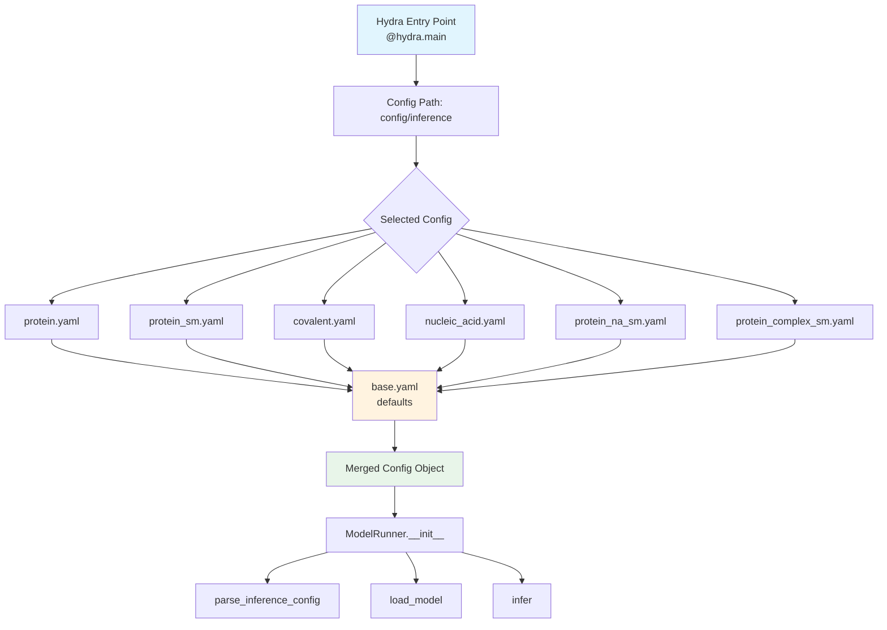

---
slug:6-hydra-configuration-management
blog_type:normal
---


本页解释了 RoseTTAFold-All-Atom 如何使用 Hydra 在不同预测场景中实现灵活的分层配置管理。Hydra 使得在仅蛋白质、蛋白质-配体和蛋白质-核酸复合物预测之间轻松切换，同时保持单一且可维护的代码库。

## 架构概述

配置系统围绕 Hydra 基于装饰器的入口点和 YAML 继承层次结构构建。[`run_inference.py`](rf2aa/run_inference.py#L203-L209) 中的主入口点使用 `@hydra.main` 装饰器从 `config/inference` 目录加载配置，然后将其传递给 `ModelRunner` 类进行执行。



## 配置层次结构与继承

所有推理配置都继承自 [`base.yaml`](rf2aa/config/inference/base.yaml#L1-L71)，该文件包含模型架构、数据加载和化学处理的基础参数。专用配置通过 Hydra 的 defaults 机制继承其余默认参数，同时覆盖特定部分。

### 基础配置结构

[`base.yaml`](rf2aa/config/inference/base.yaml) 文件定义了五个主要参数组：

| 参数组 | 用途 | 关键参数 |
|-----------------|---------|----------------|
| **Job Parameters** | 任务识别和输出 | `job_name`, `output_path`, `checkpoint_path` |
| **Database Params** | MSA 生成数据库设置 | `hhdb`, `sequencedb`, `num_cpus`, `mem`, `command` |
| **Input Definitions** | 生物分子输入规范 | `protein_inputs`, `na_inputs`, `sm_inputs`, `covale_inputs` |
| **Chem Params** | 化学处理行为 | `use_phospate_frames_for_NA`, `use_cif_ordering_for_trp` |
| **Loader Params** | 数据加载和模型约束 | `MAXSEQ`, `MAXLAT`, `MAXCYCLE`, `seqid` |
| **Model Params** | 神经网络架构 | `n_extra_block`, `d_msa`, `d_pair`, SE3 parameters |

### 专用配置文件

系统为不同的预测场景提供了七个预配置的文件：

| 配置文件 | 使用场景 | 输入类型 |
|-------------|----------|-------------|
| [`protein.yaml`](rf2aa/config/inference/protein.yaml) | 单蛋白质结构预测 | 蛋白质 |
| [`protein_sm.yaml`](rf2aa/config/inference/protein_sm.yaml) | 含小分子的蛋白质 | 蛋白质 + 小分子 |
| [`covalent.yaml`](rf2aa/config/inference/covalent.yaml) | 共价键复合物 | 蛋白质 + 小分子（共价） |
| [`nucleic_acid.yaml`](rf2aa/config/inference/nucleic_acid.yaml) | 蛋白质-核酸复合物 | 蛋白质 + 核酸 |
| [`protein_na_sm.yaml`](rf2aa/config/inference/protein_na_sm.yaml) | 蛋白质-核酸-小分子 | 蛋白质 + 核酸 + 小分子 |
| [`protein_complex_sm.yaml`](rf2aa/config/inference/protein_complex_sm.yaml) | 含配体的多蛋白质 | 多蛋白质 + 小分子 |

每个专用配置使用 `defaults: - base` 语法从基础配置继承所有参数，然后仅覆盖其特定用例的相关部分。例如，[`covalent.yaml`](rf2aa/config/inference/covalent.yaml#L4-L18) 添加了带有共价键规范的 `covale_inputs` 并将 `MAXCYCLE` 增加到 10 以收敛，而 [`nucleic_acid.yaml`](rf2aa/config/inference/nucleic_acid.yaml#L6-L14) 添加了带有 DNA 链定义的 `na_inputs`。

<CgxTip>
配置系统使用基于链的组织结构：每个生物分子组件（蛋白质、核酸、小分子）都分配了一个单字母链标识符（A、B、C、D 等）。这使得复杂的多组件预测可以通过在同一配置文件中的不同链键下简单地指定不同的输入类型来实现。
</CgxTip>

## 输入规范模式

配置使用嵌套字典定义输入，其中顶层键代表链标识符。每条链可以指定不同的输入类型和格式：

### 蛋白质输入规范
蛋白质链需要 FASTA 文件路径：
```yaml
protein_inputs: 
  A:
    fasta_file: examples/protein/7u7w_A.fasta
```
来源：[protein.yaml](rf2aa/config/inference/protein.yaml#L5-L7)

### 核酸输入规范
核酸链需要 FASTA 文件和分子类型：
```yaml
na_inputs: 
  B: 
    fasta: examples/nucleic_acid/7u7w_B.fasta
    input_type: "dna"
```
来源：[nucleic_acid.yaml](rf2aa/config/inference/nucleic_acid.yaml#L8-L11)

### 小分子输入规范
小分子支持 SMILES 和 SDF 格式：
```yaml
sm_inputs:
  C:
    input: examples/small_molecule/NSW_ideal.sdf
    input_type: "sdf"
```
来源：[protein_sm.yaml](rf2aa/config/inference/protein_sm.yaml#L9-L12)

### 共价键规范
共价键使用描述键合原子的元组格式指定：
```yaml
covale_inputs: "[((\"A\", \"74\", \"ND2\"), (\"B\", \"1\"), (\"CW\", \"null\"))]"
```
这定义了链 A 上残基 74 的 ND2 原子与链 B 上原子 1 之间的共价键，键类型为 CW。
来源：[covalent.yaml](rf2aa/config/inference/covalent.yaml#L13-L14)

## ModelRunner 中的配置使用

`ModelRunner` 类接收合并后的配置对象，并在整个推理过程中使用它：

1. **初始化** ([`__init__`](rf2aa/run_inference.py#L23-L31))：存储配置对象，用于初始化化学数据、设置数据库连接和配置设备设置。

2. **输入解析** ([`parse_inference_config`](rf2aa/run_inference.py#L34-L94))：该方法遍历 `protein_inputs`、`na_inputs` 和 `sm_inputs`，根据指定的链标识符和文件路径加载和处理每种输入类型。

3. **模型加载** ([`load_model`](rf2aa/run_inference.py#L96-L110))：使用 `config.legacy_model_param` 实例化具有正确架构参数的 `RoseTTAFoldModule`，包括网络维度和 SE3 transformer 设置。

<CgxTip>
配置对象在 ModelRunner 中作为 `self.config` 访问，使得在初始化、输入解析、模型加载和推理执行过程中参数访问一致。这种设计模式确保所有管道阶段使用相同的参数，而无需显式传递参数。
</CgxTip>

## Docker 特定配置

对于容器化环境，[`docker.yaml`](examples/docker/docker.yaml) 演示了挂载卷的路径重映射和 Docker 特定的数据库位置：

```yaml
defaults:
  - base
checkpoint_path: /weights/RFAA_paper_weights.pt
database_params:
  sequencedb: "/pdb100_2021Mar03/pdb100_2021Mar03"
  hhdb: "/pdb100_2021Mar03/pdb100_2021Mar03"
```

此模式展示了如何针对不同的部署环境扩展基础配置，同时保持参数一致性。
来源：[docker.yaml](examples/docker/docker.yaml#L1-L22)

## 使用 Hydra 配置运行

要使用特定配置运行推理，请使用以下命令：

```bash
python rf2aa/run_inference.py --config-name <config_file>
```

例如：
- `python rf2aa/run_inference.py --config-name protein` 用于单蛋白质预测
- `python rf2aa/run_inference.py --config-name protein_sm` 用于蛋白质-配体预测
- `python rf2aa/run_inference.py --config-name covalent` 用于共价键复合物

Hydra 将自动把指定配置与 base.yaml 合并，覆盖参数，并将完整的配置对象传递给 ModelRunner。
来源：[run_inference.py](rf2aa/run_inference.py#L203-L209)

## 下一步

了解 Hydra 配置系统为自定义推理运行奠定了基础。要深入了解特定参数及其效果，请继续阅读 [基础配置参数](7-base-configuration-parameters)。要为你的预测任务创建配置，请参阅 [自定义推理配置](8-custom-inference-configs)。