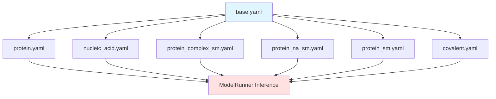
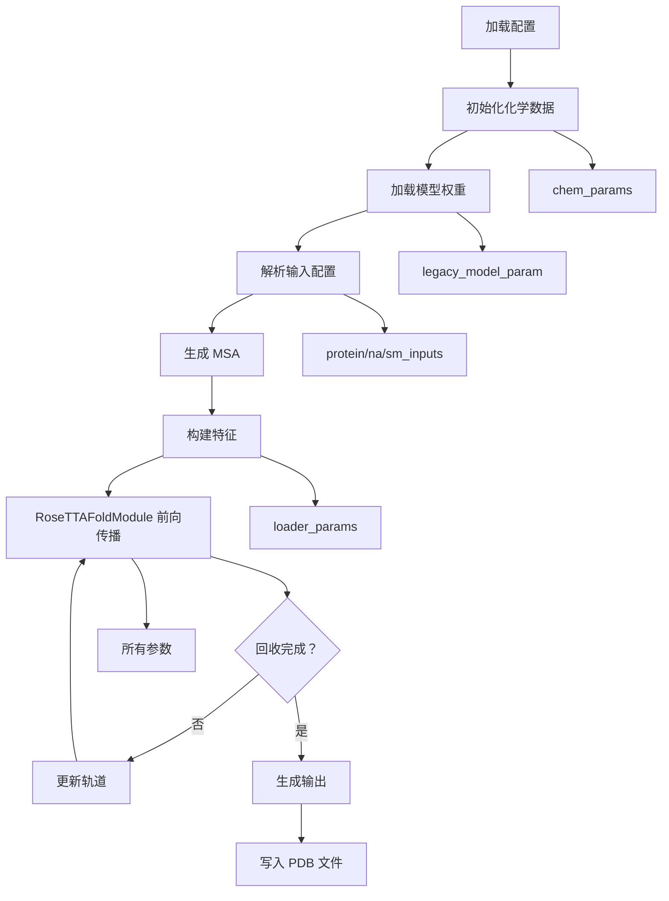

---
slug:7-base-configuration-parameters
blog_type:normal
---

RoseTTAFold-All-Atom 中的基础配置系统是所有推理操作的基础蓝图，它确立了控制模型行为、数据处理和计算资源分配的核心参数。这种集中化的配置管理方式确保了在多样化的预测任务——包括蛋白质结构、蛋白质-核酸复合物以及蛋白质-小分子复合物——中参数处理的一致性，同时允许特定配置继承并扩展这些基准设置。

## 配置架构

配置系统基于围绕 Hydra 组合框架构建的分层继承模型运行。基础是 `base.yaml`，它定义了适用于所有推理场景的通用参数。专用配置（`protein.yaml`、`nucleic_acid.yaml`、`protein_complex_sm.yaml` 等）选择性地继承并覆盖特定参数，以使系统适应特定的生物分子预测任务。

这种设计模式在确保参数一致性的同时，实现了无需代码重复的任务特定定制。基础配置提供了适用于大多数场景的合理默认值，而专用配置可以引入特定于输入的参数或为特定用例修改计算设置。

来源：[base.yaml](rf2aa/config/inference/base.yaml#L1-L71), [protein.yaml](rf2aa/config/inference/protein.yaml#L1-L8)

## 核心参数组

### 任务和输出参数

任务管理参数控制推理运行的标识和输出行为：

| 参数 | 类型 | 默认值 | 描述 |
|-----------|------|---------|-------------|
| `job_name` | string | "structure_prediction" | 推理任务的标识符，用于输出文件命名 |
| `output_path` | string | "" | 输出文件写入的目录路径 |

这些参数通常在专用配置中被覆盖，以提供特定于预测任务的描述性任务名称（例如 "7u7w_protein" 或 "3fap"）。

来源：[base.yaml](rf2aa/config/inference/base.yaml#L1-L3)

### 数据库参数

数据库配置控制系统如何访问和利用生物数据库进行 MSA（多序列比对）生成和模板检索：

| 参数 | 类型 | 默认值 | 描述 |
|-----------|------|---------|-------------|
| `database_params.sequencedb` | string | "" | 用于生成 MSA 的序列数据库路径 |
| `database_params.hhdb` | string | "pdb100_2021Mar03/pdb100_2021Mar03" | 用于模板搜索的 HH-suite 数据库标识符 |
| `database_params.command` | string | "make_msa.sh" | 生成 MSA 的脚本/命令 |
| `database_params.num_cpus` | integer | 4 | 分配给数据库操作的 CPU 线程数 |
| `database_params.mem` | integer | 64 | 数据库进程的内存分配（GB） |

系统通过 `make_msa.sh` 脚本使用 HHblits/HHsearch 生成对准确结构预测至关重要的进化信息。`num_cpus` 和 `mem` 参数直接影响 MSA 生成的并行化和吞吐量，这通常是流程中的计算瓶颈。

来源：[base.yaml](rf2aa/config/inference/base.yaml#L4-L10), [run_inference.py](rf2aa/run_inference.py#L23-L30)

### 输入类型参数

基础配置定义了所有支持的输入类型的占位符，初始化为 `null`：

| 参数 | 类型 | 默认值 | 描述 |
|-----------|------|---------|-------------|
| `protein_inputs` | object | null | 蛋白质链输入的配置 |
| `na_inputs` | object | null | 核酸输入的配置 |
| `sm_inputs` | object | null | 小分子输入的配置 |
| `covale_inputs` | object | null | 共价键输入的配置 |
| `residue_replacement` | object | null | 修饰残基处理的配置 |

这些参数在专用配置中被填充。例如，`protein_complex_sm.yaml` 通过 FASTA 文件定义蛋白质链 A 和 B，以及通过 SDF 文件指定的小分子 C。`ModelRunner.parse_inference_config()` 方法系统地处理这些输入，为蛋白质链生成 MSA 并根据其输入类型（SDF 或 SMILES）解析小分子结构。

来源：[base.yaml](rf2aa/config/inference/base.yaml#L11-L15), [protein_complex_sm.yaml](rf2aa/config/inference/protein_complex_sm.yaml#L1-L14), [run_inference.py](rf2aa/run_inference.py#L34-L94)

### 化学参数

化学参数控制原子级特征的计算和表示方式：

| 参数 | 类型 | 默认值 | 描述 |
|-----------|------|---------|-------------|
| `chem_params.use_phospate_frames_for_NA` | boolean | True | 对核酸使用磷酸骨架框架 |
| `chem_params.use_cif_ordering_for_trp` | boolean | True | 对色氨酸使用 CIF 标准原子排序 |

这些参数影响全局 `ChemData` 单例的初始化，该单例存储原子坐标框架、Lennard-Jones 参数和化学键信息。磷酸框架选项影响核酸骨架几何结构的表示方式，而 CIF 排序确保与标准蛋白质结构格式的兼容性。

来源：[base.yaml](rf2aa/config/inference/base.yaml#L16-L18), [chemical.py](rf2aa/chemical.py#L59-L100)

## 加载器参数

加载器参数定义了模型推理之前数据准备的约束和处理规则：

| 参数 | 类型 | 默认值 | 描述 |
|-----------|------|---------|-------------|
| `loader_params.n_templ` | integer | 4 | 用于结构预测的模板数量 |
| `loader_params.MAXLAT` | integer | 128 | MSA 潜在轨道的最大序列长度 |
| `loader_params.MAXSEQ` | integer | 1024 | MSA 中的最大序列数 |
| `loader_params.MAXCYCLE` | integer | 4 | 推理期间的回收迭代次数 |
| `loader_params.BLACK_HOLE_INIT` | boolean | False | 对坐标使用黑洞初始化 |
| `loader_params.seqid` | float | 150.0 | MSA 聚类的序列同一性阈值 |

<CgxTip>序列长度约束（`MAXLAT`、`MAXSEQ`）是关键的计算参数——超出这些限制将在前向传播期间导致张量维度不匹配。在处理大型蛋白质或复合物时，请谨慎调整这些值。</CgxTip>

回收参数（`MAXCYCLE`）确定模型迭代优化其预测的次数。每个回收周期都会提高准确性，但会线性增加推理时间。黑洞初始化在启用时，将坐标初始化为奇点而不是理想化的模板，这有助于模型在训练场景中从头学习。

来源：[base.yaml](rf2aa/config/inference/base.yaml#L19-L25), [data_loader.py](rf2aa/data/data_loader.py#L107-L117)

## 遗留模型参数

遗留模型参数部分构成了 RoseTTAFoldModule 的核心架构规范，定义了处理 MSA、成对和 3D 坐标信息的三轨神经网络架构。

### 模块结构参数

模型组织为三种类型的 transformer 模块：

| 参数 | 类型 | 默认值 | 描述 |
|-----------|------|---------|-------------|
| `legacy_model_param.n_extra_block` | integer | 4 | 额外处理模块的数量 |
| `legacy_model_param.n_main_block` | integer | 32 | 主 transformer 模块的数量 |
| `legacy_model_param.n_ref_block` | integer | 4 | 精炼模块的数量 |
| `legacy_model_param.n_finetune_block` | integer | 0 | 微调模块的数量 |

主模块在三轨之间执行核心转换操作，而精炼模块在回收迭代期间改进预测。参数值（32 个主模块和 4 个精炼模块）代表了已发布模型中使用的架构配置。

来源：[base.yaml](rf2aa/config/inference/base.yaml#L26-L30), [RoseTTAFoldModel.py](rf2aa/model/RoseTTAFoldModel.py#L38-L41)

### 轨道维度参数

三轨架构中的每个轨道都保持自己的维度：

| 参数 | 类型 | 默认值 | 描述 |
|-----------|------|---------|-------------|
| `legacy_model_param.d_msa` | integer | 256 | MSA 潜在轨道的维度 |
| `legacy_model_param.d_msa_full` | integer | 64 | 完整 MSA 轨道的维度 |
| `legacy_model_param.d_pair` | integer | 192 | 成对轨道的维度 |
| `legacy_model_param.d_templ` | integer | 64 | 模板轨道的维度 |

MSA 潜在轨道（256 维）捕获压缩的进化信息，而成对轨道（192 维）表示残基-残基关系。模板轨道（64 维）整合来自同源结构的结构信息。

来源：[base.yaml](rf2aa/config/inference/base.yaml#L31-L34)

### 注意力机制参数

注意力头控制 transformer 模块内的并行处理：

| 参数 | 类型 | 默认值 | 描述 |
|-----------|------|---------|-------------|
| `legacy_model_param.n_head_msa` | integer | 8 | MSA 轨道的注意力头数 |
| `legacy_model_param.n_head_pair` | integer | 6 | 成对轨道的注意力头数 |
| `legacy_model_param.n_head_templ` | integer | 4 | 模板轨道的注意力头数 |
| `legacy_model_param.d_hidden_templ` | integer | 64 | 模板 MLP 的隐藏维度 |

多头注意力机制使模型能够同时捕获不同类型的关系。头数（MSA 为 8，成对为 6，模板为 4）在计算成本和表示能力之间取得了平衡。

来源：[base.yaml](rf2aa/config/inference/base.yaml#L35-L38)

### 物理模型参数

这些参数控制物理约束与模型的集成：

| 参数 | 类型 | 默认值 | 描述 |
|-----------|------|---------|-------------|
| `legacy_model_param.p_drop` | float | 0.0 | Dropout 概率（0.0 = 推理时不使用 dropout） |
| `legacy_model_param.use_chiral_l1` | boolean | True | 在 L1 正则化中使用手性损失 |
| `legacy_model_param.use_lj_l1` | boolean | True | 在 L1 损失中使用 Lennard-Jones 势 |
| `legacy_model_param.use_atom_frames` | boolean | True | 使用原子坐标框架 |
| `legacy_model_param.lj_lin` | float | 0.75 | Lennard-Jones 势的线性系数 |
| `legacy_model_param.recycling_type` | string | "all" | 回收策略（"all"、"msa_pair" 等） |
| `legacy_model_param.use_same_chain` | boolean | True | 启用同链邻接特征 |

<CgxTip>在推理期间，通常会禁用 dropout（`p_drop=0.0`）以最大化预测一致性。物理模型参数（手性、Lennard-Jones）确保预测结构满足基本的化学约束，从而减少对大量后处理精炼的需求。</CgxTip>

回收类型确定在每个回收迭代期间更新哪些轨道。"all" 策略更新所有三个轨道（MSA、成对和 3D 坐标），以增加计算为代价提供最全面的精炼。

来源：[base.yaml](rf2aa/config/inference/base.yaml#L39-L47), [RoseTTAFoldModel.py](rf2aa/model/RoseTTAFoldModel.py#L64-L68)

### SE(3) Transformer 参数

SE(3)（3D 特殊欧几里得群）Transformer 能够对 3D 坐标进行旋转等变处理：

| 参数 | 主轨道 | 精炼轨道 | 描述 |
|-----------|------------|------------------|-------------|
| `num_layers` | 1 | 2 | SE(3) transformer 层数 |
| `num_channels` | 32 | 32 | SE(3) 层中的通道数 |
| `num_degrees` | 2 | 2 | 最大球谐度数 |
| `l0_in_features` | 64 | 64 | 0 度（标量）的输入特征 |
| `l0_out_features` | 64 | 64 | 0 度（标量）的输出特征 |
| `l1_in_features` | 3 | 3 | 1 度（向量）的输入特征 |
| `l1_out_features` | 2 | 2 | 1 度（向量）的输出特征 |
| `num_edge_features` | 64 | 64 | 成对边的特征 |
| `n_heads` | 4 | 4 | 注意力头数 |
| `div` | 4 | 4 | 维度计算的除法因子 |

SE(3) transformer 处理 3D 坐标，同时保持旋转和平移等变性——这对准确的结构预测至关重要。精炼轨道使用更多层（2 层对 1 层）以提高回收迭代期间的坐标精度。

来源：[base.yaml](rf2aa/config/inference/base.yaml#L48-L71), [RoseTTAFoldModel.py](rf2aa/model/RoseTTAFoldModel.py#L55-L56)

## 配置使用流程

基础配置参数按定义的顺序流经推理流程：

`run_inference.py` 中的 `ModelRunner` 类编排此流程。在初始化期间，化学参数初始化 `ChemData` 单例。模型参数配置 `RoseTTAFoldModule` 架构。输入参数定义要处理的生物分子组分，而加载器参数约束特征构建过程。

来源：[run_inference.py](rf2aa/run_inference.py#L21-L30), [run_inference.py](rf2aa/run_inference.py#L96-L114)

## 参数依赖关系和交互

多个参数组表现出重要的依赖关系，在修改配置时必须理解这些关系：

1. **内存与模型大小**：较大的模块计数（`n_main_block`、`n_ref_block`）和轨道维度（`d_msa`、`d_pair`）会成比例地增加内存消耗。在扩展模型容量时，请确保有足够的 GPU 内存可用。

2. **速度与准确性**：`MAXCYCLE` 参数直接权衡推理速度和预测准确性。更多的回收迭代会提高结构质量，但会线性增加运行时间。

3. **硬件分配**：`num_cpus` 参数影响 MSA 生成速度，但不影响模型推理（后者受 GPU 限制）。根据 `database_params.command` 脚本的并行化能力优化 CPU 分配。

4. **序列长度限制**：超出 `MAXLAT` 或 `MAXSEQ` 会导致立即的张量维度错误。对于大型蛋白质，请考虑分段输入或在有足够内存分配的情况下增加这些限制。

5. **物理约束**：`use_chiral_l1` 和 `use_lj_l1` 参数在训练期间影响损失景观，但在推理期间主要影响初始化和特征处理。

来源：[data_loader.py](rf2aa/data/data_loader.py#L107-L117), [setup_model.py](rf2aa/setup_model.py#L64-L79)

## 后续步骤

既然你已了解基础配置参数，就可以探索如何针对特定预测任务自定义这些参数。继续阅读 [自定义推理配置](8-custom-inference-configs)，查看专用配置如何扩展仅蛋白质预测、蛋白质-核酸复合物和蛋白质-小分子复合物的基础参数。如需深入了解 Hydra 如何管理此配置组合，请参阅 [Hydra 配置管理](6-hydra-configuration-management)。