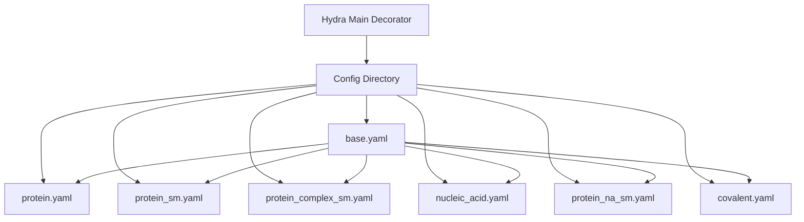

---
slug:8-custom-inference-configs
blog_type:normal
---


RoseTTAFold All-Atom 中的自定义推理配置利用 Hydra 的配置管理系统创建灵活、可维护的预测设置。本页介绍配置架构，演示如何为不同的预测场景创建专用配置，并涵盖运行时自定义选项。

来源：[rf2aa/run_inference.py](rf2aa/run_inference.py#L206-L210), [README.md](README.md#L119-L150)

## 配置系统架构

配置系统遵循分层继承模型，其中专用配置扩展了包含默认模型参数的基础配置。入口点 `rf2aa/run_inference.py` 使用指向 `config/inference` 作为配置目录的 `@hydra.main` 装饰器，允许你通过 `--config-name` 参数指定任何配置文件。



当你运行 `python -m rf2aa.run_inference --config-name protein` 时，Hydra 加载 `protein.yaml`，该文件通过 `defaults` 列表继承 `base.yaml` 的所有默认值，然后覆盖 `protein.yaml` 中定义的特定参数。生成的合并配置被传递给 `ModelRunner` 类，该类使用它来初始化数据加载器和模型架构。

来源：[rf2aa/config/inference/base.yaml](rf2aa/config/inference/base.yaml#L1-L71), [rf2aa/run_inference.py](rf2aa/run_inference.py#L206-L210)

## 基础配置结构

基础配置（`rf2aa/config/inference/base.yaml`）包含推理过程中使用的所有参数，并组织成逻辑部分。理解这些部分对于创建有效的自定义配置至关重要。

### 全局参数

```yaml
job_name: "structure_prediction"        # 输出文件的标识符
output_path: ""                          # 输出目录（空值表示当前目录）
checkpoint_path: RFAA_paper_weights.pt   # 模型权重的路径
```

来源：[rf2aa/config/inference/base.yaml](rf2aa/config/inference/base.yaml#L1-L4)

### 数据库配置

`database_params` 部分控制 MSA 和模板生成资源：

| 参数 | 描述 | 默认值 |
|-----------|-------------|---------|
| `sequencedb` | 序列数据库的路径 | 空字符串 |
| `hhdb` | HHsearch 数据库的路径 | `pdb100_2021Mar03/pdb100_2021Mar03` |
| `command` | 用于生成 MSA 的脚本 | `make_msa.sh` |
| `num_cpus` | 用于生成 MSA 的 CPU 线程数 | `4` |
| `mem` | 内存分配量（单位 GB） | `64` |

来源：[rf2aa/config/inference/base.yaml](rf2aa/config/inference/base.yaml#L5-L10)

### 输入配置部分

配置支持四种类型的分子输入，每种类型都使用基于链的字典结构，其中键是单字符链标识符：

- **protein_inputs**：来自 FASTA 文件的蛋白质序列
- **na_inputs**：带有类型指定的核酸（DNA/RNA）
- **sm_inputs**：来自 SMILES 字符串或 SDF 文件的小分子
- **covale_inputs**：使用 Python 元组语法的共价键规范
- **residue_replacement**：修饰残基规范（尚未实现）

所有输入部分在基础配置中默认为 `null`，允许专用配置选择性地仅包含所需的输入类型。

来源：[rf2aa/config/inference/base.yaml](rf2aa/config/inference/base.yaml#L11-L16), [rf2aa/run_inference.py](rf2aa/run_inference.py#L29-L90)

### 化学参数

`chem_params` 部分控制化学特征处理：

```yaml
chem_params:
  use_phospate_frames_for_NA: True   # 对核酸使用磷酸盐参考坐标系
  use_cif_ordering_for_trp: True     # 对色氨酸使用 CIF 原子排序
```

这些参数影响 ModelRunner 构造函数中通过 `initialize_chemdata()` 初始化化学数据的方式。

来源：[rf2aa/config/inference/base.yaml](rf2aa/config/inference/base.yaml#L18-L21), [rf2aa/run_inference.py](rf2aa/run_inference.py#L19-L20)

### 加载器参数

`loader_params` 部分控制数据加载和处理约束：

| 参数 | 描述 | 默认值 |
|-----------|-------------|---------|
| `n_templ` | 要使用的模板最大数量 | `4` |
| `MAXLAT` | 最大潜在维度 | `128` |
| `MAXSEQ` | MSA 中的最大序列数 | `1024` |
| `MAXCYCLE` | 最大循环迭代次数 | `4` |
| `BLACK_HOLE_INIT` | 黑洞初始化标志 | `False` |
| `seqid` | 模板的序列同一性阈值 | `150.0` |

<CgxTip>将 `MAXCYCLE` 从 4 增加到 10（如在 covalent.yaml 中所见）可以提高对具有挑战性的预测（如共价修饰蛋白质）的准确性，但会按比例增加推理时间。</CgxTip>

来源：[rf2aa/config/inference/base.yaml](rf2aa/config/inference/base.yaml#L23-L30), [rf2aa/config/inference/covalent.yaml](rf2aa/config/inference/covalent.yaml#L17)

### 模型架构参数

`legacy_model_param` 部分包含 RoseTTAFoldModule 的所有架构参数：

| 参数类别 | 参数 | 描述 |
|--------------------|------------|-------------|
| Block 计数 | `n_extra_block`, `n_main_block`, `n_ref_block`, `n_finetune_block` | 各个 track 中的 transformer block 数量 |
| 维度 | `d_msa`, `d_msa_full`, `d_pair`, `d_templ` | 不同 track 的特征维度 |
| 注意力头 | `n_head_msa`, `n_head_pair`, `n_head_templ` | 多头注意力配置 |
| SE3 Transformer | `SE3_param`, `SE3_ref_param` | 3D 等变 transformer 设置 |
| 特征 | `use_chiral_l1`, `use_lj_l1`, `use_atom_frames` | 手性、Lennard-Jones、原子坐标系的特征开关 |
| 循环 | `recycling_type`, `use_same_chain` | 循环策略和同链约束 |

这些参数直接传递给 RoseTTAFoldModule 构造函数，除非你有特殊要求，否则通常不应修改。

来源：[rf2aa/config/inference/base.yaml](rf2aa/config/inference/base.yaml#L32-L71), [rf2aa/run_inference.py](rf2aa/run_inference.py#L101-L110)

## 创建专用配置文件

### 纯蛋白质配置

最简单的配置类型仅使用蛋白质输入扩展基础配置：

```yaml
# rf2aa/config/inference/protein.yaml
defaults:
  - base

job_name: "7u7w_protein"
protein_inputs: 
  A:
    fasta_file: examples/protein/7u7w_A.fasta
```

此配置从指定的 FASTA 文件加载标记为“A”的单个蛋白质链。你可以通过在 `protein_inputs` 下包含其他条目来添加多个蛋白质链：

```yaml
protein_inputs:
  A:
    fasta_file: examples/protein/3fap_A.fasta
  B:
    fasta_file: examples/protein/3fap_B.fasta
```

每个链名称必须是唯一的单字符。ModelRunner 在 `parse_inference_config()` 期间会对此进行验证。

来源：[rf2aa/config/inference/protein.yaml](rf2aa/config/inference/protein.yaml#L1-L8), [rf2aa/run_inference.py](rf2aa/run_inference.py#L33-L43)

### 蛋白质-小分子复合物

要预测蛋白质-小分子复合物，你需要同时添加 `protein_inputs` 和 `sm_inputs`：

```yaml
# rf2aa/config/inference/protein_sm.yaml
defaults:
  - base

job_name: 7qxr

protein_inputs:
  A: 
    fasta_file: examples/protein/7qxr.fasta

sm_inputs:
  B:
    input: examples/small_molecule/NSW_ideal.sdf
    input_type: "sdf"
```

小分子支持两种输入类型：
- **smiles**：配置中的 SMILES 字符串
- **sdf**：包含 3D 坐标的 SDF 文件路径

`run_inference.py` 中的输入解析器会验证每个小分子链的 `input_type` 是否为 "smiles" 或 "sdf"。

来源：[rf2aa/config/inference/protein_sm.yaml](rf2aa/config/inference/protein_sm.yaml#L1-L13), [rf2aa/run_inference.py](rf2aa/run_inference.py#L68-L74), [rf2aa/data/small_molecule.py](rf2aa/data/small_molecule.py#L10-L18)

### 含小分子的蛋白质复合物

要预测含有小分子的蛋白质-蛋白质复合物（异源多聚体），请包含多个蛋白质链和一个或多个小分子链：

```yaml
# rf2aa/config/inference/protein_complex_sm.yaml
defaults:
  - base
job_name: "3fap"

protein_inputs:
  A:
    fasta_file: examples/protein/3fap_A.fasta
  B: 
    fasta_file: examples/protein/3fap_B.fasta

sm_inputs:
  C:
    input: examples/small_molecule/ARD_ideal.sdf
    input_type: "sdf"
```

此配置展示了一个异源二聚体蛋白质复合物（链 A 和 B）与结合的小分子（链 C）。`data/merge_inputs.py` 中的 `merge_all()` 函数在保持链边界的同时连接所有输入的特征。

来源：[rf2aa/config/inference/protein_complex_sm.yaml](rf2aa/config/inference/protein_complex_sm.yaml#L1-L14), [rf2aa/data/merge_inputs.py](rf2aa/data/merge_inputs.py#L161-L169)

### 蛋白质-核酸复合物

核酸输入需要指定分子类型（DNA 或 RNA）：

```yaml
# rf2aa/config/inference/nucleic_acid.yaml
defaults:
  - base

job_name: "7u7w_protein_nucleic"
protein_inputs: 
  A: 
    fasta_file: examples/protein/7u7w_A.fasta
na_inputs: 
  B: 
    fasta: examples/nucleic_acid/7u7w_B.fasta
    input_type: "dna"
  C: 
    fasta: examples/nucleic_acid/7u7w_C.fasta
    input_type: "dna"
```

每个核酸链需要两个参数：`fasta`（FASTA 文件路径）和 `input_type`（"dna" 或 "rna"）。加载器会强制执行这些约束，如果指定了无效类型则会引发错误。

来源：[rf2aa/config/inference/nucleic_acid.yaml](rf2aa/config/inference/nucleic_acid.yaml#L1-L15), [rf2aa/data/nucleic_acid.py](rf2aa/data/nucleic_acid.py#L18-L23)

### 蛋白质-核酸-小分子复合物

对于最复杂的生物分子组装，结合所有三种输入类型：

```yaml
# rf2aa/config/inference/protein_na_sm.yaml
defaults:
  - base

job_name: "7u7w_protein_nucleic_sm"
protein_inputs: 
  A: 
    fasta_file: examples/protein/7u7w_A.fasta
na_inputs: 
  B: 
    fasta: examples/nucleic_acid/7u7w_B.fasta
    input_type: "dna"
  C: 
    fasta: examples/nucleic_acid/7u7w_C.fasta
    input_type: "dna"
sm_inputs: 
  D:
    input: examples/small_molecule/XG4.sdf
    input_type: "sdf"
```

此配置表示一个蛋白质（A）与两条 DNA 链（B、C）和一个小分子（D）结合。该系统为每种输入类型维护单独的处理管道，然后在 `merge_all()` 中合并它们。

来源：[rf2aa/config/inference/protein_na_sm.yaml](rf2aa/config/inference/protein_na_sm.yaml#L1-L19), [rf2aa/data/merge_inputs.py](rf2aa/data/merge_inputs.py#L106-L113)

### 共价修饰蛋白质

共价修饰需要最复杂的配置语法：

```yaml
# rf2aa/config/inference/covalent.yaml
defaults:
  - base

job_name: 7s69_A

protein_inputs: 
  A: 
    fasta_file: examples/protein/7s69_A.fasta

sm_inputs:
  B: 
    input: examples/small_molecule/7s69_glycan.sdf
    input_type: sdf

covale_inputs: "[((\"A\", \"74\", \"ND2\"), (\"B\", \"1\"), (\"CW\", \"null\"))]"

loader_params:
  MAXCYCLE: 10
```

`covale_inputs` 参数使用在运行时计算的 Python 元组语法：
- 第一个元组：蛋白质链（"A"）、残基编号（"74"）、原子名称（"ND2"）
- 第二个元组：小分子链（"B"）、从 1 开始索引的原子编号（"1"）
- 第三个元组：第一个和第二个原子的手性规范（或 "null"）

`data/covale.py` 中的 `load_covalent_molecules()` 函数解析此规范，查找要原子化的残基，并创建包含蛋白质残基和共价结合小分子的组合分子表示。

<CgxTip>指定共价键时，请务必对小分子使用从 1 开始索引的原子编号（匹配 SDF 文件约定），对内部处理使用从 0 开始索引的原子索引。`load_covalent_molecules()` 会自动处理转换。</CgxTip>

来源：[rf2aa/config/inference/covalent.yaml](rf2aa/config/inference/covalent.yaml#L1-L18), [rf2aa/data/covale.py](rf2aa/data/covale.py#L28-L30)

## 运行时配置自定义

Hydra 提供了强大的功能，可以在不修改配置文件的情况下在运行时自定义配置。

### 命令行覆盖

你可以使用点表示法覆盖任何配置参数：

```bash
# 覆盖输出路径和作业名称
python -m rf2aa.run_inference --config-name protein \
    job_name=my_prediction \
    output_path=/path/to/output

# 覆盖加载器参数
python -m rf2aa.run_inference --config-name protein \
    loader_params.MAXCYCLE=6 \
    loader_params.n_templ=8

# 覆盖多个参数
python -m rf2aa.run_inference --config-name protein_sm \
    job_name=custom_run \
    checkpoint_path=/custom/path/weights.pt \
    loader_params.MAXCYCLE=8
```

Hydra 的覆盖系统按指定顺序应用更改，允许你逐步构建复杂的自定义配置。

来源：[README.md](README.md#L119-L135)

### 配置组合

你可以为通用参数集创建模块化配置文件，并在运行时组合它们。虽然当前仓库没有明确使用此模式，但你可以通过创建如下配置来扩展它：

```yaml
# rf2aa/config/inference/high_accuracy.yaml
defaults:
  - base
loader_params:
  MAXCYCLE: 10
  n_templ: 8
  MAXSEQ: 2048
```

然后将其与特定于输入的配置一起使用：

```bash
python -m rf2aa.run_inference --config-name protein,high_accuracy
```

这将在 `base.yaml` 之上合并 `protein.yaml` 和 `high_accuracy.yaml`。

## Docker 特定配置

在 Docker 环境中运行时，必须指定容器内显示的路径。`examples/docker/docker.yaml` 演示了此模式：

```yaml
defaults:
  - base
checkpoint_path: /weights/RFAA_paper_weights.pt
database_params:
  sequencedb: "/pdb100_2021Mar03/pdb100_2021Mar03"
  hhdb: "/pdb100_2021Mar03/pdb100_2021Mar03"
  command: make_msa.sh
  num_cpus: 4
  mem: 64
job_name: "/workdir/3fap"

protein_inputs:
  A:
    fasta_file: /workdir/3fap_A.fasta
  B: 
    fasta_file: /workdir/3fap_B.fasta

sm_inputs:
  C:
    input: /workdir/ARD_ideal.sdf
    input_type: "sdf"
```

使用 `-v pwd:/workdir` 挂载卷时，所有引用为 `/workdir/...` 的输入都能正确解析为当前目录中的文件。数据库路径应与 `docker run` 命令中指定的卷挂载相匹配。

来源：[examples/docker/docker.yaml](examples/docker/docker.yaml#L1-L22), [README.md](README.md#L85-L118)

## 配置验证和错误处理

配置系统包含多个验证层，以便及早捕获常见错误：

### 链名称验证

ModelRunner 会检查所有链名称是否为唯一的单字符：

```python
if chain in chains:
    raise ValueError(f"Duplicate chain found with name: {chain}")
elif len(chain) > 1:
    raise ValueError(f"Chain name must be a single character, found chain with name: {chain}")
```

这适用于所有输入类型（蛋白质、核酸、小分子）。

来源：[rf2aa/run_inference.py](rf2aa/run_inference.py#L34-L39)

### 输入类型验证

不同的输入类型有特定的验证：
- 小分子：必须指定 `input_type` 为 "smiles" 或 "sdf"
- 核酸：必须指定 `input_type` 为 "dna" 或 "rna"
- 共价修饰：共价结合分子仅支持 SDF 格式

这些验证发生在相应的加载器函数（`load_small_molecule()`、`load_nucleic_acid()`、`load_covalent_molecules()`）中。

来源：[rf2aa/run_inference.py](rf2aa/run_inference.py#L68-L76), [rf2aa/data/nucleic_acid.py](rf2aa/data/nucleic_acid.py#L18-L23)

### 离去原子验证

非共价小分子不能指定 "is_leaving" 原子（用于在共价键形成过程中去除原子）。如果尝试这样做，系统将引发错误。

来源：[rf2aa/run_inference.py](rf2aa/run_inference.py#L72-L74)

## 自定义配置的最佳实践

### 命名约定

- 使用描述性的 `job_name` 值来标识生物系统
- 链名称应遵循 PDB 约定（单个大写字母）
- 保持配置文件名称与生物系统类型一致

### 参数调优指南

自定义加载器参数时：

1. **MAXCYCLE**：从默认值 (4) 开始，仅对具有挑战性的预测进行增加。每个额外周期会增加约 25% 的推理时间。
2. **n_templ**：增加到 8-16 可以帮助有良好模板覆盖的系统。超过 16 通常没有帮助。
3. **MAXSEQ**：仅当 MSA 生成太慢时才减少。默认值 (1024) 对于大多数情况已经足够。
4. **seqid**：较低的值（例如 100.0）包含更多样化的模板，但可能会引入噪声。

### 路径管理

为了确保可重现性：
- 尽可能在配置中使用相对路径
- 在 `base.yaml` 中一次性设置数据库路径
- 使用 `output_path` 按项目组织结果
- 在分析笔记中记录每次预测所使用的配置文件

## 后续步骤

既然你了解了如何创建自定义推理配置，请继续探索：

- [蛋白质结构预测](9-protein-structure-prediction) 以详细了解蛋白质输入的准备
- [蛋白质-小分子复合物预测](11-protein-small-molecule-complex-prediction) 以了解高级小分子处理
- [共价键规范](26-covalent-bond-specification) 以更深入地理解共价修饰语法
- [ModelRunner 工作流](22-modelrunner-workflow) 以了解配置如何驱动推理管道