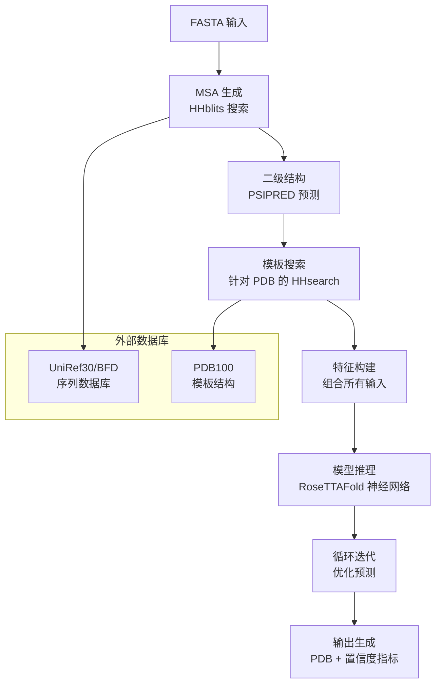

---
slug:9-protein-structure-prediction
blog_type:normal
---


使用 RoseTTAFold-All-Atom (RFAA) 进行蛋白质结构预测，使你能够通过将多重序列比对中的进化信息与深度学习相结合，生成高置信度的蛋白质原子模型。本页面将指导你完成从准备输入序列到解释结构预测的完整工作流程，特别关注单蛋白质和蛋白质复合物的预测。

****

RFAA 系统采用复杂的三轨神经网络架构，同时处理序列、距离和坐标信息，生成带有显式置信度指标的全原子模型。对于初学者，入门的关键在于理解如何准备蛋白质序列数据、配置推理参数，以及解释有助于你评估预测可靠性的结构输出。

## 输入数据准备

### FASTA 文件格式要求

蛋白质结构预测的基本输入是包含你蛋白质序列的 FASTA 文件。每条蛋白质链需要一个单独的 FASTA 文件，其中包含特定的头部格式和标准氨基酸编码。头部行（以 `>` 开头）提供元数据，有助于跟踪蛋白质的来源和身份。

```text
>7U7W_1|Chain A|DNA polymerase eta|Homo sapiens (9606)
GPHMATGQDRVVALVDMDCFFVQVEQRQNPHLRNKPCAVVQYKSWKGGGIIAVSYEARAFGVTRSMWADDAKKLCPDLLLAQVRESRGKANLTKYREASVEVMEIMSRFAVIERASIDEAYVDLTSAVQERLQKLQGQPISADLLPSTYIEGLPQGPTTAEETVQKEGMRKQGLFQWLDSLQIDNLTSPDLQLTVGAVIVEEMRAAIERETGFQCSAGISHNKVLAKLACGLNKPNRQTLVSHGSVPQLFSQMPIRKIRSLGGKLGASVIEILGIEYMGELTQFTESQLQSHFGEKNGSW
```

你的序列必须使用标准的 20 种氨基酸单字母代码（ACDEFGHIKLMNPQRSTVWY）。系统会在处理过程中自动处理未知或模糊的残基。当预测多链蛋白质复合物时，每条链都会获得一个唯一的标识符（通常是大写字母，如 "A"、"B"、"C"），该标识符必须在整个配置中保持一致使用。

### 蛋白质文件示例

该仓库在 `examples/protein/` 目录中包含了几个示例蛋白质 FASTA 文件，你可以将它们用作自己预测的模板：

| 文件名 | 描述 | 链 |
|-----------|-------------|-------|
| `7u7w_A.fasta` | DNA 聚合酶 η（人类） | 单链单体 |
| `3fap_A.fasta` | Fab 抗体链 A | 抗体复合物的一部分 |
| `3fap_B.fasta` | Fab 抗体链 B | 抗体复合物的一部分 |
| `7qxr.fasta` | 蛋白质结构示例 | 单链 |
| `7s69_A.fasta` | 糖基化蛋白质 | 共价修饰案例 |

来源：[examples/protein/7u7w_A.fasta](examples/protein/7u7w_A.fasta#L1-L3), [rf2aa/data/protein.py](rf2aa/data/protein.py#L1-L94)

## 配置系统

RFAA 使用 Hydra 配置管理来组合推理任务。配置层次结构允许你在继承基本参数的同时指定特定任务的输入，从而无需手动管理复杂的参数列表即可轻松设置预测。

### 基础配置继承

所有蛋白质预测配置都应继承自基础配置文件，其中包含模型训练期间使用的默认模型参数、数据库路径和推理设置。这确保你的预测使用模型开发过程中发现的相同最佳参数。

```yaml
defaults:
  - base

job_name: "7u7w_protein"
protein_inputs: 
  A:
    fasta_file: examples/protein/7u7w_A.fasta
```

带有 `- base` 的 `defaults` 部分至关重要——它从 `rf2aa/config/inference/base.yaml` 导入所有参数。此基础配置包括数据库连接设置、模型架构参数和推理选项，除非你有特定要求，否则通常不应修改这些选项。

来源：[rf2aa/config/inference/protein.yaml](rf2aa/config/inference/protein.yaml#L1-L8), [rf2aa/config/inference/base.yaml](rf2aa/config/inference/base.yaml#L1-L71)

### 关键配置参数

基础配置包含几类控制预测流程不同方面的参数：

**数据库参数**（在 `base.yaml` 中配置）：
- `sequencedb`：序列数据库路径（UniRef30, BFD）
- `hhdb`：HHsearch 模板数据库路径
- `command`：MSA 生成脚本路径（`make_msa.sh`）
- `num_cpus`：用于 MSA 搜索的 CPU 核心数
- `mem`：内存分配（以 GB 为单位）

**加载器参数**：
- `n_templ`：要使用的模板数量（默认：4）
- `MAXLAT`：最大序列长度（默认：128）
- `MAXSEQ`：MSA 中的最大序列数（默认：1024）
- `MAXCYCLE`：循环迭代次数（默认：4）
- `seqid`：模板的序列一致性截断值（默认：150.0）

<CgxTip>循环机制（MAXCYCLE）通过将输出作为输入反馈来迭代优化结构预测。对于困难的目标，更多的循环可以提高准确性，但会增加计算时间。</CgxTip>

来源：[rf2aa/config/inference/base.yaml](rf2aa/config/inference/base.yaml#L4-L15)

## 蛋白质结构预测工作流程

预测过程通过多阶段流程将你的氨基酸序列转化为三维原子模型，该流程生成进化信息、搜索结构模板，并应用深度学习来预测坐标和置信度指标。



### 阶段 1：MSA 生成

流程首先通过搜索序列数据库来构建多重序列比对（MSA），从而捕获蛋白质结构的进化约束。系统使用 HHblits 对 UniRef30 和 BFD 数据库进行迭代搜索，采用逐渐放宽的 E 值阈值（1e-10、1e-6、1e-3），并过滤结果以保持序列多样性，同时消除冗余。

`make_msa.sh` 脚本会自动执行此过程，首先运行 SignalP 6.0 以检测并切割可能干扰结构预测的信号肽。然后，脚本执行 HHblits 搜索，应用质量过滤器（90% 一致性截断值、75-50% 覆盖率要求），并在达到足够的序列深度时停止（75% 覆盖率下 >2000 条序列，或 50% 覆盖率下 >4000 条序列）。

来源：[make_msa.sh](make_msa.sh#L1-L135)

### 阶段 2：二级结构预测

基于 MSA，PSIPRED 预测二级结构元件（α-螺旋、β-折叠、卷曲），这些元件作为神经网络的额外输入特征。`input_prep/make_ss.sh` 脚本协调 CSBLAST 轮廓生成和 PSIPRED 执行，生成二级结构预测文件（`.ss2`），其中编码了预测状态和置信度值。

这些二级结构信息有助于模型识别局部结构模式，并提供补充 MSA 数据的进化约束。

来源：[input_prep/make_ss.sh](input_prep/make_ss.sh#L1-L35)

### 阶段 3：模板搜索

流程在结构数据库中搜索具有实验确定结构的同源蛋白质，这些结构可用作模板。HHsearch 将你的 MSA（包括二级结构预测）与 PDB100 数据库进行比较，识别具有序列和结构相似性的结构模板。

搜索生成比对文件（`.hhr` 用于人类可读结果，`.atab` 用于表格化比对），引导模型找到合理的折叠。模板信息包括坐标、残基映射和质量指标，神经网络可以有选择地整合这些信息。

来源：[rf2aa/data/protein.py](rf2aa/data/protein.py#L5-L31), [rf2aa/data/protein.py](rf2aa/data/protein.py#L33-L67)

### 阶段 4：特征构建和模型推理

`rf2aa/data/protein.py` 中的 `load_protein` 函数协调将所有输入特征组装成神经网络所需的格式。此过程包括：

1. **解析 MSA**：使用 20 个字母的字母表加上间隙和特殊标记，将氨基酸字母转换为数字索引
2. **处理模板**：从 HHsearch 输出中读取模板坐标、掩码和序列映射
3. **生成键特征**：创建残基级邻接矩阵，编码肽键连接性（连续残基之间的骨架键）
4. **初始化原子框架**：设置原子级预测的坐标系

构建的特征输入到 RoseTTAFold 神经网络，该网络通过多次循环迭代处理它们以优化预测坐标。三轨架构同时更新序列嵌入、成对距离表示和 3D 坐标，允许信息在不同表示之间流动，从而提高预测准确性。

来源：[rf2aa/data/protein.py](rf2aa/data/protein.py#L33-L67), [rf2aa/data/data_loader.py](rf2aa/data/data_loader.py#L107-L163), [rf2aa/run_inference.py](rf2aa/run_inference.py#L114-L130)

## 运行预测

### 单链蛋白质预测

对于单条蛋白质链，请创建一个 YAML 配置文件，指定你的 FASTA 输入和链标识符：

```yaml
defaults:
  - base

job_name: "my_protein_prediction"
protein_inputs: 
  A:
    fasta_file: path/to/your/protein.fasta
```

使用以下命令执行预测：

```bash
python -m rf2aa.run_inference --config-name your_config
```

链标识符（在此示例中为 "A"）即使是单链预测也是强制性的。这种命名约定使系统能够一致地处理多链复合物，并允许你在稍后添加核酸或小分子时引用特定的链。

### 多链蛋白质复合物

对于具有多条链的蛋白质复合物，请使用额外的链标识符扩展 `protein_inputs` 部分：

```yaml
defaults:
  - base

job_name: "protein_complex"
protein_inputs:
  A:
    fasta_file: examples/protein/3fap_A.fasta
  B:
    fasta_file: examples/protein/3fap_B.fasta
```

系统在模型推理期间自动处理链间相互作用，允许神经网络从所有链的组合 MSA 和进化约束中学习四级结构排列。

来源：[rf2aa/run_inference.py](rf2aa/run_inference.py#L33-L50)

## 输出文件和解释

预测流程会在你的 `output_path` 配置指定的目录中生成两个输出文件：

### PDB 结构文件

主要输出是一个名为 `{job_name}.pdb` 的 PDB 文件，其中包含预测的原子坐标，表示了所有重原子。PDB 文件中的 B-factor 列编码了每个残基的置信度分数（预测的 lDDT 值），使你能够在 PyMOL 或 Chimera 等分子可视化软件中直接可视化局部预测可靠性。

较高的 B-factor 值表示对局部原子排列的置信度较高，而较低的值则表示潜在的不确定性或无序性。低置信度区域（通常 B-factor 低于 50-60）可能是柔性的，或者受到进化信息的约束较差。

### 辅助指标文件

`{job_name}_aux.pt` 文件是一个 PyTorch 张量，包含详细的置信度指标，用于提供预测质量的定量评估：

| 指标 | 描述 | 形状 | 解释 |
|--------|-------------|-------|----------------|
| `plddts` | 预测的局部距离差异测试 | (L,) | 每残基置信度（0-100，越高越好） |
| `pae` | 预测比对误差 | (L, L) | 将残基 i 的坐标系与残基 j 对齐时的预期误差 |
| `pde` | 预测距离误差 | (L, L) | 成对距离中的预期误差 |
| `mean_plddt` | 平均每残基置信度 | 标量 | 整体模型质量估计 |
| `mean_pae` | 平均预测比对误差 | 标量 | 整体结构精度估计 |
| `pae_prot` | 蛋白质-蛋白质对的平均 PAE | 标量 | 链间相互作用的质量 |
| `pae_inter` | 蛋白质-配体对的平均 PAE | 标量 | 小分子结合的质量 |

加载这些指标进行分析：

```python
import torch
metrics = torch.load('your_job_aux.pt', map_location='cpu')
print(f"Mean pLDDT: {metrics['mean_plddt']:.2f}")
print(f"Mean PAE: {metrics['mean_pae']:.2f}")
```

**<CgxTip>`pae_inter` 指标对于评估蛋白质-配体或蛋白质-蛋白质复合物中的对接质量特别重要。低于 10 Å 的值通常表示适合进行详细分析的高置信度结合预测。</CgxTip>**

来源：[rf2aa/run_inference.py](rf2aa/run_inference.py#L132-L160), [rf2aa/run_inference.py](rf2aa/run_inference.py#L162-L183)

## 常见问题故障排除

### MSA 生成问题

如果 MSA 生成失败或产生的比对非常浅：

1. **检查数据库路径**：确保 `DB_UR30`、`DB_BFD` 和 `BLASTMAT` 环境变量指向正确下载的数据库
2. **验证内存分配**：对于大型蛋白质，可能需要增加配置中的 `mem` 参数
3. **数据库完整性**：确认 UniRef30 和 BFD 数据库已完全下载并解压

### 模板搜索失败

如果模板搜索未产生结果：

1. **检查 PDB 数据库**：确保 HHsearch 数据库文件（`pdb100_2021Mar03`）可访问且索引正确
2. **序列一致性**：非常远缘的同源物在当前的 PDB 数据库中可能没有合适的模板
3. **配置路径**：验证配置中的 `hhdb` 指向正确的数据库位置

### 低置信度预测

如果你的模型输出 pLDDT 分数较低（<50）或 PAE 值较高：

1. **MSA 深度**：更深的 MSA 通常会改善预测。如果可用，考虑使用 UniRef30 之外的序列数据库
2. **结构域边界**：你的序列可能包含多个结构域；分别预测结构域可能会提高准确性
3. **新型折叠**：极其新颖的蛋白质折叠可能因缺乏足够的进化信息而难以进行可靠预测

来源：[rf2aa/data/protein.py](rf2aa/data/protein.py#L69-L94), [rf2aa/run_inference.py](rf2aa/run_inference.py#L1-L71)

## 后续步骤

掌握单蛋白质预测后，请探索更复杂的场景：

- **[蛋白质-核酸复合物预测](10-protein-nucleic-acid-complex-prediction)**：学习使用适当的碱基配对约束来模拟与 DNA 或 RNA 结合的蛋白质
- **[蛋白质-小分子复合物预测](11-protein-small-molecule-complex-prediction)**：向你的蛋白质预测中添加配体、辅因子和金属离子
- **[高阶生物分子复合物](12-higher-order-biomolecular-complexes)**：在多组件组装中组合蛋白质、核酸和小分子
- **[理解模型输出](5-understanding-model-outputs)**：深入研究置信度指标和输出可视化技术

如需更深入地了解底层架构，请探索 **[三轨设计概述](14-three-track-design-overview)** 以了解 RFAA 如何同时处理序列、距离和坐标信息，或查看 **[输入数据结构](18-input-data-structures)** 以了解模型使用的内部特征表示。