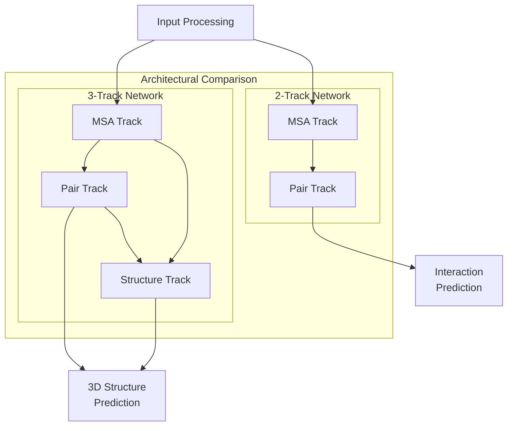
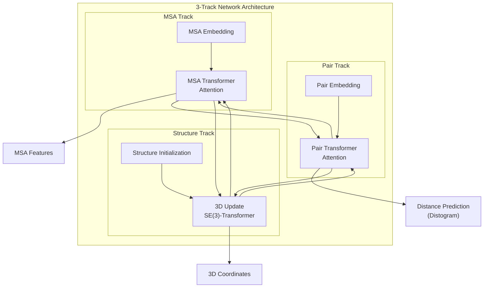
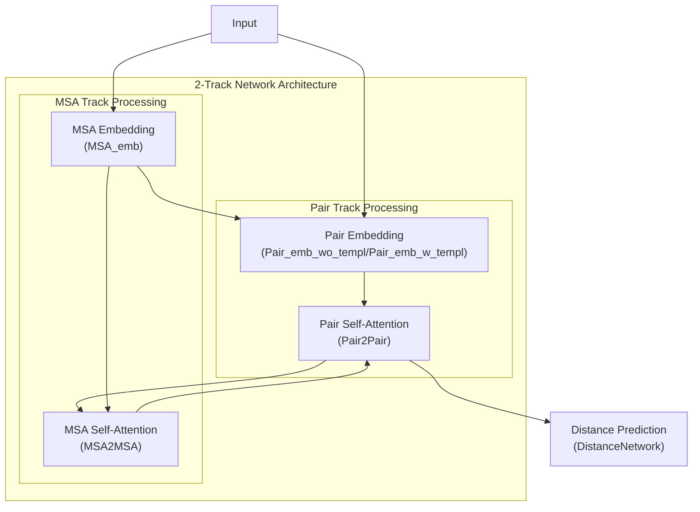
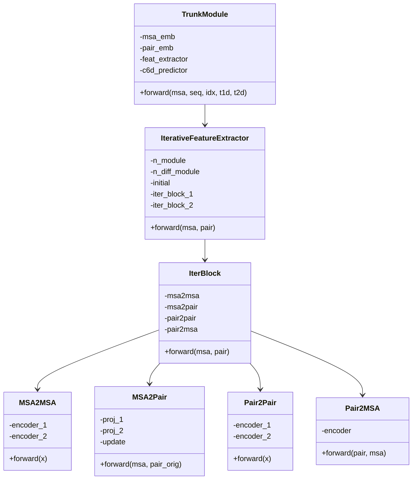

# 3-Track vs 2-Track Networks

> **Relevant source files**
> * [README.md](https://github.com/RosettaCommons/RoseTTAFold/blob/fcf9125c/README.md?plain=1)
> * [network_2track/Attention_module.py](https://github.com/RosettaCommons/RoseTTAFold/blob/fcf9125c/network_2track/Attention_module.py)
> * [network_2track/TrunkModel.py](https://github.com/RosettaCommons/RoseTTAFold/blob/fcf9125c/network_2track/TrunkModel.py)

## Purpose and Scope

This document explains the two different neural network architectures used in RoseTTAFold: the 3-track and 2-track networks. It compares their structure, capabilities, implementation details, and appropriate use cases. For details about specific attention mechanisms used within these networks, see [Attention Mechanisms](/RosettaCommons/RoseTTAFold/5.2-attention-mechanisms). For information about embedding layers, see [Embedding Layers](/RosettaCommons/RoseTTAFold/5.3-embedding-layers).

## Overview of Track-Based Architectures

RoseTTAFold employs track-based neural network architectures to process protein information. Each "track" represents a specialized processing pathway for a specific type of protein data:

* **MSA Track**: Processes evolutionary information from multiple sequence alignments
* **Pair Track**: Processes pairwise relationships between residues
* **Structure Track**: Processes 3D structural information (only in the 3-track network)



**Diagram 1: High-level comparison of 3-track and 2-track architectures**

Sources: [README.md L98-L99](https://github.com/RosettaCommons/RoseTTAFold/blob/fcf9125c/README.md?plain=1#L98-L99)

 [network_2track/TrunkModel.py L26-L36](https://github.com/RosettaCommons/RoseTTAFold/blob/fcf9125c/network_2track/TrunkModel.py#L26-L36)

## 3-Track Architecture

The 3-track architecture is the core of RoseTTAFold's primary protein structure prediction capability. It consists of three specialized tracks that process and exchange information in an iterative manner:

1. **MSA Track**: Processes evolutionary information from multiple sequence alignments to identify conserved patterns
2. **Pair Track**: Captures pairwise relationships between residues (distances, orientations)
3. **Structure Track**: Models 3D coordinates and updates them based on information from the other tracks



**Diagram 2: Information flow in the 3-track architecture**

The 3-track architecture is used for:

* Full protein structure prediction (monomer modeling)
* Complex structure modeling
* High-accuracy predictions requiring 3D coordinate modeling

The inclusion of the structure track allows the model to directly predict 3D coordinates, enabling end-to-end structure prediction without requiring additional steps like distance-based folding.

Sources: [README.md L99](https://github.com/RosettaCommons/RoseTTAFold/blob/fcf9125c/README.md?plain=1#L99-L99)

## 2-Track Architecture

The 2-track architecture is a streamlined version that omits the structure track, focusing only on MSA and pair information processing:

1. **MSA Track**: Processes evolutionary information from multiple sequence alignments
2. **Pair Track**: Captures pairwise relationships between residues



**Diagram 3: Information flow in the 2-track architecture**

The 2-track architecture is primarily used for:

* Protein-Protein Interaction (PPI) screening
* Applications requiring faster prediction with lower computational resources
* Cases where full 3D structure is not needed, but residue interaction information is sufficient

Sources: [network_2track/Attention_module.py L8-L14](https://github.com/RosettaCommons/RoseTTAFold/blob/fcf9125c/network_2track/Attention_module.py#L8-L14)

 [network_2track/TrunkModel.py L8-L64](https://github.com/RosettaCommons/RoseTTAFold/blob/fcf9125c/network_2track/TrunkModel.py#L8-L64)

 [README.md L28](https://github.com/RosettaCommons/RoseTTAFold/blob/fcf9125c/README.md?plain=1#L28-L28)

 [README.md L72-L73](https://github.com/RosettaCommons/RoseTTAFold/blob/fcf9125c/README.md?plain=1#L72-L73)

## Implementation and Code Structure

The 2-track architecture's implementation consists of several key components that work together to process MSA and pair information:



**Diagram 4: Class relationships in the 2-track network implementation**

The key processing flow in the 2-track network implementation:

1. **Embedding**: Input sequences are embedded by `MSA_emb` and `Pair_emb_wo_templ`/`Pair_emb_w_templ` classes
2. **Feature Extraction**: The `IterativeFeatureExtractor` processes these embeddings through multiple iterations
3. **Inter-Track Communication**: Information flows between tracks via the `MSA2Pair` and `Pair2MSA` modules
4. **Intra-Track Processing**: Within each track, information is processed by `MSA2MSA` and `Pair2Pair` modules
5. **Prediction**: The processed pair information is used to predict distance maps via the `DistanceNetwork`

The core iterative processing is implemented in the `IterBlock` class, which executes four steps in sequence:

1. Process MSA features using self-attention (`MSA2MSA`)
2. Update pair features using MSA information (`MSA2Pair`)
3. Process pair features using self-attention (`Pair2Pair`)
4. Update MSA features using pair information (`Pair2MSA`)

Sources: [network_2track/TrunkModel.py L8-L64](https://github.com/RosettaCommons/RoseTTAFold/blob/fcf9125c/network_2track/TrunkModel.py#L8-L64)

 [network_2track/Attention_module.py L129-L164](https://github.com/RosettaCommons/RoseTTAFold/blob/fcf9125c/network_2track/Attention_module.py#L129-L164)

## Detailed Module Functions in 2-Track Architecture

| Module | Function | Implementation |
| --- | --- | --- |
| **MSA2MSA** | Processes MSA features using Transformer encoders | Applies attention along N dimension (sequence count) and then along L dimension (sequence length) |
| **MSA2Pair** | Updates pair features using information from MSA | Projects MSA features to lower dimension, computes outer products, and merges with original pair information |
| **Pair2Pair** | Processes pair features using Transformer encoders | Applies attention along rows and columns of the pair matrix |
| **Pair2MSA** | Updates MSA features using information from pairs | Uses specialized encoder that incorporates pair information into MSA features |

Sources: [network_2track/Attention_module.py L16-L127](https://github.com/RosettaCommons/RoseTTAFold/blob/fcf9125c/network_2track/Attention_module.py#L16-L127)

## Performance and Use Case Comparison

| Feature | 3-Track Network | 2-Track Network |
| --- | --- | --- |
| **Primary Application** | Full structure prediction, Complex modeling | PPI screening |
| **Output** | 3D coordinates, distances, orientations | Interaction scores, distances |
| **Computational Resources** | Higher (GPU memory, compute time) | Lower |
| **Prediction Speed** | Slower | Faster |
| **Prediction Detail** | Complete 3D structure | Primarily residue interactions |
| **Implementation Location** | Main network modules | network_2track/ directory |

The choice between using the 3-track or 2-track architecture depends on your specific requirements:

* Use the **3-track network** when: * You need complete 3D structural models * Accuracy is more important than speed * You have sufficient computational resources * You are modeling monomers or complexes where 3D structure is important
* Use the **2-track network** when: * You are primarily interested in detecting protein-protein interactions * You need faster processing for screening many potential interactions * You have limited computational resources * Full 3D structural details are not required

Sources: [README.md L28](https://github.com/RosettaCommons/RoseTTAFold/blob/fcf9125c/README.md?plain=1#L28-L28)

 [README.md L72-L74](https://github.com/RosettaCommons/RoseTTAFold/blob/fcf9125c/README.md?plain=1#L72-L74)

 [README.md L76-L78](https://github.com/RosettaCommons/RoseTTAFold/blob/fcf9125c/README.md?plain=1#L76-L78)

## Usage Example for the 2-Track Network

For PPI screening using the 2-track version, the following command can be used:

```
python network_2track/predict_msa.py -msa [paired MSA file in a3m format] -npz [output npz file name] -L1 [Length of first chain]
```

For example:

```
python network_2track/predict_msa.py -msa input.a3m -npz complex.npz -L1 218
```

This will generate predictions of protein-protein interactions without producing full 3D models, making the process much faster and more suitable for large-scale screening applications.

Sources: [README.md L72-L73](https://github.com/RosettaCommons/RoseTTAFold/blob/fcf9125c/README.md?plain=1#L72-L73)