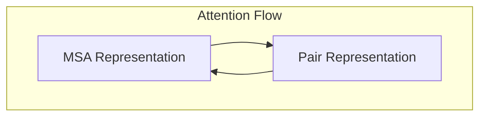
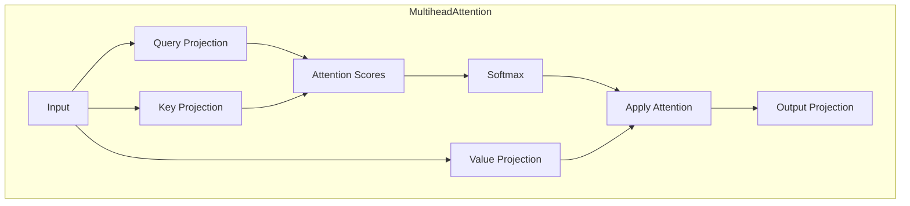
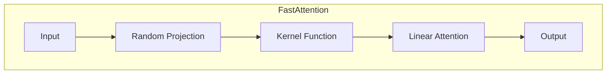
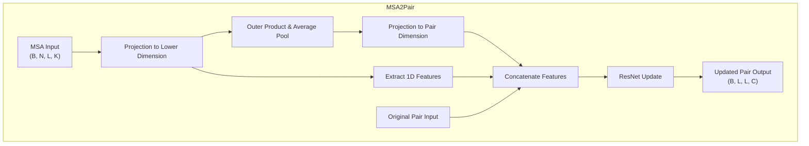
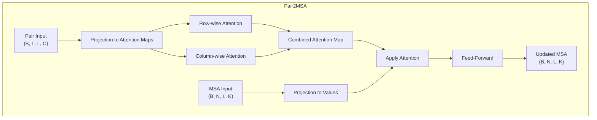
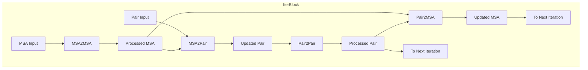
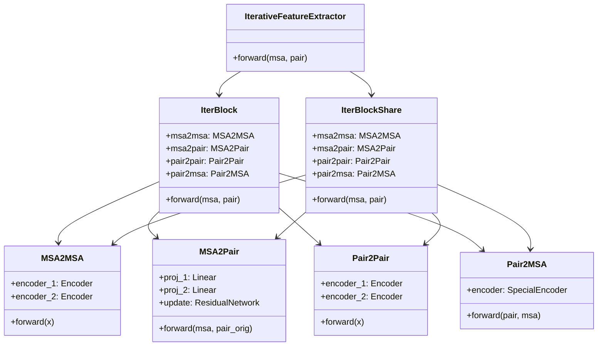
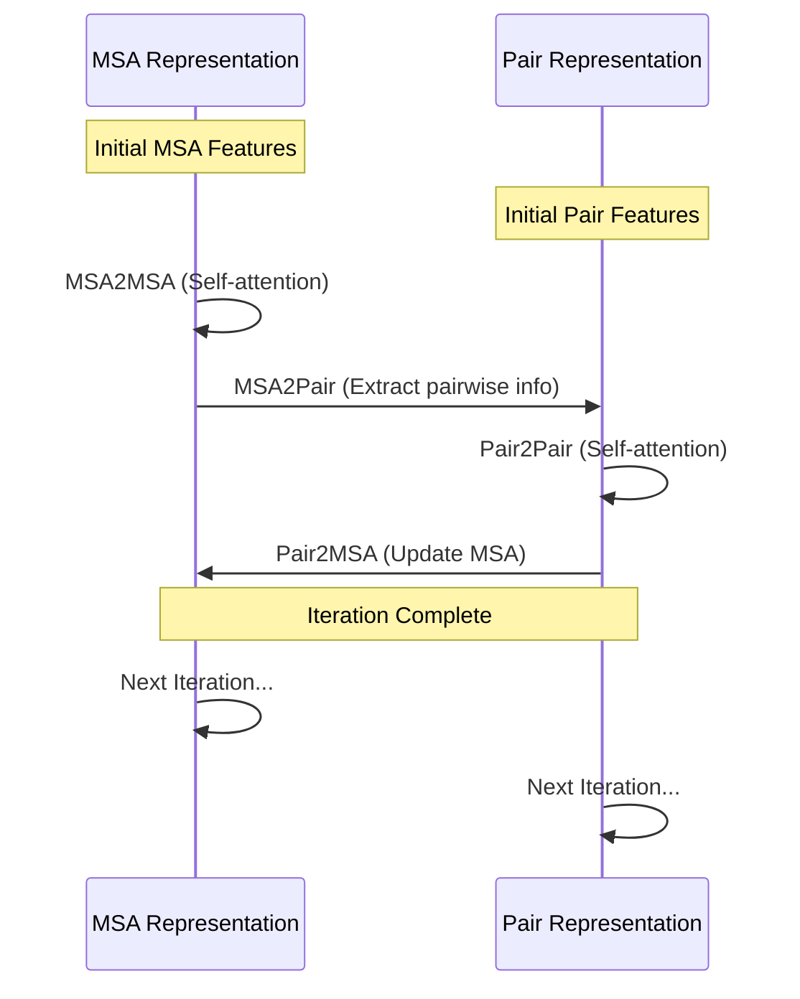

# Attention Mechanisms

> **Relevant source files**
> * [network_2track/Attention_module.py](https://github.com/RosettaCommons/RoseTTAFold/blob/fcf9125c/network_2track/Attention_module.py)
> * [network_2track/Transformer.py](https://github.com/RosettaCommons/RoseTTAFold/blob/fcf9125c/network_2track/Transformer.py)
> * [network_2track/performer_pytorch.py](https://github.com/RosettaCommons/RoseTTAFold/blob/fcf9125c/network_2track/performer_pytorch.py)

## Purpose and Scope

This document details the attention mechanisms implemented in RoseTTAFold's neural network architecture. It covers the various types of attention modules used for processing Multiple Sequence Alignments (MSAs) and pair representations, their interactions, and how they contribute to the iterative feature extraction process central to protein structure prediction.

For information about the overall neural network architecture, see [3-Track vs 2-Track Networks](/RosettaCommons/RoseTTAFold/5.1-3-track-vs-2-track-networks). For details on embedding layers that feed into these attention mechanisms, see [Embedding Layers](/RosettaCommons/RoseTTAFold/5.3-embedding-layers).

## Overview of Attention in RoseTTAFold

RoseTTAFold implements several specialized attention mechanisms that work together to extract and refine features from both MSA and pair representations of protein sequences. These attention mechanisms form a cycle of information exchange between different data representations.

Sources: [network_2track/Attention_module.py L8-L14](https://github.com/RosettaCommons/RoseTTAFold/blob/fcf9125c/network_2track/Attention_module.py#L8-L14)

## Key Attention Components

RoseTTAFold's attention modules perform four primary operations:

1. **MSA2Pair**: Extracts pairwise features from MSA and updates residue-pair representations
2. **MSA2MSA**: Processes MSA features using self-attention in both sequence and MSA dimensions
3. **Pair2MSA**: Updates MSA features using information from pair representation
4. **Pair2Pair**: Processes pair features using self-attention in row and column dimensions

These components are combined in iterative blocks to progressively refine features.

Sources: [network_2track/Attention_module.py L16-L127](https://github.com/RosettaCommons/RoseTTAFold/blob/fcf9125c/network_2track/Attention_module.py#L16-L127)

## Self-Attention Implementations

RoseTTAFold uses two main types of self-attention implementations:

### Standard Multihead Attention

The standard implementation closely follows the original Transformer architecture:

The `MultiheadAttention` class projects input tensors to queries, keys, and values, then computes attention scores and applies them to values. This is the standard attention mechanism used throughout the network.

Sources: [network_2track/Transformer.py L13-L46](https://github.com/RosettaCommons/RoseTTAFold/blob/fcf9125c/network_2track/Transformer.py#L13-L46)

### Performer Attention (Efficient Attention)

For improved efficiency with long sequences, RoseTTAFold can optionally use Performer attention:

Performer attention uses kernel approximations to compute attention efficiently for long sequences. The implementation is in the `FastAttention` class, which is used by the `SelfAttention` class when the appropriate options are provided.

Sources: [network_2track/performer_pytorch.py L114-L173](https://github.com/RosettaCommons/RoseTTAFold/blob/fcf9125c/network_2track/performer_pytorch.py#L114-L173)

 [network_2track/performer_pytorch.py L219-L293](https://github.com/RosettaCommons/RoseTTAFold/blob/fcf9125c/network_2track/performer_pytorch.py#L219-L293)

## Cross-Attention Between Representations

### MSA to Pair Attention (MSA2Pair)

This module extracts pairwise information from MSA representations:

The `MSA2Pair` module computes outer products between projected MSA features, then combines them with the original pair features through a residual network to update the pair representation.

Sources: [network_2track/Attention_module.py L16-L64](https://github.com/RosettaCommons/RoseTTAFold/blob/fcf9125c/network_2track/Attention_module.py#L16-L64)

### Pair to MSA Attention (Pair2MSA)

This module updates MSA features using pair information:

The `Pair2MSA` module uses pair features to generate attention maps that are then applied to MSA features. It projects pair information into two attention maps (row-wise and column-wise) which are combined and applied to the projected MSA features.

Sources: [network_2track/Transformer.py L147-L195](https://github.com/RosettaCommons/RoseTTAFold/blob/fcf9125c/network_2track/Transformer.py#L147-L195)

 [network_2track/Attention_module.py L93-L104](https://github.com/RosettaCommons/RoseTTAFold/blob/fcf9125c/network_2track/Attention_module.py#L93-L104)

## Iterative Feature Extraction

The heart of RoseTTAFold's attention mechanism is the iterative feature extraction process, which repeatedly applies these attention modules to refine features:

The `IterBlock` class combines all four attention modules into a single iteration. Multiple iterations are stacked in the `IterativeFeatureExtractor` class, which can use either separate parameters for each iteration (`IterBlock`) or shared parameters across iterations (`IterBlockShare`).

Sources: [network_2track/Attention_module.py L129-L165](https://github.com/RosettaCommons/RoseTTAFold/blob/fcf9125c/network_2track/Attention_module.py#L129-L165)

 [network_2track/Attention_module.py L205-L256](https://github.com/RosettaCommons/RoseTTAFold/blob/fcf9125c/network_2track/Attention_module.py#L205-L256)

## Implementation Architecture

The following diagram shows how the attention modules are organized in the codebase:

Sources: [network_2track/Attention_module.py L129-L256](https://github.com/RosettaCommons/RoseTTAFold/blob/fcf9125c/network_2track/Attention_module.py#L129-L256)

## Attention Module Technical Details

Each attention module has specific technical characteristics:

| Module | Input Dimensions | Output Dimensions | Main Operations |
| --- | --- | --- | --- |
| MSA2MSA | (B, N, L, K) | (B, N, L, K) | Self-attention over N dim, then over L dim |
| MSA2Pair | (B, N, L, K), (B, L, L, C) | (B, L, L, C) | Projection, outer product, residual update |
| Pair2Pair | (B, L, L, C) | (B, L, L, C) | Self-attention over rows, then over columns |
| Pair2MSA | (B, L, L, C), (B, N, L, K) | (B, N, L, K) | Generate attention maps from pairs, apply to MSA |

Where:

* B: Batch size
* N: Number of sequences in MSA
* L: Sequence length
* K: MSA feature dimension
* C: Pair feature dimension

Sources: [network_2track/Attention_module.py L16-L127](https://github.com/RosettaCommons/RoseTTAFold/blob/fcf9125c/network_2track/Attention_module.py#L16-L127)

## Configuration Options

The attention mechanisms can be configured with various options:

| Parameter | Description | Default |
| --- | --- | --- |
| n_layer | Number of attention layers in each module | 1 |
| n_att_head | Number of attention heads | 8 for pair, 4 for MSA |
| r_ff | Ratio for feed-forward dimension | 4 |
| p_drop | Dropout probability | 0.1 |
| performer_opts | Options for Performer attention | None (standard attention) |
| n_resblock | Number of residual blocks in MSA2Pair | 1 |

Performer options can be provided to use efficient attention for long sequences.

Sources: [network_2track/Attention_module.py L67-L79](https://github.com/RosettaCommons/RoseTTAFold/blob/fcf9125c/network_2track/Attention_module.py#L67-L79)

 [network_2track/Attention_module.py L107-L118](https://github.com/RosettaCommons/RoseTTAFold/blob/fcf9125c/network_2track/Attention_module.py#L107-L118)

## Attention Flow in Iterative Feature Extraction

The typical information flow through the attention modules in an iterative block is:

This cycle is repeated multiple times in the `IterativeFeatureExtractor`, with either separate parameters for each iteration or shared parameters across iterations.

Sources: [network_2track/Attention_module.py L146-L164](https://github.com/RosettaCommons/RoseTTAFold/blob/fcf9125c/network_2track/Attention_module.py#L146-L164)

 [network_2track/Attention_module.py L190-L202](https://github.com/RosettaCommons/RoseTTAFold/blob/fcf9125c/network_2track/Attention_module.py#L190-L202)