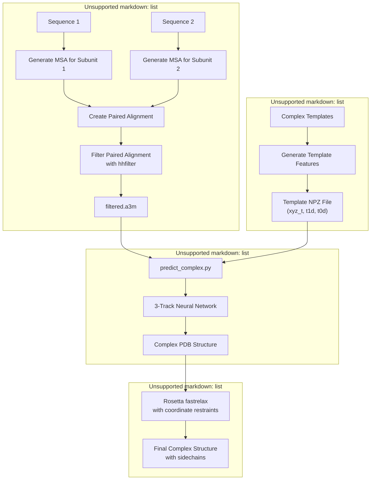
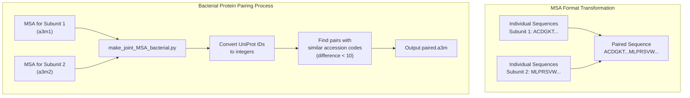
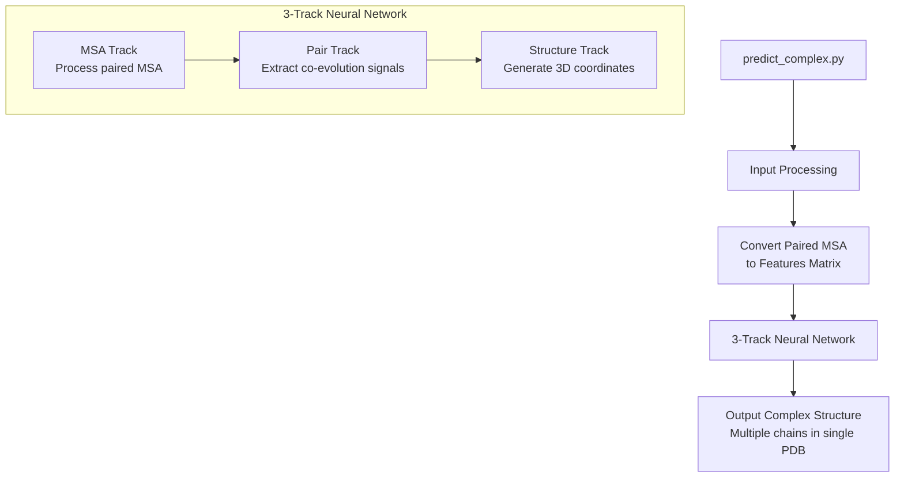

# Complex Modeling

> **Relevant source files**
> * [README.md](https://github.com/RosettaCommons/RoseTTAFold/blob/fcf9125c/README.md?plain=1)
> * [example/complex_modeling/README](https://github.com/RosettaCommons/RoseTTAFold/blob/fcf9125c/example/complex_modeling/README)
> * [example/complex_modeling/make_joint_MSA_bacterial.py](https://github.com/RosettaCommons/RoseTTAFold/blob/fcf9125c/example/complex_modeling/make_joint_MSA_bacterial.py)

## Purpose and Scope

This document covers the Complex Modeling pipeline in RoseTTAFold, which enables the prediction of protein complex structures (multiple chains interacting together). Unlike the monomer structure prediction pipelines ([End-to-End Prediction](/RosettaCommons/RoseTTAFold/4.1-end-to-end-prediction) and [PyRosetta Prediction](/RosettaCommons/RoseTTAFold/4.2-pyrosetta-prediction)), complex modeling focuses on predicting how multiple protein chains fit together in three-dimensional space, including their interaction interfaces. For protein-protein interaction screening without full structure prediction, see [PPI Screening](/RosettaCommons/RoseTTAFold/4.4-ppi-screening).

Sources: [README.md L67-L69](https://github.com/RosettaCommons/RoseTTAFold/blob/fcf9125c/README.md?plain=1#L67-L69)

 [example/complex_modeling/README L1-L4](https://github.com/RosettaCommons/RoseTTAFold/blob/fcf9125c/example/complex_modeling/README#L1-L4)

## Complex Modeling Workflow Overview

The following diagram illustrates the complete workflow for protein complex modeling in RoseTTAFold:



Sources: [example/complex_modeling/README L1-L28](https://github.com/RosettaCommons/RoseTTAFold/blob/fcf9125c/example/complex_modeling/README#L1-L28)

 [README.md L67-L69](https://github.com/RosettaCommons/RoseTTAFold/blob/fcf9125c/README.md?plain=1#L67-L69)

## Input Preparation

Complex modeling requires specialized input preparation to capture the evolutionary relationships between interacting proteins.

### 1. Generate MSAs for Individual Subunits

First, generate multiple sequence alignments (MSAs) for each protein subunit individually, using the same process as for monomer predictions.

### 2. Create Paired Alignments

The critical step unique to complex modeling is creating "paired alignments," where sequences from the MSAs of different subunits are paired if they are believed to interact with each other in their respective organisms. This pairing captures the co-evolutionary signals between the subunits.



#### For Bacterial Proteins

RoseTTAFold provides a utility script `make_joint_MSA_bacterial.py` that pairs sequences based on similar UniProt accession codes. This works because in bacteria, interacting proteins are often encoded near each other in the genome and have similar accession numbers.

The script:

1. Reads the MSAs for both subunits
2. Converts UniProt IDs to numerical values
3. Pairs sequences whose numerical values differ by less than 10
4. Outputs a concatenated MSA where each sequence is the concatenation of two paired sequences

```markdown
# Example usage:python example/complex_modeling/make_joint_MSA_bacterial.py subunit1.a3m subunit2.a3m# Creates paired.a3m
```

Sources: [example/complex_modeling/README L5-L8](https://github.com/RosettaCommons/RoseTTAFold/blob/fcf9125c/example/complex_modeling/README#L5-L8)

 [example/complex_modeling/make_joint_MSA_bacterial.py L1-L91](https://github.com/RosettaCommons/RoseTTAFold/blob/fcf9125c/example/complex_modeling/make_joint_MSA_bacterial.py#L1-L91)

#### For Eukaryotic Proteins

For eukaryotic proteins, generating paired alignments is more challenging as the script above does not work. The README notes: "For eukaryotes, there's no easy way to generate paired alignments. Good luck!"

Sources: [example/complex_modeling/README L7-L8](https://github.com/RosettaCommons/RoseTTAFold/blob/fcf9125c/example/complex_modeling/README#L7-L8)

### 3. Filter the Paired Alignment

After creating the paired alignment, filter it using `hhfilter` to reduce redundancy and improve signal quality:

```
hhfilter -i paired.a3m -o filtered.a3m -id 90 -cov 75
```

Where:

* `-id 90`: Maximum sequence identity (90-95% recommended)
* `-cov 75`: Minimum coverage (50-75% recommended)

Sources: [example/complex_modeling/README L10-L11](https://github.com/RosettaCommons/RoseTTAFold/blob/fcf9125c/example/complex_modeling/README#L10-L11)

### 4. Optional: Incorporate Template Information

For improved results, you can incorporate information from known complex templates by creating an NPZ file containing:

* `xyz_t`: N, CA, C coordinates of complex templates (# of templates, # of residues, 3 atoms (N, CA, C), 3 coordinates (x,y,z)) * For unaligned regions, use NaN values
* `t1d`: 1D features from HHsearch results (score, SS, probability column from atab file) * For unaligned regions, use zero values
* `t0d`: 0D features from HHsearch (Probability/100.0, Identities/100.0, Similarity from hhr file)

Sources: [example/complex_modeling/README L13-L20](https://github.com/RosettaCommons/RoseTTAFold/blob/fcf9125c/example/complex_modeling/README#L13-L20)

## Running Complex Prediction

Once the input preparation is complete, run the complex structure prediction:

```
python network/predict_complex.py -i filtered.a3m -o complex -Ls 218 310
```

Where:

* `-i filtered.a3m`: Input paired alignment file
* `-o complex`: Output prefix for resulting files
* `-Ls 218 310`: Lengths of each individual subunit (in this example, subunit 1 is 218 amino acids long, subunit 2 is 310 amino acids long)

The lengths must be specified in the same order as they were paired in the MSA.



Sources: [example/complex_modeling/README L22-L25](https://github.com/RosettaCommons/RoseTTAFold/blob/fcf9125c/example/complex_modeling/README#L22-L25)

 [README.md L69](https://github.com/RosettaCommons/RoseTTAFold/blob/fcf9125c/README.md?plain=1#L69-L69)

## Post-Processing

After obtaining the predicted complex structure, you may want to run Rosetta fastrelax with coordinate restraints to add sidechains and optimize the structure.

Sources: [example/complex_modeling/README L27-L28](https://github.com/RosettaCommons/RoseTTAFold/blob/fcf9125c/example/complex_modeling/README#L27-L28)

## Complete Example Workflow

Here's a complete step-by-step example for predicting a protein complex structure:

1. Generate MSAs for each subunit: ``` ./run_e2e_ver.sh subunit1.fa ././run_e2e_ver.sh subunit2.fa ./ ```
2. Create a paired alignment for bacterial proteins: ```markdown python example/complex_modeling/make_joint_MSA_bacterial.py subunit1.a3m subunit2.a3m# Creates paired.a3m ```
3. Filter the paired alignment: ``` hhfilter -i paired.a3m -o filtered.a3m -id 90 -cov 75 ```
4. Run the complex prediction: ``` python network/predict_complex.py -i filtered.a3m -o complex -Ls 218 310 ```
5. (Optional) Refine the predicted structure using Rosetta tools.

Sources: [example/complex_modeling/README L1-L28](https://github.com/RosettaCommons/RoseTTAFold/blob/fcf9125c/example/complex_modeling/README#L1-L28)

 [README.md L67-L69](https://github.com/RosettaCommons/RoseTTAFold/blob/fcf9125c/README.md?plain=1#L67-L69)

## Technical Implementation Details

The complex modeling pipeline uses the same 3-track neural network architecture as the monomer structure prediction pipelines, but with modifications to handle multiple chains simultaneously. The key differences include:

1. Input processing that handles paired MSAs instead of single-chain MSAs
2. Ability to process co-evolutionary signals between different chains
3. Output processing that generates coordinates for multiple chains in the correct relative orientation

The neural network extracts co-evolutionary patterns from the paired MSA to determine the most likely interaction interfaces between the protein chains. These patterns help constrain the possible orientations of the proteins relative to each other, leading to an accurate prediction of the complex structure.

Sources: [README.md L67-L69](https://github.com/RosettaCommons/RoseTTAFold/blob/fcf9125c/README.md?plain=1#L67-L69)

 [example/complex_modeling/README L22-L25](https://github.com/RosettaCommons/RoseTTAFold/blob/fcf9125c/example/complex_modeling/README#L22-L25)