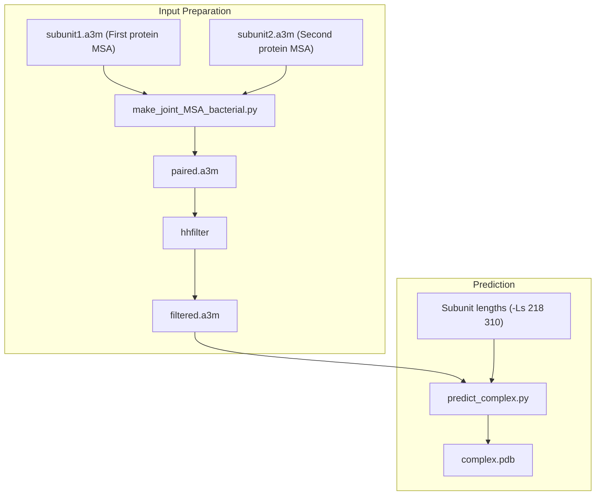
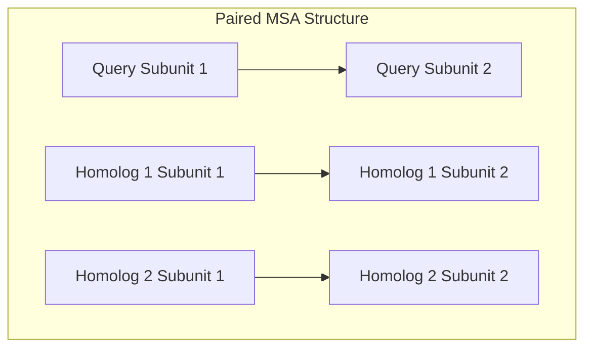
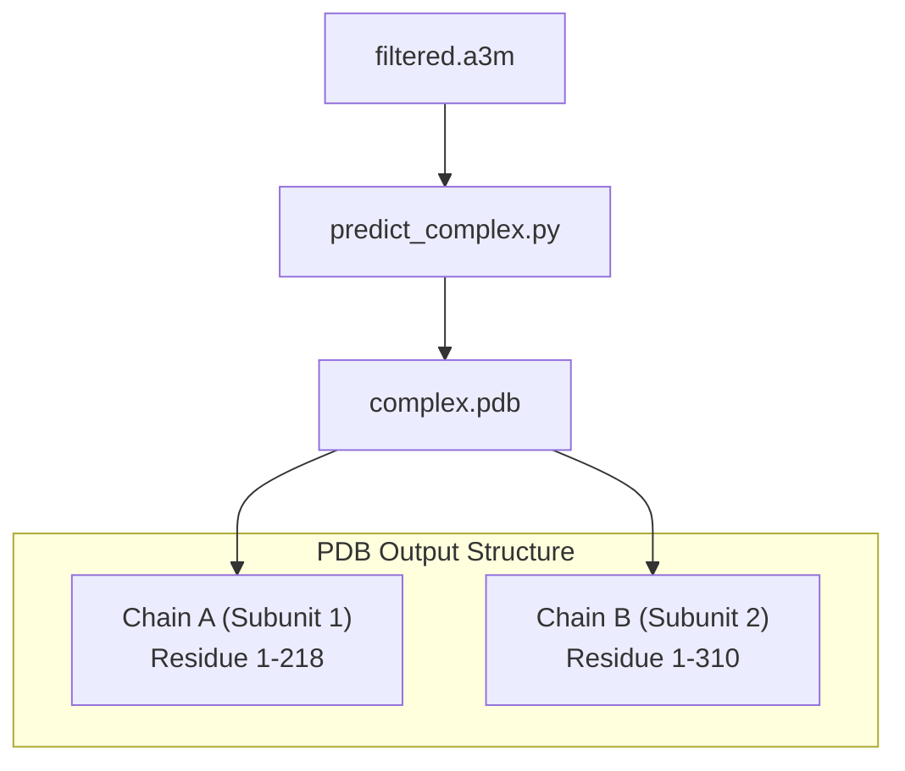

# Complex Structure Prediction Example

> **Relevant source files**
> * [example/complex_modeling/README](https://github.com/RosettaCommons/RoseTTAFold/blob/fcf9125c/example/complex_modeling/README)
> * [example/complex_modeling/complex.pdb](https://github.com/RosettaCommons/RoseTTAFold/blob/fcf9125c/example/complex_modeling/complex.pdb)
> * [example/complex_modeling/paired.a3m](https://github.com/RosettaCommons/RoseTTAFold/blob/fcf9125c/example/complex_modeling/paired.a3m)
> * [example/complex_modeling/subunit1.a3m](https://github.com/RosettaCommons/RoseTTAFold/blob/fcf9125c/example/complex_modeling/subunit1.a3m)
> * [example/complex_modeling/subunit2.a3m](https://github.com/RosettaCommons/RoseTTAFold/blob/fcf9125c/example/complex_modeling/subunit2.a3m)

This page provides a step-by-step guide for predicting the 3D structure of protein complexes (multiple interacting protein chains) using RoseTTAFold. Unlike monomer prediction, complex modeling requires specialized preparation of aligned sequences to capture co-evolutionary signals between interacting proteins. For information about predicting individual protein structures, see [Monomer Structure Prediction Example](/RosettaCommons/RoseTTAFold/7.1-monomer-structure-prediction-example).

## Overview of Complex Structure Prediction

RoseTTAFold's complex modeling pipeline enables prediction of multi-chain protein structures by leveraging paired multiple sequence alignments (MSAs) that maintain the relationship between sequences across different protein subunits.

### Complex Modeling Workflow



Sources: [example/complex_modeling/README L1-L29](https://github.com/RosettaCommons/RoseTTAFold/blob/fcf9125c/example/complex_modeling/README#L1-L29)

## Input Preparation

### Generating MSAs for Individual Subunits

First, you need separate MSAs for each protein in your complex. These MSAs should be in A3M format, which is the standard format used by RoseTTAFold. The example directory contains `subunit1.a3m` which is the MSA for the first protein.

### Creating Paired Alignments

The critical step in complex modeling is creating paired alignments that match corresponding sequences between different subunits, allowing the neural network to extract co-evolutionary signals across protein-protein interfaces.



For bacterial proteins, RoseTTAFold provides `make_joint_MSA_bacterial.py` which pairs sequences based on similar UniProt accession codes:

```
python make_joint_MSA_bacterial.py -a subunit1.a3m -b subunit2.a3m -o paired.a3m
```

The paired alignment is created by matching protein sequences that likely interact in their native organisms. For example, when proteins are encoded in the same bacterial operon, they often have similar UniProt identifiers, making pairing more straightforward.

For eukaryotic proteins, creating paired alignments is more challenging and may require specialized approaches or manual curation.

Sources: [example/complex_modeling/README L5-L8](https://github.com/RosettaCommons/RoseTTAFold/blob/fcf9125c/example/complex_modeling/README#L5-L8)

 [example/complex_modeling/paired.a3m L1-L136](https://github.com/RosettaCommons/RoseTTAFold/blob/fcf9125c/example/complex_modeling/paired.a3m#L1-L136)

### Filtering Paired Alignments

After creating the paired alignment, it's essential to filter it to improve quality:

```
hhfilter -i paired.a3m -o filtered.a3m -id 90 -cov 75
```

Parameters:

* `-id 90`: Clusters sequences at 90% sequence identity (can use 95 for stricter filtering)
* `-cov 75`: Requires at least 75% coverage compared to the query (can use 50 for lower requirements)

Filtering helps remove redundant sequences and improves the signal-to-noise ratio in the evolutionary couplings that drive the structure prediction.

Sources: [example/complex_modeling/README L10-L11](https://github.com/RosettaCommons/RoseTTAFold/blob/fcf9125c/example/complex_modeling/README#L10-L11)

### Optional Template Information

You can incorporate complex template information by creating an NPZ file containing the following features:

| Feature | Dimensions | Description | Value for Unaligned Regions |
| --- | --- | --- | --- |
| `xyz_t` | T × L × 3 × 3 | N, CA, C coordinates | NaN |
| `t1d` | T × L × 3 | 1D features from HHsearch | Zeros |
| `t0d` | T × 3 | 0D features from HHsearch | N/A |

Where T = number of templates, L = sequence length

Sources: [example/complex_modeling/README L13-L20](https://github.com/RosettaCommons/RoseTTAFold/blob/fcf9125c/example/complex_modeling/README#L13-L20)

## Running Complex Structure Prediction

After preparing the inputs, execute the complex structure prediction:

```
python network/predict_complex.py -i filtered.a3m -o complex -Ls 218 310
```

Key parameters:

* `-i`: Input paired alignment file
* `-o`: Output prefix for result files
* `-Ls`: Sequence lengths of each individual subunit (space-separated)

The `-Ls` parameter is crucial - it tells the predictor where to split the concatenated sequence into separate chains. In this example, the first subunit is 218 amino acids long, and the second is 310 amino acids long.



The output PDB file contains the predicted structure with chains A and B representing the two subunits of the complex.

Sources: [example/complex_modeling/README L22-L26](https://github.com/RosettaCommons/RoseTTAFold/blob/fcf9125c/example/complex_modeling/README#L22-L26)

 [example/complex_modeling/complex.pdb L1-L654](https://github.com/RosettaCommons/RoseTTAFold/blob/fcf9125c/example/complex_modeling/complex.pdb#L1-L654)

## Example Walkthrough

The `example/complex_modeling` directory contains a complete example:

### Step 1: Examine the Input Files

* `subunit1.a3m`: MSA for the first protein subunit (218 residues)
* `paired.a3m`: Already paired alignment of two subunits

### Step 2: Filter the Paired Alignment

```
hhfilter -i paired.a3m -o filtered.a3m -id 90 -cov 75
```

### Step 3: Run Complex Structure Prediction

```
python network/predict_complex.py -i filtered.a3m -o complex -Ls 218 310
```

### Step 4: Examine the Results

The `complex.pdb` file contains the 3D coordinates of the predicted complex structure. You can visualize this file with any standard molecular visualization tool such as PyMOL, Chimera, or VMD.

In the PDB file, the first 218 residues (lines 1-654) correspond to chain A (the first subunit), and the remaining residues correspond to chain B (the second subunit).

Sources: [example/complex_modeling/complex.pdb L1-L654](https://github.com/RosettaCommons/RoseTTAFold/blob/fcf9125c/example/complex_modeling/complex.pdb#L1-L654)

 [example/complex_modeling/paired.a3m L1-L136](https://github.com/RosettaCommons/RoseTTAFold/blob/fcf9125c/example/complex_modeling/paired.a3m#L1-L136)

 [example/complex_modeling/subunit1.a3m L1-L197](https://github.com/RosettaCommons/RoseTTAFold/blob/fcf9125c/example/complex_modeling/subunit1.a3m#L1-L197)

## Optional Post-Processing

For more accurate side chain modeling, you can run Rosetta fastrelax with coordinate restraints:

```markdown
# Rosetta fastrelax with coordinate restraints
<rosetta_scripts> -s complex.pdb -relax:coord_constrain_sidechains
```

This refinement step adds detailed side chain information while preserving the backbone structure predicted by RoseTTAFold.

Sources: [example/complex_modeling/README L27-L28](https://github.com/RosettaCommons/RoseTTAFold/blob/fcf9125c/example/complex_modeling/README#L27-L28)

## Summary

Complex structure prediction with RoseTTAFold involves these key steps:

1. Generate MSAs for individual subunits
2. Create paired alignments for the interacting proteins
3. Filter the paired alignment to improve quality
4. Run `predict_complex.py` with appropriate `-Ls` parameters
5. Optionally refine the structure with Rosetta

The accuracy of complex prediction depends significantly on the quality of paired alignments. Better paired alignments result in more accurate co-evolutionary signals and more reliable complex structure predictions.