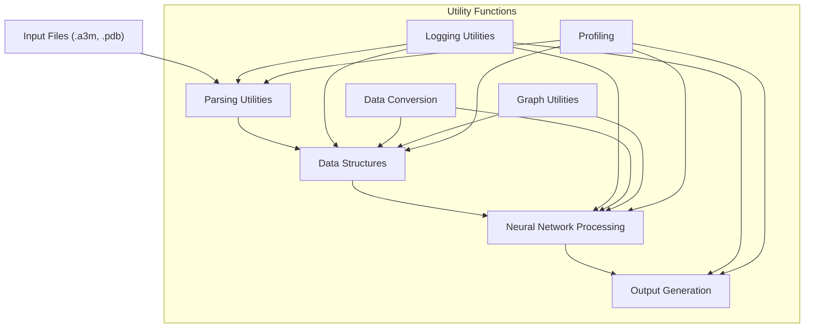
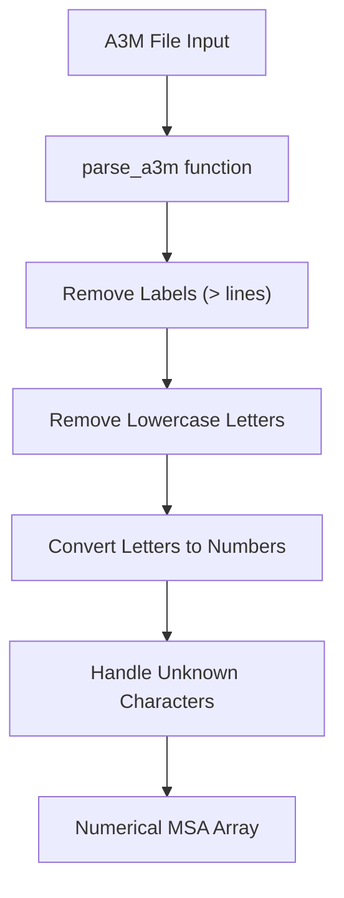
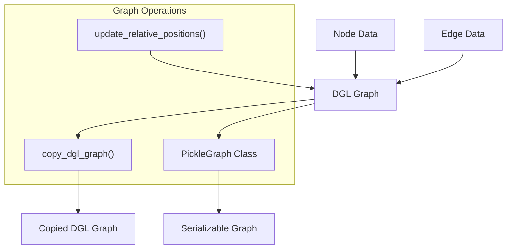
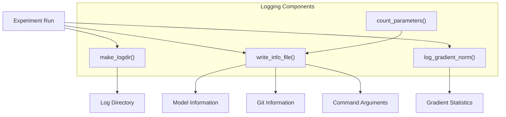
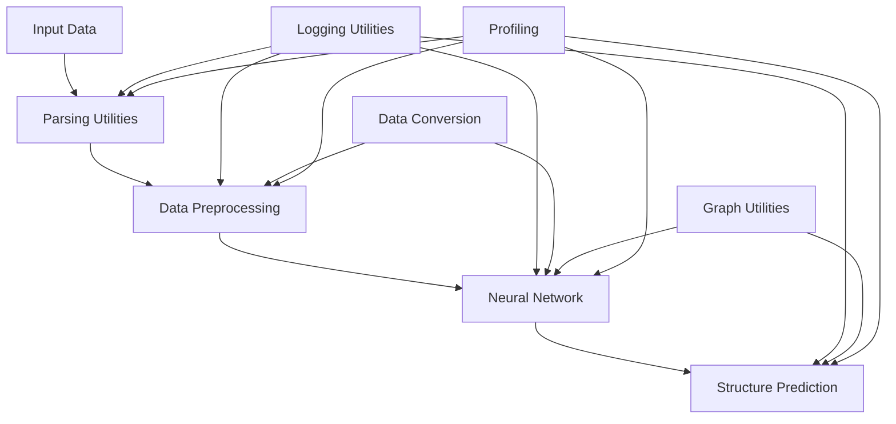

# Data Processing and Utilities

> **Relevant source files**
> * [network/utils/utils_data.py](https://github.com/RosettaCommons/RoseTTAFold/blob/fcf9125c/network/utils/utils_data.py)
> * [network/utils/utils_logging.py](https://github.com/RosettaCommons/RoseTTAFold/blob/fcf9125c/network/utils/utils_logging.py)
> * [network/utils/utils_profiling.py](https://github.com/RosettaCommons/RoseTTAFold/blob/fcf9125c/network/utils/utils_profiling.py)
> * [network_2track/parsers.py](https://github.com/RosettaCommons/RoseTTAFold/blob/fcf9125c/network_2track/parsers.py)

This page documents the data processing components and utility functions used throughout the RoseTTAFold codebase. These utilities provide essential functionality for parsing input files, manipulating data structures, logging information, and profiling code performance. These components support the core neural network architecture (described in [Neural Network Architecture](/RosettaCommons/RoseTTAFold/5-neural-network-architecture)) and prediction pipelines (described in [Prediction Pipelines](/RosettaCommons/RoseTTAFold/4-prediction-pipelines)).

## Overview of Data Processing Components

RoseTTAFold's data processing components handle various aspects of data transformation, from initial parsing of sequence alignments to preparing data for neural network processing and analysis.



Sources: [network_2track/parsers.py](https://github.com/RosettaCommons/RoseTTAFold/blob/fcf9125c/network_2track/parsers.py)

 [network/utils/utils_logging.py](https://github.com/RosettaCommons/RoseTTAFold/blob/fcf9125c/network/utils/utils_logging.py)

 [network/utils/utils_data.py](https://github.com/RosettaCommons/RoseTTAFold/blob/fcf9125c/network/utils/utils_data.py)

 [network/utils/utils_profiling.py](https://github.com/RosettaCommons/RoseTTAFold/blob/fcf9125c/network/utils/utils_profiling.py)

## Parsing Utilities

### MSA Parsing

The codebase provides functionality for parsing Multiple Sequence Alignment (MSA) files in A3M format, which is a common format used in bioinformatics for representing sequence alignments.



The `parse_a3m` function in [network_2track/parsers.py L14-L42](https://github.com/RosettaCommons/RoseTTAFold/blob/fcf9125c/network_2track/parsers.py#L14-L42)

 performs the following steps:

1. Reads the A3M file line by line
2. Skips lines starting with '>' (header lines)
3. Removes lowercase letters (which typically represent insertions relative to the query)
4. Converts each amino acid letter to a numerical index (0-20, where 20 represents gaps)
5. Returns a numerical representation of the MSA as a NumPy array

Sources: [network_2track/parsers.py L14-L42](https://github.com/RosettaCommons/RoseTTAFold/blob/fcf9125c/network_2track/parsers.py#L14-L42)

## Data Conversion Utilities

### Tensor to NumPy Conversion

The `to_np` function in [network/utils/utils_data.py L7-L8](https://github.com/RosettaCommons/RoseTTAFold/blob/fcf9125c/network/utils/utils_data.py#L7-L8)

 provides a convenient way to convert PyTorch tensors to NumPy arrays, which is useful for data processing and visualization:

```python
def to_np(x):    return x.cpu().detach().numpy()
```

This function handles moving tensors to CPU (if they're on GPU), detaching them from the computation graph, and converting them to NumPy arrays.

Sources: [network/utils/utils_data.py L7-L8](https://github.com/RosettaCommons/RoseTTAFold/blob/fcf9125c/network/utils/utils_data.py#L7-L8)

### Graph Data Structures

RoseTTAFold uses graph-based data structures to represent protein structures and their properties. The codebase provides utilities for manipulating these graph structures.



Key graph utilities include:

1. **PickleGraph Class** [network/utils/utils_data.py L11-L37](https://github.com/RosettaCommons/RoseTTAFold/blob/fcf9125c/network/utils/utils_data.py#L11-L37)  - A lightweight graph representation for easy serialization (pickling) * Stores node data (`ndata`) and edge data (`edata`) as dictionaries * Stores edge connectivity via source (`src`) and destination (`dst`) arrays * Can be initialized from a DGL graph
2. **Copy Function** [network/utils/utils_data.py L40-L57](https://github.com/RosettaCommons/RoseTTAFold/blob/fcf9125c/network/utils/utils_data.py#L40-L57)  - `copy_dgl_graph()` creates a deep copy of a DGL graph * Handles both single graphs and batched graphs * Preserves all node and edge data
3. **Position Updating** [network/utils/utils_data.py L59-L64](https://github.com/RosettaCommons/RoseTTAFold/blob/fcf9125c/network/utils/utils_data.py#L59-L64)  - `update_relative_positions()` calculates relative spatial positions between connected nodes * Useful for geometric computations in protein structure modeling

Sources: [network/utils/utils_data.py L11-L64](https://github.com/RosettaCommons/RoseTTAFold/blob/fcf9125c/network/utils/utils_data.py#L11-L64)

## Logging Utilities

RoseTTAFold includes a comprehensive set of logging utilities to track experiments, record model information, and monitor training progress.



Key logging utilities include:

1. **Directory Creation** [network/utils/utils_logging.py L15-L30](https://github.com/RosettaCommons/RoseTTAFold/blob/fcf9125c/network/utils/utils_logging.py#L15-L30) * `try_mkdir()` creates a directory if it doesn't exist * `make_logdir()` creates a timestamped log directory for experiment runs
2. **Parameter Counting** [network/utils/utils_logging.py L33-L41](https://github.com/RosettaCommons/RoseTTAFold/blob/fcf9125c/network/utils/utils_logging.py#L33-L41) * `count_parameters()` counts the number of trainable parameters in a model
3. **Info File Writing** [network/utils/utils_logging.py L44-L98](https://github.com/RosettaCommons/RoseTTAFold/blob/fcf9125c/network/utils/utils_logging.py#L44-L98) * `write_info_file()` records model information, command-line arguments, and git commit information * Creates checkpoint directories and logging subdirectories
4. **Gradient Tracking** [network/utils/utils_logging.py L101-L123](https://github.com/RosettaCommons/RoseTTAFold/blob/fcf9125c/network/utils/utils_logging.py#L101-L123) * `log_gradient_norm()` tracks gradient norms during training * `get_average()` and `clear_data()` help manage logged gradient data

Sources: [network/utils/utils_logging.py L15-L123](https://github.com/RosettaCommons/RoseTTAFold/blob/fcf9125c/network/utils/utils_logging.py#L15-L123)

## Profiling Utilities

RoseTTAFold includes a simple profiling decorator in [network/utils/utils_profiling.py](https://github.com/RosettaCommons/RoseTTAFold/blob/fcf9125c/network/utils/utils_profiling.py)

 that can be used to profile function execution. If a global `profile` function is not defined, it provides a no-op decorator that allows code to run normally.

```python
try:    profileexcept NameError:    def profile(func):        return func
```

This allows conditional profiling based on whether a profiling tool is active.

Sources: [network/utils/utils_profiling.py L1-L5](https://github.com/RosettaCommons/RoseTTAFold/blob/fcf9125c/network/utils/utils_profiling.py#L1-L5)

## Integration with RoseTTAFold Pipeline

These data processing and utility components are integrated throughout the RoseTTAFold pipeline to support various operations.



The data processing components work together to:

1. Parse input files like MSAs and template structures
2. Convert data between different formats (PyTorch tensors, NumPy arrays, graph structures)
3. Log information about model execution and performance
4. Profile code execution for performance optimization

These utilities provide the infrastructure that enables the core prediction functionality of RoseTTAFold.

Sources: [network_2track/parsers.py](https://github.com/RosettaCommons/RoseTTAFold/blob/fcf9125c/network_2track/parsers.py)

 [network/utils/utils_logging.py](https://github.com/RosettaCommons/RoseTTAFold/blob/fcf9125c/network/utils/utils_logging.py)

 [network/utils/utils_data.py](https://github.com/RosettaCommons/RoseTTAFold/blob/fcf9125c/network/utils/utils_data.py)

 [network/utils/utils_profiling.py](https://github.com/RosettaCommons/RoseTTAFold/blob/fcf9125c/network/utils/utils_profiling.py)