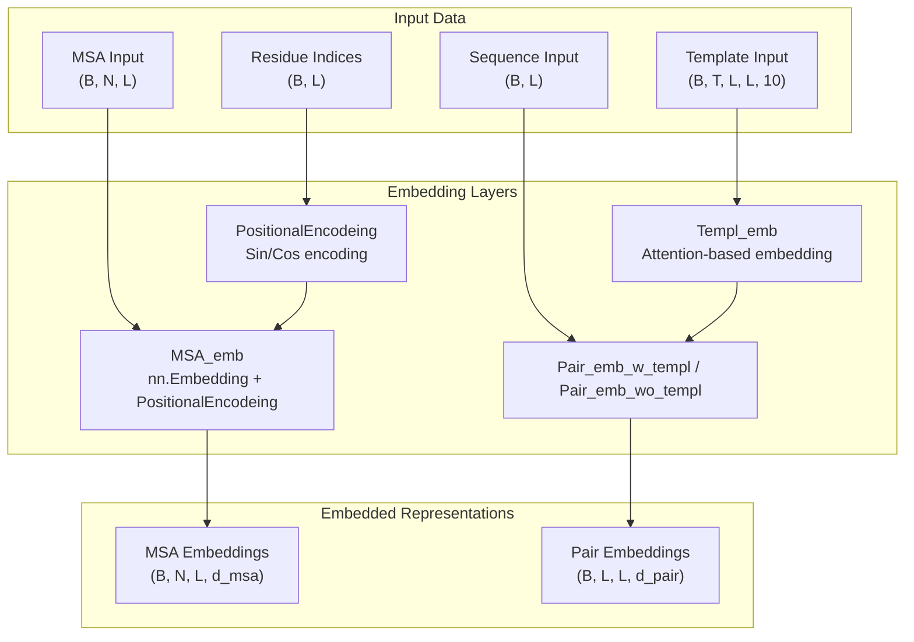
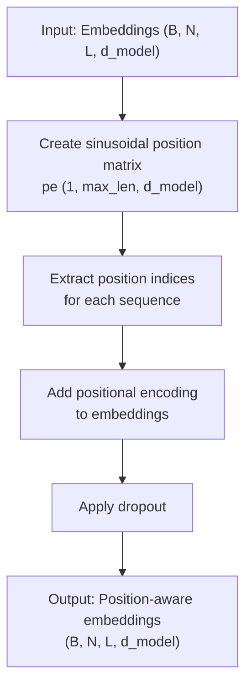
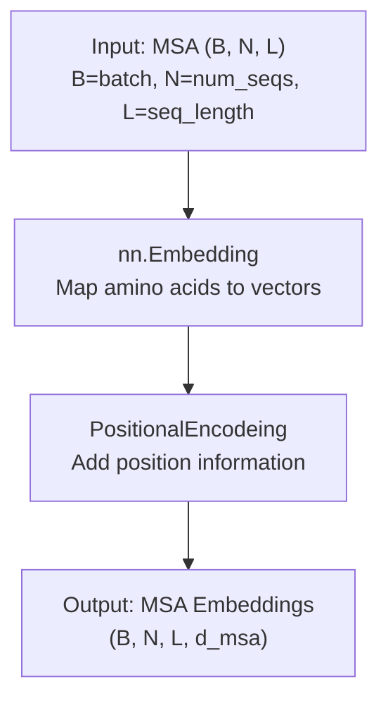
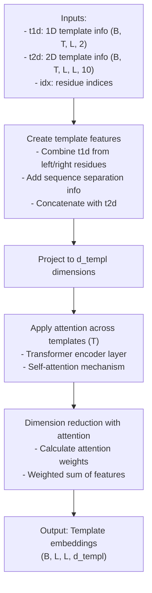
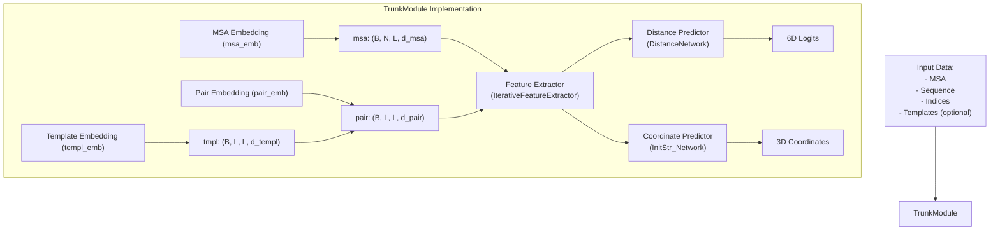

# Embedding Layers

> **Relevant source files**
> * [network_2track/Embeddings.py](https://github.com/RosettaCommons/RoseTTAFold/blob/fcf9125c/network_2track/Embeddings.py)
> * [network_2track/TrunkModel.py](https://github.com/RosettaCommons/RoseTTAFold/blob/fcf9125c/network_2track/TrunkModel.py)

## Purpose and Scope

This page documents the embedding layers used in RoseTTAFold's neural network architecture. Embedding layers serve as the initial processing components that transform raw input data (MSA, sequence, and template information) into learnable vector representations that the network can effectively process. For information about the overall network architecture and how these embeddings are used in subsequent layers, see [Neural Network Architecture](/RosettaCommons/RoseTTAFold/5-neural-network-architecture) and [3-Track vs 2-Track Networks](/RosettaCommons/RoseTTAFold/5.1-3-track-vs-2-track-networks).

## Overview of Embedding Types

RoseTTAFold uses several types of embedding layers to process different input data types:

1. **MSA Embedding** - Converts multiple sequence alignment data into vector representations
2. **Pair Embedding** - Creates pairwise relationship representations between residues
3. **Template Embedding** - Processes structural template information when available
4. **Positional Encoding** - Adds position information to the sequence-based embeddings

These embedding layers form the foundation of the neural network and enable it to learn from diverse biological data types.



Diagram: Embedding Layer Flow in RoseTTAFold

Sources: [network_2track/Embeddings.py L33-L42](https://github.com/RosettaCommons/RoseTTAFold/blob/fcf9125c/network_2track/Embeddings.py#L33-L42)

 [network_2track/Embeddings.py L83-L126](https://github.com/RosettaCommons/RoseTTAFold/blob/fcf9125c/network_2track/Embeddings.py#L83-L126)

 [network_2track/Embeddings.py L45-L81](https://github.com/RosettaCommons/RoseTTAFold/blob/fcf9125c/network_2track/Embeddings.py#L45-L81)

 [network_2track/Embeddings.py L12-L31](https://github.com/RosettaCommons/RoseTTAFold/blob/fcf9125c/network_2track/Embeddings.py#L12-L31)

## Positional Encoding

Positional encoding is crucial for sequence-based models as it injects information about the relative or absolute position of tokens in the sequence. RoseTTAFold uses sinusoidal positional encoding.

### Implementation

The `PositionalEncodeing` class implements sinusoidal positional encoding, which adds position information to embeddings:



Diagram: Positional Encoding Process

Sources: [network_2track/Embeddings.py L12-L31](https://github.com/RosettaCommons/RoseTTAFold/blob/fcf9125c/network_2track/Embeddings.py#L12-L31)

The positional encoding uses sine and cosine functions of different frequencies to encode positions:

* Even dimensions use sine functions
* Odd dimensions use cosine functions

This approach allows the model to attend to relative positions in the sequence, which is important for understanding protein structure since nearby residues in sequence often interact in 3D space.

## MSA Embedding

The MSA embedding layer converts multiple sequence alignment data into vector representations. MSAs provide evolutionary information that is crucial for predicting protein structure.

### Implementation

The `MSA_emb` class handles MSA embedding:



Diagram: MSA Embedding Process

Sources: [network_2track/Embeddings.py L33-L42](https://github.com/RosettaCommons/RoseTTAFold/blob/fcf9125c/network_2track/Embeddings.py#L33-L42)

Key components:

* An `nn.Embedding` layer maps each amino acid to a vector representation of dimension `d_model`
* Positional encoding adds sequence position information
* The output is a tensor of shape (batch_size, num_sequences, sequence_length, embedding_dimension)

## Template Embedding

The template embedding layer processes structural template information, which provides prior knowledge about potentially similar protein structures. This embedding uses an attention mechanism to aggregate information across multiple templates.

### Implementation

The `Templ_emb` class implements template embedding using a pixel-wise attention approach:



Diagram: Template Embedding Process

Sources: [network_2track/Embeddings.py L45-L81](https://github.com/RosettaCommons/RoseTTAFold/blob/fcf9125c/network_2track/Embeddings.py#L45-L81)

Key steps:

1. Combine 1D template information from both residues in a pair
2. Add sequence separation information (log of sequence distance)
3. Concatenate with 2D template information
4. Project to template embedding dimension
5. Apply attention across templates using a transformer encoder
6. Reduce dimension using attention weights to produce a single embedding per residue pair

## Pair Embeddings

Pair embeddings capture pairwise relationships between residues. RoseTTAFold implements two variants: with and without template information.

### Implementation



```mermaid
flowchart TD

A2["Inputs:<br>- seq: target sequence (B, L)<br>- idx: residue indices"]
B2["Embed sequence residues"]
C2["Create pairwise features:<br>- left residue embeddings<br>- right residue embeddings<br>- sequence separation"]
D2["Project to pair dimension (d_pair)"]
E2["Output: Pair embeddings (B, L, L, d_pair)"]
A1["Inputs: <br>- seq: target sequence (B, L)<br>- idx: residue indices<br>- templ: template embeddings (B, L, L, d_templ)"]
B1["Embed sequence residues"]
C1["Create pairwise features:<br>- left residue embeddings<br>- right residue embeddings<br>- template embeddings<br>- sequence separation"]
D1["Project to pair dimension (d_pair)"]
E1["Output: Pair embeddings (B, L, L, d_pair)"]

subgraph subGraph1 ["Pair Embedding Without Templates"]
    A2
    B2
    C2
    D2
    E2
    A2 --> B2
    B2 --> C2
    C2 --> D2
    D2 --> E2
end

subgraph subGraph0 ["Pair Embedding With Templates"]
    A1
    B1
    C1
    D1
    E1
    A1 --> B1
    B1 --> C1
    C1 --> D1
    D1 --> E1
end
```

Diagram: Pair Embedding Processes

Sources: [network_2track/Embeddings.py L83-L126](https://github.com/RosettaCommons/RoseTTAFold/blob/fcf9125c/network_2track/Embeddings.py#L83-L126)

Both variants:

1. Embed sequence residues using an embedding layer
2. Create pairwise features by combining embeddings from left and right residues
3. Add sequence separation information (log of sequence distance)
4. Project to the pair embedding dimension

The difference is that `Pair_emb_w_templ` incorporates template information while `Pair_emb_wo_templ` does not.

## Integration with Network Architecture

The embedding layers are integrated into the TrunkModule, which forms the core of RoseTTAFold's neural network architecture.



Diagram: Integration of Embedding Layers in TrunkModule

Sources: [network_2track/TrunkModel.py L8-L64](https://github.com/RosettaCommons/RoseTTAFold/blob/fcf9125c/network_2track/TrunkModel.py#L8-L64)

The flow of operations in the TrunkModule:

1. MSA data is processed by `msa_emb`
2. If templates are used, template data is processed by `templ_emb`
3. Sequence data is combined with template embeddings (if available) using either `Pair_emb_w_templ` or `Pair_emb_wo_templ`
4. The embeddings are passed to the feature extractor (`IterativeFeatureExtractor`)
5. The extracted features are used to predict distances and 3D coordinates

## Code Structure

The embedding layers are implemented in the `network_2track/Embeddings.py` file, with the following class hierarchy:

| Class | Purpose | Key Methods |
| --- | --- | --- |
| `PositionalEncodeing` | Adds positional information to embeddings | `forward(x, idx_s)` |
| `MSA_emb` | Embeds MSA data | `forward(msa, idx)` |
| `Templ_emb` | Embeds template information | `forward(t1d, t2d, idx)` |
| `Pair_emb_w_templ` | Creates pair embeddings with templates | `forward(seq, idx, templ)` |
| `Pair_emb_wo_templ` | Creates pair embeddings without templates | `forward(seq, idx)` |

Sources: [network_2track/Embeddings.py L1-L128](https://github.com/RosettaCommons/RoseTTAFold/blob/fcf9125c/network_2track/Embeddings.py#L1-L128)

The `TrunkModel.py` file shows how these embedding layers are instantiated and used:

```markdown
# Initialize embedding layersself.msa_emb = MSA_emb(d_model=d_msa, p_drop=p_drop, max_len=5000)if use_templ:    self.templ_emb = Templ_emb(d_templ=d_templ, n_att_head=n_head_templ, r_ff=r_ff, p_drop=p_drop)    self.pair_emb = Pair_emb_w_templ(d_model=d_pair, d_templ=d_templ)else:    self.pair_emb = Pair_emb_wo_templ(d_model=d_pair)
```

Sources: [network_2track/TrunkModel.py L19-L24](https://github.com/RosettaCommons/RoseTTAFold/blob/fcf9125c/network_2track/TrunkModel.py#L19-L24)

## Embedding Layer Parameters

The embedding layers accept several key parameters that control their behavior:

| Parameter | Description | Used In |
| --- | --- | --- |
| `d_model` | Embedding dimension for sequence/MSA | MSA_emb, Pair_emb |
| `d_msa` | Input dimension for MSA data (typically 21 for 20 amino acids + gap) | MSA_emb |
| `d_templ` | Dimension for template embeddings | Templ_emb, Pair_emb_w_templ |
| `p_drop` | Dropout probability | All embedding layers |
| `max_len` | Maximum sequence length supported | PositionalEncodeing, MSA_emb |
| `n_att_head` | Number of attention heads for template processing | Templ_emb |
| `r_ff` | Expansion ratio for feed-forward networks | Templ_emb |

Sources: [network_2track/TrunkModel.py L8-L24](https://github.com/RosettaCommons/RoseTTAFold/blob/fcf9125c/network_2track/TrunkModel.py#L8-L24)

 [network_2track/Embeddings.py L12-L126](https://github.com/RosettaCommons/RoseTTAFold/blob/fcf9125c/network_2track/Embeddings.py#L12-L126)