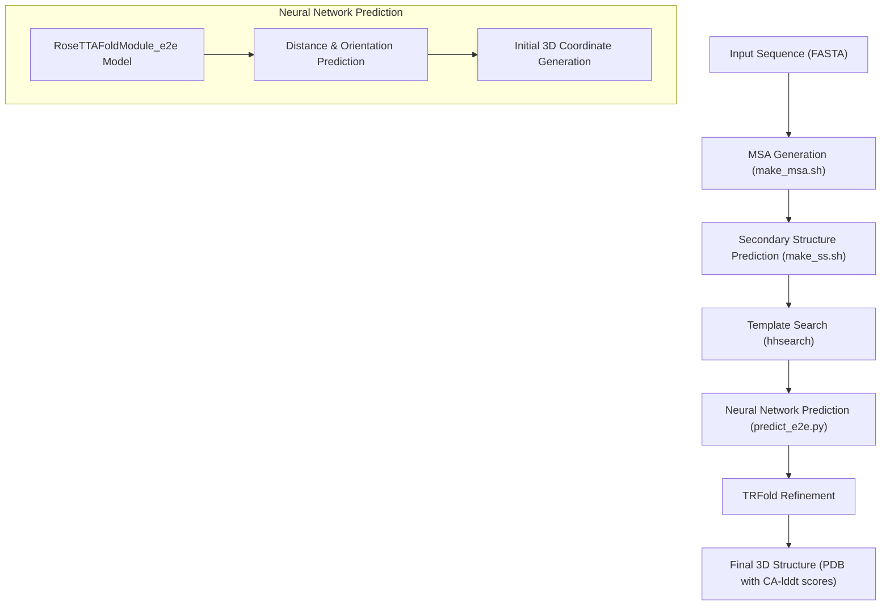
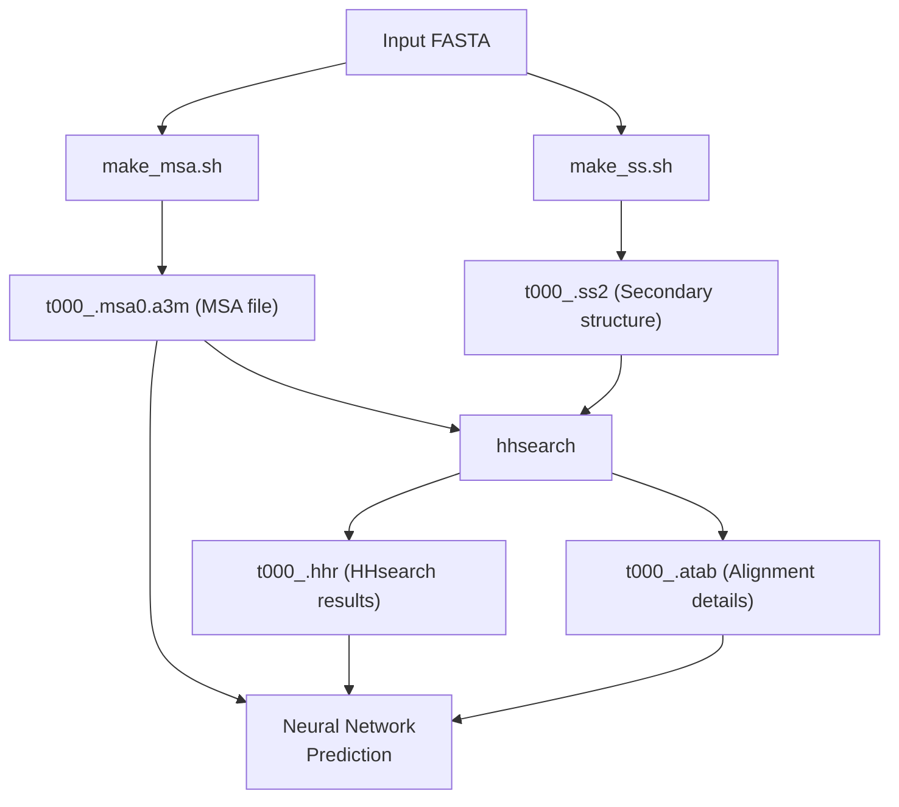
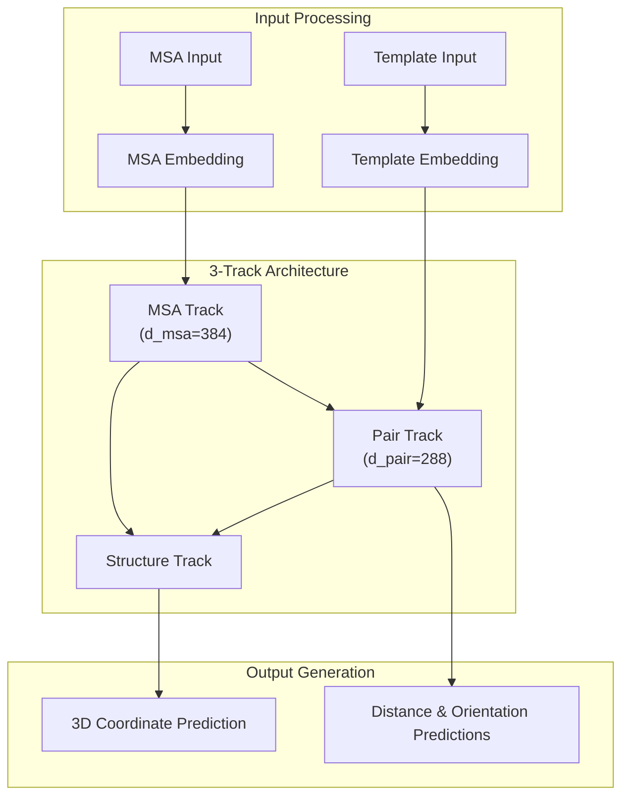
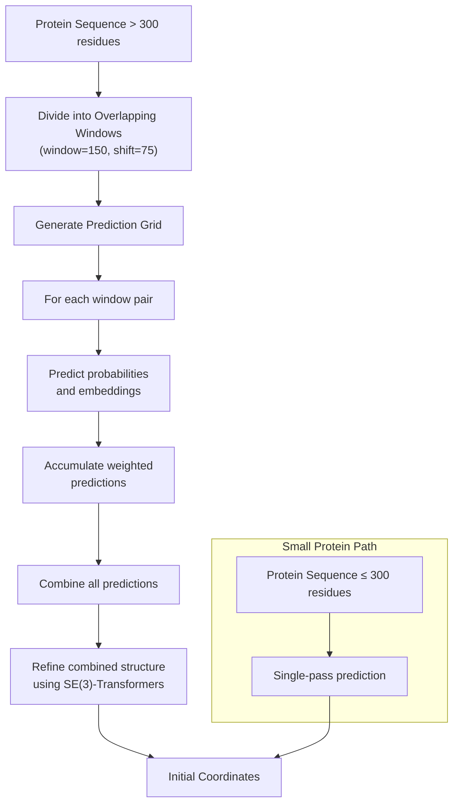
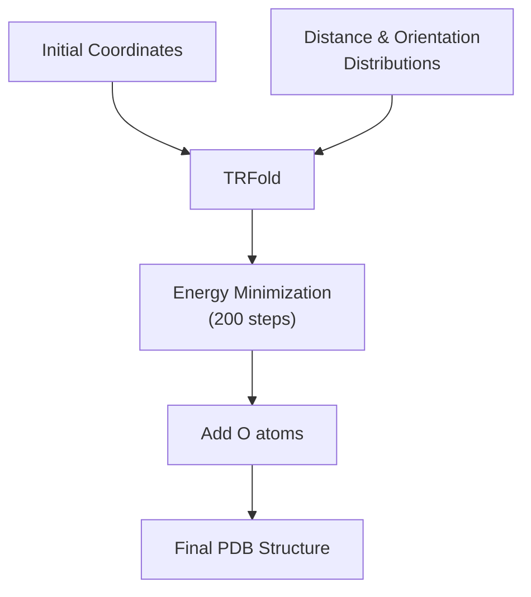
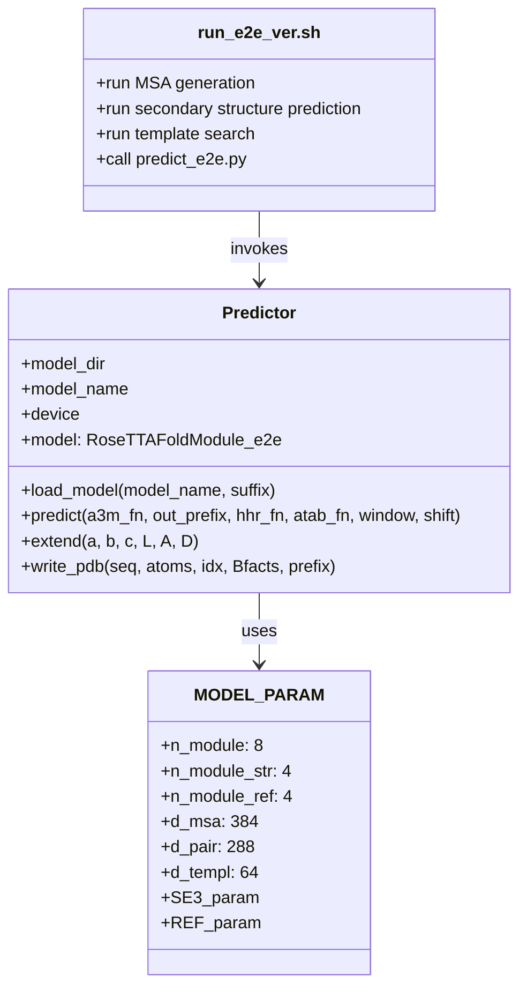

# End-to-End Prediction

> **Relevant source files**
> * [README.md](https://github.com/RosettaCommons/RoseTTAFold/blob/fcf9125c/README.md?plain=1)
> * [example/end-to-end/t000_.e2e.npz](https://github.com/RosettaCommons/RoseTTAFold/blob/fcf9125c/example/end-to-end/t000_.e2e.npz)
> * [example/end-to-end/t000_.e2e.pdb](https://github.com/RosettaCommons/RoseTTAFold/blob/fcf9125c/example/end-to-end/t000_.e2e.pdb)
> * [network/predict_e2e.py](https://github.com/RosettaCommons/RoseTTAFold/blob/fcf9125c/network/predict_e2e.py)
> * [run_e2e_ver.sh](https://github.com/RosettaCommons/RoseTTAFold/blob/fcf9125c/run_e2e_ver.sh)
> * [run_pyrosetta_ver.sh](https://github.com/RosettaCommons/RoseTTAFold/blob/fcf9125c/run_pyrosetta_ver.sh)

## Purpose and Scope

The End-to-End Prediction pipeline represents one of the two main approaches for protein structure prediction in RoseTTAFold. Unlike the PyRosetta-based method (see [PyRosetta Prediction](/RosettaCommons/RoseTTAFold/4.2-pyrosetta-prediction)), this pipeline directly predicts 3D coordinates through a neural network and produces a single high-quality model with confidence scores. This document explains the workflow, architecture, and usage of the end-to-end prediction system.

## Pipeline Overview

The End-to-End Prediction pipeline takes a protein sequence as input and produces a 3D structural model in PDB format with per-residue confidence scores in a single, streamlined process.



Sources: [run_e2e_ver.sh](https://github.com/RosettaCommons/RoseTTAFold/blob/fcf9125c/run_e2e_ver.sh)

 [network/predict_e2e.py](https://github.com/RosettaCommons/RoseTTAFold/blob/fcf9125c/network/predict_e2e.py)

## Input Preparation

Before the neural network prediction, the following preparation steps are performed:

1. **MSA Generation**: Multiple sequence alignments are generated using HHblits against UniRef30 and BFD databases
2. **Secondary Structure Prediction**: PSIPRED is used to predict secondary structure
3. **Template Search**: HHsearch identifies structural templates from the PDB database

This preparation is handled by the `run_e2e_ver.sh` script, which calls the appropriate tools and prepares inputs for the neural network.



Sources: [run_e2e_ver.sh L33-L61](https://github.com/RosettaCommons/RoseTTAFold/blob/fcf9125c/run_e2e_ver.sh#L33-L61)

## Neural Network Prediction

The core of the End-to-End pipeline is the neural network prediction implemented in `predict_e2e.py`. This utilizes a 3-track network architecture with specialized handling for large proteins.

### Model Architecture

The RoseTTAFold end-to-end model uses a 3-track architecture with MSA, pair, and structure tracks that exchange information:



The model parameters include:

* 8 network modules (n_module)
* 4 structure modules (n_module_str)
* 4 refinement modules (n_module_ref)
* MSA dimension of 384
* Pair dimension of 288
* Template dimension of 64

Sources: [network/predict_e2e.py L19-L64](https://github.com/RosettaCommons/RoseTTAFold/blob/fcf9125c/network/predict_e2e.py#L19-L64)

### Handling Large Proteins

For proteins longer than twice the window size (default 150 residues), the prediction is performed using a cropping strategy:



The cropping strategy:

1. Divides the protein into overlapping windows (default size 150, shift 75)
2. Creates a grid of all window pairs
3. For each window pair, performs neural network prediction
4. Accumulates the predictions with appropriate weighting
5. Performs a final refinement step using the combined predictions

Sources: [network/predict_e2e.py L143-L207](https://github.com/RosettaCommons/RoseTTAFold/blob/fcf9125c/network/predict_e2e.py#L143-L207)

## Structure Refinement

After the initial coordinate prediction, a TRFold refinement step is performed to improve the structure:



TRFold uses energy minimization with the predicted distance and orientation distributions as constraints to refine the initial structure. This refinement:

1. Takes the initial coordinates from the neural network
2. Uses the predicted distance and orientation distributions
3. Performs 200 steps of energy minimization with a learning rate of 0.1
4. Adds oxygen atoms to complete the backbone
5. Writes the final PDB file with CA-lddt scores in the B-factor column

Sources: [network/predict_e2e.py L229-L246](https://github.com/RosettaCommons/RoseTTAFold/blob/fcf9125c/network/predict_e2e.py#L229-L246)

## Outputs

The End-to-End prediction pipeline produces two main outputs:

1. **NPZ file** containing predicted distributions: * Distance distributions (dist) * Omega angle distributions (omega) * Theta angle distributions (theta) * Phi angle distributions (phi)
2. **PDB file** containing: * 3D coordinates for N, CA, C, and O atoms * Residue-wise confidence scores (CA-lddt) in the B-factor column

Example output files from the pipeline:

* `t000_.e2e.npz` - Contains all distribution predictions
* `t000_.e2e.pdb` - Final structure model with confidence scores

Sources: [network/predict_e2e.py L222-L246](https://github.com/RosettaCommons/RoseTTAFold/blob/fcf9125c/network/predict_e2e.py#L222-L246)

 [example/end-to-end/t000_.e2e.pdb](https://github.com/RosettaCommons/RoseTTAFold/blob/fcf9125c/example/end-to-end/t000_.e2e.pdb)

## Code Structure

The End-to-End prediction system is implemented through the following key components:



The main flow through the codebase:

1. `run_e2e_ver.sh` handles input preparation and calls `predict_e2e.py`
2. `predict_e2e.py` defines a `Predictor` class that loads the model and performs prediction
3. The prediction process handles both small and large proteins differently
4. TRFold is used for final refinement

Sources: [network/predict_e2e.py L89-L247](https://github.com/RosettaCommons/RoseTTAFold/blob/fcf9125c/network/predict_e2e.py#L89-L247)

 [run_e2e_ver.sh L64-L77](https://github.com/RosettaCommons/RoseTTAFold/blob/fcf9125c/run_e2e_ver.sh#L64-L77)

## Usage

To run the End-to-End prediction pipeline, use the `run_e2e_ver.sh` script:

```
cd example
../run_e2e_ver.sh input.fa output_directory
```

Where:

* `input.fa` is your input FASTA file
* `output_directory` is where results will be stored

Alternatively, you can run the prediction script directly:

```
python network/predict_e2e.py -i [input.a3m] -o [output_prefix] --hhr [template.hhr] --atab [template.atab]
```

Key parameters in `predict_e2e.py`:

* `-i` / `--a3m_fn`: Input MSA in a3m format
* `-o` / `--out_prefix`: Prefix for output files
* `--hhr`: HHsearch output file
* `--atab`: HHsearch alignment file
* `--db`: Path to template database
* `--cpu`: Use CPU instead of GPU

Sources: [network/predict_e2e.py L295-L313](https://github.com/RosettaCommons/RoseTTAFold/blob/fcf9125c/network/predict_e2e.py#L295-L313)

 [run_e2e_ver.sh](https://github.com/RosettaCommons/RoseTTAFold/blob/fcf9125c/run_e2e_ver.sh)

## Comparison with PyRosetta Method

The End-to-End pipeline differs from the PyRosetta-based approach in several key ways:

| Feature | End-to-End | PyRosetta |
| --- | --- | --- |
| Output models | Single model | 5 final models |
| Confidence metric | CA-lddt | CA-RMSE |
| Direct coordinate prediction | Yes | No (predicts distances first) |
| Refinement method | TRFold | Rosetta structure modeling |
| Runtime | Faster | Slower but potentially more accurate |
| Required dependencies | Standard RoseTTAFold | Requires PyRosetta installation |

The End-to-End method is recommended when:

* A quick prediction is needed
* A single representative model is sufficient
* Per-residue confidence scores are important

Sources: [README.md L76-L78](https://github.com/RosettaCommons/RoseTTAFold/blob/fcf9125c/README.md?plain=1#L76-L78)

 [run_e2e_ver.sh](https://github.com/RosettaCommons/RoseTTAFold/blob/fcf9125c/run_e2e_ver.sh)

 [run_pyrosetta_ver.sh](https://github.com/RosettaCommons/RoseTTAFold/blob/fcf9125c/run_pyrosetta_ver.sh)

## Conclusion

The End-to-End prediction pipeline provides a streamlined approach for protein structure prediction in RoseTTAFold. It directly predicts 3D coordinates from sequence information and refines them into a high-quality structural model with confidence scores. The cropping strategy enables handling of proteins of any length, while the TRFold refinement helps optimize the final structure.