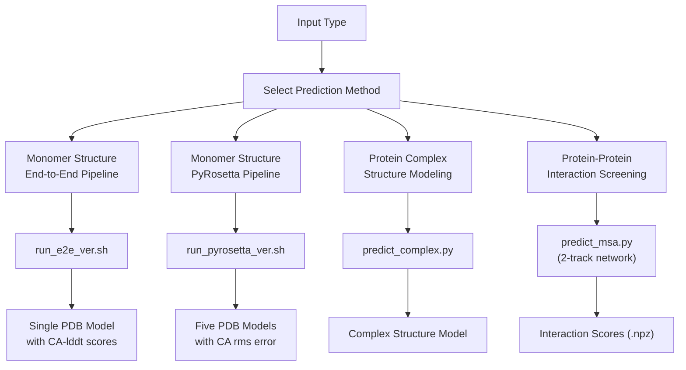
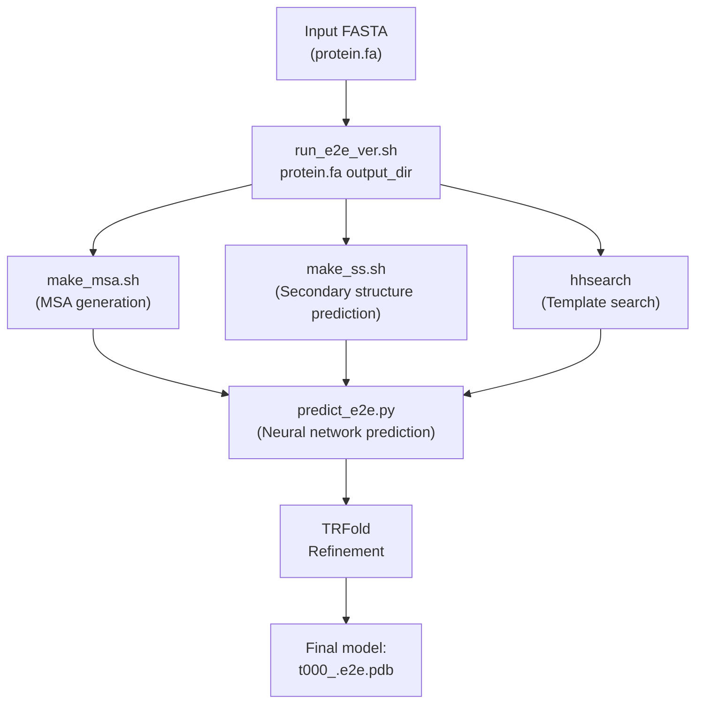
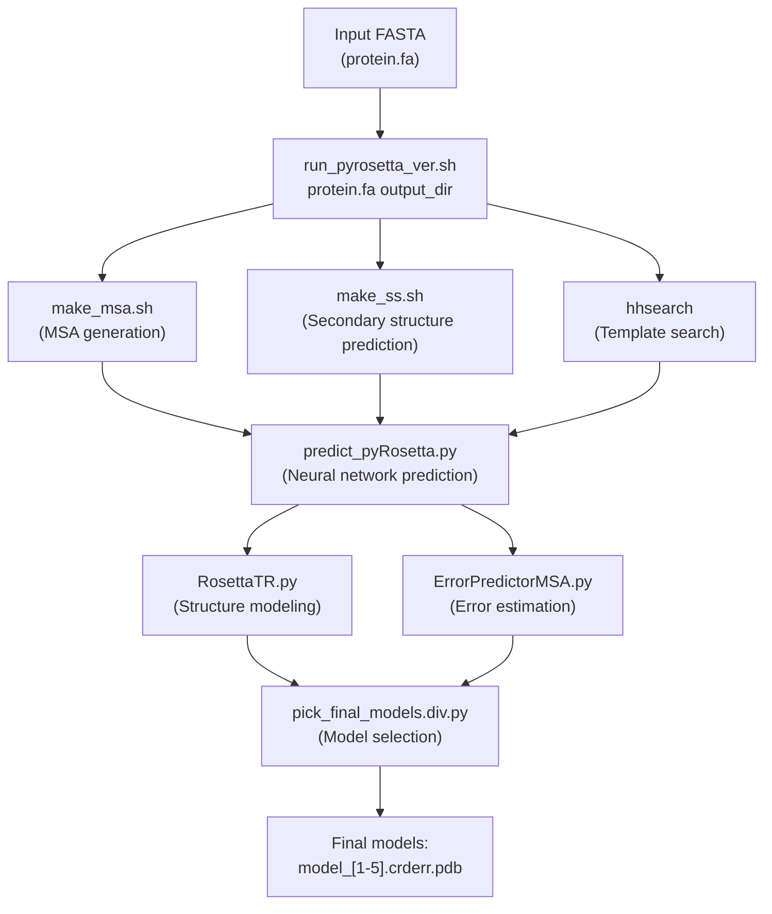
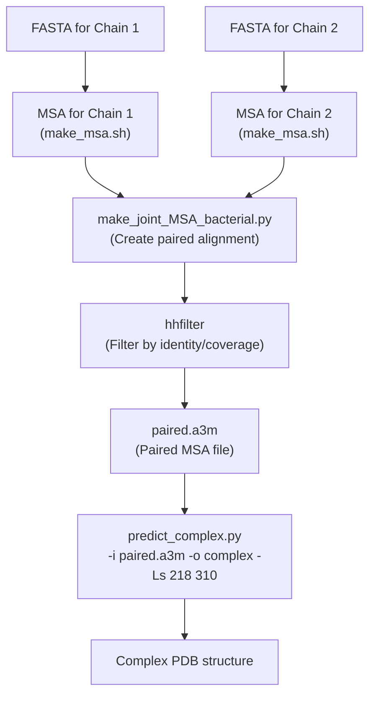
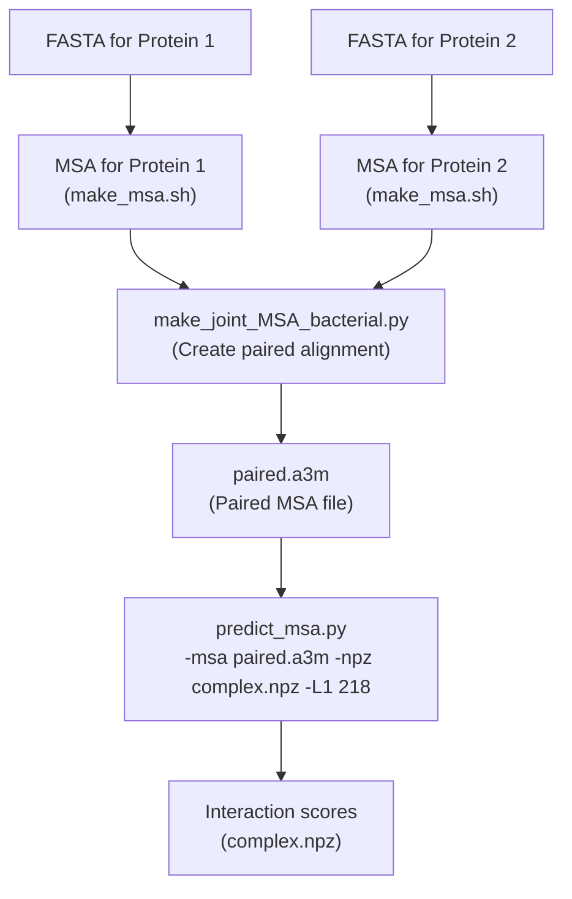

# Example Usage

> **Relevant source files**
> * [README.md](https://github.com/RosettaCommons/RoseTTAFold/blob/fcf9125c/README.md?plain=1)
> * [example/complex_modeling/complex.pdb](https://github.com/RosettaCommons/RoseTTAFold/blob/fcf9125c/example/complex_modeling/complex.pdb)
> * [example/complex_modeling/filtered.a3m](https://github.com/RosettaCommons/RoseTTAFold/blob/fcf9125c/example/complex_modeling/filtered.a3m)

This page provides concrete examples for using the RoseTTAFold system to predict protein structures. The document walks through the practical steps for running the different prediction pipelines with real-world protein sequences. For detailed information about specific components, see [RoseTTAFold Overview](/RosettaCommons/RoseTTAFold/1-rosettafold-overview), [Input Preparation Pipeline](/RosettaCommons/RoseTTAFold/3-input-preparation-pipeline), and [Prediction Pipelines](/RosettaCommons/RoseTTAFold/4-prediction-pipelines).

## Prediction Methods Overview

RoseTTAFold provides four main prediction methods, each optimized for different scenarios:



Sources: [README.md L60-L74](https://github.com/RosettaCommons/RoseTTAFold/blob/fcf9125c/README.md?plain=1#L60-L74)

## Comparison of Methods

| Method | Input | Output | Speed | Best For |
| --- | --- | --- | --- | --- |
| End-to-End | FASTA | Single model with confidence | Fastest | Quick single structure prediction |
| PyRosetta | FASTA | 5 diverse models | Slower | Higher quality structure prediction |
| Complex Modeling | Paired MSA | Complex structure | Medium | Multi-chain protein assemblies |
| PPI Screening (2-track) | Paired MSA | Interaction scores | Fast | Screening potential interactions |

Sources: [README.md L76-L78](https://github.com/RosettaCommons/RoseTTAFold/blob/fcf9125c/README.md?plain=1#L76-L78)

## Example 1: Monomer Structure Prediction (End-to-End Pipeline)

The end-to-end pipeline quickly predicts a single protein structure with confidence metrics.

### Workflow



Sources: [README.md L62-L65](https://github.com/RosettaCommons/RoseTTAFold/blob/fcf9125c/README.md?plain=1#L62-L65)

 [README.md L77](https://github.com/RosettaCommons/RoseTTAFold/blob/fcf9125c/README.md?plain=1#L77-L77)

### Step-by-Step Instructions

1. Prepare a FASTA file with your protein sequence (e.g., `protein.fa`)
2. Navigate to your working directory: ``` cd example ```
3. Run the end-to-end script: ``` ../run_e2e_ver.sh protein.fa output_dir ```

### Output

The main output is a single PDB file named `t000_.e2e.pdb` in your output directory. The B-factor column contains estimated residue-wise CA-lddt scores, which indicate confidence in the predicted positions (higher values indicate higher confidence).

Sources: [README.md L76-L78](https://github.com/RosettaCommons/RoseTTAFold/blob/fcf9125c/README.md?plain=1#L76-L78)

## Example 2: Monomer Structure Prediction (PyRosetta Pipeline)

The PyRosetta pipeline generates multiple diverse models with potentially higher accuracy.

### Workflow



Sources: [README.md L62-L65](https://github.com/RosettaCommons/RoseTTAFold/blob/fcf9125c/README.md?plain=1#L62-L65)

 [README.md L77](https://github.com/RosettaCommons/RoseTTAFold/blob/fcf9125c/README.md?plain=1#L77-L77)

### Requirements

Before using this pipeline, make sure you have:

1. PyRosetta installed in the folding environment
2. Activated the folding environment: ``` conda activate folding ```

### Step-by-Step Instructions

1. Prepare a FASTA file with your protein sequence (e.g., `protein.fa`)
2. Navigate to your working directory: ``` cd example ```
3. Run the PyRosetta script: ``` ../run_pyrosetta_ver.sh protein.fa output_dir ```

### Output

The PyRosetta pipeline produces five PDB models named `model/model_1.crderr.pdb` through `model/model_5.crderr.pdb`. The B-factor column contains estimated CA rms error, indicating the expected accuracy of each residue's position (lower values indicate higher confidence).

Sources: [README.md L76-L78](https://github.com/RosettaCommons/RoseTTAFold/blob/fcf9125c/README.md?plain=1#L76-L78)

## Example 3: Protein Complex Modeling

The complex modeling pipeline predicts the structure of multi-chain protein complexes.

### Workflow



Sources: [README.md L67-L70](https://github.com/RosettaCommons/RoseTTAFold/blob/fcf9125c/README.md?plain=1#L67-L70)

### Step-by-Step Instructions

1. Generate MSAs for each chain separately using `make_msa.sh`
2. Create a paired MSA file: ``` python make_joint_MSA_bacterial.py -i1 chain1.a3m -i2 chain2.a3m -o paired.a3m ```
3. Run the complex modeling: ``` python network/predict_complex.py -i paired.a3m -o complex -Ls 218 310 ``` Where: * `-i paired.a3m`: Input paired MSA file * `-o complex`: Output prefix * `-Ls 218 310`: Length of each chain (218 for chain 1, 310 for chain 2)

### Output

The output is a PDB file (e.g., `complex.pdb`) containing the predicted structure of the protein complex with multiple chains.

Sources: [README.md L67-L70](https://github.com/RosettaCommons/RoseTTAFold/blob/fcf9125c/README.md?plain=1#L67-L70)

 [example/complex_modeling/complex.pdb](https://github.com/RosettaCommons/RoseTTAFold/blob/fcf9125c/example/complex_modeling/complex.pdb)

## Example 4: Protein-Protein Interaction Screening

The 2-track network provides faster screening of potential protein-protein interactions.

### Workflow



Sources: [README.md L72-L73](https://github.com/RosettaCommons/RoseTTAFold/blob/fcf9125c/README.md?plain=1#L72-L73)

### Step-by-Step Instructions

1. Generate MSAs for each protein separately using `make_msa.sh`
2. Create a paired MSA file similar to complex modeling
3. Run the PPI screening: ``` python network_2track/predict_msa.py -msa paired.a3m -npz complex.npz -L1 218 ``` Where: * `-msa paired.a3m`: Input paired MSA file * `-npz complex.npz`: Output file for interaction scores * `-L1 218`: Length of the first protein (218 residues)

### Output

The output is an NPZ file containing interaction scores that can be used to assess the likelihood of interaction between the two proteins.

Sources: [README.md L72-L73](https://github.com/RosettaCommons/RoseTTAFold/blob/fcf9125c/README.md?plain=1#L72-L73)

## Practical Considerations

### Input Preparation Advice

* Input FASTA files should have clean headers and sequences
* Using sequence-specific MSAs can improve results
* For complex modeling, ensuring proper alignment of interacting regions is crucial

### Example FASTA Format

```
>protein_name
MKTVRQERLKSIVRILERSKEPVSGAQLAEELSVSRQVIVQDIAYLRSLGYNIVATPRGYVLAGG
```

### Resource Requirements

| Method | CPU Cores | Memory | GPU | Disk Space | Approx. Runtime |
| --- | --- | --- | --- | --- | --- |
| End-to-End | 4-8 | 16GB+ | Required | 2-5GB | 1-4 hours |
| PyRosetta | 4-8 | 32GB+ | Required | 5-10GB | 4-24 hours |
| Complex | 8+ | 32GB+ | Required | 10-20GB | 4-48 hours |
| PPI Screening | 4+ | 16GB+ | Required | 2-5GB | 1-2 hours |

### Submitting Jobs

For efficient resource usage on computing clusters, modify the provided bash scripts to submit separate jobs with appropriate dependencies:

* More CPUs/memory for MSA generation and template search
* GPUs for running the neural networks

Sources: [README.md L84-L85](https://github.com/RosettaCommons/RoseTTAFold/blob/fcf9125c/README.md?plain=1#L84-L85)

## Troubleshooting Common Issues

* **Segmentation fault during hhblits/hhsearch**: Try compiling hhsuite from source instead of using the conda version
* **Memory errors**: Increase available memory or reduce batch size if applicable
* **Missing models**: Check error logs for specific failures in the pipeline

Sources: [README.md L80-L82](https://github.com/RosettaCommons/RoseTTAFold/blob/fcf9125c/README.md?plain=1#L80-L82)