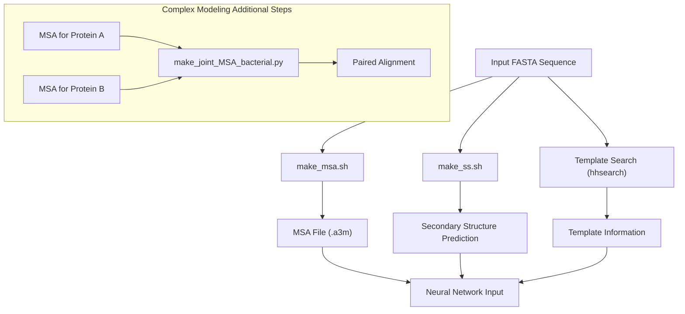
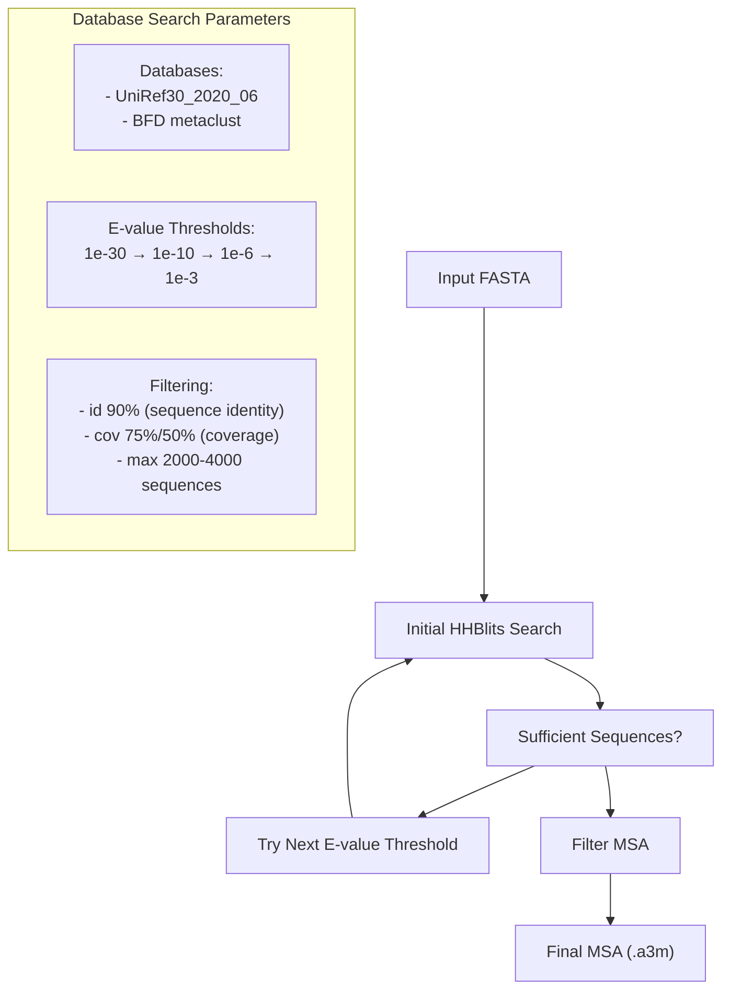
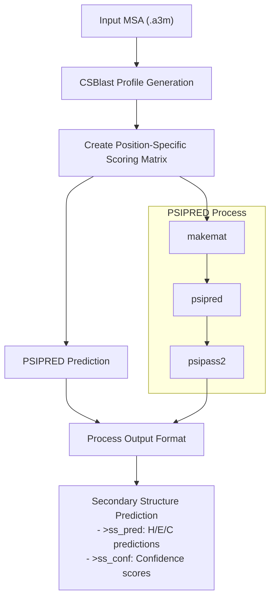

# Input Preparation Pipeline

> **Relevant source files**
> * [README.md](https://github.com/RosettaCommons/RoseTTAFold/blob/fcf9125c/README.md?plain=1)
> * [input_prep/make_msa.sh](https://github.com/RosettaCommons/RoseTTAFold/blob/fcf9125c/input_prep/make_msa.sh)
> * [input_prep/make_ss.sh](https://github.com/RosettaCommons/RoseTTAFold/blob/fcf9125c/input_prep/make_ss.sh)
> * [install_dependencies.sh](https://github.com/RosettaCommons/RoseTTAFold/blob/fcf9125c/install_dependencies.sh)

## Purpose and Scope

This page details the input preparation pipeline for RoseTTAFold, which is responsible for generating the data required before protein structure prediction can begin. This pipeline processes the initial protein sequence to create multiple sequence alignments (MSAs), secondary structure predictions, and template information. These outputs serve as the foundation for all subsequent prediction tasks in RoseTTAFold, including monomer structure prediction, complex modeling, and protein-protein interaction screening.

For information about how these prepared inputs are used in the various prediction methods, see [Prediction Pipelines](/RosettaCommons/RoseTTAFold/4-prediction-pipelines).

## Pipeline Overview

The input preparation pipeline consists of three primary components:

1. **MSA generation** - Creates evolutionary sequence profiles via database searches
2. **Secondary structure prediction** - Predicts protein secondary structure using PSIPRED
3. **Template search** - Identifies structural templates via HHSearch

These components work sequentially to transform a raw protein sequence (FASTA) into the rich, information-dense inputs required by RoseTTAFold's neural networks.



*Sources: mermaid diagram adapted from the "Data Processing and Input Preparation" diagram provided in the context*

## Required Resources and Databases

Before running the input preparation pipeline, you must have the following resources installed and configured:

1. **Sequence databases**: * UniRef30 (2020_06 release) - ~46GB * BFD (metaclust) - ~272GB
2. **Structure template database**: * PDB100 database - >100GB
3. **External tools**: * HHBlits/HHSearch - For sequence searching * PSIPRED - For secondary structure prediction * CSBlast - For profile generation

These resources can be installed following the instructions in the [Installation and Setup](/RosettaCommons/RoseTTAFold/2-installation-and-setup) page.

*Sources: [README.md L40-L56](https://github.com/RosettaCommons/RoseTTAFold/blob/fcf9125c/README.md?plain=1#L40-L56)

 [install_dependencies.sh L1-L27](https://github.com/RosettaCommons/RoseTTAFold/blob/fcf9125c/install_dependencies.sh#L1-L27)*

## MSA Generation

The Multiple Sequence Alignment (MSA) generation is handled by the `make_msa.sh` script, which performs iterative searches against large protein sequence databases to find homologous sequences.

### MSA Generation Process



### HHBlits Command Configuration

The MSA generation uses HHBlits with the following parameters:

* Maximum activation: 0.35 (`-mact 0.35`)
* Maximum filter: 100,000,000 (`-maxfilt 100000000`)
* Maximum Neff: 20 (`-neffmax 20`)
* Minimum coverage: 25% (`-cov 25`)
* 4 iterations (`-n 4`)

### MSA Filtering Strategy

The script employs a progressive search strategy that:

1. Starts with the strictest E-value threshold (1e-30)
2. Performs HHBlits search against each database
3. Filters results by sequence identity (90%) and coverage (75% or 50%)
4. Checks if sufficient sequences are found (>2000 for 75% coverage, >4000 for 50% coverage)
5. If not enough sequences, continues with less stringent E-value thresholds

This approach ensures high-quality MSAs while adapting to proteins with different levels of sequence conservation.

*Sources: [input_prep/make_msa.sh L1-L60](https://github.com/RosettaCommons/RoseTTAFold/blob/fcf9125c/input_prep/make_msa.sh#L1-L60)*

## Secondary Structure Prediction

Secondary structure prediction is performed using PSIPRED via the `make_ss.sh` script. This provides information about the likely helices, strands, and coils in the protein structure.



The script performs the following steps:

1. Converts the MSA to a checkpoint file using CSBlast
2. Creates a position-specific scoring matrix with `makemat`
3. Runs PSIPRED to predict secondary structure
4. Processes the output into the required format

The final output includes:

* Predicted secondary structure states (H=helix, E=strand, C=coil)
* Confidence values for each prediction

*Sources: [input_prep/make_ss.sh L1-L30](https://github.com/RosettaCommons/RoseTTAFold/blob/fcf9125c/input_prep/make_ss.sh#L1-L30)*

## Template Search

Although not provided in the code excerpts, the pipeline also performs a template search using HHSearch against the PDB100 database. This search identifies proteins with known 3D structures that have sequence similarity to the query protein.

The template information provides valuable structural constraints that can guide the prediction, especially for regions with good template coverage.

## Complex Modeling Preparation

For protein complex modeling, additional steps are required to create paired alignments between multiple protein chains:

1. Generate individual MSAs for each protein chain
2. Use `make_joint_MSA_bacterial.py` to identify co-evolved sequence pairs
3. Filter the paired alignment by identity and coverage

This process captures evolutionary coupling information between protein chains, which is crucial for predicting their interaction interfaces.

## Troubleshooting

Common issues that may arise during the input preparation process include:

1. **Segmentation faults in HHBlits/HHSearch** - As noted in the FAQ, this may be resolved by compiling HHSuite from source rather than using the conda version.
2. **Insufficient sequences in MSA** - For some proteins with few homologs, the MSA may contain very few sequences even at the most permissive E-value threshold. The pipeline is designed to handle this case by using whatever sequences are available.
3. **Large memory requirements** - The database searches, particularly against BFD, can require significant memory. The `make_msa.sh` script accepts a memory parameter to control this.

## Input Preparation Execution

The input preparation steps are typically executed as part of the main prediction scripts (`run_e2e_ver.sh` or `run_pyrosetta_ver.sh`), but they can also be run independently:

```markdown
# Generate MSA./input_prep/make_msa.sh input.fa output_dir [num_cpu] [memory_in_GB] # Predict secondary structure./input_prep/make_ss.sh output_dir/t000_.msa0.a3m output_dir/t000_.ss
```

For complex modeling, additional steps would be required to generate paired alignments after creating individual MSAs.

*Sources: [README.md L62-L68](https://github.com/RosettaCommons/RoseTTAFold/blob/fcf9125c/README.md?plain=1#L62-L68)*