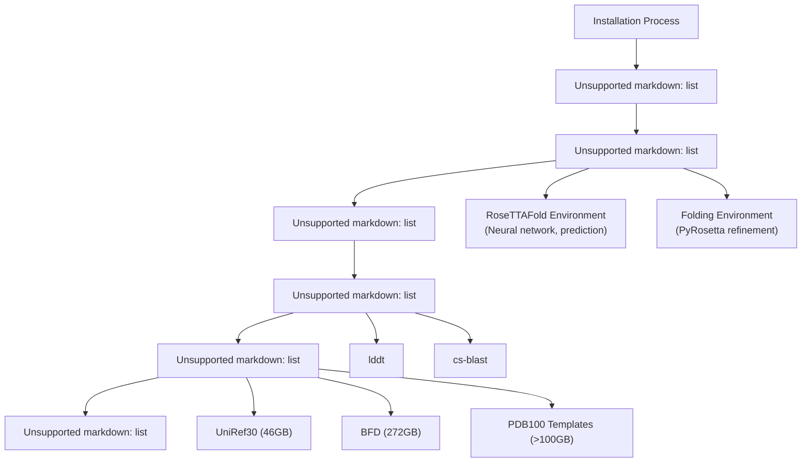
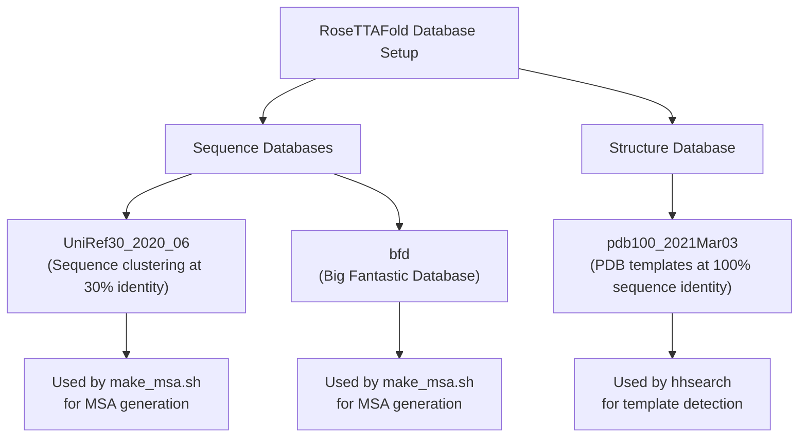
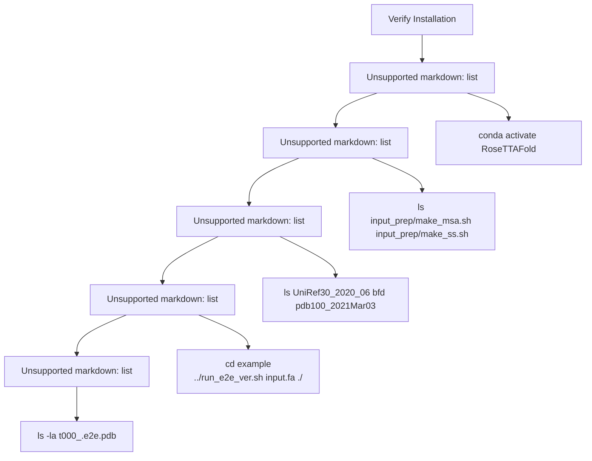

# Installation and Setup

> **Relevant source files**
> * [.gitignore](https://github.com/RosettaCommons/RoseTTAFold/blob/fcf9125c/.gitignore)
> * [README.md](https://github.com/RosettaCommons/RoseTTAFold/blob/fcf9125c/README.md?plain=1)
> * [RoseTTAFold-linux.yml](https://github.com/RosettaCommons/RoseTTAFold/blob/fcf9125c/RoseTTAFold-linux.yml)
> * [folding-linux.yml](https://github.com/RosettaCommons/RoseTTAFold/blob/fcf9125c/folding-linux.yml)
> * [input_prep/make_msa.sh](https://github.com/RosettaCommons/RoseTTAFold/blob/fcf9125c/input_prep/make_msa.sh)
> * [input_prep/make_ss.sh](https://github.com/RosettaCommons/RoseTTAFold/blob/fcf9125c/input_prep/make_ss.sh)
> * [install_dependencies.sh](https://github.com/RosettaCommons/RoseTTAFold/blob/fcf9125c/install_dependencies.sh)

This document provides comprehensive instructions for installing and configuring RoseTTAFold, a deep learning-based protein structure prediction system. It covers environment setup, dependency installation, neural network weight downloads, and database configuration required to run the system.

For information about using RoseTTAFold after installation, see [Input Preparation Pipeline](/RosettaCommons/RoseTTAFold/3-input-preparation-pipeline) and [Prediction Pipelines](/RosettaCommons/RoseTTAFold/4-prediction-pipelines).

## System Requirements

Before beginning installation, ensure your system meets these requirements:

* CUDA-capable GPU (NVIDIA) with at least 10GB VRAM
* At least 500GB free disk space (primarily for databases)
* Linux operating system (preferred)
* Sufficient RAM (16GB minimum, 32GB+ recommended)
* Git, wget, and conda package manager

## Installation Overview

The RoseTTAFold installation process involves several components that work together to form the complete system:



Sources: [README.md L5-L58](https://github.com/RosettaCommons/RoseTTAFold/blob/fcf9125c/README.md?plain=1#L5-L58)

## 1. Clone the Repository

First, clone the RoseTTAFold repository from GitHub:

```
git clone https://github.com/RosettaCommons/RoseTTAFold.gitcd RoseTTAFold
```

Sources: [README.md L7-L11](https://github.com/RosettaCommons/RoseTTAFold/blob/fcf9125c/README.md?plain=1#L7-L11)

## 2. Set Up Conda Environments

RoseTTAFold uses two separate conda environments:

1. **RoseTTAFold Environment** - For running the neural network models
2. **Folding Environment** - For PyRosetta-based structure refinement (only needed for the PyRosetta pipeline)

### 2.1 Create the RoseTTAFold Environment

Choose the appropriate environment file based on your CUDA version:

```sql
# If your NVIDIA driver is compatible with CUDA 11conda env create -f RoseTTAFold-linux.yml # If your NVIDIA driver is compatible with CUDA 10.1conda env create -f RoseTTAFold-linux-cu101.yml
```

This environment contains:

* PyTorch with CUDA support
* Biopython
* HHsuite
* PSIPRED
* Various network dependencies

### 2.2 Create the Folding Environment

Only required if you plan to use the PyRosetta pipeline:

```sql
conda env create -f folding-linux.yml
```

This environment contains:

* TensorFlow GPU
* pandas
* scikit-learn
* parallel (GNU parallel)

Sources: [README.md L13-L23](https://github.com/RosettaCommons/RoseTTAFold/blob/fcf9125c/README.md?plain=1#L13-L23)

 [RoseTTAFold-linux.yml L1-L109](https://github.com/RosettaCommons/RoseTTAFold/blob/fcf9125c/RoseTTAFold-linux.yml#L1-L109)

 [folding-linux.yml L1-L9](https://github.com/RosettaCommons/RoseTTAFold/blob/fcf9125c/folding-linux.yml#L1-L9)

## 3. Download Neural Network Weights

Download the pre-trained neural network weights:

```
wget https://files.ipd.uw.edu/pub/RoseTTAFold/weights.tar.gztar xfz weights.tar.gz
```

These weights include:

* `weights_3track.pt` - Main RoseTTAFold 3-track model
* `RF2t.pt` - 2-track model for PPI (Protein-Protein Interaction) screening

**Note:** The model weights are available for non-commercial use only under the Rosetta-DL Software license. See [https://files.ipd.uw.edu/pub/RoseTTAFold/Rosetta-DL_LICENSE.txt](https://files.ipd.uw.edu/pub/RoseTTAFold/Rosetta-DL_LICENSE.txt) for details.

Sources: [README.md L25-L33](https://github.com/RosettaCommons/RoseTTAFold/blob/fcf9125c/README.md?plain=1#L25-L33)

## 4. Install Third-Party Dependencies

Run the dependency installation script:

```
./install_dependencies.sh
```

This script installs:

* **lddt** - Tool for protein structure quality assessment
* **cs-blast** - Tool for context-specific sequence searches

The script automatically detects your operating system (Linux or macOS) and installs the appropriate versions.

Sources: [README.md L35-L38](https://github.com/RosettaCommons/RoseTTAFold/blob/fcf9125c/README.md?plain=1#L35-L38)

 [install_dependencies.sh L1-L28](https://github.com/RosettaCommons/RoseTTAFold/blob/fcf9125c/install_dependencies.sh#L1-L28)

## 5. Download Sequence and Structure Databases

RoseTTAFold requires several large databases for sequence searching and structure template identification. The total storage requirement exceeds 400GB.



### 5.1 Download UniRef30 (46GB)

```
wget http://wwwuser.gwdg.de/~compbiol/uniclust/2020_06/UniRef30_2020_06_hhsuite.tar.gzmkdir -p UniRef30_2020_06tar xfz UniRef30_2020_06_hhsuite.tar.gz -C ./UniRef30_2020_06
```

### 5.2 Download BFD (272GB)

```
wget https://bfd.mmseqs.com/bfd_metaclust_clu_complete_id30_c90_final_seq.sorted_opt.tar.gzmkdir -p bfdtar xfz bfd_metaclust_clu_complete_id30_c90_final_seq.sorted_opt.tar.gz -C ./bfd
```

### 5.3 Download PDB100 Templates (>100GB)

```
wget https://files.ipd.uw.edu/pub/RoseTTAFold/pdb100_2021Mar03.tar.gztar xfz pdb100_2021Mar03.tar.gz
```

**Note:** For CASP14 benchmarks, a different version was used: `https://files.ipd.uw.edu/pub/RoseTTAFold/pdb100_2020Mar11.tar.gz`

Sources: [README.md L40-L56](https://github.com/RosettaCommons/RoseTTAFold/blob/fcf9125c/README.md?plain=1#L40-L56)

 [input_prep/make_msa.sh L1-L60](https://github.com/RosettaCommons/RoseTTAFold/blob/fcf9125c/input_prep/make_msa.sh#L1-L60)

## 6. Install PyRosetta (For PyRosetta Pipeline Only)

If you plan to use the PyRosetta-based prediction pipeline (`run_pyrosetta_ver.sh`), you need to install PyRosetta in the folding environment:

1. Obtain a PyRosetta license from [https://els2.comotion.uw.edu/product/pyrosetta](https://els2.comotion.uw.edu/product/pyrosetta)
2. Download the appropriate PyRosetta package from [http://www.pyrosetta.org/downloads](http://www.pyrosetta.org/downloads)
3. Install PyRosetta in the folding environment:

```html
conda activate foldingpip install <path-to-downloaded-pyrosetta-file>
```

Sources: [README.md L58](https://github.com/RosettaCommons/RoseTTAFold/blob/fcf9125c/README.md?plain=1#L58-L58)

## 7. Environment Variables and File Paths

RoseTTAFold scripts expect certain environment variables to be set correctly for locating databases and tools. Create a setup script (e.g., `setup_env.sh`) with the following content:

```javascript
#!/bin/bash # Path to RoseTTAFold directoryexport PIPEDIR=/path/to/RoseTTAFold # Add cs-blast and lddt to PATHexport PATH=$PIPEDIR/csblast-2.2.3/bin:$PIPEDIR/lddt:$PATH # Set up HHLIB for HHsuiteexport HHLIB=$CONDA_PREFIX/share/hhsuite
```

Sources: [input_prep/make_msa.sh L15-L17](https://github.com/RosettaCommons/RoseTTAFold/blob/fcf9125c/input_prep/make_msa.sh#L15-L17)

## 8. Verifying Installation

To verify your installation is working correctly:



### 8.1 Basic Verification

1. Activate the RoseTTAFold environment: ``` conda activate RoseTTAFold ```
2. Verify that you can run the end-to-end prediction script on a small example: ``` cd example../run_e2e_ver.sh input.fa ./ ```
3. Check for the output PDB file: ``` ls -la t000_.e2e.pdb ```

### 8.2 Common Installation Issues

* **hhblits/hhsearch segmentation fault**: May require compiling hhsuite from source rather than using the conda version. See [GitHub](https://github.com/RosettaCommons/RoseTTAFold/blob/fcf9125c/GitHub)  for instructions.
* **Database path issues**: Ensure that the database paths in scripts are correctly set to your installation locations.
* **CUDA errors**: Verify that your CUDA version matches the one specified in the conda environment.

Sources: [README.md L80-L82](https://github.com/RosettaCommons/RoseTTAFold/blob/fcf9125c/README.md?plain=1#L80-L82)

## 9. Hardware Recommendations and Resource Usage

Different components of RoseTTAFold have different hardware requirements:

| Component | CPU Cores | RAM | GPU Memory | Disk Space |
| --- | --- | --- | --- | --- |
| MSA Generation (hhblits) | 8+ | 16GB+ | N/A | Input: SmallDatabase: 318GB |
| Neural Network Prediction | 2+ | 8GB+ | 10GB+ | Input: 1-10GBOutput: <1GB |
| PyRosetta Structure Modeling | 8+ | 16GB+ | 4GB+ | Input: <1GBOutput: <1GB |

For efficient usage in a cluster environment, consider splitting the pipeline steps into separate jobs with appropriate resource allocations.

Sources: [README.md L84-L85](https://github.com/RosettaCommons/RoseTTAFold/blob/fcf9125c/README.md?plain=1#L84-L85)

This completes the installation and setup of RoseTTAFold. For information on running predictions, see [Prediction Pipelines](/RosettaCommons/RoseTTAFold/4-prediction-pipelines).