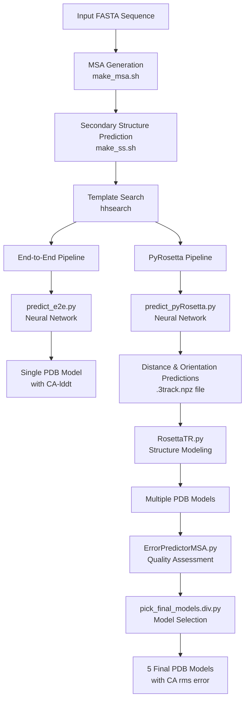
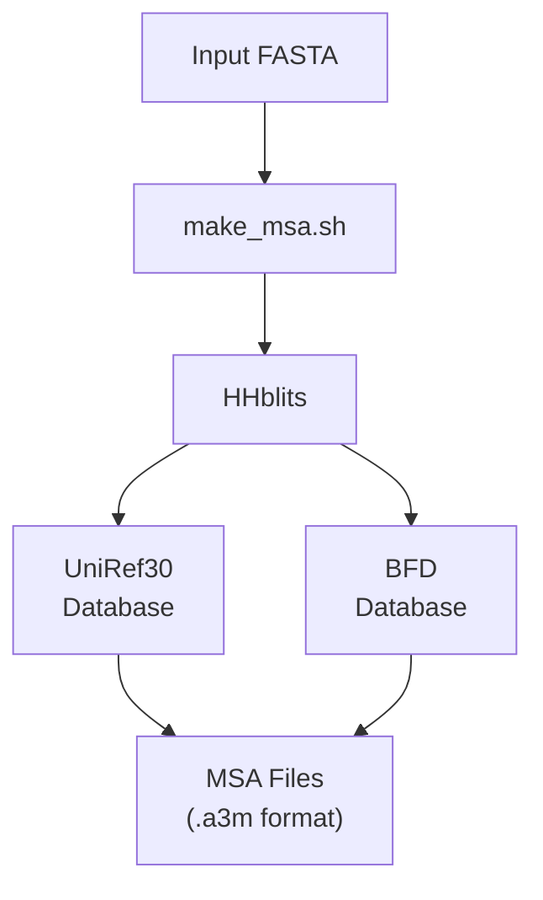
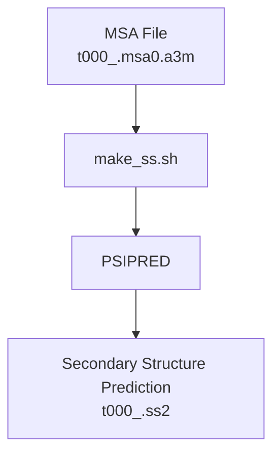
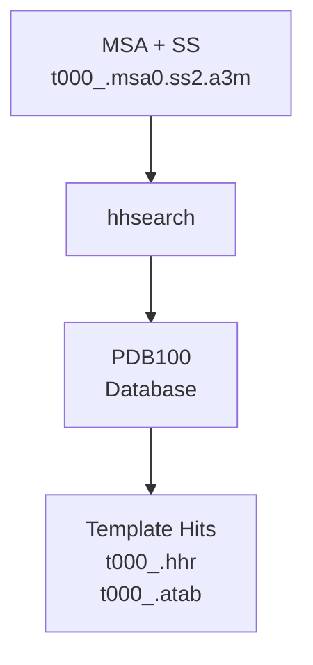
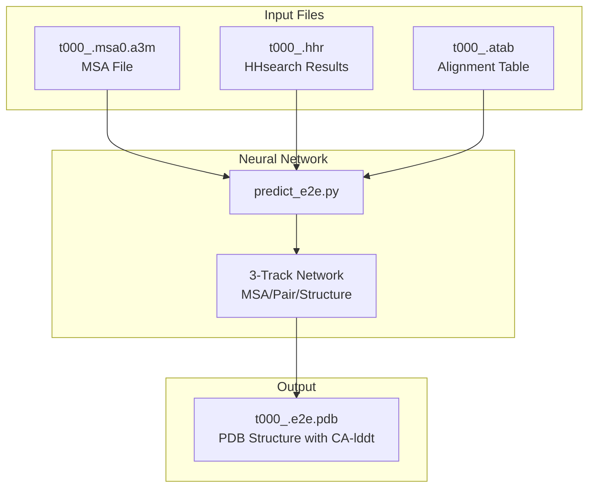
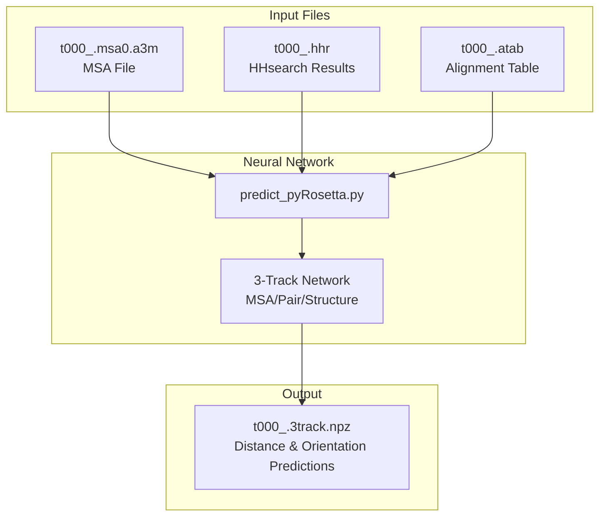
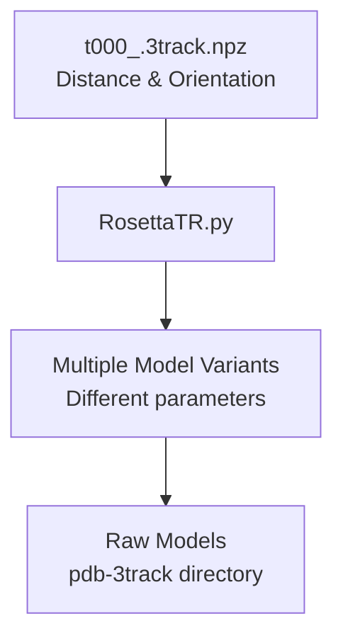
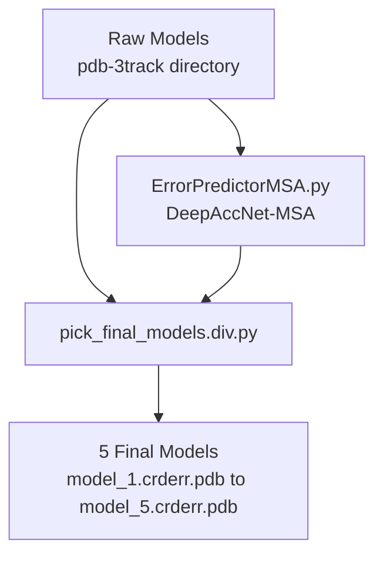

# Monomer Structure Prediction Example

> **Relevant source files**
> * [README.md](https://github.com/RosettaCommons/RoseTTAFold/blob/fcf9125c/README.md?plain=1)
> * [run_e2e_ver.sh](https://github.com/RosettaCommons/RoseTTAFold/blob/fcf9125c/run_e2e_ver.sh)
> * [run_pyrosetta_ver.sh](https://github.com/RosettaCommons/RoseTTAFold/blob/fcf9125c/run_pyrosetta_ver.sh)

## Purpose and Scope

This document provides a step-by-step guide for predicting a monomer protein structure using RoseTTAFold. It covers both the end-to-end (`run_e2e_ver.sh`) and PyRosetta (`run_pyrosetta_ver.sh`) prediction pipelines, demonstrating how to prepare inputs, execute predictions, and interpret the results. For information about predicting protein complexes, see [Complex Structure Prediction Example](/RosettaCommons/RoseTTAFold/7.2-complex-structure-prediction-example).

Sources: [README.md L62-L68](https://github.com/RosettaCommons/RoseTTAFold/blob/fcf9125c/README.md?plain=1#L62-L68)

 [README.md L76-L78](https://github.com/RosettaCommons/RoseTTAFold/blob/fcf9125c/README.md?plain=1#L76-L78)

## Prerequisites

Before running the prediction pipelines, ensure you have:

1. Installed RoseTTAFold following the instructions in [Installation and Setup](/RosettaCommons/RoseTTAFold/2-installation-and-setup)
2. Properly configured the required databases (UniRef30, BFD, PDB100)
3. Installed PyRosetta (required only for the PyRosetta pipeline)
4. A protein sequence in FASTA format

Sources: [README.md L5-L58](https://github.com/RosettaCommons/RoseTTAFold/blob/fcf9125c/README.md?plain=1#L5-L58)

## Workflow Overview



Sources: [run_e2e_ver.sh L31-L78](https://github.com/RosettaCommons/RoseTTAFold/blob/fcf9125c/run_e2e_ver.sh#L31-L78)

 [run_pyrosetta_ver.sh L31-L123](https://github.com/RosettaCommons/RoseTTAFold/blob/fcf9125c/run_pyrosetta_ver.sh#L31-L123)

## Common Input Preparation Steps

Both prediction pipelines share the same initial steps:

### 1. Prepare Input Sequence

Create a FASTA file containing your protein sequence:

```
>protein_name
SEQUENCE
```

### 2. Run MSA Generation

The script `make_msa.sh` uses HHblits to search UniRef30 and BFD databases to generate a multiple sequence alignment:



Generated files:

* `t000_.msa0.a3m`: Main MSA file used for structure prediction

Sources: [run_e2e_ver.sh L31-L38](https://github.com/RosettaCommons/RoseTTAFold/blob/fcf9125c/run_e2e_ver.sh#L31-L38)

 [run_pyrosetta_ver.sh L31-L38](https://github.com/RosettaCommons/RoseTTAFold/blob/fcf9125c/run_pyrosetta_ver.sh#L31-L38)

### 3. Predict Secondary Structure

The script `make_ss.sh` uses PSIPRED to predict secondary structure from the MSA:



Sources: [run_e2e_ver.sh L41-L48](https://github.com/RosettaCommons/RoseTTAFold/blob/fcf9125c/run_e2e_ver.sh#L41-L48)

 [run_pyrosetta_ver.sh L41-L48](https://github.com/RosettaCommons/RoseTTAFold/blob/fcf9125c/run_pyrosetta_ver.sh#L41-L48)

### 4. Search for Templates

HHsearch is used to search for structural templates in the PDB100 database:



Generated files:

* `t000_.hhr`: HHsearch results in human-readable format
* `t000_.atab`: Alignment in tabular format

Sources: [run_e2e_ver.sh L51-L61](https://github.com/RosettaCommons/RoseTTAFold/blob/fcf9125c/run_e2e_ver.sh#L51-L61)

 [run_pyrosetta_ver.sh L51-L61](https://github.com/RosettaCommons/RoseTTAFold/blob/fcf9125c/run_pyrosetta_ver.sh#L51-L61)

## End-to-End Prediction Pipeline

The end-to-end pipeline offers a faster, streamlined approach that directly predicts 3D coordinates:

### 1. Run Neural Network Prediction

The script uses `predict_e2e.py` to generate a structure model directly:



Command:

```
../run_e2e_ver.sh input.fa output_directory
```

Output:

* A single PDB file (`t000_.e2e.pdb`) containing the predicted structure
* B-factor column contains estimated residue-wise CA-lddt (local distance difference test) as a confidence metric

Sources: [run_e2e_ver.sh L64-L77](https://github.com/RosettaCommons/RoseTTAFold/blob/fcf9125c/run_e2e_ver.sh#L64-L77)

 [README.md L78](https://github.com/RosettaCommons/RoseTTAFold/blob/fcf9125c/README.md?plain=1#L78-L78)

## PyRosetta Prediction Pipeline

The PyRosetta pipeline offers higher-quality structure prediction by generating multiple models with Rosetta refinement:

### 1. Run Neural Network Prediction

The script uses `predict_pyRosetta.py` to predict distances and orientations:



Sources: [run_pyrosetta_ver.sh L64-L77](https://github.com/RosettaCommons/RoseTTAFold/blob/fcf9125c/run_pyrosetta_ver.sh#L64-L77)

### 2. Perform Structure Modeling

RosettaTR.py performs structure modeling using the predicted distances and orientations:



The script generates multiple models with different parameters:

* 3 modes (m = 0, 1, 2)
* 5 restraint weights (p = 0.05, 0.15, 0.25, 0.35, 0.45)
* Each parameter combination creates a model file named `model{i}_{m}_{p}.pdb`

Sources: [run_pyrosetta_ver.sh L80-L104](https://github.com/RosettaCommons/RoseTTAFold/blob/fcf9125c/run_pyrosetta_ver.sh#L80-L104)

### 3. Quality Assessment and Model Selection

The pipeline evaluates model quality using DeepAccNet-MSA and selects five diverse, high-quality models:



Output:

* Five PDB files named `model_1.crderr.pdb` through `model_5.crderr.pdb`
* B-factor column contains estimated CA-rms error as a confidence metric

Command:

```
../run_pyrosetta_ver.sh input.fa output_directory
```

Sources: [run_pyrosetta_ver.sh L106-L122](https://github.com/RosettaCommons/RoseTTAFold/blob/fcf9125c/run_pyrosetta_ver.sh#L106-L122)

 [README.md L77](https://github.com/RosettaCommons/RoseTTAFold/blob/fcf9125c/README.md?plain=1#L77-L77)

## Comparison of Methods

| Feature | End-to-End Pipeline | PyRosetta Pipeline |
| --- | --- | --- |
| Speed | Faster (single step) | Slower (multiple steps) |
| Output | Single model | Five diverse models |
| Quality metric | CA-lddt | CA-rms error |
| Dependencies | RoseTTAFold environment | RoseTTAFold + PyRosetta + folding environments |
| Best use case | Quick structure assessment | Higher-quality structure prediction |
| Script | `run_e2e_ver.sh` | `run_pyrosetta_ver.sh` |

Sources: [README.md L76-L78](https://github.com/RosettaCommons/RoseTTAFold/blob/fcf9125c/README.md?plain=1#L76-L78)

## Example Usage

To run a monomer structure prediction, navigate to your working directory and execute:

```markdown
# For end-to-end predictioncd example../run_e2e_ver.sh input.fa output_directory # For PyRosetta predictioncd example../run_pyrosetta_ver.sh input.fa output_directory
```

The scripts will:

1. Create a working directory if it doesn't exist
2. Generate all necessary intermediate files
3. Output final structure predictions in the specified directory

Sources: [README.md L62-L66](https://github.com/RosettaCommons/RoseTTAFold/blob/fcf9125c/README.md?plain=1#L62-L66)

## Output Interpretation

### End-to-End Model

* Single PDB file (`t000_.e2e.pdb`)
* B-factor column indicates predicted CA-lddt values
* Higher B-factor values (closer to 100) indicate higher confidence regions
* Regions with low B-factor values may be less accurately predicted

### PyRosetta Models

* Five PDB files (`model_1.crderr.pdb` through `model_5.crderr.pdb`)
* B-factor column indicates estimated CA-rms error
* Lower B-factor values indicate higher confidence regions
* Models are selected for both quality and structural diversity
* Comparing the models can provide insights into flexible or uncertain regions

Sources: [README.md L76-L78](https://github.com/RosettaCommons/RoseTTAFold/blob/fcf9125c/README.md?plain=1#L76-L78)

## Troubleshooting

### Common Issues

* Segmentation fault during HHblits/HHsearch: Try compiling HHsuite from source instead of using the conda version
* Resource limitations: Consider modifying the scripts to submit separate jobs for computationally intensive steps
* For large proteins, increase the memory allocation in the script variables (`MEM` parameter)

Sources: [README.md L80-L85](https://github.com/RosettaCommons/RoseTTAFold/blob/fcf9125c/README.md?plain=1#L80-L85)