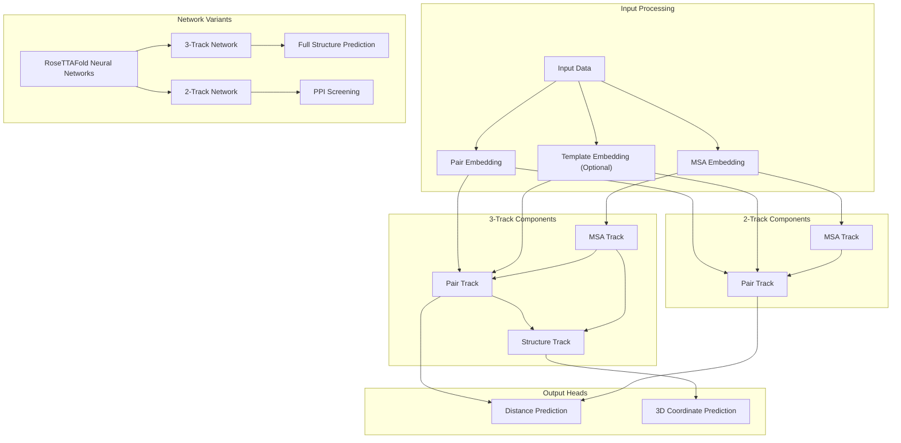
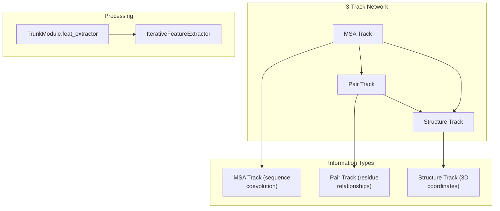
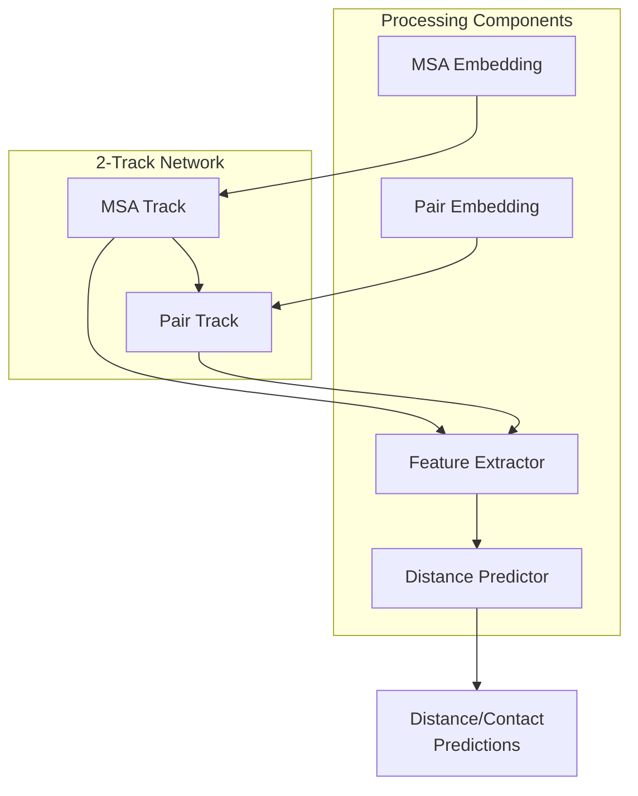
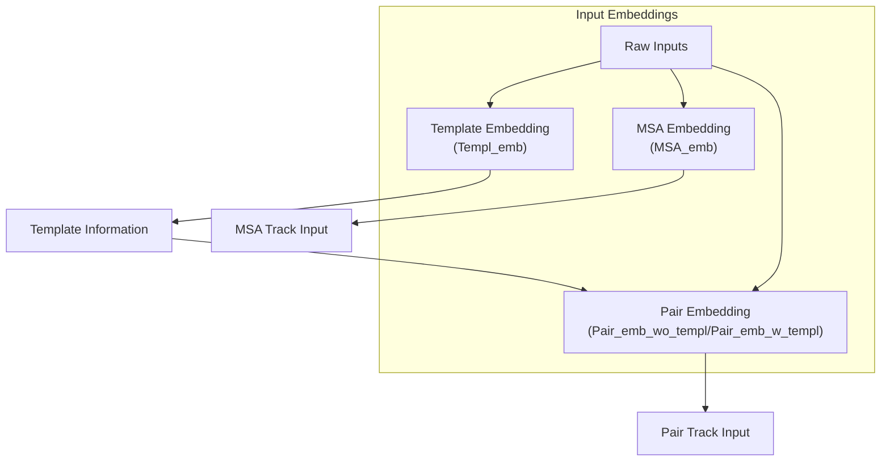
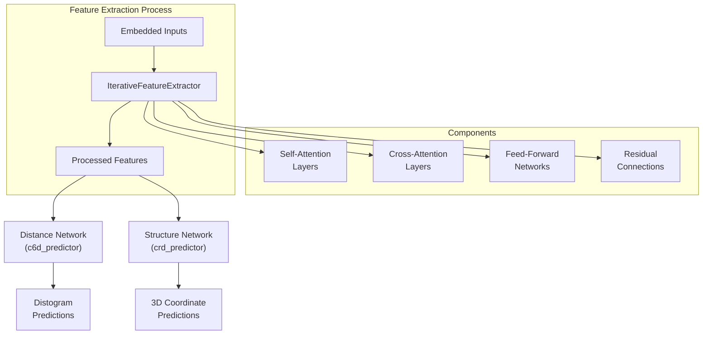
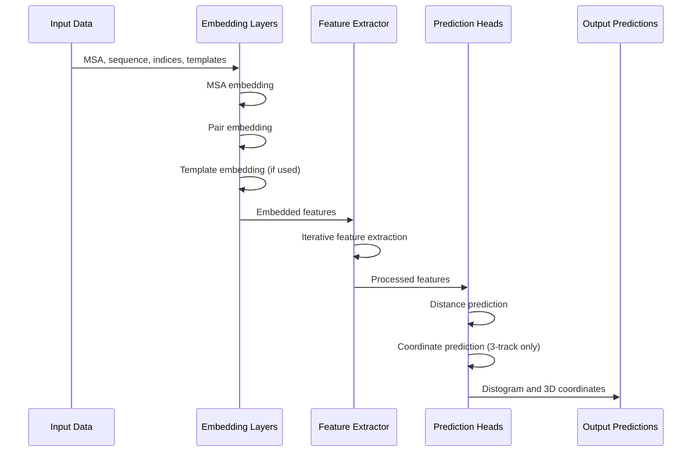

# Neural Network Architecture

> **Relevant source files**
> * [README.md](https://github.com/RosettaCommons/RoseTTAFold/blob/fcf9125c/README.md?plain=1)
> * [network_2track/TrunkModel.py](https://github.com/RosettaCommons/RoseTTAFold/blob/fcf9125c/network_2track/TrunkModel.py)

This document provides a detailed explanation of the neural network architecture used in RoseTTAFold. It covers the core design of the 3-track and 2-track networks that power RoseTTAFold's protein structure prediction capabilities. For specific information about the differences between these network variants, see [3-Track vs 2-Track Networks](/RosettaCommons/RoseTTAFold/5.1-3-track-vs-2-track-networks). For details on the attention mechanisms used throughout the architecture, see [Attention Mechanisms](/RosettaCommons/RoseTTAFold/5.2-attention-mechanisms).

## Core Architecture Overview

RoseTTAFold uses a novel multi-track neural network architecture to process and integrate different types of information about protein sequences. The architecture comes in two main variants:

1. **3-Track Network** - Used for full structure prediction in both end-to-end and PyRosetta pipelines, as well as complex modeling
2. **2-Track Network** - Used for faster protein-protein interaction (PPI) screening

Both architectures share similar design principles but differ in their complexity and output capabilities.

Sources: [network_2track/TrunkModel.py L8-L44](https://github.com/RosettaCommons/RoseTTAFold/blob/fcf9125c/network_2track/TrunkModel.py#L8-L44)

## The 3-Track Neural Network

The 3-track network is the more comprehensive architecture in RoseTTAFold, consisting of three interconnected tracks that process different aspects of protein information:

Sources: [network_2track/TrunkModel.py L26-L36](https://github.com/RosettaCommons/RoseTTAFold/blob/fcf9125c/network_2track/TrunkModel.py#L26-L36)

### MSA Track

The MSA (Multiple Sequence Alignment) track processes evolutionary information from homologous protein sequences. It captures coevolutionary patterns that are crucial for predicting residue contacts.

* **Dimensions**: Operates on data of shape `[batch_size, num_sequences, sequence_length, d_msa]`
* **Core operations**: Self-attention across sequences and positions
* **Implemented via**: MSA embedding (`MSA_emb` class) and attention mechanisms

### Pair Track

The Pair track processes pairwise relationships between residues, incorporating both sequence information and optionally template information.

* **Dimensions**: Operates on data of shape `[batch_size, sequence_length, sequence_length, d_pair]`
* **Core operations**: Self-attention across residue pairs, receives information from MSA track
* **Implemented via**: Pair embedding (`Pair_emb_w_templ` or `Pair_emb_wo_templ` classes)

### Structure Track

The Structure track processes and refines 3D structural information, ultimately producing the final protein structure prediction.

* **Dimensions**: Operates on data representing 3D coordinates and orientations
* **Core operations**: SE(3)-equivariant transformations, receives information from both MSA and Pair tracks
* **Output**: 3D coordinates and orientations for each residue

## The 2-Track Neural Network

The 2-Track network is a simplified version that omits the Structure track, making it more efficient for tasks that don't require full 3D structure prediction, such as protein-protein interaction screening.

Sources: [network_2track/TrunkModel.py L8-L44](https://github.com/RosettaCommons/RoseTTAFold/blob/fcf9125c/network_2track/TrunkModel.py#L8-L44)

 [network_2track/TrunkModel.py L54-L63](https://github.com/RosettaCommons/RoseTTAFold/blob/fcf9125c/network_2track/TrunkModel.py#L54-L63)

## Input Embedding Layers

The network begins with several embedding layers that transform raw input data into learnable representations:

Sources: [network_2track/TrunkModel.py L18-L24](https://github.com/RosettaCommons/RoseTTAFold/blob/fcf9125c/network_2track/TrunkModel.py#L18-L24)

### MSA Embedding

The MSA embedding layer transforms the raw multiple sequence alignment into learned representations:

* **Input**: One-hot encoded MSA data
* **Implementation**: `MSA_emb` class with positional encoding
* **Parameters**: Dimension `d_msa` (typically 64), dropout rate `p_drop`
* **Output**: Embedded MSA features of shape `[batch_size, num_sequences, sequence_length, d_msa]`

### Pair Embedding

The Pair embedding layer generates pairwise features from sequence information and optionally from template structures:

* **Without templates**: `Pair_emb_wo_templ` creates embeddings from sequence information only
* **With templates**: `Pair_emb_w_templ` incorporates template structure information
* **Output**: Pairwise features of shape `[batch_size, sequence_length, sequence_length, d_pair]`

### Template Embedding

When available, template information from known structures can be incorporated:

* **Implementation**: `Templ_emb` class using attention mechanisms
* **Parameters**: Dimension `d_templ` (typically 64), attention heads `n_head_templ`
* **Used by**: The Pair embedding when templates are available

## Feature Extraction and Processing

The core of the network is the iterative feature extractor, which processes information through multiple layers and facilitates information exchange between tracks:

Sources: [network_2track/TrunkModel.py L26-L43](https://github.com/RosettaCommons/RoseTTAFold/blob/fcf9125c/network_2track/TrunkModel.py#L26-L43)

 [network_2track/TrunkModel.py L56-L62](https://github.com/RosettaCommons/RoseTTAFold/blob/fcf9125c/network_2track/TrunkModel.py#L56-L62)

### Iterative Feature Extractor

The `IterativeFeatureExtractor` is the main processing component that iteratively refines the features across tracks:

* **Configuration**: * `n_module`: Number of iteration modules (typically 4) * `n_layer`: Number of attention layers per module (typically 4) * Attention heads: `n_head_msa` for MSA track, `n_head_pair` for Pair track * Feed-forward ratio: `r_ff` (typically 4) * Dropout rate: `p_drop` for regularization
* **Operation**: Performs iterative refinement through a series of self-attention, cross-attention, and feed-forward layers with residual connections

### Performer Attention

RoseTTAFold uses Performer attention, an efficient approximation of the standard attention mechanism that scales better with sequence length:

* **Configuration**: Through `performer_L_opts` for sequence dimension and `performer_N_opts` for MSA dimension
* **Implementation**: Based on the Performer architecture (see credit in the GitHub README)

## Prediction Heads

The final components of the network are the prediction heads that transform the processed features into structure predictions:

### Distance Prediction Network

The Distance Network predicts pairwise distances and orientations between residues:

* **Implementation**: `DistanceNetwork` class with bottleneck architecture
* **Input**: Processed pair features
* **Output**: Logits representing distance and orientation predictions (distogram)

### Coordinate Prediction Network

The Structure Network predicts 3D coordinates and orientations for each residue:

* **Implementation**: `InitStr_Network` class
* **Input**: Processed features from all tracks
* **Output**: 3D coordinates and orientations for each residue
* **Only present in**: 3-track architecture

## Forward Pass Through the Network

The forward pass through the `TrunkModule` (the main network class) follows these steps:

1. Embed the inputs (MSA, sequence, and optionally templates)
2. Process the embedded features through the iterative feature extractor
3. Generate predictions: * For 3-track networks: both distance predictions and 3D coordinates * For 2-track networks: only distance predictions

Sources: [network_2track/TrunkModel.py L45-L64](https://github.com/RosettaCommons/RoseTTAFold/blob/fcf9125c/network_2track/TrunkModel.py#L45-L64)

## Model Configurations and Parameters

The RoseTTAFold neural network can be configured with different parameters depending on the specific task:

| Parameter | Description | Typical Value | Notes |
| --- | --- | --- | --- |
| `d_msa` | Dimension of MSA embeddings | 64 | Higher values capture more evolutionary information |
| `d_pair` | Dimension of pair embeddings | 128 | Higher values capture more residue relationship information |
| `d_templ` | Dimension of template embeddings | 64 | Used only when templates are available |
| `n_head_msa` | Number of attention heads for MSA | 4 |  |
| `n_head_pair` | Number of attention heads for pairs | 8 |  |
| `n_module` | Number of iteration modules | 4 | More modules typically improve accuracy at cost of computation |
| `n_layer` | Number of attention layers per module | 4 |  |
| `p_drop` | Dropout probability | 0.1 | For regularization |
| `use_templ` | Whether to use template information | True/False | Templates improve accuracy when available |

Sources: [network_2track/TrunkModel.py L8-L17](https://github.com/RosettaCommons/RoseTTAFold/blob/fcf9125c/network_2track/TrunkModel.py#L8-L17)

## Integration with Prediction Pipelines

The neural network architecture is the core component of RoseTTAFold's prediction pipelines:

* **End-to-End Pipeline**: Uses the 3-track network to directly predict 3D structures
* **PyRosetta Pipeline**: Uses the 3-track network to predict distances and angles, which are then refined with PyRosetta
* **Complex Modeling**: Uses the 3-track network with specialized processing for protein complexes
* **PPI Screening**: Uses the 2-track network for faster protein-protein interaction prediction

For detailed information about these prediction pipelines, see [Prediction Pipelines](/RosettaCommons/RoseTTAFold/4-prediction-pipelines).