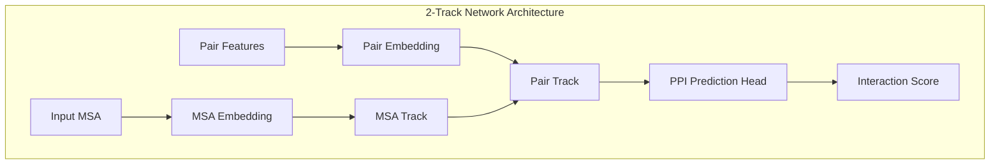
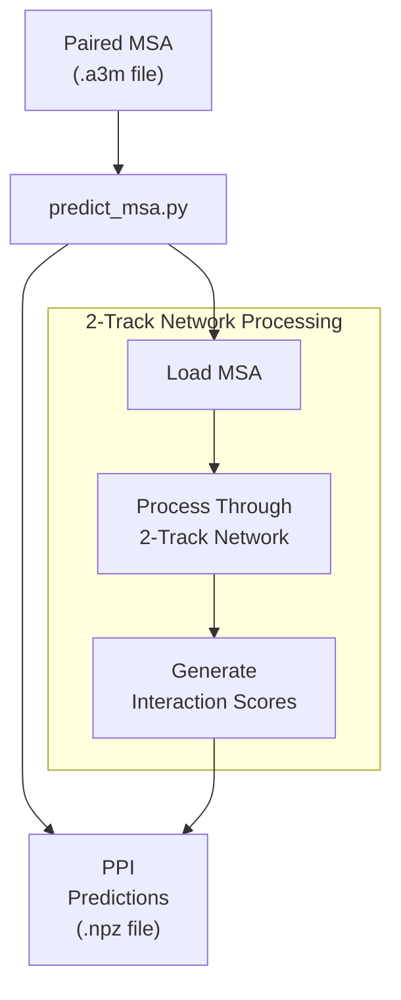
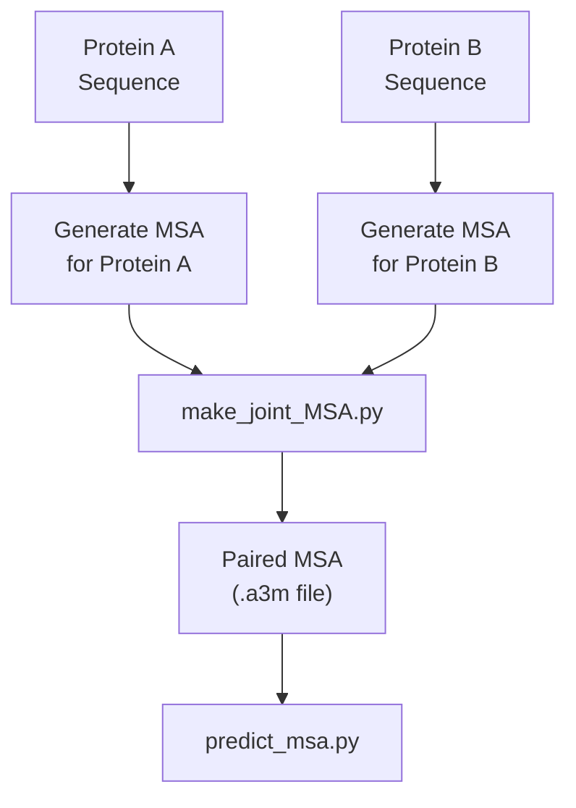
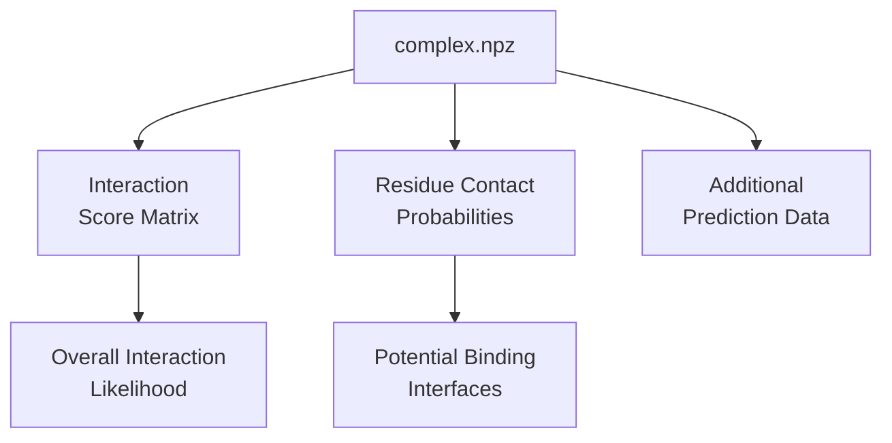
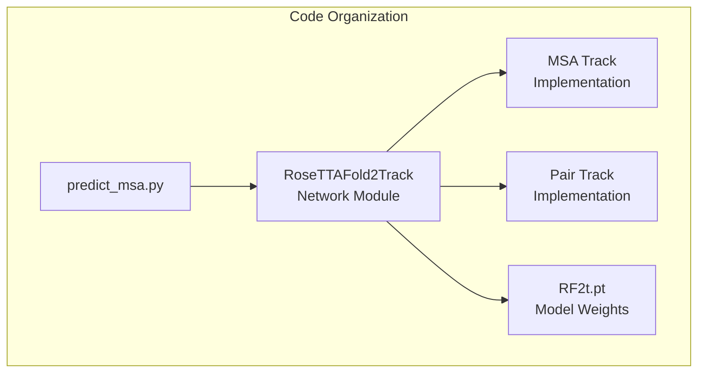

# PPI Screening

> **Relevant source files**
> * [README.md](https://github.com/RosettaCommons/RoseTTAFold/blob/fcf9125c/README.md?plain=1)
> * [example/complex_2track/complex.npz](https://github.com/RosettaCommons/RoseTTAFold/blob/fcf9125c/example/complex_2track/complex.npz)
> * [example/complex_2track/input.a3m](https://github.com/RosettaCommons/RoseTTAFold/blob/fcf9125c/example/complex_2track/input.a3m)

## Purpose and Scope

This document explains how to use the 2-track neural network in RoseTTAFold for protein-protein interaction (PPI) screening. Unlike the structure prediction pipelines that generate 3D coordinates (see [End-to-End Prediction](/RosettaCommons/RoseTTAFold/4.1-end-to-end-prediction), [PyRosetta Prediction](/RosettaCommons/RoseTTAFold/4.2-pyrosetta-prediction), and [Complex Modeling](/RosettaCommons/RoseTTAFold/4.3-complex-modeling)), PPI screening focuses on rapidly identifying potential interactions between proteins without generating full structural models.

The 2-track network provides a lightweight, computationally efficient approach designed specifically for high-throughput screening of protein-protein interactions. This functionality is particularly useful when you need to evaluate many potential protein interactions quickly.

## 2-Track Network Architecture

The PPI screening pipeline uses a simplified 2-track neural network architecture compared to the full 3-track network used in structure prediction.



Sources: [README.md L28](https://github.com/RosettaCommons/RoseTTAFold/blob/fcf9125c/README.md?plain=1#L28-L28)

The 2-track architecture consists of:

1. **MSA Track**: Processes multiple sequence alignment information
2. **Pair Track**: Processes residue pair relationships

Unlike the 3-track network, it omits the structure track which would compute 3D coordinates, making it computationally lighter while still capturing sufficient information to predict interactions.

## Workflow

The PPI screening workflow follows these steps:



Sources: [README.md L72-L73](https://github.com/RosettaCommons/RoseTTAFold/blob/fcf9125c/README.md?plain=1#L72-L73)

## Input Requirements

The PPI screening pipeline requires a paired multiple sequence alignment (MSA) file in A3M format as input. This file should contain aligned sequences of both interaction partners.

To generate a paired MSA for PPI screening:



Sources: [README.md L72-L73](https://github.com/RosettaCommons/RoseTTAFold/blob/fcf9125c/README.md?plain=1#L72-L73)

## Running the PPI Screening

To run the PPI screening, use the `predict_msa.py` script from the `network_2track` directory:

```
python network_2track/predict_msa.py -msa [paired MSA file in a3m format] -npz [output npz file name] -L1 [Length of first chain]
```

### Parameters

| Parameter | Description | Example |
| --- | --- | --- |
| `-msa` | Path to the paired MSA file in A3M format | `-msa input.a3m` |
| `-npz` | Output NPZ filename | `-npz complex.npz` |
| `-L1` | Length of the first protein chain | `-L1 218` |

### Example Usage

```
python network_2track/predict_msa.py -msa input.a3m -npz complex.npz -L1 218
```

Sources: [README.md L72-L73](https://github.com/RosettaCommons/RoseTTAFold/blob/fcf9125c/README.md?plain=1#L72-L73)

## Output Interpretation

The PPI screening pipeline produces an NPZ file containing predicted interaction scores and related data:



Sources: [README.md L72-L73](https://github.com/RosettaCommons/RoseTTAFold/blob/fcf9125c/README.md?plain=1#L72-L73)

The output NPZ file contains a matrix of predicted probabilities for residue-residue contacts between the two proteins. Higher values indicate stronger predicted interactions. The overall interaction score can be derived from these contact probabilities.

## 2-Track vs. 3-Track Comparison

The following table compares the 2-track PPI screening approach with the 3-track structure prediction approach:

| Feature | 2-Track (PPI Screening) | 3-Track (Structure Prediction) |
| --- | --- | --- |
| Purpose | Interaction prediction | Full structure prediction |
| Computational cost | Lower | Higher |
| Memory requirements | Lower | Higher |
| Output | Interaction scores (.npz) | 3D structural models (.pdb) |
| Processing speed | Faster | Slower |
| Components | MSA + Pair tracks | MSA + Pair + Structure tracks |
| Use case | High-throughput screening | Detailed structural analysis |

Sources: [README.md L28](https://github.com/RosettaCommons/RoseTTAFold/blob/fcf9125c/README.md?plain=1#L28-L28)

## Technical Implementation

The implementation of the 2-track network follows a similar pattern to the 3-track network, but with the structure track removed. The model weights for the 2-track network are stored in the `RF2t.pt` file, which is included in the weights download.



Sources: [README.md L28](https://github.com/RosettaCommons/RoseTTAFold/blob/fcf9125c/README.md?plain=1#L28-L28)

 [README.md L72-L73](https://github.com/RosettaCommons/RoseTTAFold/blob/fcf9125c/README.md?plain=1#L72-L73)

## Performance Considerations

The 2-track network is optimized for screening purposes, not for generating accurate structural models. Consider the following when using this pipeline:

1. **Speed vs. Accuracy**: The 2-track network trades structural accuracy for computational efficiency, making it ideal for initial screening of many potential interactions.
2. **Memory Usage**: While lower than the 3-track network, processing large proteins may still require significant memory.
3. **Preprocessing Requirements**: Like other RoseTTAFold pipelines, the quality of the input MSA significantly affects prediction accuracy.
4. **Large-Scale Applications**: The 2-track network was used for yeast PPI screening, demonstrating its suitability for proteome-scale interaction analysis.

Sources: [README.md L28](https://github.com/RosettaCommons/RoseTTAFold/blob/fcf9125c/README.md?plain=1#L28-L28)

## Conclusion

The PPI screening functionality in RoseTTAFold provides a fast and efficient way to predict protein-protein interactions using a simplified 2-track neural network architecture. By omitting the structure track used in full structure prediction, it offers a computationally efficient approach suitable for high-throughput screening while still leveraging the power of RoseTTAFold's deep learning capabilities.

When you need to screen many potential protein interactions quickly, the 2-track PPI screening is the recommended approach rather than running the more computationally intensive structure prediction pipelines.