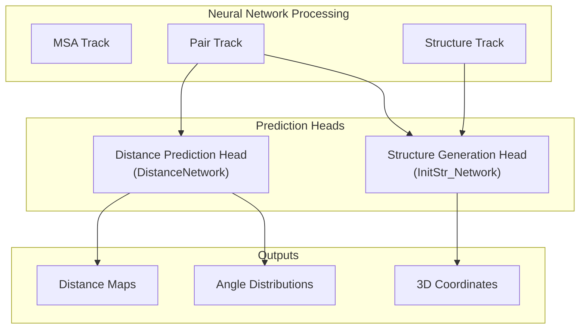
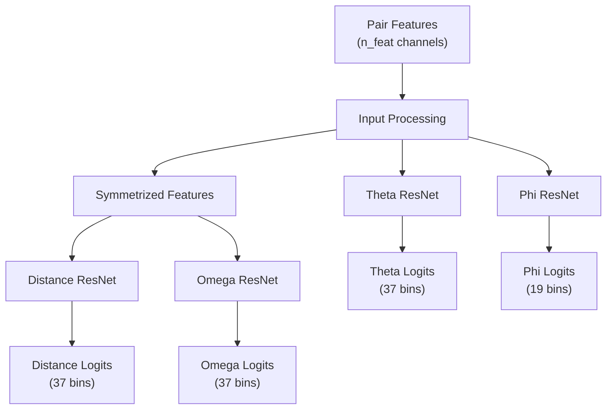
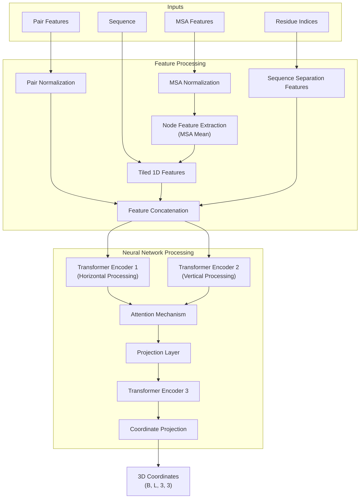
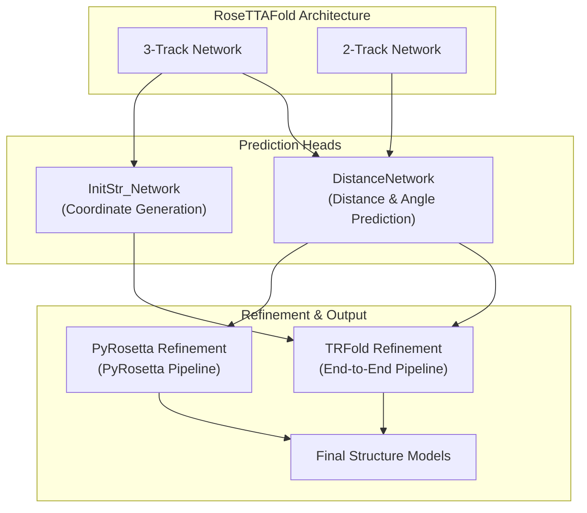

# Prediction Heads

> **Relevant source files**
> * [network_2track/DistancePredictor.py](https://github.com/RosettaCommons/RoseTTAFold/blob/fcf9125c/network_2track/DistancePredictor.py)
> * [network_2track/InitStrGenerator.py](https://github.com/RosettaCommons/RoseTTAFold/blob/fcf9125c/network_2track/InitStrGenerator.py)

## Purpose and Scope

This document details the prediction heads used in RoseTTAFold's neural network architecture to convert the learned protein representations into specific outputs. These heads are specialized components that transform the network's internal representations into biologically relevant predictions, primarily:

1. **Distance and angle predictions** - Converting pair representations into inter-residue distances and angles
2. **3D coordinate predictions** - Generating the actual 3D coordinates of protein structures

For information about the neural network architecture that feeds into these prediction heads, see [3-Track vs 2-Track Networks](/RosettaCommons/RoseTTAFold/5.1-3-track-vs-2-track-networks). For information about how input data is initially processed, see [Embedding Layers](/RosettaCommons/RoseTTAFold/5.3-embedding-layers).

## Overview of Prediction Heads

RoseTTAFold's prediction heads serve as the final transformation layers that convert learned representations into actionable outputs. They take the information encoded in the network's intermediate representations and produce predictions that can be directly interpreted in a biological context.



Sources: [network_2track/DistancePredictor.py](https://github.com/RosettaCommons/RoseTTAFold/blob/fcf9125c/network_2track/DistancePredictor.py)

 [network_2track/InitStrGenerator.py](https://github.com/RosettaCommons/RoseTTAFold/blob/fcf9125c/network_2track/InitStrGenerator.py)

## Distance Prediction Head

The distance prediction head is implemented in the `DistanceNetwork` class and is responsible for predicting various geometric relationships between residue pairs, which are essential for determining protein structure.

### Architecture and Components

The `DistanceNetwork` class uses multiple residual networks to predict four key structural features:



Sources: [network_2track/DistancePredictor.py L8-L28](https://github.com/RosettaCommons/RoseTTAFold/blob/fcf9125c/network_2track/DistancePredictor.py#L8-L28)

### Prediction Types

The distance prediction head outputs four types of predictions:

1. **Distance logits** - Predict the distribution of distances between residue pairs
2. **Omega angle logits** - Predict the dihedral angle between four atoms: Cα(i), Cβ(i), Cβ(j), and Cα(j)
3. **Theta angle logits** - Predict the angle between Cα(i), Cβ(i), and Cβ(j)
4. **Phi angle logits** - Predict the angle between Cβ(i), Cβ(j), and Cα(j)

Each prediction is represented as a probability distribution across discrete bins, allowing the model to express uncertainty about its predictions.

### Symmetry Considerations

An important architectural detail is the handling of symmetry:

* **Distance and omega predictions** are symmetric with respect to residue order (i,j vs j,i)
* **Theta and phi predictions** are non-symmetric and depend on the order of residues

This is reflected in the implementation where the input is symmetrized (averaged with its transpose) only for distance and omega predictions:

```markdown
# For symmetric predictions (distance and omega)x = 0.5 * (x + x.permute(0,1,3,2))
```

Sources: [network_2track/DistancePredictor.py L23-L26](https://github.com/RosettaCommons/RoseTTAFold/blob/fcf9125c/network_2track/DistancePredictor.py#L23-L26)

## Structure Generation Head

The structure generation head is implemented in the `InitStr_Network` class and produces the actual 3D coordinates of the protein backbone atoms.

### Architecture and Components



Sources: [network_2track/InitStrGenerator.py L63-L114](https://github.com/RosettaCommons/RoseTTAFold/blob/fcf9125c/network_2track/InitStrGenerator.py#L63-L114)

### Input Processing

The structure generation head takes four inputs:

1. **MSA features** - Information from multiple sequence alignment
2. **Pair features** - Pairwise relationships between residues
3. **Sequence** - The target protein sequence
4. **Residue indices** - Position information for each residue

These inputs undergo several processing steps:

* Normalization of MSA and pair features
* Extraction of node features by averaging across the MSA
* Generation of tiled 1D features and sequence separation features
* Concatenation of all features

### Coordinate Prediction Pipeline

The processed features then flow through a sophisticated neural network pipeline:

1. **Transformer Processing**: * Encoder 1 processes pair information horizontally (B*L, L, d_hidden) * Encoder 2 processes pair information vertically (B*L, L, d_hidden) * Results are concatenated and attended over using an attention mechanism * A projection layer reduces dimensionality * Encoder 3 performs final processing
2. **Coordinate Generation**: * The final projection layer maps to 9-dimensional outputs * These are reshaped to (B, L, 3, 3) representing the 3D coordinates of N, Cα, and C atoms for each residue

The output is a complete set of backbone atom coordinates that define the protein's 3D structure.

Sources: [network_2track/InitStrGenerator.py L90-L114](https://github.com/RosettaCommons/RoseTTAFold/blob/fcf9125c/network_2track/InitStrGenerator.py#L90-L114)

## Integration with RoseTTAFold System

The prediction heads are the final components in RoseTTAFold's neural network pipeline, converting internal representations into biologically interpretable outputs.



### Pipeline-Specific Usage

The prediction heads are used differently in various prediction pipelines:

1. **End-to-End Pipeline**: * Uses both distance prediction and structure generation heads * Structure is directly predicted and then refined by TRFold
2. **PyRosetta Pipeline**: * Primarily uses the distance prediction head * Distances and angles are fed into Rosetta for structure modeling
3. **Complex Modeling Pipeline**: * Uses similar prediction heads but with adaptations for multi-chain modeling * Handles interfaces between protein chains
4. **PPI Screening**: * Uses mainly the distance prediction head with the 2-track network * Focuses on predicting interaction patterns rather than full structures

Sources: [network_2track/DistancePredictor.py](https://github.com/RosettaCommons/RoseTTAFold/blob/fcf9125c/network_2track/DistancePredictor.py)

 [network_2track/InitStrGenerator.py](https://github.com/RosettaCommons/RoseTTAFold/blob/fcf9125c/network_2track/InitStrGenerator.py)

## Technical Details

### Distance Prediction Head Parameters

| Parameter | Description | Default Value |
| --- | --- | --- |
| `n_block` | Number of residual blocks | Varies by model |
| `n_feat` | Number of input/hidden features | Varies by model |
| `block_type` | Type of residual block | 'orig' |
| `p_drop` | Dropout probability | 0.1 |

### Structure Generation Head Parameters

| Parameter | Description | Default Value |
| --- | --- | --- |
| `d_model` | Model dimension | 128 |
| `d_hidden` | Hidden dimension | 64 |
| `d_out` | Output dimension | 64 |
| `d_attn` | Attention dimension | 50 |
| `d_msa` | MSA feature dimension | 64 |
| `n_rnn_layer` | Number of RNN layers | 2 |
| `n_layers` | Number of transformer layers | 2 |
| `n_att_head` | Number of attention heads | 4 |
| `r_ff` | Feed-forward expansion ratio | 2 |
| `p_drop` | Dropout probability | 0.1 |

Sources: [network_2track/DistancePredictor.py L8-L14](https://github.com/RosettaCommons/RoseTTAFold/blob/fcf9125c/network_2track/DistancePredictor.py#L8-L14)

 [network_2track/InitStrGenerator.py L63-L89](https://github.com/RosettaCommons/RoseTTAFold/blob/fcf9125c/network_2track/InitStrGenerator.py#L63-L89)

## Summary

The prediction heads in RoseTTAFold serve as the crucial final components that transform learned representations into biologically meaningful outputs. The `DistanceNetwork` predicts geometric relationships between residues in the form of distances and angles, while the `InitStr_Network` generates the actual 3D coordinates of protein backbone atoms. These components work together with other parts of the RoseTTAFold system to enable accurate protein structure prediction across various applications.