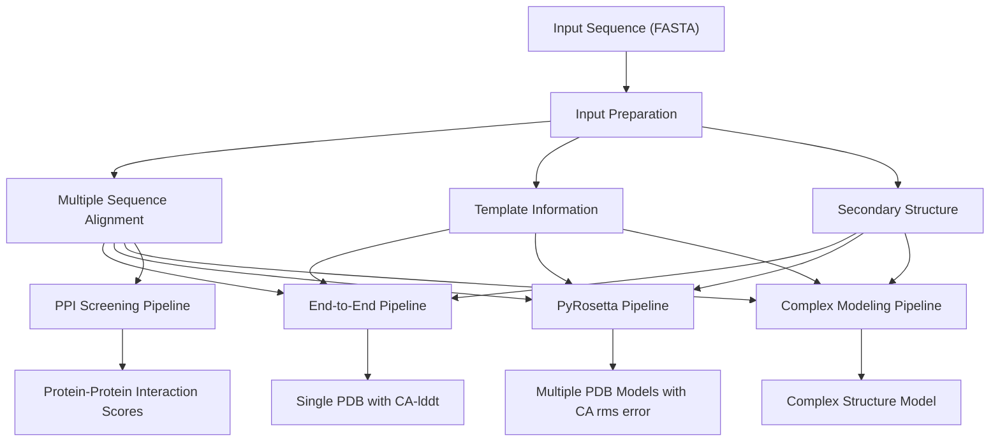
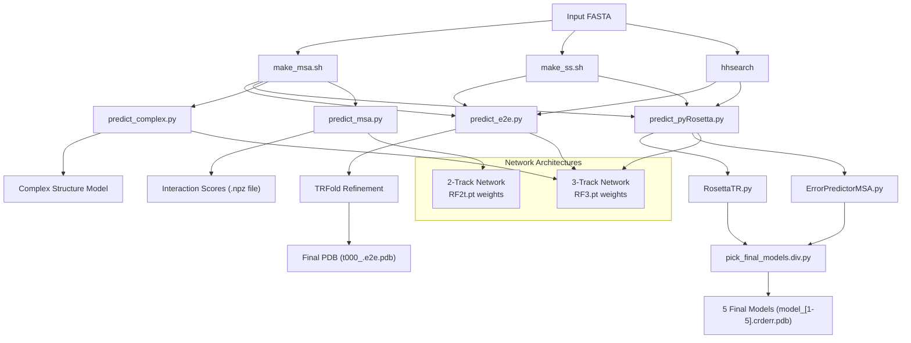
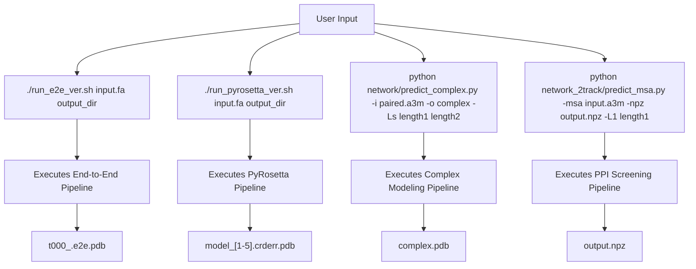

# Prediction Pipelines

> **Relevant source files**
> * [README.md](https://github.com/RosettaCommons/RoseTTAFold/blob/fcf9125c/README.md?plain=1)
> * [run_e2e_ver.sh](https://github.com/RosettaCommons/RoseTTAFold/blob/fcf9125c/run_e2e_ver.sh)
> * [run_pyrosetta_ver.sh](https://github.com/RosettaCommons/RoseTTAFold/blob/fcf9125c/run_pyrosetta_ver.sh)

## Purpose and Scope

This document provides an overview of the different prediction pipelines available in RoseTTAFold. These pipelines represent different approaches to protein structure prediction that users can choose based on their specific needs. Each pipeline has distinct characteristics, computational requirements, and output formats.

For detailed information about the input preparation process that feeds into these pipelines, see [Input Preparation Pipeline](/RosettaCommons/RoseTTAFold/3-input-preparation-pipeline). For in-depth information about the neural network architecture that powers these pipelines, see [Neural Network Architecture](/RosettaCommons/RoseTTAFold/5-neural-network-architecture).

## Pipeline Overview

RoseTTAFold offers four main prediction pipelines, each designed for specific use cases:

1. **End-to-End Pipeline**: Direct structure prediction for single protein chains
2. **PyRosetta Pipeline**: High-quality structure prediction with multiple model generation
3. **Complex Modeling Pipeline**: Structure prediction for multi-chain protein complexes
4. **PPI Screening Pipeline**: Fast screening of protein-protein interactions

Each pipeline shares common input preparation steps but differs in how it processes the data and what outputs it generates.

Sources: [README.md L61-L78](https://github.com/RosettaCommons/RoseTTAFold/blob/fcf9125c/README.md?plain=1#L61-L78)

 [run_e2e_ver.sh](https://github.com/RosettaCommons/RoseTTAFold/blob/fcf9125c/run_e2e_ver.sh)

 [run_pyrosetta_ver.sh](https://github.com/RosettaCommons/RoseTTAFold/blob/fcf9125c/run_pyrosetta_ver.sh)

## Pipeline Components and Workflow

Each prediction pipeline follows a specific workflow with distinct components. The diagram below illustrates the technical components and executable scripts involved in each pipeline:

Sources: [run_e2e_ver.sh L63-L77](https://github.com/RosettaCommons/RoseTTAFold/blob/fcf9125c/run_e2e_ver.sh#L63-L77)

 [run_pyrosetta_ver.sh L63-L77](https://github.com/RosettaCommons/RoseTTAFold/blob/fcf9125c/run_pyrosetta_ver.sh#L63-L77)

 [run_pyrosetta_ver.sh L79-L123](https://github.com/RosettaCommons/RoseTTAFold/blob/fcf9125c/run_pyrosetta_ver.sh#L79-L123)

 [README.md L61-L78](https://github.com/RosettaCommons/RoseTTAFold/blob/fcf9125c/README.md?plain=1#L61-L78)

## Pipeline Comparison

The following table compares the key characteristics of each prediction pipeline:

| Pipeline | Main Script | Network | Output | Strengths | Use Cases |
| --- | --- | --- | --- | --- | --- |
| End-to-End | predict_e2e.py | 3-Track | Single PDB with CA-lddt | Fast, direct structure prediction | Quick structure prediction for a single protein |
| PyRosetta | predict_pyRosetta.py | 3-Track | Multiple PDB models with CA rms error | Higher quality structures, diverse models | When structure quality and diversity are important |
| Complex Modeling | predict_complex.py | 3-Track | Complex structure model | Models multiple chains and interfaces | Predicting structures of protein complexes |
| PPI Screening | predict_msa.py | 2-Track | Interaction scores (.npz) | Fast screening, lower resource usage | Screening many potential protein interactions |

Sources: [README.md L61-L78](https://github.com/RosettaCommons/RoseTTAFold/blob/fcf9125c/README.md?plain=1#L61-L78)

 [run_e2e_ver.sh](https://github.com/RosettaCommons/RoseTTAFold/blob/fcf9125c/run_e2e_ver.sh)

 [run_pyrosetta_ver.sh](https://github.com/RosettaCommons/RoseTTAFold/blob/fcf9125c/run_pyrosetta_ver.sh)

## End-to-End Pipeline

The End-to-End pipeline directly predicts protein structure from sequence information, using the 3-track neural network. This pipeline is implemented in the script [run_e2e_ver.sh](https://github.com/RosettaCommons/RoseTTAFold/blob/fcf9125c/run_e2e_ver.sh)

 and uses [network/predict_e2e.py](https://github.com/RosettaCommons/RoseTTAFold/blob/fcf9125c/network/predict_e2e.py)

 for structure prediction.

Key features:

* Produces a single PDB model with estimated CA-lddt values in the B-factor column
* Faster than the PyRosetta pipeline
* Suitable for quick structure predictions

For detailed information, see [End-to-End Prediction](/RosettaCommons/RoseTTAFold/4.1-end-to-end-prediction).

Sources: [run_e2e_ver.sh L63-L77](https://github.com/RosettaCommons/RoseTTAFold/blob/fcf9125c/run_e2e_ver.sh#L63-L77)

 [README.md L77-L78](https://github.com/RosettaCommons/RoseTTAFold/blob/fcf9125c/README.md?plain=1#L77-L78)

## PyRosetta Pipeline

The PyRosetta pipeline uses the neural network to predict distances and orientations, then employs PyRosetta to generate and refine multiple structure models. This pipeline is implemented in [run_pyrosetta_ver.sh](https://github.com/RosettaCommons/RoseTTAFold/blob/fcf9125c/run_pyrosetta_ver.sh)

 and uses [network/predict_pyRosetta.py](https://github.com/RosettaCommons/RoseTTAFold/blob/fcf9125c/network/predict_pyRosetta.py)

 for distance and orientation prediction.

Key features:

* Produces five final models with estimated CA rms error in the B-factor column
* More computationally intensive than the End-to-End pipeline
* Generally produces higher quality structures
* Requires PyRosetta installation

For detailed information, see [PyRosetta Prediction](/RosettaCommons/RoseTTAFold/4.2-pyrosetta-prediction).

Sources: [run_pyrosetta_ver.sh L63-L123](https://github.com/RosettaCommons/RoseTTAFold/blob/fcf9125c/run_pyrosetta_ver.sh#L63-L123)

 [README.md L77-L78](https://github.com/RosettaCommons/RoseTTAFold/blob/fcf9125c/README.md?plain=1#L77-L78)

## Complex Modeling Pipeline

The Complex Modeling pipeline predicts structures of protein complexes using paired multiple sequence alignments. This pipeline uses [network/predict_complex.py](https://github.com/RosettaCommons/RoseTTAFold/blob/fcf9125c/network/predict_complex.py)

 for structure prediction.

Key features:

* Models multiple protein chains and their interfaces
* Requires paired multiple sequence alignments as input
* Uses the 3-track neural network

For detailed information, see [Complex Modeling](/RosettaCommons/RoseTTAFold/4.3-complex-modeling).

Sources: [README.md L67-L69](https://github.com/RosettaCommons/RoseTTAFold/blob/fcf9125c/README.md?plain=1#L67-L69)

## PPI Screening Pipeline

The PPI Screening pipeline uses a faster 2-track version of the neural network to screen for protein-protein interactions. This pipeline uses [network_2track/predict_msa.py](https://github.com/RosettaCommons/RoseTTAFold/blob/fcf9125c/network_2track/predict_msa.py)

 for interaction prediction.

Key features:

* Faster and less resource-intensive than full structure prediction
* Uses the 2-track neural network (RF2t.pt weights)
* Outputs interaction scores rather than full structures
* Suitable for screening many potential protein interactions

For detailed information, see [PPI Screening](/RosettaCommons/RoseTTAFold/4.4-ppi-screening).

Sources: [README.md L71-L73](https://github.com/RosettaCommons/RoseTTAFold/blob/fcf9125c/README.md?plain=1#L71-L73)

## Execution Workflow

The following diagram illustrates how the prediction pipelines are executed from the command line:

Sources: [README.md L61-L74](https://github.com/RosettaCommons/RoseTTAFold/blob/fcf9125c/README.md?plain=1#L61-L74)

## When to Use Each Pipeline

* **End-to-End Pipeline**: Use when you need a quick structure prediction for a single protein chain and a single model is sufficient.
* **PyRosetta Pipeline**: Use when you need higher quality structure predictions or multiple diverse models for a single protein chain.
* **Complex Modeling Pipeline**: Use when you need to predict the structure of a protein complex with multiple chains.
* **PPI Screening Pipeline**: Use when you need to quickly screen many potential protein-protein interactions without generating full structure models.

Sources: [README.md L61-L78](https://github.com/RosettaCommons/RoseTTAFold/blob/fcf9125c/README.md?plain=1#L61-L78)