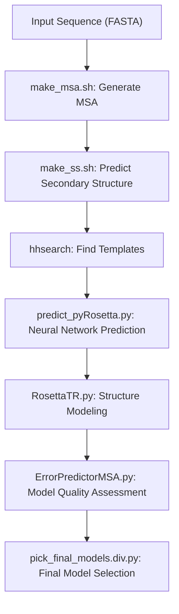
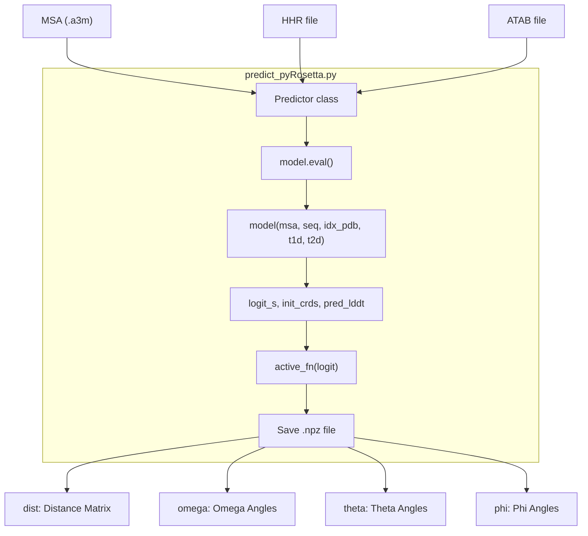
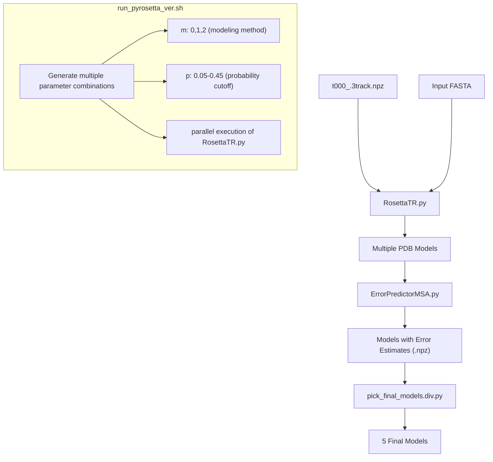
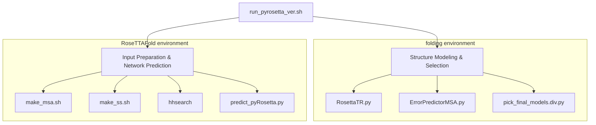
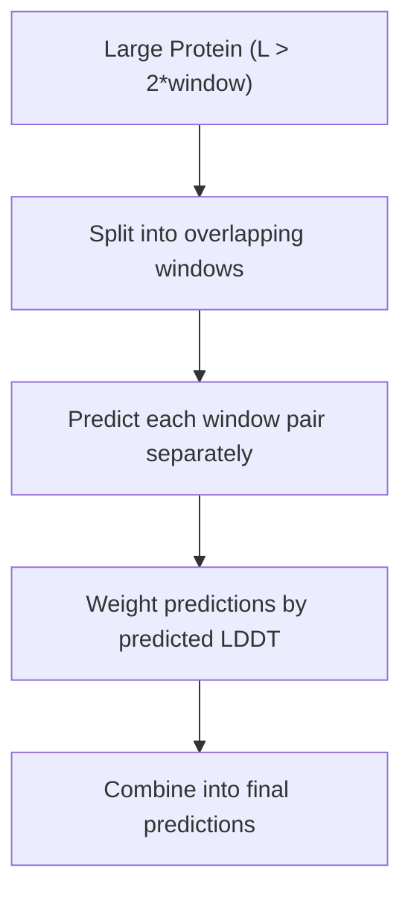

# PyRosetta Prediction

> **Relevant source files**
> * [README.md](https://github.com/RosettaCommons/RoseTTAFold/blob/fcf9125c/README.md?plain=1)
> * [network/predict_pyRosetta.py](https://github.com/RosettaCommons/RoseTTAFold/blob/fcf9125c/network/predict_pyRosetta.py)
> * [run_e2e_ver.sh](https://github.com/RosettaCommons/RoseTTAFold/blob/fcf9125c/run_e2e_ver.sh)
> * [run_pyrosetta_ver.sh](https://github.com/RosettaCommons/RoseTTAFold/blob/fcf9125c/run_pyrosetta_ver.sh)

## Purpose and Scope

The PyRosetta Prediction pipeline is one of the main protein structure prediction methods in RoseTTAFold. Unlike the [End-to-End Prediction](/RosettaCommons/RoseTTAFold/4.1-end-to-end-prediction) pipeline, it generates multiple refined protein structure models using a two-stage approach: first predicting inter-residue geometries using a 3-track neural network, then using PyRosetta to generate and refine 3D structures based on these predictions.

This document covers the technical implementation details of the PyRosetta prediction pipeline, including its architecture, data flow, execution workflow, and outputs. For complex structure prediction, see [Complex Modeling](/RosettaCommons/RoseTTAFold/4.3-complex-modeling).

## Pipeline Architecture

The PyRosetta prediction pipeline consists of the following stages:



Sources: [run_pyrosetta_ver.sh L32-L121](https://github.com/RosettaCommons/RoseTTAFold/blob/fcf9125c/run_pyrosetta_ver.sh#L32-L121)

The pipeline is orchestrated by `run_pyrosetta_ver.sh` which:

1. Takes a FASTA file as input and creates a working directory
2. Runs the input preparation steps (MSA generation, secondary structure prediction, template search)
3. Executes the neural network prediction to generate distance and orientation information
4. Uses PyRosetta to generate multiple structure models with different parameters
5. Assesses model quality with DeepAccNet-MSA
6. Selects the 5 best models based on quality and diversity

## Neural Network Prediction Component

The neural network prediction step is implemented in `predict_pyRosetta.py` and uses the `RoseTTAFoldModule` class to generate probabilistic predictions of inter-residue distances and orientations.



Sources: [network/predict_pyRosetta.py L51-L168](https://github.com/RosettaCommons/RoseTTAFold/blob/fcf9125c/network/predict_pyRosetta.py#L51-L168)

Key aspects of the neural network prediction:

1. The `Predictor` class loads the pre-trained RoseTTAFold model
2. The `predict` method processes the input MSA and optional template information
3. For large proteins (> 2× window size), it uses a sliding window approach to manage memory usage
4. The model outputs four sets of logits that are converted to probabilities using softmax
5. The predictions are saved in NPZ format with four arrays: dist, omega, theta, and phi

## Structure Generation with PyRosetta

After neural network prediction, the pipeline uses PyRosetta to generate 3D structures:



Sources: [run_pyrosetta_ver.sh L80-L122](https://github.com/RosettaCommons/RoseTTAFold/blob/fcf9125c/run_pyrosetta_ver.sh#L80-L122)

The structure generation process:

1. Uses the neural network predictions from the NPZ file as constraints for PyRosetta
2. Runs RosettaTR.py multiple times with different parameters: * `m`: Modeling method (0, 1, 2) * `p`: Probability cutoff (0.05, 0.15, 0.25, 0.35, 0.45)
3. Executes these jobs in parallel using the GNU parallel tool
4. Evaluates model quality using DeepAccNet-MSA
5. Selects 5 final models that balance quality and diversity

## Execution Environment

The PyRosetta prediction pipeline uses two separate conda environments:



Sources: [run_pyrosetta_ver.sh L30-L85](https://github.com/RosettaCommons/RoseTTAFold/blob/fcf9125c/run_pyrosetta_ver.sh#L30-L85)

 [run_pyrosetta_ver.sh L84-L122](https://github.com/RosettaCommons/RoseTTAFold/blob/fcf9125c/run_pyrosetta_ver.sh#L84-L122)

The script switches between environments:

1. `RoseTTAFold`: Used for input preparation and neural network prediction
2. `folding`: Used for PyRosetta-based structure modeling and model selection

## File Structure and Outputs

The PyRosetta prediction pipeline generates the following directory structure and key files:

| Directory/File | Description |
| --- | --- |
| `working_dir/t000_.msa0.a3m` | Multiple sequence alignment from HHblits |
| `working_dir/t000_.ss2` | Secondary structure prediction from PSIPRED |
| `working_dir/t000_.hhr` | HHsearch results for template detection |
| `working_dir/t000_.atab` | Alignment table from HHsearch |
| `working_dir/t000_.3track.npz` | Neural network predictions (distances and orientations) |
| `working_dir/pdb-3track/` | Directory containing all generated models |
| `working_dir/pdb-3track/model*_*_*.pdb` | Initial structure models with varying parameters |
| `working_dir/pdb-3track/*.npz` | Error prediction files from DeepAccNet-MSA |
| `working_dir/model/model_[1-5].crderr.pdb` | 5 final selected models with error estimates |

Sources: [run_pyrosetta_ver.sh L34-L122](https://github.com/RosettaCommons/RoseTTAFold/blob/fcf9125c/run_pyrosetta_ver.sh#L34-L122)

## Command-Line Usage

To run the PyRosetta prediction pipeline:

```
./run_pyrosetta_ver.sh input.fa working_dir
```

Where:

* `input.fa` is the input FASTA file containing the protein sequence
* `working_dir` is the directory where all outputs will be stored

Sources: [run_pyrosetta_ver.sh L22-L23](https://github.com/RosettaCommons/RoseTTAFold/blob/fcf9125c/run_pyrosetta_ver.sh#L22-L23)

## Dependencies and Requirements

The PyRosetta prediction pipeline requires:

| Requirement | Description |
| --- | --- |
| RoseTTAFold conda environment | Created using RoseTTAFold-linux.yml |
| folding conda environment | Created using folding-linux.yml |
| PyRosetta | Licensed software requiring academic or commercial license |
| UniRef30 database | For MSA generation |
| BFD database | For MSA generation |
| PDB100 database | For template search |
| CPU resources | At least 8 cores recommended |
| Memory | At least 64GB recommended |

Sources: [README.md L12-L23](https://github.com/RosettaCommons/RoseTTAFold/blob/fcf9125c/README.md?plain=1#L12-L23)

 [README.md L58](https://github.com/RosettaCommons/RoseTTAFold/blob/fcf9125c/README.md?plain=1#L58-L58)

 [run_pyrosetta_ver.sh L18-L19](https://github.com/RosettaCommons/RoseTTAFold/blob/fcf9125c/run_pyrosetta_ver.sh#L18-L19)

## Comparison with End-to-End Prediction

| Feature | PyRosetta Prediction | End-to-End Prediction |
| --- | --- | --- |
| Number of final models | 5 | 1 |
| Error metric | CA RMS error | CA-LDDT |
| Structural refinement | PyRosetta-based | TRFold refinement |
| License requirements | Requires PyRosetta license | None beyond RoseTTAFold |
| Typical runtime | Longer | Shorter |
| Memory usage | Similar | Similar |
| Output quality | Potentially higher | Good |

Sources: [README.md L76-L78](https://github.com/RosettaCommons/RoseTTAFold/blob/fcf9125c/README.md?plain=1#L76-L78)

## Performance Considerations for Large Proteins

For large proteins, the neural network prediction uses a windowing approach to manage memory usage:



Sources: [network/predict_pyRosetta.py L105-L151](https://github.com/RosettaCommons/RoseTTAFold/blob/fcf9125c/network/predict_pyRosetta.py#L105-L151)

The windowing process:

1. Divides the protein into overlapping segments of fixed window size (default 150)
2. Processes each window pair separately through the neural network
3. Weights the predictions based on predicted local distance difference test (LDDT) scores
4. Combines the weighted predictions into the final output

The window size and shift parameters can be adjusted in the script, with defaults of 150 and 50 respectively.