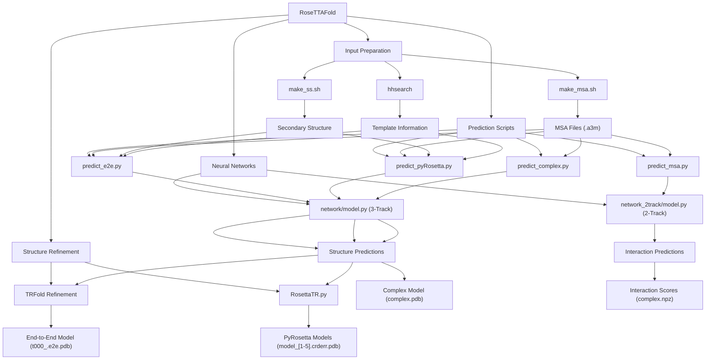
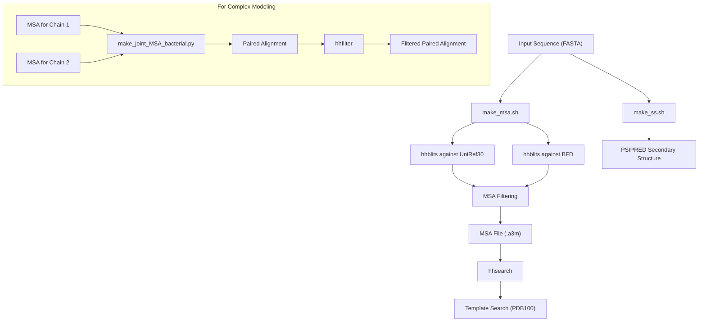
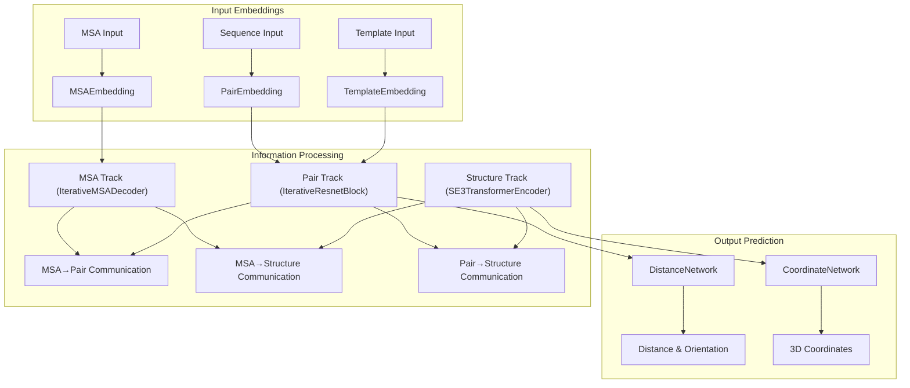
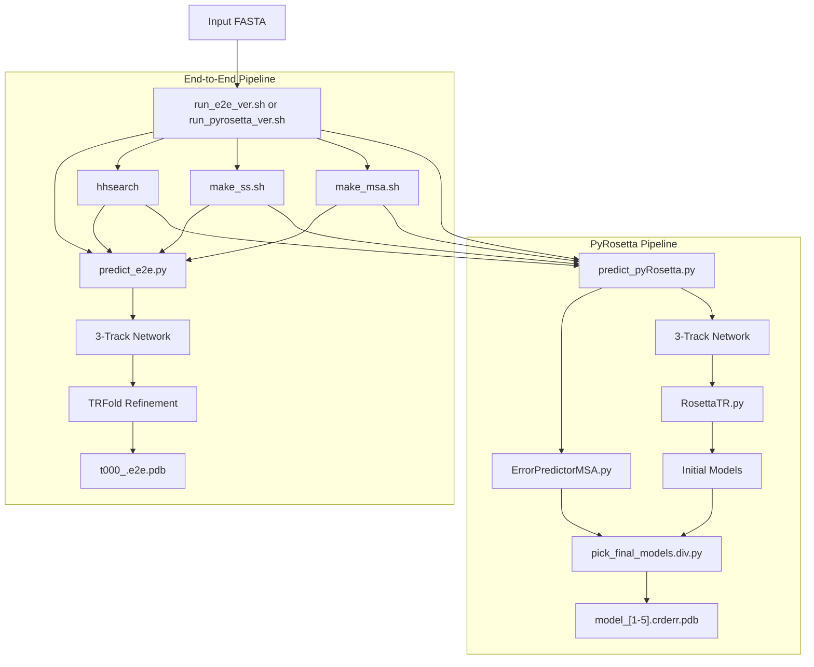

# RoseTTAFold Overview

> **Relevant source files**
> * [README.md](https://github.com/RosettaCommons/RoseTTAFold/blob/fcf9125c/README.md?plain=1)

This document provides a technical overview of RoseTTAFold, a deep learning system for protein structure prediction. RoseTTAFold employs a multi-track neural network architecture to accurately predict three-dimensional protein structures and interactions from sequence data.

For installation instructions, see [Installation and Setup](/RosettaCommons/RoseTTAFold/2-installation-and-setup). For details on preparing input data, see [Input Preparation Pipeline](/RosettaCommons/RoseTTAFold/3-input-preparation-pipeline). For specific prediction methodologies, see [Prediction Pipelines](/RosettaCommons/RoseTTAFold/4-prediction-pipelines). For in-depth details about the neural networks, see [Neural Network Architecture](/RosettaCommons/RoseTTAFold/5-neural-network-architecture).

## System Purpose and Capabilities

RoseTTAFold is designed for:

* Predicting monomer protein structures (single chains)
* Modeling protein complexes (multiple interacting chains)
* Screening for protein-protein interactions (PPI)

The system offers multiple prediction pipelines optimized for different tasks, balancing speed, accuracy, and computational resource requirements.

Sources: [README.md L1-L3](https://github.com/RosettaCommons/RoseTTAFold/blob/fcf9125c/README.md?plain=1#L1-L3)

## System Architecture

### Overview of System Components



RoseTTAFold consists of four main components: input preparation, neural networks, prediction scripts, and structure refinement. The system begins with sequence inputs, processes them through multiple sequence alignment (MSA) generation and template searching, then applies one of several neural networks to predict structures or interactions, followed by optional refinement.

Sources: [README.md L5-L78](https://github.com/RosettaCommons/RoseTTAFold/blob/fcf9125c/README.md?plain=1#L5-L78)

## Input Preparation Pipeline

The input preparation process transforms a raw protein sequence into information-rich inputs for the neural networks:



The input preparation consists of three main processes:

1. MSA generation using `make_msa.sh` (searching UniRef30 and BFD databases)
2. Secondary structure prediction using `make_ss.sh` (running PSIPRED)
3. Template identification using `hhsearch` (searching PDB100 database)

For complex modeling, additional steps pair and filter alignments from multiple chains.

Sources: [README.md L42-L56](https://github.com/RosettaCommons/RoseTTAFold/blob/fcf9125c/README.md?plain=1#L42-L56)

## Neural Network Architecture

RoseTTAFold implements two neural network architectures, with the 3-track architecture being the primary innovation:

### 3-Track Network Architecture



The 3-track architecture's key components:

* **MSA Track**: Processes evolutionary information from MSAs using attention mechanisms
* **Pair Track**: Handles pairwise residue relationships and generates distance/orientation predictions
* **Structure Track**: Manages 3D coordinate information using SE(3)-equivariant transformers from `network/equivariant_attention`

The 2-track architecture (in `network_2track/model.py`) is a simplified version that omits the structure track, enabling faster computation with lower memory usage for protein-protein interaction screening.

Sources: [README.md L92-L94](https://github.com/RosettaCommons/RoseTTAFold/blob/fcf9125c/README.md?plain=1#L92-L94)

## Prediction Pipelines

RoseTTAFold offers four distinct prediction pipelines, each optimized for different use cases:

### Pipeline Comparison

| Pipeline | Main Script | Network | Primary Output | Key Features |
| --- | --- | --- | --- | --- |
| End-to-End | `predict_e2e.py` | 3-Track | Single PDB with CA-lddt | Direct 3D prediction, fastest for single structures |
| PyRosetta | `predict_pyRosetta.py` | 3-Track | Five PDBs with CA rms error | Higher quality, multiple diverse models |
| Complex | `predict_complex.py` | 3-Track | Complex PDB | Models multiple chains, captures interfaces |
| PPI Screening | `predict_msa.py` | 2-Track | Interaction scores (.npz) | Fast screening, lower memory requirements |

### Execution Workflow



The execution workflow begins with running either `run_e2e_ver.sh` or `run_pyrosetta_ver.sh`, which orchestrate the input preparation and prediction processes. The end-to-end pipeline is more streamlined, while the PyRosetta pipeline includes additional steps for error prediction and model selection to generate multiple diverse structures.

Sources: [README.md L60-L74](https://github.com/RosettaCommons/RoseTTAFold/blob/fcf9125c/README.md?plain=1#L60-L74)

## Input and Output Specifications

### Input Requirements

* **Sequence input**: FASTA format files (`.fa`)
* **Required databases**: * UniRef30: For MSA generation (~46GB) * BFD: For deeper MSA generation (~272GB) * PDB100: For template identification (~100GB)

### Output Formats

| Pipeline | Output File | Format | Contents |
| --- | --- | --- | --- |
| End-to-End | `t000_.e2e.pdb` | PDB | 3D coordinates with residue-wise CA-lddt in B-factor column |
| PyRosetta | `model/model_[1-5].crderr.pdb` | PDB | 3D coordinates with estimated CA rms error in B-factor column |
| Complex | `complex.pdb` | PDB | Multi-chain structure of the protein complex |
| PPI Screening | `complex.npz` | NPZ | NumPy array with interaction scores |

Sources: [README.md L76-L78](https://github.com/RosettaCommons/RoseTTAFold/blob/fcf9125c/README.md?plain=1#L76-L78)

## Basic Usage

For monomer structure prediction:

```
cd example
../run_[pyrosetta, e2e]_ver.sh input.fa .
```

For complex modeling:

```
python network/predict_complex.py -i paired.a3m -o complex -Ls 218 310
```

For PPI screening:

```
python network_2track/predict_msa.py -msa input.a3m -npz complex.npz -L1 218
```

Where `-Ls` and `-L1` specify chain lengths for multi-chain predictions.

Sources: [README.md L60-L74](https://github.com/RosettaCommons/RoseTTAFold/blob/fcf9125c/README.md?plain=1#L60-L74)

## References

RoseTTAFold is the official implementation described in:

1. M. Baek, et al., "Accurate prediction of protein structures and interactions using a three-track neural network," Science (2021).
2. I.R. Humphreys, J. Pei, M. Baek, A. Krishnakumar, et al, "Computed structures of core eukaryotic protein complexes," Science (2021).

The code in `network/performer_pytorch.py` is based on the Performer architecture implementation, and code in `network/equivariant_attention` is from the SE(3)-Transformer repository.

Sources: [README.md L92-L101](https://github.com/RosettaCommons/RoseTTAFold/blob/fcf9125c/README.md?plain=1#L92-L101)