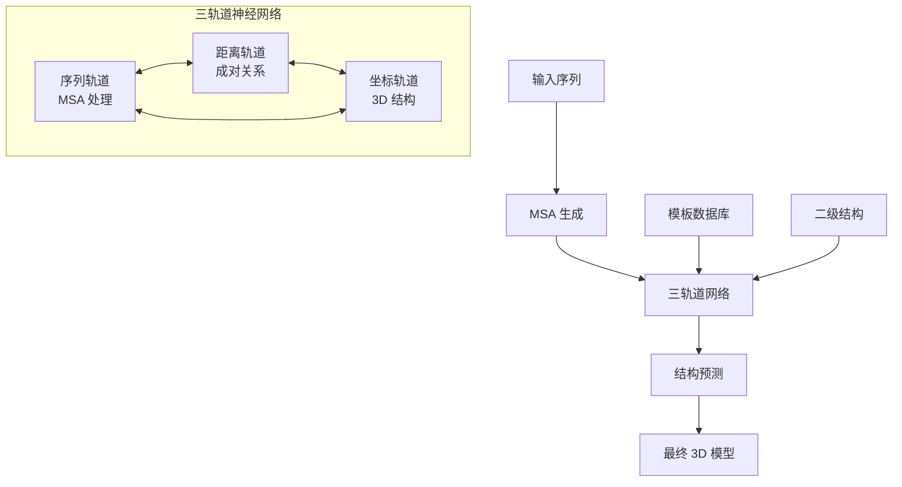

---
slug:1-overview
blog_type:normal
---


RoseTTAFold 是一个深度学习框架，采用三轨道神经网络架构，能够准确预测蛋白质结构和相互作用。本仓库提供了这一突破性方法的官方实现，该方法融合了序列、距离和坐标信息，在蛋白质结构预测领域达到了最先进的性能水平。

## 架构概述

RoseTTAFold 采用独特的 **三轨道神经网络**，同时处理蛋白质信息的多种表征形式：

- **序列轨道**：捕获进化信息的多序列比对（MSA）数据
- **距离轨道**：残基间距离和方向预测
- **坐标轨道**：使用 SE(3)-等变网络处理的三维结构坐标

该架构通过注意力机制整合这些轨道，允许不同表征之间的信息流动，使模型能够学习序列、结构和功能之间的复杂关系。



## 核心组件

RoseTTAFold 框架由几个主要模块组成：

### 核心网络架构
- **RoseTTAFoldModel** ([`network/RoseTTAFoldModel.py`](network/RoseTTAFoldModel.py#L8))：实现三轨道架构的主要神经网络模块
- **Transformer Networks** ([`network/Transformer.py`](network/Transformer.py#L43))：用于序列和成对表征学习的多头注意力机制
- **SE(3) Networks** ([`network/SE3_network.py`](network/SE3_network.py#L8))：用于 3D 坐标处理的等变图卷积网络

### 处理流程
- **输入准备** ([`input_prep/`](input_prep/))：MSA 生成和二级结构预测
- **折叠整合** ([`folding/`](folding/))：基于 PyRosetta 的结构优化和能量最小化
- **双轨道扩展** ([`network_2track/`](network_2track/))：用于蛋白质-蛋白质相互作用预测的优化版本

### 分析工具
- **DeepAccNet** ([`DAN-msa/`](DAN-msa/))：用于模型质量评估的错误预测系统
- **示例工作流** ([`example/`](example/))：单体预测、复合物建模和端到端处理的完整示例

## 项目结构

```
RoseTTAFold/
├── 🧬 network/           # 核心三轨道神经网络
├── 🔧 input_prep/        # MSA 和特征准备  
├── 🏗️ folding/          # PyRosetta 结构优化
├── 🔄 network_2track/    # 优化的 PPI 预测
├── 📊 DAN-msa/          # 错误预测模块
├── 📁 example/          # 使用示例和测试数据
└── 🚀 scripts/          # 执行和设置脚本
```

## 核心功能

| 功能 | 描述 | 实现 |
|---------|-------------|---------------|
| **三轨道架构** | 同时处理序列、距离和坐标信息 | [`RoseTTAFoldModel.py`](network/RoseTTAFoldModel.py#L8) |
| **SE(3)-等变性** | 旋转和平移不变的 3D 处理 | [`SE3_network.py`](network/SE3_network.py#L54) |
| **模板整合** | 融入已知结构模板 | [`predict_e2e.py`](network/predict_e2e.py) |
| **端到端预测** | 直接的序列到结构映射 | [`run_e2e_ver.sh`](run_e2e_ver.sh#L1) |
| **复合物建模** | 蛋白质-蛋白质相互作用预测 | [`network_2track/`](network_2track/) |
| **错误估计** | 预测的置信度评分 | [`DAN-msa/`](DAN-msa/) |

## 使用模式

RoseTTAFold 支持多种执行模式，适用于不同的使用场景：

### 1. 端到端预测
使用集成的三轨道网络，从序列到最终结构的完整流程：

```bash
# 执行端到端预测
./run_e2e_ver.sh input.fasta output_directory
```

此工作流 ([`run_e2e_ver.sh`](run_e2e_ver.sh#L31)) 执行：
- 使用 HHblits 生成 MSA
- 使用 PSIPRED 预测二级结构
- 使用 HHsearch 搜索模板
- 三轨道结构预测

### 2. PyRosetta 集成
对于需要使用 Rosetta 能量函数进行高质量结构优化的用户：

```bash
# 执行 PyRosetta 增强预测  
./run_pyrosetta_ver.sh input.fasta output_directory
```

### 3. 复合物建模
使用优化的双轨道网络进行蛋白质-蛋白质相互作用预测的专门模式：

```bash
python network/predict_complex.py -i paired.a3m -o complex -Ls 218 310
```

## 技术要求

RoseTTAFold 需要大量的计算资源和多个外部依赖：

- **GPU**：CUDA 兼容 GPU（推荐以提高性能）
- **内存**：大型蛋白质需要 64GB+ RAM
- **存储**：所需数据库需要 400GB+ 空间
- **依赖**：PyTorch、PyRosetta、HHsuite、PSIPRED

<CgxTip>
框架提供两个 conda 环境配置：`RoseTTAFold-linux.yml` 用于标准使用，`RoseTTAFold-linux-cu101.yml` 用于 CUDA 10.1 兼容性。此外，`folding-linux.yml` 是 PyRosetta 集成和 DeepAccNet 错误预测所必需的。
</CgxTip>

## 后续步骤

开始使用 RoseTTAFold：

1. **[快速入门](2-quick-start)**：通过简单示例学习基本工作流
2. **[安装和环境设置](3-installation-and-environment-setup)**：详细的安装说明和依赖管理
3. **[数据库下载和配置](4-database-download-and-configuration)**：设置所需的序列和结构数据库

如需深入了解技术细节，请探索涵盖三轨道架构、蛋白质结构预测流程和高级功能的**深度解析**部分。

---

*RoseTTAFold 代表了计算蛋白质结构预测的重大进步，将深度学习与生物物理原理相结合，为单个蛋白质和蛋白质复合物提供准确的模型。*