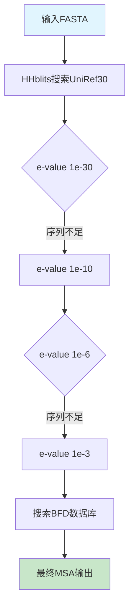
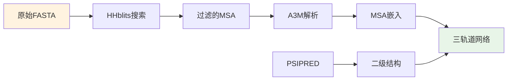

---
slug:11-msa-generation-and-sequence-processing
blog_type:normal
---


MSA（多序列比对）生成和序列处理流水线构成了RoseTTAFold结构预测能力的基础输入层。该系统将原始蛋白质序列转化为富含进化信息的表示，捕获关键的结构和功能信息。

## MSA生成流水线

RoseTTAFold采用精密的迭代搜索策略，通过HHblits对综合蛋白质数据库进行搜索，构建高质量的多序列比对。核心流水线在[`make_msa.sh`](input_prep/make_msa.sh#L1-L60)中实现，该脚本协调数据库搜索和过滤操作。

### 数据库搜索策略

MSA生成过程采用渐进放宽e值阈值的迭代方法：



流水线搜索两个主要数据库：UniRef30_2020_06和BFD（Big Fantastic Database），应用逐渐宽松的e值阈值（1e-30 → 1e-10 → 1e-6 → 1e-3），在保持质量的同时最大化序列覆盖度[`make_msa.sh`](input_prep/make_msa.sh#L19-L25)。

### 序列过滤和质量控制

每次搜索迭代后，序列通过hhfilter进行严格过滤，使用两个严格程度级别：

- **高严格度**：90%相似度，75%覆盖率 - 目标>2000条序列
- **中等严格度**：90%相似度，50%覆盖率 - 目标>4000条序列

这种双阈值方法确保充足的进化信息，同时控制冗余[`make_msa.sh`](input_prep/make_msa.sh#L31-L42)。

<CgxTip>
过滤策略在序列多样性和计算效率之间取得平衡。更高的覆盖率阈值捕获对准确结构预测至关重要的远源同源蛋白，而相似度阈值防止近缘序列的过度表示可能引起的比对偏差。
</CgxTip>

## 序列处理和特征提取

### A3M格式解析

处理后的MSA文件以A3M格式存储，该格式同时保留比对和未比对区域。解析功能在[`network/parsers.py`](network/parsers.py#L18-L48)和[`network_2track/parsers.py`](network_2track/parsers.py#L14-L44)中实现。

解析器执行几个关键操作：

1. **序列提取**：移除FASTA标头并提取原始序列
2. **小写字母移除**：删除代表未比对区域的小写字母
3. **字母表编码**：将氨基酸转换为数字索引（20个氨基酸+间隙对应0-20）
4. **未知字符处理**：将任何未识别的字符映射为间隙位置

```python
# 来自parsers.py的核心解析逻辑
alphabet = np.array(list("ARNDCQEGHILKMFPSTWYV-"), dtype='|S1').view(np.uint8)
msa = np.array([list(s) for s in msa], dtype='|S1').view(np.uint8)
for i in range(alphabet.shape[0]):
    msa[msa == alphabet[i]] = i
# 将所有未知字符视为间隙
msa[msa > 20] = 20
```

### MSA嵌入架构

处理后的MSA数据通过[`MSA_emb`](network/Embeddings.py#L69-L81)类进行精密嵌入，将原始序列比对转化为丰富的特征表示：

- **Token嵌入**：将每个氨基酸/间隙映射到高维向量空间
- **位置编码**：使用正弦嵌入捕获序列信息
- **查询编码**：对目标序列的专用编码

这种三阶段嵌入过程创建的表示既保留了MSA的进化信息，又保留了结构预测所需的位置上下文。

## 二级结构预测

作为MSA生成的补充，RoseTTAFold整合了使用PSIPRED的二级结构预测。[`make_ss.sh`](input_prep/make_ss.sh#L1-L30)脚本协调此过程：

1. **CSBlast分析**：使用CSBlast和K4000.crf模型生成序列谱
2. **PSIPRED预测**：应用基于神经网络的二级结构预测
3. **置信度评分**：为预测生成每个残基的置信度值

输出结合了二级结构预测（H/E/C代表螺旋/链/卷曲）和置信度分数，为折叠流水线提供额外的结构约束。

## 复合物特异性MSA处理

对于蛋白质-蛋白质相互作用建模，RoseTTAFold包含蛋白质复合物的专用MSA处理。[`make_joint_MSA_bacterial.py`](example/complex_modeling/make_joint_MSA_bacterial.py#L1-L91)脚本演示了如何：

1. **解析单个MSA**：从独立比对中提取序列和UniProt标识符
2. **标识符哈希**：将UniProt ID转换为数值表示以进行高效比较
3. **配对识别**：查找具有相似UniProt ID（±10范围内）的序列对
4. **联合比对构建**：创建保留相互作用蛋白质间进化耦合的配对MSA

<CgxTip>
联合MSA构建对蛋白质复合物预测至关重要。通过配对相互作用蛋白质的同源序列，系统捕获定义界面区域和相互作用几何的协同进化信号。
</CgxTip>

## 数据流集成

MSA生成和处理流水线与RoseTTAFold的三轨道架构无缝集成：



处理后的MSA特征直接输入三轨道神经网络，提供准确结构预测所需的进化上下文。这种集成确保网络接收全面的序列信息，包括保守模式、协同进化信号和结构倾向。

要更深入了解这些处理后的序列如何影响神经架构，请参阅[RoseTTAFold核心模型实现](8-rosettafold-core-model-implementation)和[模板整合和特征提取](12-template-integration-and-feature-extraction)。