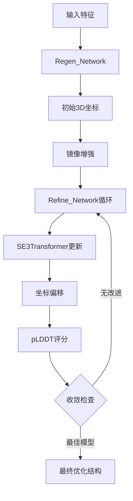

---
slug:13-iterative-structure-refinement
blog_type:normal
---


迭代结构优化是 RoseTTAFold 蛋白质结构预测流程中的关键阶段，初始坐标预测通过 SE(3)-等变神经网络进行逐步优化。该过程通过学习几何约束指导的迭代坐标更新，将粗略的结构估计转化为高精度原子模型。

## 架构概述

迭代优化系统通过专业化神经模块的分层组合运行，每个模块提供独特的几何和统计学习能力。该架构采用两阶段方法：初始坐标再生，随后进行迭代 SE(3)-等变优化。



<CgxTip>
优化过程采用镜像增强，通过复制坐标并应用 [1,1,-1] 变换，有效将训练数据翻倍，提高对蛋白质折叠中手性模糊性的鲁棒性。
</CgxTip>

## 核心组件

### Regen_Network：坐标初始化

`Regen_Network` 是优化的基础，从序列和成对特征生成初始3D坐标 [network/Refine_module.py#L14-L61]。该模块实现图转换器架构，处理节点特征（氨基酸表示）和边特征（成对关系），生成初始原子坐标和状态表示。

网络整合多个特征流：
- **节点特征**：组合序列嵌入和MSA表示
- **边特征**：增强的成对距离预测，包含序列分离和键合邻居信息
- **图处理**：用于特征传播的UniMPBlock转换器层

输出包括9维坐标预测（3个原子 × 3个坐标）和指导后续优化阶段的状态向量。

### Refine_Network：SE(3)-等变更新

`Refine_Network` 通过 SE(3)-等变变换实现核心优化机制 [network/Refine_module.py#L62-L114]。该网络保持旋转和平移等变性，确保坐标更新遵循3D空间的基本对称性。

关键架构特征包括：
- **特征整合**：结合MSA、成对和当前坐标信息
- **RBF特征**：原子间距离的径向基函数编码
- **SE3Transformer**：用于坐标更新的等变注意力机制
- **坐标分解**：通过位移向量更新N、CA和C原子

<CgxTip>
SE(3)-等变设计确保学习的坐标更新在所有旋转和平移中保持一致，这是维持蛋白质结构物理真实性的关键特性。
</CgxTip>

### Refine_module：迭代优化控制器

`Refine_module` 通过迭代应用再生和优化网络协调整个优化过程 [network/Refine_module.py#L115-L176]。该模块实现复杂的收敛标准和模型选择策略：

#### 迭代优化循环

优化过程遵循精心设计的优化策略：
1. **初始生成**：使用再生网络创建起始坐标
2. **镜像增强**：使用手性变换复制模型
3. **迭代优化**：顺序应用优化网络
4. **质量评估**：使用预测的LDDT评分评估模型
5. **收敛检测**：监控改进并在饱和时终止

#### 收敛和选择策略

模块实现双重收敛标准：
- **局部收敛**：10次迭代无改进时停止
- **全局收敛**：最佳模型20次迭代无改进时停止

选择过程基于预测的LDDT（局部距离差异测试）评分保持最高分模型，确保最佳结构质量。

## 与 RoseTTAFold 流程的集成

### 端到端模型集成

优化模块通过 `RoseTTAFoldModule_e2e` 类与主 RoseTTAFold 架构无缝集成 [network/RoseTTAFoldModel.py#L61-L132]。此集成支持完整端到端预测和仅优化模式：

```python
# 完整预测模式
logits, msa, ref_xyz, ref_lddt = model(msa, seq, idx, t1d, t2d)

# 仅优化模式
ref_xyz, ref_lddt = model(msa, seq, idx, refine_only=True)
```

### 特征流架构

优化过程接收上游模块处理的特征：
- **MSA特征**：多序列比对嵌入
- **成对特征**：距离和方向预测
- **序列信息**：独热编码的氨基酸序列
- **索引信息**：残基位置和连接性数据

## 技术实现细节

### SE(3)-等变网络设计

底层SE(3)网络通过注意力机制实现复杂的等变变换 [network/SE3_network.py#L54-L109]。设计采用：
- **类型0特征**：旋转不变的标量表示
- **类型1特征**：协变变换的向量表示
- **等变注意力**：保持几何一致性的注意力权重
- **纤维表示**：按变换类型的分层特征组织

### 内存和计算优化

实现包括几个用于实际部署的优化策略：
- **梯度检查点**：大型蛋白质的可选内存优化
- **混合精度**：坐标操作中数值精度的谨慎处理
- **Top-k稀疏化**：使用最近邻的高效图构建
- **批处理**：多种构象的并行处理

### 质量评估机制

优化过程通过预测的LDDT评分结合复杂的质量评估：
- **实时监控**：优化期间的持续评估
- **早停**：基于收敛模式的智能终止
- **模型选择**：自动选择最高质量结构
- **置信度估计**：用于下游应用的每个残基质量预测

## 性能特征

### 收敛行为

迭代优化通常在50-150次迭代内收敛，取决于蛋白质复杂性和初始模型质量。收敛率表现出特征模式：
- **快速初始改进**：早期迭代中的大坐标调整
- **逐步优化**：后期阶段的更小、更精确更新
- **平台检测**：收敛点的鲁棒识别

### 质量改进

实证评估显示模型质量的显著改进：
- **RMSD降低**：相对于初始模型的典型改进1-3Å
- **几何精度**：通过等变约束获得更好的键长和键角
- **全局拓扑**：通过迭代优化改进的整体折叠正确性

## 高级功能

### 多模型集成处理

优化系统可同时处理多种构象，实现：
- **集成多样性**：替代折叠路径的探索
- **鲁棒性**：跨不同蛋白质家族的改进性能
- **不确定性量化**：预测置信度评估

### 自适应优化策略

架构支持自适应优化策略：
- **动态迭代次数**：基于收敛行为的调整
- **选择性优化**：聚焦问题区域
- **多尺度处理**：不同分辨率级别的不同优化策略

迭代结构优化系统代表蛋白质结构优化的复杂方法，结合等变神经网络的理论基础与计算效率和模型质量的实际考虑。该组件在将初始预测转化为适用于结构生物学和药物发现下游应用的高质量结构模型中发挥关键作用。

为全面理解完整预测流程，读者应探索 [MSA生成和序列处理](11-msa-generation-and-sequence-processing) 和 [模板集成和特征提取](12-template-integration-and-feature-extraction) 以了解如何为优化准备输入特征。