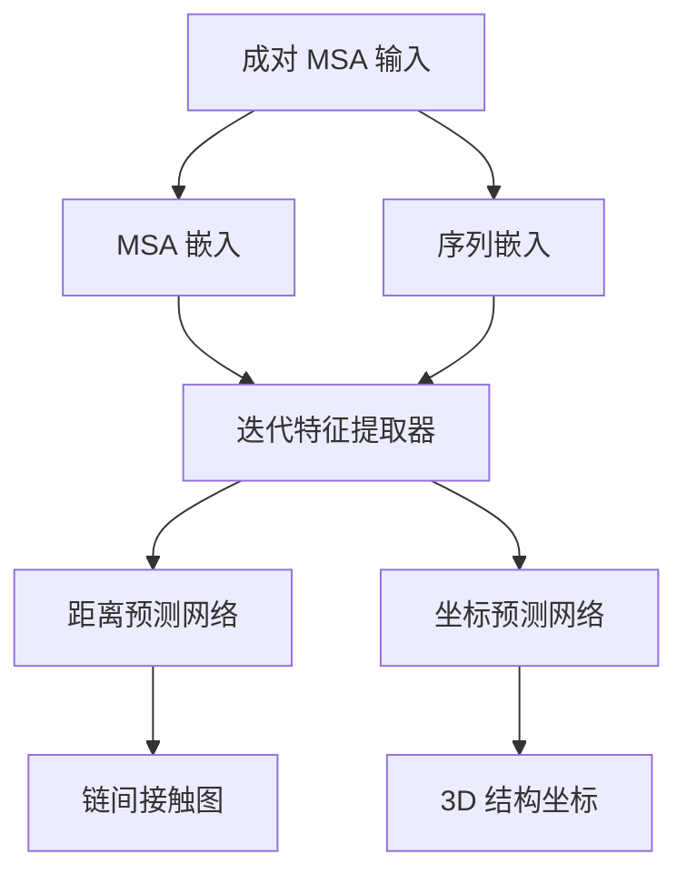

---
slug:14-two-track-network-for-complex-prediction
blog_type:normal
---

双轨网络是 RoseTTAFold 用于蛋白质-蛋白质相互作用（PPI）预测和复合物建模的专用架构。该系统在核心三轨方法的基础上进行了扩展，增强了处理链间关系和预测多蛋白质链之间相互作用界面的能力。

## 架构概览

双轨网络在 `network_2track/` 目录中实现，采用优化的流线型设计，既适用于复合物预测，又保持与 RoseTTAFold 核心原则的兼容性。该架构处理成对的多序列比对（MSA）以预测链间接触和相互作用几何结构。

## 核心组件

### TrunkModule 架构

位于 [`TrunkModel.py`](network_2track/TrunkModel.py#L8) 的核心 `TrunkModule` 协调整个预测流程：

- **MSA 嵌入**：通过带位置编码的 `MSA_emb` 处理输入序列
- **成对嵌入**：生成残基对表示，可选集成模板信息
- **特征提取**：采用 `IterativeFeatureExtractor` 进行多尺度特征学习
- **预测头**：包含距离和坐标预测网络

该模块通过条件嵌入路径支持模板增强和无模板模式 [`TrunkModel.py`](network_2track/TrunkModel.py#L13-15)。

### 迭代特征提取

位于 [`Attention_module.py`](network_2track/Attention_module.py#L205) 的 `IterativeFeatureExtractor` 实现核心注意力机制：

- **初始处理**：应用 `Pair2Pair` 变换建立基线关系
- **差分模块**：通过 `n_diff_module` 个独立迭代处理特征
- **共享模块**：利用 `IterBlockShare` 进行一致的特征细化
- **MSA-成对交互**：维护序列和成对表示之间的双向信息流

该架构使网络能够通过迭代细化捕获链内和链间进化信号。

### 距离预测网络

位于 [`DistancePredictor.py`](network_2track/DistancePredictor.py#L8) 的 `DistanceNetwork` 预测几何约束：

- **对称处理**：结合正向和反向成对表示
- **多头预测**：生成距离、omega、theta 和 phi 角度预测
- **ResNet 主干**：利用残差网络进行鲁棒的几何学习

## 输入处理和数据流

### 成对 MSA 格式

网络期望成对 MSA，其中来自不同链的序列通过特殊索引连接。[`example/complex_2track/input.a3m`](example/complex_2track/input.a3m#L1) 中的示例演示了这种格式：

- 通过序列索引分离链（第二条链偏移 +200）
- 跨越链边界的进化耦合保持
- 构建联合 MSA 以提取共进化信号

### 预测流程

[`predict_msa.py`](network_2track/predict_msa.py#L34) 中的 `Predictor` 类管理完整工作流：

1. **模型加载**：加载预训练的 "RF2t" 权重
2. **MSA 处理**：解析和格式化成对 MSA 输入
3. **索引生成**：创建带链分离的位置索引
4. **推理**：生成链间接触概率
5. **输出**：将距离图存储为压缩的 NPZ 格式

## 关键架构特性

### 注意力机制

双轨网络采用专用注意力模块：

- **MSA2MSA**：处理序列级进化信息
- **Pair2Pair**：处理残基对关系建模
- **MSA2Pair**：桥接序列和成对表示
- **Pair2MSA**：将成对约束传播到序列特征

### 模板集成

通过 `Templ_emb` 和 `Pair_emb_w_templ` 提供可选模板支持：

- **1D 模板特征**：序列谱和二级结构信息
- **2D 模板特征**：来自已知结构的距离和方向约束
- **基于注意力的集成**：像素级注意力用于模板特征加权

## 性能特征

### 计算效率

- **批处理**：支持多个复合物的批量推理
- **内存优化**：针对大型蛋白质复合物的高效张量操作
- **GPU 加速**：CUDA 优化实现以加快预测速度

### 预测能力

- **链间接触**：预测跨越链边界的残基-残基接触
- **几何约束**：生成距离和方向预测
- **界面建模**：识别潜在的相互作用界面和结合模式

## 与 RoseTTAFold 生态系统的集成

双轨网络与 RoseTTAFold 框架无缝集成：

- **共享组件**：利用通用注意力机制和嵌入策略
- **一致的 API**：遵循与单链预测相同的接口模式
- **管道兼容性**：与现有的 MSA 生成和结构细化工具协同工作

这种专用架构使 RoseTTAFold 能够解决蛋白质-蛋白质相互作用预测这一挑战性问题，同时保持核心系统特有的效率和准确性。