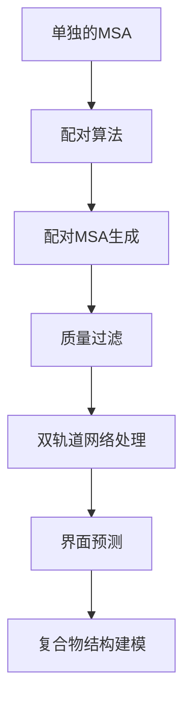

---
slug:15-ppi-screening-and-interface-modeling
blog_type:normal
---


RoseTTAFold通过其专用的双轨道神经网络架构，为蛋白质-蛋白质相互作用（PPI）筛选和界面建模提供了强大的功能。该系统通过利用配对多重序列比对中的协同进化信号，并在可用时整合模板信息，能够准确预测蛋白质复合物结构。

## 双轨道网络架构

RoseTTAFold中PPI筛选的核心通过`network_2track`目录中的`TrunkModule`类实现，该类处理配对序列信息以预测链间接触和界面[TrunkModel.py](network_2track/TrunkModel.py#L8-L65)。该架构包含：

- **MSA嵌入**：使用`MSA_emb`处理配对的多重序列比对，以捕获序列级特征
- **配对嵌入**：通过`Pair_emb_wo_templ`或在有模板信息时通过`Pair_emb_w_templ`生成配对表示
- **迭代特征提取**：采用具有注意力机制的`IterativeFeatureExtractor`来学习复杂的链间关系
- **距离预测**：使用`DistanceNetwork`预测链间接触概率和距离分布

模型通过特殊索引处理序列，其中不同的链通过向位置索引添加偏移量（500个残基）来分隔[predict_complex.py](network/predict_complex.py#L149-L152)，确保网络能够区分不同的蛋白质亚基。

## PPI筛选工作流程

筛选过程始于生成高质量的配对多重序列比对，这些比对捕获了相互作用蛋白质之间的协同进化信号：



### 配对MSA生成

对于细菌蛋白质，RoseTTAFold提供了专门的配对脚本，根据UniProt登录号匹配序列[make_joint_MSA_bacterial.py](example/complex_modeling/make_joint_MSA_bacterial.py#L1-L91)。该算法：

1. 解析单独的A3M文件以提取序列和UniProt标识符
2. 使用复杂的编码方案将UniProt登录号转换为数值索引
3. 查找登录号相似的序列对（差异阈值在10以内）
4. 构建保持正确序列对应关系的配对比对

`uni2idx`函数实现了复杂的编码，保留了UniProt登录号的层次结构，从而实现高效的数值比较和配对[make_joint_MSA_bacterial.py](example/complex_modeling/make_joint_MSA_bacterial.py#L25-L50)。

### 复合物结构预测

主要的预测管道在`predict_complex.py`中实现，处理无模板和有模板建模[predict_complex.py](network/predict_complex.py#L88-L250)。关键功能包括：

- **窗口化处理**：对于大型复合物（>400个残基），系统使用滑动窗口方法，具有可配置的窗口大小（默认200）和位移（默认100）来管理内存限制
- **模板整合**：支持通过`xyz_t`、`t1d`和`t0d`数组整合复合物模板特征，包含结构和比对信息
- **基于裁剪的预测**：处理重叠窗口并根据覆盖计数使用加权平均合并结果
- **端到端优化**：使用`RoseTTAFoldModule_e2e`进行完整的结构预测和迭代优化

## 界面建模功能

### 接触预测

双轨道网络专注于通过关注距离矩阵的跨链区域来预测链间接触[predict_msa.py](network_2track/predict_msa.py#L78-L82)：

```python
# 提取链间接触概率
prob = np.sum(prob.reshape(L,L,-1)[:L1,L1:,:20], axis=-1).astype(np.float16)
```

这仅提取链间部分（前L1个残基与剩余残基）并对应于近距离接触（<8Å）的前20个距离区间求和。

### 模板整合

当有复合物模板可用时，系统可以通过以下方式整合结构信息：

- **xyz_t**：N、CA、C原子的模板坐标，未对齐区域为NaN
- **t1d**：来自HHsearch的1D模板特征，包括评分和二级结构
- **t2d**：从坐标信息导出的2D模板特征

模板特征通过专门的嵌入层处理并整合到配对表示中[RoseTTAFoldModel.py](network/RoseTTAFoldModel.py#L61-L110)。

## 高级处理能力

### 内存高效的裁剪

对于大型蛋白质复合物，系统实现了复杂的裁剪策略：

1. **网格生成**：使用可配置的步长创建重叠窗口
2. **序列过滤**：使用覆盖阈值移除间隙过多的序列
3. **并行处理**：在可能时同时处理多个裁剪区域
4. **结果合并**：使用基于计数的权重合并裁剪预测

### 优化管道

端到端模型包括专门的优化模块（`Refine_module`），通过迭代SE(3)-等变变换改进初始预测[RoseTTAFoldModel.py](network/RoseTTAFoldModel.py#L85-L86)。这确保了高质量的界面几何结构和正确的链堆积。

## 实际实现

### 命令行使用

PPI筛选的典型工作流程包括：

1. 为每个亚基生成单独的MSA
2. 使用适当的配对策略创建配对比对
3. 使用hhfilter过滤配对比对（90-95%同一性，50-75%覆盖度）
4. 运行复合物预测：

```bash
python network/predict_complex.py -i filtered.a3m -o complex -Ls 218 310
```

`-Ls`参数按配对顺序指定各个链的长度[README](example/complex_modeling/README#L22-L24)。

### 输出生成

系统生成：
- **距离/方向图**：6D坐标预测（dist、omega、theta、phi），保存为压缩的NPZ文件
- **3D结构**：通过TRFold整合生成的完整原子坐标
- **置信度评分**：用于模型质量评估的每残基LDDT预测

<CgxTip>双轨道架构的关键创新在于其能够在处理配对序列信息的同时，为链内和链间关系保持独立的表示，即使在模板信息有限的情况下也能实现准确的界面预测。</CgxTip>

<CgxTip>对于自动配对具有挑战性的真核蛋白质，可能需要手动整理配对比对或使用替代的协同进化检测方法，以获得最佳的PPI筛选性能。</CgxTip>

## 后续步骤

要全面了解完整的建模工作流程，请探索[复合物建模工作流程](16-complex-modeling-workflow)文档。要详细了解底层的神经网络架构，请参考[用于复合物预测的双轨道网络](14-two-track-network-for-complex-prediction)页面。