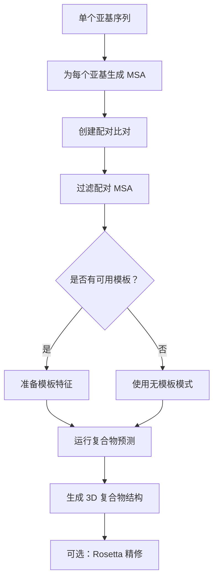

---
slug:16-complex-modeling-workflow
blog_type:normal
---


RoseTTAFold 中的复合物建模工作流利用来自配对多重序列比对（MSA）的协同进化信号和专门的双轨道神经网络架构，实现蛋白质-蛋白质复合物结构的预测。该工作流专为多个蛋白质亚基之间的相互作用建模而设计，提供了从输入准备到最终结构生成的系统化方法。

## 工作流概述

复合物建模过程遵循一个结构化流程，将单个蛋白质序列转换为精确的 3D 复合物结构。该工作流包含四个主要阶段：各个亚基的 MSA 生成、配对比对创建、模板整合（可选）以及使用双轨道网络进行复合物结构预测。



## 输入准备

### 单个 MSA 生成

第一步需要为每个蛋白质亚基单独生成高质量的多重序列比对。这些单个 MSA 作为提取进化信息的基础，这些信息稍后将进行配对以识别相互作用蛋白质之间的协同进化信号。

对于细菌蛋白质，RoseTTAFold 提供了专门的脚本来自动化配对过程。[`make_joint_MSA_bacterial.py`](example/complex_modeling/make_joint_MSA_bacterial.py) 脚本基于 UniProt 登录号相似性配对序列，假设具有相似登录号的序列可能属于同一个操纵子或功能复合物 [来源](example/complex_modeling/make_joint_MSA_bacterial.py#L78-L79)。

### 配对比对创建

创建准确的配对比对对于成功的复合物建模至关重要。配对算法识别来自不同亚基的、可能相互作用的序列对：

```python
# 查找差异不超过 10 的 uniprot id 对
idx1,idx2 = np.where(np.abs(hash1[:,None]-hash2[None,:]) < 10)
```

脚本随后通过连接配对同源物的序列生成配对的 MSA 文件，其中查询序列（已知的相互作用物）置于比对的前列 [来源](example/complex_modeling/make_joint_MSA_bacterial.py#L86-L89)。

<CgxTip>对于真核蛋白质，由于缺乏类似操纵子的基因组组织，配对比对的生成仍然具有挑战性。用户可能需要探索替代策略，如系统发育谱分析或实验相互作用数据来指导配对。</CgxTip>

### MSA 过滤

创建配对比对后，过滤是必不可少的步骤，以去除冗余序列并提高信号质量。推荐的过滤参数使用 HHfilter：

```bash
hhfilter -i paired.a3m -o filtered.a3m -id 90 -cov 75
```

此命令去除同一性 >90% 且覆盖率 <75% 的序列，有助于平衡多样性和比对质量 [来源](example/complex_modeling/README#L11)。

## 模板整合

### 可选模板特征

RoseTTAFold 支持整合来自已知复合物模板的结构信息。当可用时，模板特征应准备在包含三个关键组件的 NPZ 文件中：

- **xyz_t**：复合物模板的 N、CA、C 坐标，形状为 (templates, residues, 3, 3)
- **t1d**：来自 HHsearch 结果的 1D 特征（得分、二级结构、概率）
- **t0d**：包括概率、同一性和相似性得分的 0D 特征

模板中未对齐的区域应使用 NaN 值标记坐标，使用零值标记特征 [来源](example/complex_modeling/README#L16-L22)。

### 模板特征处理

预测流程通过将模板特征转换为适当的张量格式来处理：

```python
if templ_npz != None:
    templ = np.load(templ_npz)
    xyz_t = torch.from_numpy(templ["xyz_t"])
    t1d = torch.from_numpy(templ["t1d"])
    t0d = torch.from_numpy(templ["t0d"])
else:
    xyz_t = torch.full((1, L, 3, 3), np.nan).float()
    t1d = torch.zeros((1, L, 3)).float()
    t0d = torch.zeros((1,3)).float()
```

当未提供模板时，系统会自动创建占位符模板特征，支持无模板预测 [来源](network/predict_complex.py#L120-L127)。

## 复合物结构预测

### 双轨道网络架构

复合物预测利用在 [`TrunkModule`](network_2track/TrunkModel.py#L8) 类中实现的专门双轨道神经网络架构。该架构通过并行轨道处理配对的 MSA 数据，捕获链内和链间的进化信息：

```python
def forward(self, msa, seq, idx, t1d=None, t2d=None):
    # 获取嵌入
    msa = self.msa_emb(msa, idx)
    if self.use_templ:
        tmpl = self.templ_emb(t1d, t2d, idx)
        pair = self.pair_emb(seq, idx, tmpl)
    else:
        pair = self.pair_emb(seq, idx)
```

网络生成复合物的 6D 方向预测和 3D 坐标预测 [来源](network_2track/TrunkModel.py#L45-L65)。

### 预测流程

主要预测工作流在 [`Predictor`](network/predict_complex.py#L88) 类中实现，该类处理输入处理、模型推理和输出生成。关键步骤包括：

1. **MSA 处理**：解析配对的 MSA 并转换为张量格式
2. **索引管理**：创建残基索引，通过添加偏移量（500 个残基）分隔不同亚基，防止链间交叉污染
3. **模板整合**：如果可用，处理模板特征
4. **窗口预测**：对大型复合物使用滑动窗口方法（默认：200 个残基窗口，100 个残基位移）

```python
# 通过添加索引偏移量分隔亚基
for L_i in Ls[:-1]:
    idx_pdb[:,L_prev+L_i:] += 500
    L_prev += L_i
```

这种索引方案确保来自不同亚基的残基在预测过程中被正确区分 [来源](network/predict_complex.py#L133-L135)。

### 命令行界面

复合物预测通过命令行界面启动：

```bash
python network/predict_complex.py -i filtered.a3m -o complex -Ls 218 310
```

`-Ls` 参数指定各个亚基按配对顺序的长度，这对于正确的链分离至关重要 [来源](example/complex_modeling/README#L26-L27)。

## 输出和后处理

### 结构生成

预测流程为复合物中所有亚基的骨架原子（N、CA、C）生成 3D 坐标。输出以 NPZ 格式保存，包含预测坐标和置信度分数。

### 可选精修

为获得更高质量的模型，用户可以应用带坐标约束的 Rosetta fastrelax 来添加侧链原子并优化结构：

```bash
你可能需要运行带坐标约束的 Rosetta fastrelax 来添加侧链。
```

此步骤有助于提高预测复合物的物理真实性，同时保持整体骨架构象 [来源](example/complex_modeling/README#L29)。

<CgxTip>专为复合物设计的双轨道网络架构比单链方法能更有效地捕获蛋白质间协同进化信号，使其特别适用于异源二聚体和多聚体蛋白质复合物。</CgxTip>

## 高级配置

复合物建模工作流通过预测脚本支持各种配置选项，包括 GPU 加速、自定义模型目录和模板整合。用户可以调整大型复合物的窗口大小和位移等参数，以平衡计算效率和预测准确性。

要全面理解底层的神经网络架构和实现细节，请参阅 [用于复合物预测的双轨道网络](14-two-track-network-for-complex-prediction) 文档。要探索替代预测方法，请参阅 [端到端实现与 PyRosetta 实现的比较](19-end-to-end-vs-pyrosetta-implementation)。