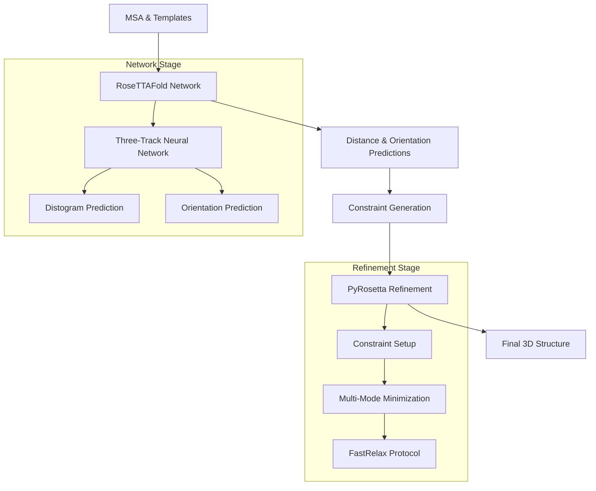

---
slug:17-pyrosetta-integration-for-structure-refinement
blog_type:normal
---

RoseTTAFold中的PyRosetta集成是一种复杂的混合方法，它将深度神经网络预测与基于经典物理的精修相结合。这种集成利用PyRosetta强大的分子建模能力，通过迭代精修协议将原始网络输出转化为物理上真实的蛋白质结构。

## 架构概览

PyRosetta集成采用两阶段流水线，其中神经网络预测引导基于Rosetta的结构精修。该架构通过约束生成和迭代最小化，将深度学习预测与基于物理的建模连接起来。

## 网络预测接口

PyRosetta集成始于专门的预测模块`predict_pyRosetta.py` [network/predict_pyRosetta.py](network/predict_pyRosetta.py#L51)。该模块实现了`Predictor`类，专门生成适用于Rosetta约束生成的距离和方向预测。

关键配置参数包括：
- **模型架构**：8个模块，包含4个结构精修模块 [network/predict_pyRosetta.py#L18-L49]
- **SE(3)网络**：2层，16个通道用于坐标预测 [network/predict_pyRosetta.py#L37-L48]
- **输入处理**：支持MSA解析和模板整合 [network/predict_pyRosetta.py#L81-L120]

预测器输出四种类型的约束：
- 距离分布（37个区间，4.25-20Å）
- 二面角（omega、theta、phi）
- 骨架几何的方向约束

## Rosetta约束系统

### 约束生成

`utils.py`中的约束生成过程 [folding/utils.py](folding/utils.py#L12-L100) 将神经网络概率转化为Rosetta兼容的约束函数。该系统使用复杂的概率过滤和样条插值：

**距离约束**：应用于Cβ原子（甘氨酸为Cα），采用基于概率的过滤。仅保留概率>0.05的约束 [folding/data/params.json](folding/data/params.json#L2)。

**方向约束**：Omega、theta和phi角被转换为具有可配置权重和容差窗口的谐波约束。

### 多模式精修协议

精修协议通过三种不同模式运行 [folding/RosettaTR.py](folding/RosettaTR.py#L50-L150)：

| 模式 | 策略 | 描述 |
|------|----------|-------------|
| 模式 0 | 短程 → 中程 → 长程 | 顺序精修，约束强度递增 |
| 模式 1 | (短程 + 中程) → 长程 | 组合初始精修后应用长程约束 |
| 模式 2 | (短程 + 中程 + 长程) | 同时应用所有约束类型 |

每种模式采用不同的约束权重调度：
- **VDW权重**：在精修阶段中从3.0逐步增加到10.0 [folding/RosettaTR.py#L10]
- **距离约束**：随着结构收敛，影响减弱（3.0 → 1.0）[folding/RosettaTR.py#L11]
- **方向约束**：一致应用，略有减少（1.0 → 0.5）[folding/RosettaTR.py#L12]

## 高级精修功能

### 笛卡尔空间优化

该协议包含使用`sf_cart`评分函数的专门笛卡尔空间最小化 [folding/RosettaTR.py#L47-L49]。这能够在保持约束满足的同时实现精确的原子定位。

### 噪声注入和采样

为了增强构象采样，系统引入受控扰动：
- 随机二面角扰动（±10°）用于多次重启 [folding/RosettaTR.py#L75-L80]
- Savitzky-Golay滤波用于平滑约束应用 [folding/utils.py](folding/utils.py#L30-L32)
- 坐标数组操作的循环移位选项 [folding/arguments.py](folding/arguments.py#L38)

### FastRelax集成

可选的FastRelax协议使用Rosetta的全原子能量函数提供最终结构精修，确保物理真实的侧链堆积和骨架几何 [folding/arguments.py](folding/arguments.py#L35-L36)。

## 工作流执行

完整的PyRosetta工作流通过`run_pyrosetta_ver.sh`编排 [run_pyrosetta_ver.sh](run_pyrosetta_ver.sh#L1-L124)：

1. **MSA生成**：HHblits创建序列谱
2. **模板搜索**：HHsearch搜索结构同源物
3. **网络预测**：距离和方向估计
4. **并行精修**：使用不同参数的多个模型
5. **模型选择**：基于DeepAccNet的质量评估

工作流为每个目标生成15个模型，使用不同的概率阈值（0.05、0.15、0.25、0.35、0.45）和精修模式，提供全面的构象采样。

<CgxTip>
PyRosetta集成采用渐进式约束加权策略，早期精修阶段强调长程距离约束，后期阶段则通过方向约束和范德华势专注于局部几何优化。
</CgxTip>

<CgxTip>
为获得最佳性能，系统对超过300个残基的蛋白质采用裁剪预测，使用大小为150、步长为50的重叠窗口进行处理，以管理内存使用同时保持约束连续性。
</CgxTip>

## 配置参数

精修行为通过`params.json`控制 [folding/data/params.json](folding/data/params.json)：

- **PCUT**：约束包含的最小概率阈值（0.05）
- **EBASE/EREP**：距离势的基线能量和排斥参数
- **NRUNS**：独立精修轨迹数量（默认：3）
- **DSTEP/ASTEP**：距离（0.5Å）和角度（15°）离散化的分辨率

这些参数在约束严格性和构象灵活性之间取得平衡，能够对不同蛋白质家族进行稳健的结构预测。

## 集成优势

PyRosetta集成相比纯神经网络方法提供几个优势：

1. **物理真实性**：Rosetta基于物理的能量函数确保化学上合理的结构
2. **约束灵活性**：概率约束允许基于预测置信度的自适应精修
3. **采样多样性**：多次重启和参数变化探索构象空间
4. **质量评估**：集成的DeepAccNet提供自动化模型质量评估

这种混合方法成功地将深度学习的模式识别能力与经典分子建模的物理严谨性相结合，产生适用于下游应用的高质量蛋白质结构预测。

**后续步骤**：要了解互补的端到端方法，参见[End-to-End vs PyRosetta Implementation](19-end-to-end-vs-pyrosetta-implementation)。有关神经网络架构的详细信息，请参考[RoseTTAFold Core Model Implementation](8-rosettafold-core-model-implementation)。